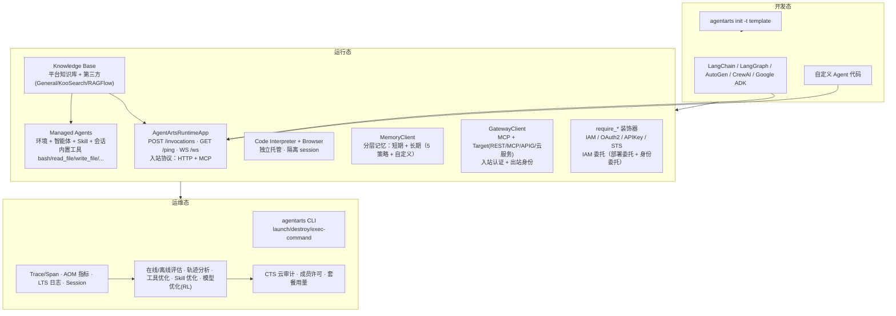

# AgentArts 平台架构

> 本文档是 AgentArts 知识包的总纲。SDK 锚点：`agentarts-sdk-python`（**v0.1.6**，Python ≥ 3.10，包名 `agentarts-sdk`，**仅支持 cn-southwest-2**）。
>
> **官方材料基线**：`AgentArts原始材料-0916`（2026-09-14 ~ 2026-09-16），共 12 分册、4,864 页。此前知识包基于 `AgentArts原始材料-0804`（文档版本 02，2026-08-04），两者之间存在**结构性差异**，详见 [release_delta_0916.md](release_delta_0916.md)。本知识包所有事实已按 0916 材料复核。

## 1. 核心定位

AgentArts 高代码开发提供**从代码开发到生产运行的一体化 Agent 工程平台**。

它解决的是企业级 Agent 落地的三类问题：

| 问题 | 谁负责 | AgentArts 提供什么 |
| --- | --- | --- |
| 模型会推理，但谁来安全地执行？ | 平台 | Runtime + Sandbox |
| Agent 有状态，但谁来持久化与召回？ | 平台 | Memory |
| Agent 要调外部能力，但谁来管权限与路由？ | 平台 | Gateway + Identity |
| Agent 需要静态知识，但谁来管文档与检索？ | 平台 | Knowledge Base（RAG 底座） |
| 不想打镜像，但谁来托管整个 Agent 循环？ | 平台 | Managed Agents（全托管环境 + 内置工具 + Skill） |
| Agent 会乱来或被绕过，谁来管安全？ | 平台 | **安全防护**（智能体卫士 AI Defender 运行时防护 + 权限与访问控制底座 + 安全护栏 + 安全评估） |

**职责边界原则**：模型负责理解/推理/规划；Runtime 负责执行/状态/权限/重试/审计。这条边界是企业级 Agent 与 demo Agent 的分水岭——模型不应直接持有生产权限，所有副作用操作必须经 Runtime/Sandbox/Gateway 受控执行。

## 2. 平台能力总览

### 2.1 三种开发范式（0916 明确）

| 范式 | 交付物 | 运行底座 | 详见 |
| --- | --- | --- | --- |
| 低代码开发 | 应用配置（拖拽编排） | 平台工作流引擎 | 官方《低代码开发智能体》 |
| **高代码开发** | **容器镜像（ARM64）** | **智能体运行时（microVM 隔离）** | [01-runtime](../01-runtime/runtime.md) |
| **Managed Agents** | 配置项（无镜像） | 全托管环境（Miracle 沙箱） | [managed_agents.md](managed_agents.md) |

### 2.2 核心组件（九大能力域）

- **Runtime** — Agent 生产运行时（HTTP + MCP 入站、microVM 隔离、版本/端点/灰度、会话与存储）
- **Managed Agents** — 全托管智能体（环境 + 智能体 + Skill + 会话，零镜像）
- **Sandbox** — 安全执行环境（**Code Interpreter 代码解释器** + **Browser 浏览器**，独立托管、各自隔离 session）
- **Memory** — 分层记忆库（短期记忆 + 长期记忆，5 种内置策略 + 自定义策略）
- **Knowledge Base** — 知识库 / RAG 底座（平台知识库 + 第三方知识库 General/KooSearch/RAGFlow）
- **Gateway** — 外部能力接入网关（MCP 协议、Target 四类型 REST/MCP/APIG/云服务、入站与出站双层认证）
- **Identity** — 身份与授权（运行时入站三认证 IAM/OAuth 2.0/API Key；出站凭据 APIKey/OAuth2/STS；IAM 委托）
- **Observability & Optimization** — 运营运维（Trace/Span、AOM 指标、LTS 日志、会话分析、在线/离线评估、**轨迹分析/工具优化/Skill 优化/模型优化**）
- **Security** — 智能体安全（**运行时防护：智能体卫士 AI Defender —— 高危操作阻断 / 意图行为一致性检测 / 角色限定**；权限与访问控制底座：委托 + URN + 入站三认证；安全护栏 Rails；内容审核；开发态镜像/Skills 扫描与 AI Infra 安全为**待补充项**）

### 2.3 一键对照旧材料

0804 → 0916 的术语与能力变化（如"沙箱工具"拆为"代码解释器 + 浏览器"、"OpenAPI Schemas"改名"REST API"）见 [release_delta_0916.md](release_delta_0916.md)。**引用旧结论前必须复核。**

## 3. SDK 仓库布局

```
src/agentarts/
├── sdk/                    # 核心 SDK
│   ├── runtime/            # AgentArtsRuntimeApp（HTTP 运行时）
│   │   ├── app.py          # ASGI 应用、装饰器、并发控制
│   │   ├── context.py      # AgentArtsRuntimeContext（contextvars 全局上下文）
│   │   └── model.py        # RequestContext、PingStatus
│   ├── memory/             # 记忆系统
│   │   ├── client.py / async_client.py   # 同步/异步客户端
│   │   ├── session.py / async_session.py # 预绑定会话封装
│   │   └── inner/          # 控制面/数据面分离实现
│   ├── tools/
│   │   ├── code_interpreter/  # Code Interpreter 客户端
│   │   └── browser/           # Browser 客户端（沙箱浏览器自动化）
│   ├── gateway/            # GatewayClient（原 mcpgateway 已重命名）
│   ├── identity/           # 认证装饰器 + Config
│   ├── integration/langgraph/  # LangGraph 适配器（saver/store）
│   ├── service/            # 云服务 HTTP 客户端
│   │   ├── runtime_client.py / iam_client.py / swr_client.py
│   │   ├── memory_service.py / identity/identity_client.py
│   │   └── tools_http.py
│   └── utils/              # V11 签名、常量、日志
└── toolkit/                # CLI 工具（agentarts 命令）
    ├── cli/                # 命令行接口（runtime/gateway/memory 子组）
    ├── operations/         # 命令处理逻辑
    ├── plugins/memory/     # 记忆插件（安装进 AI 编程助手）
    │   ├── ai_agent/       # 平台资产（claude_code/codex/opencode/hermes）
    │   ├── installer/      # 统一安装器（memory install/uninstall）
    │   ├── mcp/            # MCP Server（stdio，本地适配层）
    │   └── resources/      # Hook 脚本与清单
    └── utils/
        ├── runtime/        # Runtime 配置与容器工具
        └── templates/      # 项目模板（basic/langchain/langgraph/google-adk）
```

**可选依赖 extras**：`langchain`、`langgraph`、`autogen`、`crewai`、`vector-stores`、`database`、`monitoring`、`huaweicloud`、`web`、`docs`。按需安装避免依赖膨胀，例如 `pip install agentarts-sdk[langgraph]`。注意 `langchain`/`langgraph` extra 已要求 `langchain>=1.0.0`、`langgraph>=1.0.0`（1.x Checkpoint 格式）。

## 4. 架构分层



### 开发态
- 用熟悉的框架（LangChain/LangGraph/AutoGen/CrewAI/Google ADK）开发 Agent 逻辑
- `agentarts init -t {basic|langchain|langgraph|google-adk}` 生成项目脚手架
- 本地 `agentarts dev` 即可启动开发服务

### 运行态
- **Runtime 托管**：`AgentArtsRuntimeApp` 把任意 Agent 包装为符合平台入站标准的服务（HTTP `/invocations` + WS `/ws`）；入站协议支持 **HTTP 与 MCP** 两种；容器以 **microVM** 隔离，Agent Gateway 按 `session-id` 路由到同一沙箱，缺失则唤醒新 microVM
- **Managed Agents（替代路径）**：不打镜像，配置**环境**（出网网络 + 会话存储 + 入站网关）与**智能体**（模型/提示词/内置工具/Skill），通过 WebSocket 调用
- **Sandbox 安全执行**：代码在 **Code Interpreter（代码解释器）** 隔离 session 中运行；网页操作在 **Browser** 隔离 session 中运行。两者**独立托管、独立会话**，各有独立控制面与数据面 API
- **Memory 上下文持久化**：控制面 Space CRUD 用 AK/SK；数据面消息/记忆用 API Key（两平面分离）。**分层记忆**：短期记忆（原始消息，会话隔离）+ 长期记忆（策略驱动抽取，异步生成，向量检索）
- **Knowledge Base 静态知识**：平台知识库（上传即用）或第三方知识库（General/KooSearch/RAGFlow，数据不落地平台）
- **Gateway 连接外部**：`GatewayClient` 管理 MCP 网关与 Target（REST/MCP/APIG/云服务），**入站认证**（谁调用网关）与**出站身份**（网关代表谁访问后端）双层独立配置
- **Identity 权限控制**：装饰器自动把凭证注入业务函数，业务代码不接触密钥；运行时侧靠 **IAM 委托**（`AgentArtsRuntimeDeploymentAgency` 服务部署委托 + 用户运行时委托/智能体身份委托）获得云资源访问权限

### 运维态
- `agentarts launch` 云端部署（构建镜像 → 推送 SWR → 创建运行时）
- **控制台部署**与 **SDK 部署**双路径等价；运行时支持**多版本**、**访问方式（Endpoint）**、**权重灰度发布**、**平滑镜像更新**
- `agentarts destroy` 销毁部署
- `agentarts runtime exec-command` 远程执行（超时上限 3600s）
- `agentarts runtime upload-files / download-files` 文件传输（单文件 100MB / 多文件合计 500MB）
- 会话：`sessions-start` / `sessions-stop`，`X-Hw-Agentarts-Session-Id` 路由；空闲超时与最大存活时间可配
- 健康观测：`PingStatus`（HEALTHY / HEALTHY_BUSY / UNHEALTHY）
- 给 AI 编程助手挂载长期记忆：`agentarts memory install`（Claude Code / Codex / OpenCode / Hermes）
- 智能体观测：Trace/Span、业务/运营指标、会话分析，以及运行时/代码解释器/网关的 LTS 日志
- 评估与优化：在线/离线任务、评测集、52 个预置评估器、对比评估；**轨迹分析（失效归因到 Span）/ 工具优化 / Skill 优化 / 模型优化（GRPO 在线强化学习）**
- 治理：CTS 云审计关键操作、成员许可、套餐用量

## 5. 模型 vs Runtime 职责边界

| 维度 | 模型负责 | Runtime 负责 |
| --- | --- | --- |
| 理解 | ✅ 自然语言理解 | |
| 推理 | ✅ 多步推理 | |
| 规划 | ✅ 任务分解 | |
| 执行 | | ✅ 容器化执行（默认 `linux/arm64`） |
| 状态 | | ✅ session / task / async task 注册表 |
| 权限 | | ✅ Identity 委托、Gateway 授权 |
| 重试 | | ✅ `tenacity`，429/5xx 指数抖动 |
| 审计 | | ✅ request_id / session_id / user_id 透传 |

## 6. 平台能力对照表

| 平台能力 | SDK 模块 | 关键类/入口 | CLI 命令 | 详见 |
| --- | --- | --- | --- | --- |
| HTTP 运行时 | sdk.runtime | AgentArtsRuntimeApp | `agentarts dev / launch / invoke` | [01-runtime](../01-runtime/runtime.md) |
| 代码沙箱 | sdk.tools.code_interpreter | CodeInterpreter, code_session | （SDK API） | [02-sandbox](../02-sandbox/sandbox.md) |
| 浏览器沙箱 | sdk.tools.browser | Browser, browser_session | （SDK API） | [02-sandbox/browser.md](../02-sandbox/browser.md) |
| 记忆 | sdk.memory | MemoryClient / AsyncMemoryClient / MemorySession | `agentarts memory` | [03-memory](../03-memory/memory.md) |
| 记忆插件 | toolkit.plugins.memory | AgentArtsMemoryClient + MCP Server + 平台适配 | `agentarts memory install/uninstall` | [03-memory/memory_plugin.md](../03-memory/memory_plugin.md) |
| 网关 | sdk.gateway | GatewayClient | `agentarts gateway` | [04-gateway](../04-gateway/gateway.md) |
| 身份 | sdk.identity + sdk.service.identity | IdentityClient + require_* 装饰器 | （SDK API） | [05-identity](../05-identity/identity.md) |
| 框架适配 | sdk.integration.langgraph | AgentArtsMemorySessionSaver / AgentArtsMemoryStore | （SDK API） | [06-integration](../06-integration/partner_agent_adaptation.md) |
| 云服务客户端 | sdk.service | RuntimeClient / IAMClient / SWRClient / MemoryHttpService | （内部） | [08-code-dev](../08-code-dev/cli_reference.md) |
| 实验局验收 | — | — | — | [07-operation](../07-operation/field_validation.md) |
| 智能体观测 | 运营运维平台 + OTel + 高代码日志配置 | Trace/Metric/Log/Session | Runtime/Gateway 配置入口 | [observability](../07-operation/observability.md) |
| 智能体评估 | 运营运维平台 | 评测集 / 评估器 / 在线与离线任务 | 控制台 | [evaluation](../07-operation/evaluation.md) |
| 智能体优化 | 观测 + 评估闭环 | 轨迹分析 / 工具优化 / Skill 优化 / 模型优化(RL) | 控制台 | [optimization](../07-operation/optimization.md) |
| **Managed Agents** | 无 SDK（控制台 + WebSocket 调用） | 环境 / 智能体 / Skill / 会话 | 控制台 + 工单开通 | [managed_agents](managed_agents.md) |
| **知识库** | 平台知识库 / 第三方知识库 | 文档解析 / 分段 / 命中测试 / RAG 检索 | 控制台 | [09-knowledge-base](../09-knowledge-base/knowledge_base.md) |
| **版本差异基线** | — | 0804 → 0916 差异与影响清单 | — | [release_delta_0916](release_delta_0916.md) |
| **智能体安全（运行时防护）** | 无 SDK（控制台开关 + HSS） | 智能体卫士 AI Defender：高危操作阻断 / 意图行为一致性检测 / 角色限定 | 发布部署时开启（**默认关闭**） | [10-security](../10-security/agent_security.md) |
| **智能体安全（权限底座）** | sdk.identity + 委托 | IAM 委托 / URN + AgentIdentity / 入站三认证 / Rails 护栏 | 控制台「权限与访问控制」 | [05-identity](../05-identity/identity.md) |

## 7. 控制面 / 数据面分离

AgentArts 的一个核心架构决策是**控制面与数据面分离**，贯穿 Memory、Sandbox、Gateway：

| 平面 | 职责 | 认证 | 典型操作 |
| --- | --- | --- | --- |
| 控制面 | 资源管理（CRUD） | AK/SK 签名 | `POST /v1/core/runtimes`、create_space、create_gateway、create_code_interpreter、create_browser |
| 数据面 | 数据读写 | API Key Bearer 或 IAM V11 签名 | add_messages、execute_code、invoke Target、`/runtimes/{name}/invocations` |

**0916 细化**：数据面的 IAM 签名有两种算法，运行时数据面接口只签请求头与查询参数、**不签 body**（其他 AgentArts 接口仍需签 body）：

| 签名算法 | 说明 |
| --- | --- |
| `V11-HMAC-SHA256` | HMAC-SHA256，SK 作密钥，支持 Region 级密钥派生 |
| `SDK-ECDSA-P256SHA256` | ECDSA P-256 非对称签名 |

约束：AK/SK 签名仅支持消息体 ≤ 12MB；临时访问密钥需额外携带 `X-Security-Token`；网关校验 `X-Sdk-Date` 与服务器时间差 **≤ 15 分钟**（客户端需时间同步）。

**为什么分离**：控制面操作（建 Space、建网关）是低频管理动作，可用强 AK/SK；数据面操作（每条消息、每次代码执行）是高频且需最小权限，用 Space 级 API Key 或 IAM 临时凭证更安全。这条边界决定了 SDK 客户端的双客户端结构（如 `MemoryClient` 内部含控制面 `controlplane.py` + 数据面 `dataplane.py`）。

## 8. IAM 委托：平台权限模型的地基

AgentArts 运行时依赖**两个委托**，这是"平台能代用户访问哪些云资源"的答案（0916 新增明确说明）：

| 委托 | 名称 | 用途 | 是否必须 | 用户感知 |
| --- | --- | --- | --- | --- |
| **服务部署委托** | `AgentArtsRuntimeDeploymentAgency`（固定名） | 委托给沙箱服务，用于**下载用户镜像**、**挂载 SFS Turbo 共享存储** | **必须**，删除会导致运行时创建失败或镜像下载异常 | 不感知，服务内部自动使用 |
| **用户运行时委托**（智能体身份委托） | 用户自定义，服务开通时自动创建 `DefaultAgentArtsRuntimeAgency` | 在智能体运行时内部**代表用户身份**与其他华为云服务交互 | 推荐配置 | 用默认委托开箱即用，也可手动创建 |

**策略**：

| 委托 | 策略 | 关键 Action |
| --- | --- | --- |
| 服务部署委托 | `AgentArtsRuntimeDeploymentAgencyPolicy` | `swr::createAuthorizationToken`、`swr:repo:download`、`sts::createServiceBearerToken`、`sfsturbo:shares:getShare` |
| 用户运行时委托 | `AgentArtsCoreRunRuntimeIdentityAgencyPolicy` | `agentIdentity::getResourceApiKey`、`agentIdentity::getResourceOauth2Token`、`agentIdentity::getResourceStsToken`、`csms:secret:getVersion`、`kms:cmk:decryptDataKey` |
| 用户运行时委托 | `AgentArtsCoreRunRuntimeOpsAgencyPolicy` | `apm:application:get`、`aom:metric:list`、`aom:icmgr:get` |

手动创建用户运行时委托时：信任主体类型选**云服务**，云服务搜索 `service.WorkloadSandboxMetadata`。运行时 SDK 提供 `MetadataProvider` 自动获取该委托对应的临时凭据。

> 网关侧另有委托要求：若调用网关报"委托缺少 CSMS/KMS 相关 action 权限"，需补齐 CSMS/KMS 授权（托管与运行智能体 13.12）。

## 9. 入站身份认证：谁在调用运行时

运行时入站支持三种认证方式（0916 新增明确规范）：

| 认证方式 | 凭据 | 请求头格式 |
| --- | --- | --- |
| IAM（AK/SK 签名） | AK + SK 生成签名 | `Authorization: V11-HMAC-SHA256 Access={AK}, SignedHeaders=..., Signature=...` |
| API Key | API Key 字符串 | `Authorization: Bearer {API Key}` |
| OAuth 2.0 | 第三方身份提供商签发的 JWT | `Authorization: Bearer {JWT Token}` |

OAuth 2.0 配置参数：`Discovery URL`（须以 `https://` 开头、`/.well-known/openid-configuration` 结尾）、允许的受众（≤100）、允许的客户端（≤100）、允许的范围（≤100）、自定义声明匹配。

平台侧权限：租户管理员需给 IAM 用户授予 `AgentArtsFullAccessPolicy` + `AgentIdentityFullAccessPolicy`；自定义策略按需（如代码解释器创建需 `iam:agencies:pass`、`vpc:nativePorts:create`、`eip:publicIps:associateInstance`）。

**同一条请求的完整身份链路**（托管运行时）：

```
调用方 --(入站认证)--> Agent Gateway --(按 session-id 路由)--> microVM 沙箱
                                                                    |
                                          (用户运行时委托) --> IAM 临时凭据 --> 其他云服务
                                                                    |
                                          (出站身份) --> Gateway Target 后端
```

## 10. 伙伴 Agent 接入模型

AgentArts 的标准接入路径是 **Adapter Layer**，而非直接绑定平台接口：

```
Partner Agent（业务智能）
        ↓  Adapter Layer（按平台规范适配）
AgentArts Infra（企业级基础设施）
```

- **伙伴负责**：业务逻辑、领域知识、Agent 行为设计
- **平台负责**：运行托管、安全执行、状态持久化、权限控制、可观测性
- **Adapter 负责**：把伙伴 Agent 的 run/ainvoke 包装为 `@app.entrypoint`，把伙伴的 state 映射到 Memory session，把伙伴的工具映射到 Gateway Target

详见 [06-integration/partner_agent_adaptation.md](../06-integration/partner_agent_adaptation.md)。

## 11. 环境变量与配置

SDK 通过环境变量配置，支持系统环境变量 / `.env` 文件 / IDE 配置三种方式。核心配置：

| 类别 | 关键变量 | 说明 |
| --- | --- | --- |
| 凭证 | `HUAWEICLOUD_SDK_AK` / `HUAWEICLOUD_SDK_SK` | 华为云永久访问密钥 |
| 临时凭证 | `HUAWEICLOUD_SDK_SECURITY_TOKEN` | 使用 STS 临时访问密钥时必填（请求需带 `X-Security-Token`） |
| 区域 | `HUAWEICLOUD_SDK_REGION`（兼容 `HUAWEICLOUD_REGION` / `OS_REGION_NAME`） | 默认 `cn-southwest-2`，**0916 仅此一个可用区域** |
| 项目 | `HUAWEICLOUD_SDK_PROJECT_ID` | 项目级调用 |
| 联邦身份 | `HUAWEICLOUD_SDK_IDP_ID` / `HUAWEICLOUD_SDK_ID_TOKEN_FILE` | 身份提供商与 ID Token |
| Memory | `HUAWEICLOUD_SDK_MEMORY_API_KEY` | Space 数据面 API Key |
| Memory 数据面 | `AGENTARTS_MEMORY_DATA_ENDPOINT` | 记忆库数据面端点 |
| CodeInterpreter | `HUAWEICLOUD_SDK_CODE_INTERPRETER_API_KEY` | 代码解释器会话认证 |
| CodeInterpreter 数据面 | `AGENTARTS_CODEINTERPRETER_DATA_ENDPOINT` | 代码解释器数据面端点 |
| Browser | `HUAWEICLOUD_SDK_BROWSER_API_KEY` | 浏览器会话认证（数据面） |
| Browser 数据面 | `AGENTARTS_BROWSER_DATA_ENDPOINT` | 浏览器数据面端点 |
| Runtime 数据面 | `AGENTARTS_RUNTIME_DATA_ENDPOINT` | 运行时数据面端点 |
| 记忆插件 | `AGENTARTS_MEMORY_SPACE_ID` | 记忆插件绑定的 Space ID |
| 控制面端点 | `AGENTARTS_CONTROL_ENDPOINT` | 私有化部署时自定义；默认 `https://agentarts.{region}.myhuaweicloud.com` |
| IAM 端点 | `HUAWEICLOUD_SDK_IAM_ENDPOINT` | 自定义 IAM 端点 |
| SWR 端点 | `HUAWEICLOUD_SDK_SWR_ENDPOINT` | 自定义镜像仓端点 |
| AgentIdentity 端点 | `HUAWEICLOUD_SDK_AGENTIDENTITY_ENDPOINT` | 智能体身份服务端点 |
| 基础镜像 | `PYTHON_BASE_IMAGE` | CLI 构建镜像时覆盖基础镜像 |
| 日志 | `AGENTARTS_LOG_LEVEL` | DEBUG/INFO/WARNING/ERROR |

完整变量列表与优先级见 SDK 文档 `docs/cn/sdk_user_guide/environment_variables.md`。

## 12. Agent 读取原则

本知识包不是普通说明书，而是 **Platform Capability Knowledge Base**，用于回答：

1. 平台有什么能力？→ 能力对照表 + 各专章
2. 如何接入已有 Agent？→ [06-integration](../06-integration/partner_agent_adaptation.md) + [08-code-dev](../08-code-dev/scaffolding.md)
3. 哪些能力由模型负责，哪些由 Runtime 负责？→ 第 5 节职责边界
4. 如何完成企业级上线？→ [08-code-dev/deployment.md](../08-code-dev/deployment.md) + [07-operation](../07-operation/field_validation.md)
5. 如何观测、评估并持续优化？→ [observability](../07-operation/observability.md) + [evaluation](../07-operation/evaluation.md) + [optimization](../07-operation/optimization.md)
6. 不想打镜像怎么办？→ [managed_agents.md](managed_agents.md)
7. RAG / 文档问答怎么做？→ [09-knowledge-base/knowledge_base.md](../09-knowledge-base/knowledge_base.md)
8. 我手上的旧结论还成立吗？→ [release_delta_0916.md](release_delta_0916.md)（先查差异清单）
9. 通过 API 创建 runtime 怎么调？→ [08-code-dev/deployment.md](../08-code-dev/deployment.md) 第「管理面 API」节 + [04-gateway](../04-gateway/gateway.md)
10. 智能体安全怎么做？运行态防护有哪些？→ [10-security/agent_security.md](../10-security/agent_security.md)（三层框架，含官方已确认项与待补充项）
