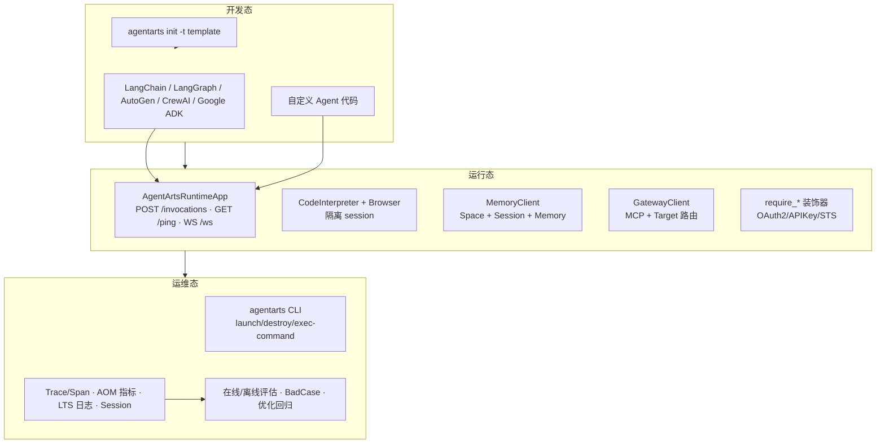

# AgentArts 平台架构

> 本文档是 AgentArts 高代码开发知识包的总纲。内容锚点：`agentarts-sdk-python`（v0.1.6，Python 3.10+，包名 `agentarts-sdk`）。

## 1. 核心定位

AgentArts 高代码开发提供**从代码开发到生产运行的一体化 Agent 工程平台**。

它解决的是企业级 Agent 落地的三类问题：

| 问题 | 谁负责 | AgentArts 提供什么 |
| --- | --- | --- |
| 模型会推理，但谁来安全地执行？ | 平台 | Runtime + Sandbox |
| Agent 有状态，但谁来持久化与召回？ | 平台 | Memory |
| Agent 要调外部能力，但谁来管权限与路由？ | 平台 | Gateway + Identity |

**职责边界原则**：模型负责理解/推理/规划；Runtime 负责执行/状态/权限/重试/审计。这条边界是企业级 Agent 与 demo Agent 的分水岭——模型不应直接持有生产权限，所有副作用操作必须经 Runtime/Sandbox/Gateway 受控执行。

## 2. 平台能力总览

七大核心组件：

- **Runtime** — Agent 生产运行时（HTTP/WebSocket 服务、并发控制、生命周期）
- **Sandbox** — 安全代码执行环境（Code Interpreter，隔离 session）
- **Memory** — 长期上下文与记忆（语义/偏好/情景/事件多策略）
- **Gateway** — 外部能力接入网关（MCP 协议、Target 路由、授权）
- **Identity** — 身份认证与授权（OAuth2/API Key/STS 三流）
- **Tools** — 内置工具集（Code Interpreter 沙箱执行 + Browser 浏览器自动化）
- **Observability & Evaluation** — 运营运维（Trace/Span、AOM 指标、LTS 日志、会话分析、在线/离线评估与优化闭环）

## 3. SDK 仓库布局

```
src/agentarts/
├── sdk/                    # 核心 SDK
│   ├── runtime/            # AgentArtsRuntimeApp（HTTP 运行时）
│   │   ├── app.py          # ASGI 应用、装饰器、并发控制
│   │   ├── context.py      # AgentArtsRuntimeContext（contextvars 全局上下文）
│   │   └── model.py        # RequestContext、PingStatus
│   ├── memory/             # 记忆系统
│   │   ├── client.py / async_client.py   # 同步/异步客户端
│   │   ├── session.py / async_session.py # 预绑定会话封装
│   │   └── inner/          # 控制面/数据面分离实现
│   ├── tools/
│   │   ├── code_interpreter/  # Code Interpreter 客户端
│   │   └── browser/           # Browser 客户端（沙箱浏览器自动化）
│   ├── gateway/            # GatewayClient（原 mcpgateway 已重命名）
│   ├── identity/           # 认证装饰器 + Config
│   ├── integration/langgraph/  # LangGraph 适配器（saver/store）
│   ├── service/            # 云服务 HTTP 客户端
│   │   ├── runtime_client.py / iam_client.py / swr_client.py
│   │   ├── memory_service.py / identity/identity_client.py
│   │   └── tools_http.py
│   └── utils/              # V11 签名、常量、日志
└── toolkit/                # CLI 工具（agentarts 命令）
    ├── cli/                # 命令行接口（runtime/gateway/memory 子组）
    ├── operations/         # 命令处理逻辑
    ├── plugins/memory/     # 记忆插件（安装进 AI 编程助手）
    │   ├── ai_agent/       # 平台资产（claude_code/codex/opencode/hermes）
    │   ├── installer/      # 统一安装器（memory install/uninstall）
    │   ├── mcp/            # MCP Server（stdio，本地适配层）
    │   └── resources/      # Hook 脚本与清单
    └── utils/
        ├── runtime/        # Runtime 配置与容器工具
        └── templates/      # 项目模板（basic/langchain/langgraph/google-adk）
```

**可选依赖 extras**：`langchain`、`langgraph`、`autogen`、`crewai`、`vector-stores`、`database`、`monitoring`、`huaweicloud`、`web`、`docs`。按需安装避免依赖膨胀，例如 `pip install agentarts-sdk[langgraph]`。注意 `langchain`/`langgraph` extra 已要求 `langchain>=1.0.0`、`langgraph>=1.0.0`（1.x Checkpoint 格式）。

## 4. 架构分层



### 开发态
- 用熟悉的框架（LangChain/LangGraph/AutoGen/CrewAI/Google ADK）开发 Agent 逻辑
- `agentarts init -t {basic|langchain|langgraph|google-adk}` 生成项目脚手架
- 本地 `agentarts dev` 即可启动开发服务

### 运行态
- **Runtime 托管**：`AgentArtsRuntimeApp` 把任意 Agent 包装为符合平台控制面标准的 HTTP 服务
- **Sandbox 安全执行**：代码在华为云 Code Interpreter 隔离 session 中运行；网页操作在 Browser 隔离 session 中运行
- **Memory 上下文持久化**：控制面 Space CRUD 用 AK/SK；数据面消息/记忆用 API Key（两平面分离）
- **Gateway 连接外部**：`GatewayClient` 管理 MCP 网关与 Target，自动创建 IAM 委托
- **Identity 权限控制**：装饰器自动把凭证注入业务函数，业务代码不接触密钥

### 运维态
- `agentarts launch` 云端部署（构建镜像 → 推送 SWR → 创建运行时）
- `agentarts destroy` 销毁部署
- `agentarts runtime exec-command` 远程执行（超时上限 3600s）
- `agentarts runtime upload-files / download-files` 文件传输
- 健康观测：`PingStatus`（Healthy / HealthyBusy / Unhealthy）
- 给 AI 编程助手挂载长期记忆：`agentarts memory install`（Claude Code / Codex / OpenCode / Hermes）
- 智能体观测：Trace/Span、业务/运营指标、会话分析，以及 Runtime/Gateway/Sandbox 的 LTS 日志
- 评估与优化：在线/离线任务、评测集、评估器、BadCase、对比评估与回归测试

## 5. 模型 vs Runtime 职责边界

| 维度 | 模型负责 | Runtime 负责 |
| --- | --- | --- |
| 理解 | ✅ 自然语言理解 | |
| 推理 | ✅ 多步推理 | |
| 规划 | ✅ 任务分解 | |
| 执行 | | ✅ 容器化执行（默认 `linux/arm64`） |
| 状态 | | ✅ session / task / async task 注册表 |
| 权限 | | ✅ Identity 委托、Gateway 授权 |
| 重试 | | ✅ `tenacity`，429/5xx 指数抖动 |
| 审计 | | ✅ request_id / session_id / user_id 透传 |

## 6. 平台能力对照表

| 平台能力 | SDK 模块 | 关键类/入口 | CLI 命令 | 详见 |
| --- | --- | --- | --- | --- |
| HTTP 运行时 | sdk.runtime | AgentArtsRuntimeApp | `agentarts dev / launch / invoke` | [01-runtime](../01-runtime/runtime.md) |
| 代码沙箱 | sdk.tools.code_interpreter | CodeInterpreter, code_session | （SDK API） | [02-sandbox](../02-sandbox/sandbox.md) |
| 浏览器沙箱 | sdk.tools.browser | Browser, browser_session | （SDK API） | [02-sandbox/browser.md](../02-sandbox/browser.md) |
| 记忆 | sdk.memory | MemoryClient / AsyncMemoryClient / MemorySession | `agentarts memory` | [03-memory](../03-memory/memory.md) |
| 记忆插件 | toolkit.plugins.memory | AgentArtsMemoryClient + MCP Server + 平台适配 | `agentarts memory install/uninstall` | [03-memory/memory_plugin.md](../03-memory/memory_plugin.md) |
| 网关 | sdk.gateway | GatewayClient | `agentarts gateway` | [04-gateway](../04-gateway/gateway.md) |
| 身份 | sdk.identity + sdk.service.identity | IdentityClient + require_* 装饰器 | （SDK API） | [05-identity](../05-identity/identity.md) |
| 框架适配 | sdk.integration.langgraph | AgentArtsMemorySessionSaver / AgentArtsMemoryStore | （SDK API） | [06-integration](../06-integration/partner_agent_adaptation.md) |
| 云服务客户端 | sdk.service | RuntimeClient / IAMClient / SWRClient / MemoryHttpService | （内部） | [08-code-dev](../08-code-dev/cli_reference.md) |
| 实验局验收 | — | — | — | [07-operation](../07-operation/field_validation.md) |
| 智能体观测 | 运营运维平台 + OTel + 高代码日志配置 | Trace/Metric/Log/Session | Runtime/Gateway 配置入口 | [observability](../07-operation/observability.md) |
| 智能体评估 | 运营运维平台 | 评测集 / 评估器 / 在线与离线任务 | 控制台 | [evaluation](../07-operation/evaluation.md) |
| 智能体优化 | 观测 + 评估闭环 | BadCase / 数据回流 / 对比评估 / 回归 | 控制台 | [optimization](../07-operation/optimization.md) |

## 7. 控制面 / 数据面分离

AgentArts 的一个核心架构决策是**控制面与数据面分离**，贯穿 Memory、Sandbox、Gateway：

| 平面 | 职责 | 认证 | 典型操作 |
| --- | --- | --- | --- |
| 控制面 | 资源管理（CRUD） | AK/SK 签名 | create_space / create_gateway / create_code_interpreter |
| 数据面 | 数据读写 | API Key Bearer 或 IAM V11 签名 | add_messages / execute_code / invoke Target |

**为什么分离**：控制面操作（建 Space、建网关）是低频管理动作，可用强 AK/SK；数据面操作（每条消息、每次代码执行）是高频且需最小权限，用 Space 级 API Key 或 IAM 临时凭证更安全。这条边界决定了 SDK 客户端的双客户端结构（如 `MemoryClient` 内部含控制面 `controlplane.py` + 数据面 `dataplane.py`）。

## 8. 伙伴 Agent 接入模型

AgentArts 的标准接入路径是 **Adapter Layer**，而非直接绑定平台接口：

```
Partner Agent（业务智能）
        ↓  Adapter Layer（按平台规范适配）
AgentArts Infra（企业级基础设施）
```

- **伙伴负责**：业务逻辑、领域知识、Agent 行为设计
- **平台负责**：运行托管、安全执行、状态持久化、权限控制、可观测性
- **Adapter 负责**：把伙伴 Agent 的 run/ainvoke 包装为 `@app.entrypoint`，把伙伴的 state 映射到 Memory session，把伙伴的工具映射到 Gateway Target

详见 [06-integration/partner_agent_adaptation.md](../06-integration/partner_agent_adaptation.md)。

## 9. 环境变量与配置

SDK 通过环境变量配置，支持系统环境变量 / `.env` 文件 / IDE 配置三种方式。核心配置：

| 类别 | 关键变量 | 说明 |
| --- | --- | --- |
| 认证 | `HUAWEICLOUD_SDK_AK` / `HUAWEICLOUD_SDK_SK` | 华为云访问密钥 |
| 区域 | `HUAWEICLOUD_SDK_REGION` | 默认 `cn-southwest-2` |
| Memory 数据面 | `HUAWEICLOUD_SDK_MEMORY_API_KEY` | Space 创建后生成 |
| CodeInterpreter | `HUAWEICLOUD_SDK_CODE_INTERPRETER_API_KEY` | 代码解释器会话认证 |
| Browser | `HUAWEICLOUD_SDK_BROWSER_API_KEY` | 浏览器会话认证（数据面） |
| Browser 数据面 | `AGENTARTS_BROWSER_DATA_ENDPOINT` | 浏览器数据面端点 |
| 记忆插件 | `AGENTARTS_MEMORY_SPACE_ID` | 记忆插件绑定的 Space ID |
| 控制面端点 | `AGENTARTS_CONTROL_ENDPOINT` | 私有化部署时自定义 |
| 日志 | `AGENTARTS_LOG_LEVEL` | DEBUG/INFO/WARNING/ERROR |

完整变量列表与优先级见 SDK 文档 `docs/cn/sdk_user_guide/environment_variables.md`。

## 10. Agent 读取原则

本知识包不是普通说明书，而是 **Platform Capability Knowledge Base**，用于回答：

1. 平台有什么能力？→ 能力对照表 + 各专章
2. 如何接入已有 Agent？→ [06-integration](../06-integration/partner_agent_adaptation.md) + [08-code-dev](../08-code-dev/scaffolding.md)
3. 哪些能力由模型负责，哪些由 Runtime 负责？→ 第 5 节职责边界
4. 如何完成企业级上线？→ [08-code-dev/deployment.md](../08-code-dev/deployment.md) + [07-operation](../07-operation/field_validation.md)
5. 如何观测、评估并持续优化？→ [observability](../07-operation/observability.md) + [evaluation](../07-operation/evaluation.md) + [optimization](../07-operation/optimization.md)
