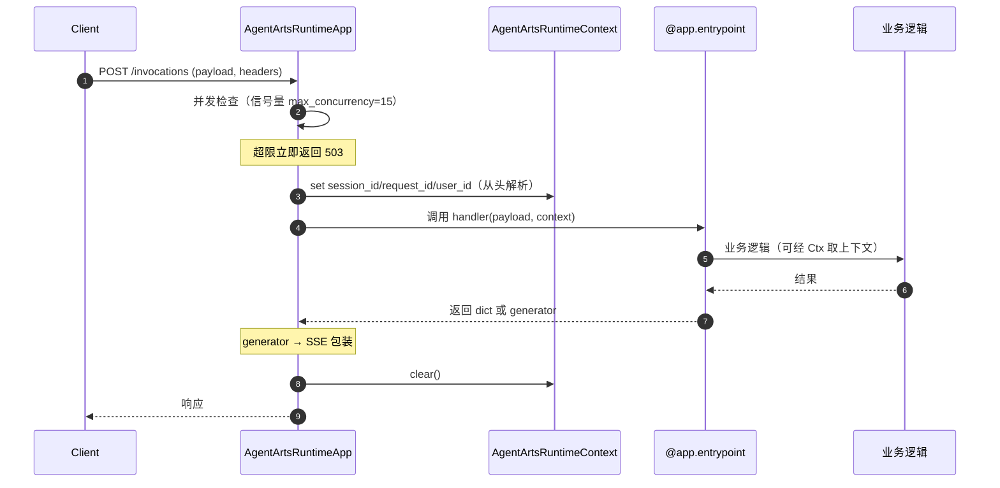

# Agent Runtime

> SDK 锚点：`agentarts.sdk.runtime`（`app.py` / `context.py` / `model.py`）。Python 3.10+，ASGI（Starlette + uvicorn）。

## 1. 定位与原理

Runtime 是 Agent 的**生产运行时**。它把任意 Agent 代码包装为符合 AgentArts 控制面标准的 HTTP/WebSocket 服务，并在此过程中注入企业级能力：并发控制、上下文隔离、健康检查、长任务追踪、审计透传。

**为什么需要 Runtime**：裸跑一个 `async def handler(payload)` 不具备生产条件——没有健康检查、没有并发上限、没有 session 隔离、没有审计。`AgentArtsRuntimeApp` 用装饰器模式在不侵入业务代码的前提下补齐这些能力。

核心组件：

| 组件 | 说明 |
| --- | --- |
| `AgentArtsRuntimeApp` | ASGI 应用，提供 HTTP/WebSocket 端点 |
| `RequestContext` | 请求上下文快照（Pydantic 模型），含 `session_id` / `request_id` / `request` |
| `AgentArtsRuntimeContext` | 全局上下文管理器，基于 `contextvars`，异步安全、无需实例化 |
| `PingStatus` | 健康状态枚举：HEALTHY / HEALTHY_BUSY / UNHEALTHY |

## 2. 平台侧托管运行时（0916 官方规范）

> 本节描述**平台**如何托管运行时，面向架构设计。为表述与官方文档对齐，此处的"运行时"指平台资源实体，与上一层的 `AgentArtsRuntimeApp`（SDK 侧封装）互为两层。

### 2.1 是什么

智能体运行时是 AgentArts 提供的**安全隔离、框架无关的智能体托管执行环境**，为生产级智能体提供企业级弹性伸缩与权限治理。用户把 Agent 代码打包为镜像、部署到运行时后即可通过 API 调用。

它回答三个问题：**Agent 代码写到哪里跑？多用户并发如何互不干扰？如何弹性伸缩、版本管理、灰度发布？**

### 2.2 功能优势（官方口径）

| 维度 | 能力 |
| --- | --- |
| 安全隔离 | 基于安全沙箱技术实现 **microVM 隔离**；框架无关（LangChain / LangGraph / Google ADK 等） |
| 企业级弹性 | 自动弹性伸缩、高并发承载；单账号 **1,000 个运行时**，单运行时 **1,000 个版本** |
| 权限治理 | 入站三认证（IAM / OAuth 2.0 / API Key）；**安全委托机制**（IAM 委托，使智能体能代表用户访问外部系统）；公网/私网访问 |
| 部署方式 | 控制台可视化部署 + SDK 命令行部署；版本化管理与历史回溯；平滑镜像更新 |
| 可观测性 | 集成 LTS 实时日志；自定义健康检查端点，三种状态 `HEALTHY` / `HEALTHY_BUSY` / `UNHEALTHY` |
| 访问控制 | 每运行时最多 **10 个访问方式**，可绑定不同版本；可选开启文件上传下载 API；入站协议 **HTTP 与 MCP** |
| 运行时配置 | 环境变量（表单/JSON）、启动命令（最多 10 条）、**存储扩展（SFS Turbo / 会话存储 / OBS）**、标签（最多 20 个） |
| API 生态 | RESTful API、Runtime/Tools/Memory/Identity/Gateway 多维 SDK、CLI 全生命周期、完整 OpenAPI 文档 |

### 2.3 工作原理：入站网关 + 安全沙箱分层协作

```
Agent 开发者：
  1. 用任意框架开发 Agent → 构建 Docker 镜像 → 发布到 SWR 镜像仓库
  2. 在 AgentArts 基于镜像创建运行时 → 获取访问方式（Endpoint）
  3. 把访问方式配置到前端应用

Agent 用户：
  1. 在前端应用完成业务登录 → 提交 Agent 任务

前端应用（开发者开发、部署、配置）：
  1. 完成用户任务请求的认证鉴权，提取 user-id，映射到运行时的 session-id
  2. 调用运行时的访问方式，调用 /invocations，header 携带 session-id
  3. Agent Gateway 接收请求后认证，提取 session-id 并按 session-id 路由：
     a. session-id 存在对应活跃 microVM → 直接转发
     b. session-id 找不到对应 microVM → 唤醒新 microVM 后转发
```

**核心概念**：

| 概念 | 定义 |
| --- | --- |
| 智能体运行时（Agent Runtime） | Agent 核心逻辑、决策与编排的运行环境，可托管智能体代码**或 MCP 工具**，管理其生命周期 |
| 版本（Versions） | 运行时的**不可变版本**，每次编辑运行时配置都会产生新版本 |
| 访问方式（Endpoints） | 运行时的访问入口，可指向某一具体版本，也可**按权重指向多个版本**，实现蓝绿/灰度发布 |
| 会话（Sessions） | 一个独立交互上下文，由请求头 `session-id` 唯一标识。业务对象与 Session 的映射由**前端应用负责**；如需按用户隔离，把 user-id 映射到一个 session-id |

> 关键设计推论：**会话亲和性由平台保证，业务对象到会话的映射由伙伴侧前端应用负责**。伙伴侧不能假设平台会按 user-id 自动隔离——必须在调用时显式传入映射后的 session-id。

### 2.4 镜像制作约束与限制（硬性）

1. **必须使用 ARM64 系统制作镜像**。使用 x86 镜像在调用时会失败（`python: exec format error`）
2. **兼容 AgentRun 入站协议**：
   - 监听 **8080** 端口，Host `0.0.0.0`
   - HTTP 协议：必须提供 `POST /invocations`
   - WebSocket 协议（可选）：提供 `/ws`，实现实时双向流式通信
   - HTTP 与 WS 端点可部署在同一容器、共用 8080 端口
3. **无状态与本地磁盘约束**：运行时部署在分布式弹性伸缩集群，**沙箱空闲触发资源释放时本地磁盘数据全部丢失**
   - ❌ 禁止依赖本地文件系统（SQLite / 本地日志 / 本地缓存都会丢）
   - ✅ 状态持久化走 Memory 组件（上下文）或 SFS Turbo / OBS（实体文件）

### 2.5 入站协议

| 协议 | 端点 | 说明 |
| --- | --- | --- |
| **HTTP** | `POST /invocations` | 主要交互端点，JSON 输入，JSON/SSE 输出。适用用户互动、外部系统集成、批量请求、长任务流式响应 |
| **MCP** | JSON-RPC | 接收 MCP RPC 消息，完整传递调用运行时的 API 负载与标准 MCP 协议消息；`application/json` 与 `text/event-stream` 响应。适用工具调用与管理、代理能力发现、资源访问、多步骤工作流 |

### 2.6 权限与访问控制：委托 + 入站认证

**两个委托**（详见 [00-overview/platform_architecture.md](../00-overview/platform_architecture.md) 第 8 节）：

| 委托 | 用途 |
| --- | --- |
| `AgentArtsRuntimeDeploymentAgency`（固定名，必须） | 沙箱服务下载用户镜像、挂载 SFS Turbo；**不可删除** |
| 用户运行时委托（默认 `DefaultAgentArtsRuntimeAgency`，推荐） | 在运行时内部代表用户身份访问其他华为云服务；SDK 提供 `MetadataProvider` 自动获取临时凭据 |

**运行时入站三认证**：

| 方式 | 凭据 | 请求头 |
| --- | --- | --- |
| IAM（AK/SK 签名） | AK + SK | `Authorization: V11-HMAC-SHA256 Access={AK}, SignedHeaders=..., Signature=...` |
| API Key | API Key 字符串 | `Authorization: Bearer {API Key}` |
| OAuth 2.0 | 第三方身份提供商 JWT | `Authorization: Bearer {JWT Token}` |

- API Key 获取路径：控制台「托管与运行 > 运行时」→ 运行时详情 → 「权限与访问控制」→ 访问 URN → 进入 AgentIdentity 智能体身份服务 → 复制 API Key
- IAM 签名算法：`V11-HMAC-SHA256`（SK 为密钥，支持 Region 级密钥派生）与 `SDK-ECDSA-P256SHA256`（ECDSA P-256 非对称）。**运行时数据面接口不签 body**，只签请求头与查询参数
- IAM 约束：消息体 ≤ 12MB；临时密钥需带 `X-Security-Token`；`X-Sdk-Date` 与服务端时差 ≤ 15 分钟

### 2.7 会话管理

| 项 | 规范 |
| --- | --- |
| 会话 ID | 由调用方自行生成；英文/数字/`-`/`_`，≤ 64 字符 |
| 会话 ID 请求头 | Agent（默认）：`X-Hw-Agentarts-Session-Id`<br>Code Interpreter：`X-Hw-Agentarts-Code-InterpreterSession-Id`<br>Browser：`X-Hw-Agentarts-Browser-Session-Id`<br>Gateway（MCP）：`X-Hw-Agentarts-Session-Id` |
| 空闲会话超时 | `lifecycleConfig.idleSessionTimeoutSec`，60–604,800 秒，默认 900 秒（15 分钟） |
| 最大存活时间 | `lifecycleConfig.maxAliveTimeSec`，60–604,800 秒，默认 86,400 秒（24 小时） |
| 终止条件 | **任一满足即自动终止** |
| 上传文件 | 单文件 ≤ 100MB，多文件合计 ≤ 500MB |

**会话生命周期**：

| 阶段 | API | 平台动作 |
| --- | --- | --- |
| 创建会话 | `POST /runtimes/{runtime_name}/sessions-start` | 创建沙箱和会话（独立沙箱实例） |
| 会话活跃期 | `POST /runtimes/{runtime_name}/invocations` | 通过会话 ID 路由到同一沙箱，支持命令执行与文件传输 |
| 停止会话 | `POST /runtimes/{runtime_name}/sessions-stop` | 销毁沙箱实例，释放计算资源，会话内临时文件自动清除 |

> **重要边界**：停止会话（销毁沙箱）与删除会话状态（清除持久化存储）是**两个独立操作**。沙箱销毁后会话数据仍可保留，也可按需单独清理，避免操作失败导致资源泄漏。

**会话隔离与路由**：每个会话运行在独立 microVM 中，实现**进程级、文件系统级、网络级**隔离。同一会话 ID 的多次调用路由到同一沙箱实例（会话亲和性），不同会话 ID 彼此隔离。

**跨访问方式（Endpoint）的会话路由**：

| 是否配置会话存储 | 路由行为 |
| --- | --- |
| 未配置 | 新请求按指定访问方式路由，同一会话 ID 可在不同版本中独立使用 |
| **已配置** | 新请求先看是否存在同会话 ID 的已激活沙箱：不存在 → 按指定访问方式路由；存在且版本一致 → 调用同一沙箱；**版本不一致 → 调用超时** |

> ⚠️ **灰度发布陷阱**：配置会话存储后，若灰度路由到的版本与已激活沙箱版本不一致，会**调用超时**。官方建议：**灰度验证时使用新的会话 ID**。

**三类典型会话场景**：

1. **基础多轮对话**：请求头带 `X-Hw-Agentarts-Session-Id`，同 ID 多次调用共享沙箱上下文。注意：该头只提供**会话标识**（路由到同一沙箱），**上下文能否保持取决于 Agent 代码是否实现了对话记忆逻辑**
2. **涉及文件处理**：`sessions-start` → `upload-files` → `invocations` → `download-files` → `sessions-stop`
3. **涉及命令执行**：`sessions-start` → `invocations`（推理）→ `commands`（执行）→ `invocations`（再推理）→ `sessions-stop`；②③④ 可循环，形成"推理 → 执行 → 再推理"闭环

### 2.8 存储配置

三种存储类型，通过 **Miracle 沙箱平台**自动挂载到沙箱容器（无需自定义挂载代码或特权容器）：

| 存储类型 | 最大数量 | 网络要求 | 典型场景 |
| --- | --- | --- | --- |
| SFS Turbo | 5 个 | 私网（VPC） | 模型文件、共享数据集、配置文件 |
| 会话存储 | 1 个 | 无限制 | 多轮对话上下文、会话临时数据 |
| OBS | 10 个（最多 5 个桶） | 私网（VPC） | 用户上传文件、生成结果文件 |

**版本更新时的配置继承**：未指定某存储子配置（如 `sfsTurbo` 为 `null`）→ 继承上一版本完整配置；指定了 → 新配置**整体替换**旧配置；会话存储支持**字段级继承**。

**关键约束**（与 [Managed Agents](../00-overview/managed_agents.md) 3.2 完全一致）：
- 会话存储配置后**不支持取消**，仅支持修改挂载路径
- 会话存储底层是 OBS + FUSE，`umask`/`uid`/`gid` 在挂载时决定，运行时 `chmod`/`chown` **不生效**
- 同一会话 ID 跨访问方式访问时，**版本不一致会导致调用超时**
- SFS Turbo 需为 NFS 协议且与运行时同一 VPC；OBS 需为运行时委托配置相应 OBS 权限

### 2.9 管理运行时

| 能力 | 说明 |
| --- | --- |
| 查看并管理运行时 | 列表、详情、版本、访问方式、权限与访问控制区域 |
| 管理访问方式 | 创建/编辑/删除。参数：名称（字母开头，字母/数字/中划线，2–48 字符）、灰度策略、版本、描述（≤255 字符）、标签（最多 20 个）。系统自动创建 **Latest 默认访问方式**，关联最新版本，**无法编辑或删除** |
| **灰度发布** | 见下 |
| 更新运行时镜像 | 「编辑」→「来源方式」选目标镜像 → 确定。实现有序可控的镜像更新 |

**灰度发布机制**：

- 通过**访问方式 + 流量权重**实现，底层由 Miracle 沙箱平台的 `PolicyItem` 路由规则承载；每个版本对应一个沙箱模板，平台按权重把请求路由到对应版本的沙箱实例
- 未配置灰度策略时，所有流量路由到单一目标版本（权重为 1）
- 配置内容：**主要版本 + 次要版本**，各自流量比例，**两版本权重之和必须等于 100**（0–100 整数）

| 约束 | 说明 |
| --- | --- |
| 版本数 | 灰度需**至少 2 个版本**才可启用 |
| 每组策略 | 每个访问方式**仅支持一组**灰度策略（1 主要 + 1 次要） |
| 版本互斥 | 主要版本与次要版本不能选同一版本 |
| 默认访问方式 | **Latest 默认访问方式无法配置灰度策略**，需新建访问方式 |
| 会话存储 | 灰度验证**必须使用新的会话 ID** |

**推荐灰度节奏**：90/10 → 70/30 → 50/50 → 20/80，每阶段观察运行状态、日志与监控指标，确认稳定后把主要版本切为新版本（100%）。

### 2.10 与 Managed Agents 的关系

| 维度 | Managed Agent | 运行时 |
| --- | --- | --- |
| 上手方式 | 配置驱动，零代码 | 代码驱动，打包镜像 |
| 基础设施 | 全托管 | 用户管理版本/实例 |
| 定制灵活度 | 通过配置项调整 | 代码层面完全可控 |
| 适用场景 | 快速验证 / 标准场景 | 深度定制 / 复杂逻辑 |

详见 [00-overview/managed_agents.md](../00-overview/managed_agents.md)。

## 3. 服务端点

| 端点 | 方法 | 说明 |
| --- | --- | --- |
| `/invocations` | POST | Agent 调用入口，handler 返回 generator 时自动包装为 SSE |
| `/ping` | GET | 健康检查，返回 `PingStatus` |
| `/ws` | WebSocket | 双向流式通信 |

## 4. 快速开始

### 最简 Agent

```python
from agentarts.sdk import AgentArtsRuntimeApp, RequestContext

app = AgentArtsRuntimeApp()

@app.entrypoint
async def handler(payload: dict, context: RequestContext = None) -> dict:
    message = payload.get("message", "")
    return {"response": f"Received: {message}"}

if __name__ == "__main__":
    app.run()
```

启动：

```bash
agentarts dev          # 本地开发（127.0.0.1:8080）
python agent.py        # 直接运行
uvicorn agent:app --host 0.0.0.0 --port 8080   # 用 uvicorn
```

### 流式响应（SSE）

handler 返回生成器即自动转为 SSE（`text/event-stream`）：

```python
import asyncio
from typing import AsyncGenerator

@app.entrypoint
async def streaming_handler(payload: dict) -> AsyncGenerator:
    message = payload.get("message", "")
    for i, word in enumerate(message.split()):
        await asyncio.sleep(0.1)
        yield {"chunk": word, "index": i, "total": len(message.split())}
```

### 健康检查

```python
from agentarts.sdk.runtime.model import PingStatus

@app.ping
def health_check() -> PingStatus:
    return PingStatus.HEALTHY if is_healthy() else PingStatus.UNHEALTHY

# 维护模式：强制设为 UNHEALTHY
app.force_ping_status(PingStatus.UNHEALTHY)
app.force_ping_status(None)  # 恢复自动探测
```

`PingStatus` 语义：

| 状态 | 说明 |
| --- | --- |
| HEALTHY | 服务健康，无正在执行的任务 |
| HEALTHY_BUSY | 服务健康，有任务正在执行（async task 注册表非空） |
| UNHEALTHY | 服务不健康 |

### WebSocket

```python
from starlette.websockets import WebSocket

@app.websocket
async def ws_handler(websocket: WebSocket, context: RequestContext = None):
    await websocket.accept()
    session_id = context.session_id if context else "default"
    try:
        while True:
            data = await websocket.receive_json()
            response = await process_message(session_id, data)
            await websocket.send_json(response)
    except Exception:
        pass
```

### 长后台任务

`@app.async_task` 标记的函数进入 `_active_tasks` 注册表，影响 ping 状态（BUSY）：

```python
@app.async_task
async def background_job(payload: dict):
    await asyncio.sleep(10)
    return await process_data(payload)

@app.entrypoint
async def handler(payload: dict, context: RequestContext = None):
    asyncio.create_task(background_job(payload))
    if app.has_running_tasks():
        print("有后台任务正在执行")
    return {"status": "accepted"}
```

## 5. AgentArtsRuntimeApp 初始化参数

```python
app = AgentArtsRuntimeApp(
    debug=False,           # 调试模式
    lifespan=None,         # 生命周期管理
    middleware=None,       # 中间件列表
    protocol="http",       # "http" | "https"
    max_concurrency=15,    # 最大并发，超出返回 503
)
```

| 参数 | 类型 | 默认 | 说明 |
| --- | --- | --- | --- |
| `debug` | bool | False | 调试模式 |
| `lifespan` | Lifespan | None | 生命周期管理 |
| `middleware` | Sequence[Middleware] | None | 中间件列表 |
| `protocol` | "http" \| "https" | "http" | 协议类型 |
| `max_concurrency` | int | 15 | 最大并发请求数，超出返回 503 |

`app.run(host=None, port=8080)` 的 host 自动探测顺序：`AGENTARTS_BIND_IP` 环境变量 → Docker/K8s 中 eth0 IP → 本地 `127.0.0.1`。

## 6. 上下文：RequestContext 与 AgentArtsRuntimeContext

两套上下文，用途不同：

| 上下文 | 性质 | 获取方式 | 适用场景 |
| --- | --- | --- | --- |
| `RequestContext` | 请求级不可变快照 | handler 的 `context` 参数 | 在 handler 内直接取 |
| `AgentArtsRuntimeContext` | 全局 contextvars | 类方法 `get_*()` / `set_*()` | 在调用栈任意深处访问 |

`AgentArtsRuntimeContext` 可用方法：

| 方法 | 说明 |
| --- | --- |
| `get_session_id()` / `set_session_id(v)` | 会话 ID |
| `get_request_id()` / `set_request_id(v)` | 请求 ID |
| `get_user_id()` / `set_user_id(v)` | 用户 ID |
| `get_workload_access_token()` / `set_workload_access_token(v)` | 工作负载访问令牌 |
| `get_user_token()` / `set_user_token(v)` | 用户令牌 |
| `get_oauth2_callback_url()` / `set_oauth2_callback_url(v)` | OAuth2 回调 URL |
| `clear()` | 清除所有上下文变量（每次调用后自动执行） |

在深层函数中访问上下文（无需层层传参）：

```python
from agentarts.sdk.runtime.context import AgentArtsRuntimeContext

async def process_with_context():
    session_id = AgentArtsRuntimeContext.get_session_id()  # 任意深处可取
    return {"processed": True, "session": session_id}
```

## 7. HTTP 头约定

Runtime 通过 HTTP 头透传会话与身份信息：

| 头 | 说明 |
| --- | --- |
| `X-Hw-Agentarts-Session-Id` | 会话 ID（**官方 0916 规范写法**，大小写不敏感；SDK 侧历史写法 `x-hw-agentarts-session-id`） |
| `X-HW-AgentGateway-Workload-Access-Token` | 工作负载访问令牌 |
| `X-HW-AgentGateway-User-Id` | 用户 ID |
| `X-Security-Token` | 使用 STS 临时访问密钥时必填 |
| `X-Sdk-Date` | IAM 签名时间戳，与服务端时差须 ≤ 15 分钟 |
| `X-Hw-AgentArts-Runtime-Custom-*` | 自定义头前缀 |

**按运行时类型区分的会话 ID 头**（避免混用）：

| 运行时类型 | 会话 ID 请求头 |
| --- | --- |
| Agent（默认） | `X-Hw-Agentarts-Session-Id` |
| Code Interpreter | `X-Hw-Agentarts-Code-InterpreterSession-Id` |
| Browser | `X-Hw-Agentarts-Browser-Session-Id` |
| Gateway（MCP） | `X-Hw-Agentarts-Session-Id` |

调用时可指定访问方式：`POST https://{域名}/runtimes/{runtime_name}/invocations?endpoint={endpoint_name}`。

## 8. 调用链



## 9. CLI 命令

| 命令 | 作用 |
| --- | --- |
| `agentarts init -n <name> -t <template>` | 初始化项目，模板 `basic\|langchain\|langgraph\|google-adk` |
| `agentarts dev` | 本地开发服务（默认 `127.0.0.1:8080`） |
| `agentarts config` | 交互式配置（`list/set/get/remove/set-env` 等子命令） |
| `agentarts launch`（别名 `deploy`） | 云端部署（`--mode cloud\|local`） |
| `agentarts invoke '<json>'` | 调用已部署 Agent（`--mode cloud\|local`、`--endpoint`、`--session`、`--custom-path`） |
| `agentarts destroy` | 销毁部署 |
| `agentarts runtime exec-command` | 远程执行命令（超时上限 **3600s**，默认 60s；含 shell 元字符自动用 `sh -c` 包裹） |
| `agentarts runtime upload-files` | 上传文件（默认路径 `/tmp/`，单文件 100MB 上限） |
| `agentarts runtime download-files` | 下载文件（`--recursive` 走 tar） |
| `agentarts runtime start-session / stop-session` | 会话生命周期 |

## 10. 伙伴 Agent 适配关注

接入伙伴 Agent 时需确认：

1. **Agent 启动方式**：`@app.entrypoint` + `app.run()`，或 CLI `launch`
2. **镜像规范**：默认 `python:3.10-slim`，平台 `linux/arm64`，Dockerfile 由模板生成
3. **HTTP 入口协议**：`/invocations` + `/ping` + `/ws`，payload 为 JSON dict
4. **Session 管理**：`X-Hw-Agentarts-Session-Id` 头，或 `--session` 参数，或 `RequestContext.session_id`
5. **镜像架构**：必须 ARM64，x86 镜像会在调用时失败
6. **区域**：0916 仅支持 `cn-southwest-2`
7. **长任务恢复**：`@app.async_task` + `has_running_tasks()` + ping 状态反映 busy

## 11. Long Loop 支持

Runtime 支持长任务的可中断恢复。任务状态机：

```
INIT → PLAN → EXECUTING → WAITING → COMPLETED
                  ↓            ↓
               FAILED       REPLAN
```

需持久化的字段：`task_id` / `current_step` / `artifacts` / `errors` / `decisions`。

对应 SDK 机制：
- **async task 注册表** + `PingStatus.HEALTHY_BUSY` 反映运行中任务
- **session 级 Memory 持久化**（见 [03-memory](../03-memory/memory.md)）保存任务状态
- **`exec-command` 超时上限 3600s** 支持长执行

## 12. 注意事项

1. **并发限制**：默认 `max_concurrency=15`，超出立即 503（非排队）
2. **上下文隔离**：每个请求的 contextvars 相互隔离，不会互相干扰
3. **流式响应**：handler 返回 generator 自动 SSE，无需手动设置
4. **健康检查**：有状态 Agent 建议实现自定义 `@app.ping`
5. **WebSocket 生命周期**：需自行处理 accept / receive / send / close
6. **框架版本**：LangGraph ≥ 1.0.0、LangChain ≥ 0.1.0（新 Checkpoint 格式含 `step`/`pending_sends`/`parents`）
7. **健康不等于控制面状态**：运行时列表的“正常”仅表示资源操作成功，实例健康应检查 `/ping`、LTS 日志和实际调用。详见 [可观测性](../07-operation/observability.md)。
8. **本地磁盘不可依赖**：沙箱空闲释放时本地磁盘数据**全部丢失**。SQLite / 本地日志 / 本地缓存都会丢——上下文走 Memory，文件走 SFS Turbo / OBS
9. **会话存储 + 灰度 = 超时风险**：配置会话存储后，同一会话 ID 跨访问方式且版本不一致会导致**调用超时**。灰度验证必须换新会话 ID
10. **会话停止 ≠ 状态清除**：`sessions-stop` 只销毁沙箱；持久化存储需单独清理
11. **服务部署委托不可删除**：`AgentArtsRuntimeDeploymentAgency` 被删除会导致运行时创建失败或镜像下载异常
12. **存储挂载路径唯一性**：多个挂载（SFS Turbo / OBS / 会话存储）之间禁止相同或存在包含关系的路径，且不得包含 `..`
