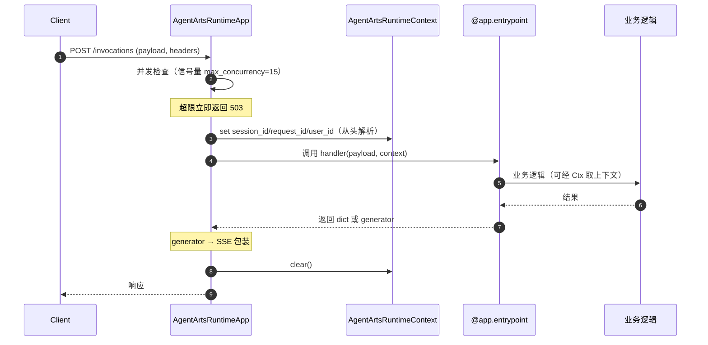

# Agent Runtime

> SDK 锚点：`agentarts.sdk.runtime`（`app.py` / `context.py` / `model.py`）。Python 3.10+，ASGI（Starlette + uvicorn）。

## 1. 定位与原理

Runtime 是 Agent 的**生产运行时**。它把任意 Agent 代码包装为符合 AgentArts 控制面标准的 HTTP/WebSocket 服务，并在此过程中注入企业级能力：并发控制、上下文隔离、健康检查、长任务追踪、审计透传。

**为什么需要 Runtime**：裸跑一个 `async def handler(payload)` 不具备生产条件——没有健康检查、没有并发上限、没有 session 隔离、没有审计。`AgentArtsRuntimeApp` 用装饰器模式在不侵入业务代码的前提下补齐这些能力。

核心组件：

| 组件 | 说明 |
| --- | --- |
| `AgentArtsRuntimeApp` | ASGI 应用，提供 HTTP/WebSocket 端点 |
| `RequestContext` | 请求上下文快照（Pydantic 模型），含 `session_id` / `request_id` / `request` |
| `AgentArtsRuntimeContext` | 全局上下文管理器，基于 `contextvars`，异步安全、无需实例化 |
| `PingStatus` | 健康状态枚举：HEALTHY / HEALTHY_BUSY / UNHEALTHY |

## 2. 服务端点

| 端点 | 方法 | 说明 |
| --- | --- | --- |
| `/invocations` | POST | Agent 调用入口，handler 返回 generator 时自动包装为 SSE |
| `/ping` | GET | 健康检查，返回 `PingStatus` |
| `/ws` | WebSocket | 双向流式通信 |

## 3. 快速开始

### 最简 Agent

```python
from agentarts.sdk import AgentArtsRuntimeApp, RequestContext

app = AgentArtsRuntimeApp()

@app.entrypoint
async def handler(payload: dict, context: RequestContext = None) -> dict:
    message = payload.get("message", "")
    return {"response": f"Received: {message}"}

if __name__ == "__main__":
    app.run()
```

启动：

```bash
agentarts dev          # 本地开发（127.0.0.1:8080）
python agent.py        # 直接运行
uvicorn agent:app --host 0.0.0.0 --port 8080   # 用 uvicorn
```

### 流式响应（SSE）

handler 返回生成器即自动转为 SSE（`text/event-stream`）：

```python
import asyncio
from typing import AsyncGenerator

@app.entrypoint
async def streaming_handler(payload: dict) -> AsyncGenerator:
    message = payload.get("message", "")
    for i, word in enumerate(message.split()):
        await asyncio.sleep(0.1)
        yield {"chunk": word, "index": i, "total": len(message.split())}
```

### 健康检查

```python
from agentarts.sdk.runtime.model import PingStatus

@app.ping
def health_check() -> PingStatus:
    return PingStatus.HEALTHY if is_healthy() else PingStatus.UNHEALTHY

# 维护模式：强制设为 UNHEALTHY
app.force_ping_status(PingStatus.UNHEALTHY)
app.force_ping_status(None)  # 恢复自动探测
```

`PingStatus` 语义：

| 状态 | 说明 |
| --- | --- |
| HEALTHY | 服务健康，无正在执行的任务 |
| HEALTHY_BUSY | 服务健康，有任务正在执行（async task 注册表非空） |
| UNHEALTHY | 服务不健康 |

### WebSocket

```python
from starlette.websockets import WebSocket

@app.websocket
async def ws_handler(websocket: WebSocket, context: RequestContext = None):
    await websocket.accept()
    session_id = context.session_id if context else "default"
    try:
        while True:
            data = await websocket.receive_json()
            response = await process_message(session_id, data)
            await websocket.send_json(response)
    except Exception:
        pass
```

### 长后台任务

`@app.async_task` 标记的函数进入 `_active_tasks` 注册表，影响 ping 状态（BUSY）：

```python
@app.async_task
async def background_job(payload: dict):
    await asyncio.sleep(10)
    return await process_data(payload)

@app.entrypoint
async def handler(payload: dict, context: RequestContext = None):
    asyncio.create_task(background_job(payload))
    if app.has_running_tasks():
        print("有后台任务正在执行")
    return {"status": "accepted"}
```

## 4. AgentArtsRuntimeApp 初始化参数

```python
app = AgentArtsRuntimeApp(
    debug=False,           # 调试模式
    lifespan=None,         # 生命周期管理
    middleware=None,       # 中间件列表
    protocol="http",       # "http" | "https"
    max_concurrency=15,    # 最大并发，超出返回 503
)
```

| 参数 | 类型 | 默认 | 说明 |
| --- | --- | --- | --- |
| `debug` | bool | False | 调试模式 |
| `lifespan` | Lifespan | None | 生命周期管理 |
| `middleware` | Sequence[Middleware] | None | 中间件列表 |
| `protocol` | "http" \| "https" | "http" | 协议类型 |
| `max_concurrency` | int | 15 | 最大并发请求数，超出返回 503 |

`app.run(host=None, port=8080)` 的 host 自动探测顺序：`AGENTARTS_BIND_IP` 环境变量 → Docker/K8s 中 eth0 IP → 本地 `127.0.0.1`。

## 5. 上下文：RequestContext 与 AgentArtsRuntimeContext

两套上下文，用途不同：

| 上下文 | 性质 | 获取方式 | 适用场景 |
| --- | --- | --- | --- |
| `RequestContext` | 请求级不可变快照 | handler 的 `context` 参数 | 在 handler 内直接取 |
| `AgentArtsRuntimeContext` | 全局 contextvars | 类方法 `get_*()` / `set_*()` | 在调用栈任意深处访问 |

`AgentArtsRuntimeContext` 可用方法：

| 方法 | 说明 |
| --- | --- |
| `get_session_id()` / `set_session_id(v)` | 会话 ID |
| `get_request_id()` / `set_request_id(v)` | 请求 ID |
| `get_user_id()` / `set_user_id(v)` | 用户 ID |
| `get_workload_access_token()` / `set_workload_access_token(v)` | 工作负载访问令牌 |
| `get_user_token()` / `set_user_token(v)` | 用户令牌 |
| `get_oauth2_callback_url()` / `set_oauth2_callback_url(v)` | OAuth2 回调 URL |
| `clear()` | 清除所有上下文变量（每次调用后自动执行） |

在深层函数中访问上下文（无需层层传参）：

```python
from agentarts.sdk.runtime.context import AgentArtsRuntimeContext

async def process_with_context():
    session_id = AgentArtsRuntimeContext.get_session_id()  # 任意深处可取
    return {"processed": True, "session": session_id}
```

## 6. HTTP 头约定

Runtime 通过 HTTP 头透传会话与身份信息：

| 头 | 说明 |
| --- | --- |
| `x-hw-agentarts-session-id` | 会话 ID |
| `X-HW-AgentGateway-Workload-Access-Token` | 工作负载访问令牌 |
| `X-HW-AgentGateway-User-Id` | 用户 ID |
| `X-Hw-AgentArts-Runtime-Custom-*` | 自定义头前缀 |

## 7. 调用链



## 8. CLI 命令

| 命令 | 作用 |
| --- | --- |
| `agentarts init -n <name> -t <template>` | 初始化项目，模板 `basic\|langchain\|langgraph\|google-adk` |
| `agentarts dev` | 本地开发服务（默认 `127.0.0.1:8080`） |
| `agentarts config` | 交互式配置（`list/set/get/remove/set-env` 等子命令） |
| `agentarts launch`（别名 `deploy`） | 云端部署（`--mode cloud\|local`） |
| `agentarts invoke '<json>'` | 调用已部署 Agent（`--mode cloud\|local`、`--endpoint`、`--session`、`--custom-path`） |
| `agentarts destroy` | 销毁部署 |
| `agentarts runtime exec-command` | 远程执行命令（超时上限 **3600s**，默认 60s；含 shell 元字符自动用 `sh -c` 包裹） |
| `agentarts runtime upload-files` | 上传文件（默认路径 `/tmp/`，单文件 100MB 上限） |
| `agentarts runtime download-files` | 下载文件（`--recursive` 走 tar） |
| `agentarts runtime start-session / stop-session` | 会话生命周期 |

## 9. 伙伴 Agent 适配关注

接入伙伴 Agent 时需确认：

1. **Agent 启动方式**：`@app.entrypoint` + `app.run()`，或 CLI `launch`
2. **镜像规范**：默认 `python:3.10-slim`，平台 `linux/arm64`，Dockerfile 由模板生成
3. **HTTP 入口协议**：`/invocations` + `/ping` + `/ws`，payload 为 JSON dict
4. **Session 管理**：`x-hw-agentarts-session-id` 头，或 `--session` 参数，或 `RequestContext.session_id`
5. **长任务恢复**：`@app.async_task` + `has_running_tasks()` + ping 状态反映 busy

## 10. Long Loop 支持

Runtime 支持长任务的可中断恢复。任务状态机：

```
INIT → PLAN → EXECUTING → WAITING → COMPLETED
                  ↓            ↓
               FAILED       REPLAN
```

需持久化的字段：`task_id` / `current_step` / `artifacts` / `errors` / `decisions`。

对应 SDK 机制：
- **async task 注册表** + `PingStatus.HEALTHY_BUSY` 反映运行中任务
- **session 级 Memory 持久化**（见 [03-memory](../03-memory/memory.md)）保存任务状态
- **`exec-command` 超时上限 3600s** 支持长执行

## 11. 注意事项

1. **并发限制**：默认 `max_concurrency=15`，超出立即 503（非排队）
2. **上下文隔离**：每个请求的 contextvars 相互隔离，不会互相干扰
3. **流式响应**：handler 返回 generator 自动 SSE，无需手动设置
4. **健康检查**：有状态 Agent 建议实现自定义 `@app.ping`
5. **WebSocket 生命周期**：需自行处理 accept / receive / send / close
6. **框架版本**：LangGraph ≥ 1.0.0、LangChain ≥ 0.1.0（新 Checkpoint 格式含 `step`/`pending_sends`/`parents`）
7. **健康不等于控制面状态**：运行时列表的“正常”仅表示资源操作成功，实例健康应检查 `/ping`、LTS 日志和实际调用。详见 [可观测性](../07-operation/observability.md)。
