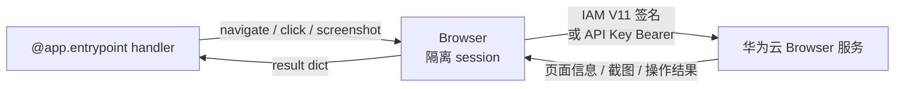

# Sandbox（Browser 浏览器自动化）

> SDK 锚点：`agentarts.sdk.tools.browser`（`Browser`、`browser_session`）。Python 3.10+。v0.1.4 之后新增，v0.1.6 已随 `agentarts.sdk` 顶层导出。

## 1. 定位与原理

Browser 是 AgentArts 的**沙箱浏览器**：让 Agent 在华为云托管的隔离浏览器 session 中打开网页、点击、输入、截图，而不是在 Runtime 进程里驱动本地浏览器。

| 维度 | 本地 Playwright/Selenium | AgentArts Browser |
| --- | --- | --- |
| 运行位置 | Agent 容器内 | 华为云托管隔离浏览器 |
| 认证 | 无 | IAM V11 签名 或 API Key Bearer |
| 可观测 | 自行搭建 | `observability`（日志/指标/Trace）与网关投递 |
| 人机协同 | 自行实现 | 实时 live view 流 + `take_control` / `release_control` |
| 状态复用 | 自行保存 cookie | Browser Profile（`save_profile`） |
| 网络边界 | 容器网络 | `network_config`：PUBLIC 或 VPC；`allowed_domains` / `blocked_domains` |

**为什么需要 Browser**：网页操作同样属于“不可信副作用”。把浏览器隔离到托管 session，配合域名白名单与人工接管，才能既让 Agent 完成信息检索/表单操作，又把凭证、Cookie 和网络边界留在平台侧。

## 2. 两平面分离

| 平面 | 职责 | 认证 | 客户端 |
| --- | --- | --- | --- |
| 控制面 | Browser 实例 + Browser Profile 的 CRUD | AK/SK | `ControlBrowserHttpClient` |
| 数据面 | session 启停、自动化操作、Profile 保存、流控制 | IAM V11 签名 或 API Key | `DataBrowserHttpClient` |

## 3. 快速开始

### 推荐：`browser_session` 上下文管理器

进入时 `start_session`，退出时自动 `stop_session`：

```python
from agentarts.sdk.tools import browser_session

with browser_session(
    region="cn-southwest-2",
    browser_name="my-browser",
    session_name="my-session",
    allowed_domains=["example.com"],
) as browser:
    browser.navigate("https://example.com")
    browser.key_type("AgentArts")          # 在当前焦点输入
    browser.key_press("Enter")
    browser.wait(1.0)
    print(browser.get_page_info())
    browser.screenshot(format="png", full_page=True)
```

> 注意：`Browser(region=...)` 的 `region` 是必填位置参数（与 `CodeInterpreter` 不同）；`browser_session` 会代建客户端。

### 手动管理 session

```python
from agentarts.sdk.tools import Browser

browser = Browser(region="cn-southwest-2", auth_type="API_KEY")
browser.create_browser(
    name="my-browser",
    auth_type="API_KEY",
    api_key_name="demo-key",          # API_KEY 认证时必填
    observability={"tracing": {"enabled": True}},
)
browser.start_session(
    browser_name="my-browser",
    session_name="my-session",
    api_key="your-api-key",           # 可选，不传则读 HUAWEICLOUD_SDK_BROWSER_API_KEY
)
browser.navigate("https://example.com")
browser.stop_session()
```

### 认证方式

```python
# API Key 认证（默认）
browser = Browser(region="cn-southwest-2")

# IAM 认证（会话无需 api_key）
browser = Browser(region="cn-southwest-2", auth_type="IAM")

# 自定义数据面端点
browser = Browser(
    region="cn-southwest-2",
    data_endpoint="https://your-custom-endpoint.com",
)
```

环境变量：

```bash
export HUAWEICLOUD_SDK_AK="your-access-key"
export HUAWEICLOUD_SDK_SK="your-secret-key"
export HUAWEICLOUD_SDK_BROWSER_API_KEY="your-api-key"                # API Key 认证时
export AGENTARTS_BROWSER_DATA_ENDPOINT="https://your-data-endpoint"  # 可选
```

## 4. Browser 初始化

```python
Browser(
    region: str | None,                     # 必填位置参数；传 None 时取 get_region()
    data_endpoint: Optional[str] = None,    # 缺省读 AGENTARTS_BROWSER_DATA_ENDPOINT
    auth_type: str = "API_KEY",             # "API_KEY" | "IAM"
    verify_ssl: Union[bool, str] = True,    # bool 或 CA 证书路径
)
```

## 5. 控制面 API

### Browser 实例管理

| 方法 | 说明 | 关键参数 |
| --- | --- | --- |
| `create_browser` | 创建浏览器实例 | `name`（正则 `[a-z][a-z0-9-]{0,38}[a-z0-9]$`）、`auth_type`、`api_key_name`（API_KEY 时必填，`^[a-zA-Z0-9_-]{1,64}$`）、`description`（≤4096）、`execution_agency_name`、`observability`、`network_config`、`agent_gateway_id`、`tags`（≤20，key 唯一） |
| `list_browsers` | 查询列表 | `name`、`limit`（默认 10）、`offset`、`sort_key`（created_at/updated_at）、`sort_dir`、tag 过滤（`tag_key_exists` / `tag_key_matches` / `tag_value_matches` / `tag_match_policy`） |
| `update_browser` | 更新（仅 `observability` / `tags`） | `browser_id`（UUID） |
| `get_browser` | 获取详情 | `browser_id` |
| `delete_browser` | 删除 | `browser_id`，返回 bool |

`create_browser` 返回字段含：`id` / `name` / `auth_type` / `api_key_name` / `execution_agency_name` / `agent_gateway_id` / `observability` / `network_config` / `workload_identity` / `access_endpoint` / `tags` / `created_at`。

`network_config`：`{"network_mode": "PUBLIC"|"VPC", "vpc_config": {"vpc_id": ..., "subnet_id": ..., "security_group_ids": [...]}}`。

### Browser Profile 管理

Profile 用于跨 session 复用浏览器状态（登录态、Cookie 等）。

| 方法 | 说明 |
| --- | --- |
| `create_browser_profile(name, description, tags)` | 创建 Profile |
| `list_browser_profiles(...)` | 列表（同 Browser 的 tag 过滤器） |
| `get_browser_profile(profile_id)` | 详情 |
| `delete_browser_profile(profile_id)` | 删除 |

在 `start_session(profile_configuration={...})` 中挂载 Profile，操作完成后调用 `save_profile(profile_id)` 回写状态。

## 6. 数据面 API

### Session 生命周期

| 方法 | 说明 | 关键参数 |
| --- | --- | --- |
| `start_session` | 启动会话 | `browser_name`、`session_name`、`session_id`、`viewport`、`profile_configuration`、`allowed_domains`、`blocked_domains`、`proxy_configuration`、`session_timeout`（默认 900s）、`api_key` |
| `get_session` | 获取会话详情 | `api_key` |
| `stop_session` | 停止当前会话 | 返回 bool |
| `save_profile` | 把当前会话状态保存到 Profile | `profile_id` |

> `allowed_domains` 与 `blocked_domains` 互斥，不能同时设置。

### 页面操作

统一入口 `invoke(type, action, api_key=None)`，`type` 必须是下列之一：

`mouse_click`、`mouse_move`、`mouse_drag`、`mouse_scroll`、`key_press`、`key_type`、`key_shortcut`、`navigate`、`go_back`、`go_forward`、`refresh`、`get_page_info`、`screenshot`、`wait`、`list_tabs`、`switch_tab`、`close_tab`、`new_tab`

常用便捷方法（内部都走 `invoke`）：

```python
browser.mouse_click(312, 482)             # 另有 left/right/double_mouse_click
browser.mouse_move(x, y)
browser.mouse_drag(100, 100, 200, 200, button="left")
browser.mouse_scroll(500, 300, delta_y=-100)   # delta_x/delta_y 可选
browser.key_press("Enter", presses=1) / key_type("hello") / key_shortcut(["Control", "c"])
browser.navigate("https://example.com")
browser.go_back() / go_forward() / refresh()
browser.get_page_info()
browser.screenshot(format="jpeg", quality=80, full_page=False)   # png | jpeg
browser.wait(2.5)                          # 0.1~30 秒
browser.list_tabs() / switch_tab(tab_id) / close_tab(tab_id) / new_tab(url)
```

### 人机协同（Human-in-the-loop）

| 方法 | 说明 |
| --- | --- |
| `generate_live_view_url()` | 返回 `(ws_url, headers)`，供前端展示实时画面 |
| `generate_automation_url()` | 返回 `(ws_url, headers)`，供程序接管自动化流 |
| `update_stream("enabled"\|"disabled")` | 切换流状态 |
| `take_control()` | 人工接管（等价 `update_stream("disabled")`） |
| `release_control()` | 交还 Agent（等价 `update_stream("enabled")`） |

## 7. 与 Runtime 的关系

Browser 是 Runtime handler 内部调用的工具，不直接对外暴露 HTTP 端点：



## 8. 联合开发检查项

| 需求 | 对应 API |
| --- | --- |
| 网页信息检索 | `navigate` + `get_page_info` |
| 表单/点击操作 | `key_type` / `mouse_click` / `key_shortcut` |
| 页面留证 | `screenshot` |
| 多标签页 | `new_tab` / `switch_tab` / `list_tabs` |
| 登录态复用 | Browser Profile + `save_profile` |
| 人工兜底 | live view + `take_control` / `release_control` |
| 网络边界 | `network_config` + `allowed_domains` |

需设计：`session_timeout`（默认 900s）、域名白名单、是否启用 VPC 内网、Profile 的隔离与清理策略、`observability` 审计配置。

## 9. 最佳实践

1. **优先用 `browser_session`**：自动 start/stop，避免 session 与计费泄漏
2. **默认开启域名白名单**：用 `allowed_domains` 收敛 Agent 可访问范围，避免注入式导航
3. **生产环境用 IAM 认证**：避免 API Key 硬编码
4. **长任务配 live view + 人工接管**：涉及提交、支付等高风险动作时先 `take_control`
5. **复用 Profile 而非重复登录**：`start_session(profile_configuration=...)` + `save_profile`
6. **操作后截图留证**：把 `screenshot` 结果落到 Memory 或对象存储，便于审计与 BadCase 复盘
7. **上线前验证日志**：开启 `observability.tracing/logs` 后执行一次可识别操作，确认“智能体运行分析”可检索。详见 [可观测性](../07-operation/observability.md)。
