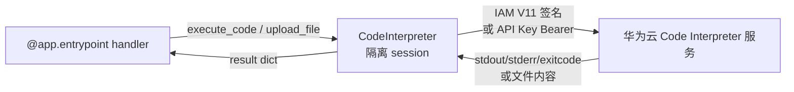

# Sandbox（Code Interpreter）

> SDK 锚点：`agentarts.sdk.tools.code_interpreter`（`CodeInterpreter`、`code_session`）。Python 3.10+。

## 1. 定位与原理

Sandbox **不是普通代码执行环境**，而是 Agent 的**安全执行环境**。区别在于：

| 维度 | 普通代码执行 | AgentArts Sandbox |
| --- | --- | --- |
| 隔离 | 进程级 | 华为云 Code Interpreter 服务，独立 session |
| 认证 | 无 | IAM V11-HMAC-SHA256 签名 或 API Key Bearer |
| 计费 | 无 | execute_code / execute_command / upload / download / install 均计费 |
| 命令安全 | 完整 shell | 正则阻断 shell 元字符 |
| 文件域 | 任意路径 | 归一化到 `/home/user` 下 |

**为什么需要 Sandbox**：Agent 生成的代码不可信（可能来自模型幻觉或用户输入），直接在 Runtime 进程执行会带来逃逸风险。Sandbox 把代码执行隔离到独立容器 session，并通过命令字符集白名单阻断注入。

## 2. 两平面分离

CodeInterpreter 同样遵循控制面/数据面分离：

| 平面 | 职责 | 认证 | 客户端 |
| --- | --- | --- | --- |
| 控制面 | Code Interpreter 实例 CRUD | AK/SK | `ControlToolsHttpClient` |
| 数据面 | session 内执行/文件操作 | IAM V11 签名 或 API Key | `DataToolsHttpClient` |

## 3. 快速开始

### 推荐：`code_session` 上下文管理器

自动管理 session 启停：

```python
from agentarts.sdk.tools import code_session

with code_session("cn-southwest-2", "my-code-interpreter-name") as client:
    result = client.execute_code("print('Hello, World!')")
    print(result)

    client.execute_command("ls -la")
    client.upload_file("/home/user/data.csv", "col1,col2\n1,2\n3,4")
    content = client.download_file("/home/user/output.txt")
```

### 手动管理 session

```python
from agentarts.sdk.tools import CodeInterpreter

client = CodeInterpreter(region="cn-southwest-2")
session_id = client.start_session(
    code_interpreter_name="my-code-interpreter-name",
    session_name="my-session",
    api_key="your-api-key",  # 可选，不传则从环境变量读取
)
result = client.execute_code("print('Hello')")
client.stop_session()  # 可选
```

### 认证方式

```python
# API Key 认证（默认）
client = CodeInterpreter(region="cn-southwest-2")

# IAM 认证（创建时 auth_type="IAM"，会话无需 api_key）
client = CodeInterpreter(region="cn-southwest-2", auth_type="IAM")

# 自定义端点
client = CodeInterpreter(
    region="cn-southwest-2",
    data_endpoint="https://your-custom-endpoint.com",
)
```

环境变量：

```bash
export HUAWEICLOUD_SDK_AK="your-access-key"
export HUAWEICLOUD_SDK_SK="your-secret-key"
export HUAWEICLOUD_SDK_CODE_INTERPRETER_API_KEY="your-api-key"  # API Key 认证时
export AGENTARTS_CODEINTERPRETER_DATA_ENDPOINT="https://your-data-endpoint"  # 可选
```

## 4. CodeInterpreter 初始化

```python
CodeInterpreter(
    region: Optional[str] = None,          # 从环境变量获取
    data_endpoint: Optional[str] = None,   # 从环境变量获取
    auth_type: str = "API_KEY",            # "API_KEY" | "IAM"
    verify_ssl: Union[bool, str] = True,   # bool 或 CA 证书路径
)
```

## 5. 控制面 API（实例管理）

| 方法 | 说明 | 关键参数 |
| --- | --- | --- |
| `create_code_interpreter` | 创建代码解释器 | `name`（正则 `[a-z][a-z0-9-]{0,38}[a-z0-9]$`）、`auth_type`、`api_key_name`、`description`、`observability`、`network_config`、`agent_gateway_id`、`tags` |
| `list_code_interpreters` | 查询列表 | `name`（2-40）、`limit`、`offset`、`sort_key`（created_at/updated_at）、`sort_dir`、tag 过滤（`tag_key_exists` / `tag_key_matches` / `tag_value_matches` / `tag_match_policy`，≤10 项） |
| `update_code_interpreter` | 更新 | `code_interpreter_id`、`observability`、`tags` |
| `get_code_interpreter` | 获取详情 | `code_interpreter_id` |
| `delete_code_interpreter` | 删除 | `code_interpreter_id` |

`create_code_interpreter` 返回字段含：`id` / `name` / `access_endpoint` / `workload_identity` / `observability` / `network_config` / `tags`。

## 6. 数据面 API（session 内操作）

### Session 生命周期

| 方法 | 说明 | 关键参数 |
| --- | --- | --- |
| `start_session` | 启动会话 | `code_interpreter_name`、`session_name`、`api_key`、`session_timeout`（60~86400s，默认 900s） |
| `get_session` | 获取会话详情 | `code_interpreter_name`、`session_id` |
| `stop_session` | 停止当前会话 | 返回 bool（无活跃会话返 True） |

### 代码与命令执行

```python
# 执行 Python 代码（计费）
result = client.execute_code('''
    import pandas as pd
    df = pd.DataFrame({'A': [1, 2, 3], 'B': [4, 5, 6]})
    print(df.describe())
''')
# 返回 {"stdout": ..., "stderr": ..., "exitcode": ...}

# 清除上下文后执行
result = client.execute_code("x = 10", clear_context=True)

# 执行命令（计费，阻断 shell 元字符）
result = client.execute_command("ls -la")
result = client.execute_command("python --version")
```

| 方法 | 说明 | 安全约束 |
| --- | --- | --- |
| `execute_code(code, language="python", clear_context=False)` | 执行代码 | 当前仅支持 python |
| `execute_command(command)` | 执行命令 | 正则 `^[a-zA-Z0-9_\-\.=\s\/\.:]+$` 阻断 shell 元字符 |
| `clear_context()` | 清除解释器状态 | 重置变量上下文 |

### 文件操作

```python
# 上传单个文件（计费）
client.upload_file(
    path="/home/user/my-file.csv",
    content="date,revenue\n2026-01-01,1000\n2026-01-02,2000",
    description='Daily sales data with columns: date, revenue',
)

# 上传多个文件（bytes 自动 base64）
client.upload_files([
    {"path": "/data.txt", "content": "Hello, World!"},
    {"path": "/home/user/my-binary-file", "content": b"123456"},
])

# 下载文件（自动解码 text/image/resource）
content = client.download_file("/home/user/data.txt")
files = client.download_files(["/home/user/data.txt", "/home/user/output.png"])
```

| 方法 | 说明 | 约束 |
| --- | --- | --- |
| `upload_file(path, content, description)` | 上传单文件 | 路径须 `/` 开头，限 `/home/user` 下；str→text，bytes→base64 blob |
| `upload_files(files)` | 批量上传 | 同上 |
| `download_file(path)` | 下载单文件 | 返回 str 或 bytes |
| `download_files(paths)` | 批量下载 | 返回 {path: content} |

### 包安装

```python
client.install_packages(["requests", "numpy==1.24.3"], upgrade=True)
```

`install_packages(packages, upgrade=False)`：阻断 `; & | \` $` 等元字符，防止命令注入。

### 通用调用入口

```python
result = client.invoke(
    operate_type="execute_code",
    arguments={"clear_context": False, "code": "print('Hi')", "language": "python"},
)
```

session 透传头：`x-HW-Agentarts-Code-Interpreter-Session-Id`。

## 7. 联合开发检查项

伙伴 Agent 是否需要：

| 需求 | 对应 API |
| --- | --- |
| Python 执行 | `execute_code` |
| Shell 执行 | `execute_command`（受限字符集，非完整 shell；需完整 shell 由 Runtime 侧 `exec-command` 的 `sh -c` 包裹） |
| 数据分析 | `execute_code` + `install_packages` |
| 文件生成 | `upload_file` / `download_file` |
| 第三方依赖 | `install_packages` |

需设计：资源限制、网络策略、权限边界（`auth_type`: API_KEY 或 IAM）、审计日志（`observability` 配置）、session 超时（60~86400s）。

## 8. 与 Runtime 的关系



Sandbox 是 Runtime 内部调用的工具，不直接对外暴露 HTTP 端点。Agent 在 handler 中创建 `CodeInterpreter` 实例并调用其方法。

> 浏览器操作是另一类 Sandbox：见 [browser.md](browser.md)。两者共用控制面/数据面分离与 session 隔离模型，但面向不同执行环境（代码 vs 网页）。

## 9. 最佳实践

1. **优先用 `code_session` 上下文管理器**：自动 start/stop，避免 session 泄漏
2. **生产环境用 IAM 认证**：避免 API Key 硬编码
3. **命令执行走 `execute_command`**：享受元字符阻断保护；需要复杂 shell 逻辑时拆分为多次调用
4. **大文件用 `upload_files` / `download_files`**：批量减少往返
5. **`description` 字段要写**：上传文件时写明数据结构（如 "CSV with columns: date, revenue"），便于 LLM 理解
6. **及时 `clear_context`**：长 session 中变量累积会拖慢执行
7. **上线前验证日志**：开启日志后，用一次可识别的测试执行验证工具详情和“智能体运行分析”都有数据。详见 [可观测性](../07-operation/observability.md)。
