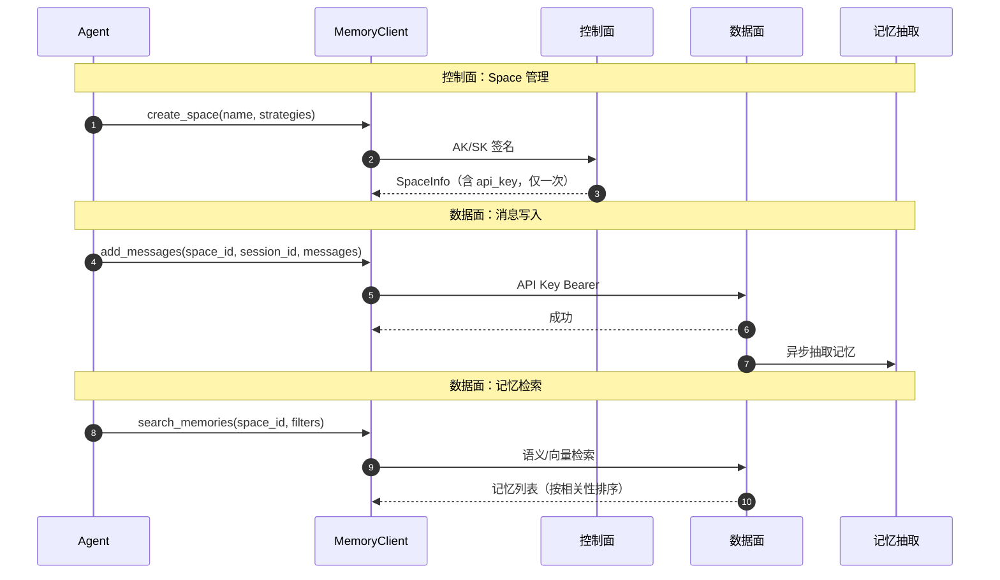

# Memory

> SDK 锚点：`agentarts.sdk.memory`（`client.py` / `async_client.py` / `session.py` / `async_session.py` / `inner/`）。Python 3.10+。

## 1. 定位与原理

企业 Agent 的 Memory **不是聊天记录**。聊天记录是原始消息流；Memory 是从消息中抽取、归类、可检索的**结构化知识**。

AgentArts Memory 把记忆按策略分类存储，支持语义检索，并与 session 绑定实现会话级上下文召回。

**记忆策略分类**（`StrategyType`）：

| 策略 | 说明 | 对应概念 |
| --- | --- | --- |
| SEMANTIC | 语义记忆 | Knowledge Memory |
| SUMMARY | 摘要记忆 | Knowledge Memory |
| USER_PREFERENCE | 用户偏好 | User Memory |
| EPISODIC | 情景记忆 | Task Memory |
| EVENT | 事件记忆 | Task Memory |
| CUSTOM | 自定义 | — |

## 2. 两平面分离

Memory 严格分离控制面与数据面：

| 平面 | 职责 | 认证 | 环境变量 |
| --- | --- | --- | --- |
| 控制面 | Space CRUD（资源管理） | AK/SK 签名 | `HUAWEICLOUD_SDK_AK` / `HUAWEICLOUD_SDK_SK` |
| 数据面 | session/message/memory 读写 | API Key Bearer | `HUAWEICLOUD_SDK_MEMORY_API_KEY` |

**为什么分离**：建 Space 是低频管理动作，可用强 AK/SK；每条消息的读写是高频且需最小权限，用 Space 级 API Key 更安全。API Key 在创建 Space 时生成，**仅显示一次**，须妥善保存。

## 3. SDK 客户端结构

三组客户端，按使用场景选择：

| 客户端 | 模式 | 适用场景 |
| --- | --- | --- |
| `MemoryClient` | 同步，全功能 | 需要控制所有操作 |
| `AsyncMemoryClient` | 异步（控制面仍同步、数据面 async） | 高并发数据面操作 |
| `MemorySession` / `AsyncMemorySession` | 预绑定 space_id+session_id+actor_id | 单一会话场景，代码最简洁 |

## 4. 快速开始

### Client 模式

```python
import time
from agentarts.sdk.memory import MemoryClient
from agentarts.sdk.memory.inner.config import TextMessage, MemorySearchFilter

with MemoryClient() as client:
    # 1. 创建 Space（控制面，AK/SK）
    space = client.create_space(
        name="my-memory-space",
        message_ttl_hours=168,
        description="示例记忆空间",
        memory_strategies_builtin=["semantic", "user_preference", "episodic"],
    )
    space_id = space.id
    api_key = space.api_key  # 仅此一次可见，妥善保存

    # 2. 创建会话（数据面，需 API Key）
    session_data = client.create_memory_session(
        space_id=space_id,
        actor_id="user-001",
        assistant_id="assistant-001",
    )
    session_id = session_data.id

    # 3. 添加消息
    client.add_messages(
        space_id=space_id,
        session_id=session_id,
        messages=[
            TextMessage(role="user", content="你好，我想了解机器学习", actor_id="user-001"),
            TextMessage(role="assistant", content="机器学习是 AI 的一个分支...", actor_id="assistant-001"),
        ],
    )

    # 4. 等待记忆生成（系统异步抽取，建议 30s）
    time.sleep(30)

    # 5. 搜索记忆
    results = client.search_memories(
        space_id=space_id,
        filters=MemorySearchFilter(query="机器学习", top_k=3),
    )
```

### Session 模式

```python
from agentarts.sdk.memory import MemoryClient
from agentarts.sdk.memory.session import MemorySession
from agentarts.sdk.memory.inner.config import TextMessage

with MemoryClient() as client:
    space = client.create_space(name="session-mode-space", memory_strategies_builtin=["semantic"])
    session = MemorySession(space_id=space.id, actor_id="user-002", assistant_id="assistant-002")
    # session_id 自动创建并绑定

    session.add_messages([TextMessage(role="user", content="我是一名 Python 开发者")])
    memories = session.list_memories(limit=10)
    results = session.search_memories(filters=MemorySearchFilter(query="Python", top_k=3))
```

## 5. API 参考

### MemoryClient 初始化

```python
MemoryClient(region_name="cn-southwest-2", api_key=None)
```

| 参数 | 类型 | 默认 | 说明 |
| --- | --- | --- | --- |
| `region_name` | str | cn-southwest-2 | 华为云区域 |
| `api_key` | str | None | 数据面 API Key，不传则从 `HUAWEICLOUD_SDK_MEMORY_API_KEY` 读取 |

### Space 管理（控制面）

| 方法 | 说明 | 关键参数 |
| --- | --- | --- |
| `create_space` | 创建记忆空间 | `name`（1-128）、`message_ttl_hours`（1-8760，默认 168）、`description`、`tags`、`memory_strategies_builtin`、`public_access_enable`（默认 True）、`private_vpc_id` |
| `list_spaces(limit=20, offset=0)` | 列出 Space | — |
| `get_space(space_id)` | 获取详情 | — |
| `update_space(space_id, ...)` | 更新配置 | `name` / `description` / `message_ttl_hours` |
| `delete_space(space_id)` | 删除（级联删 session/message/memory） | — |

`create_space` 返回 `SpaceInfo`：`id` / `name` / `api_key`（仅创建时可见）/ `api_key_id` / `status` / `created_at`。

### Session 管理（数据面）

| 方法 | 说明 | 关键参数 |
| --- | --- | --- |
| `create_memory_session` | 创建会话 | `space_id`、`id`（可选，指定 session_id）、`actor_id`、`assistant_id`、`meta` → `SessionInfo` |
| `list_sessions` | 列出会话 | `space_id`、`actor_id`（可选过滤）、`limit`（默认 20）、`offset` |
| `get_session` | 获取会话详情 | `space_id`、`session_id` → `SessionInfo` |
| `delete_session` | 删除会话 | `space_id`、`session_id` |

`MemorySession` 同样提供 `get_info()` / `delete()` / `close()`，并支持 `with` 上下文管理器自动关闭。

### 消息管理

```python
add_messages(
    space_id, session_id, messages,
    timestamp=None, idempotency_key=None, is_force_extract=False,
) -> MessageBatchResponse
```

消息类型（`inner/config.py`）：

| 类型 | 字段 | 说明 |
| --- | --- | --- |
| `TextMessage` | `role`（user/assistant/system）、`content`、`actor_id`、`assistant_id` | 文本消息 |
| `ToolCallMessage` | `id`、`name`、`arguments` | 工具调用 |
| `ToolResultMessage` | `tool_call_id`、`content` | 工具结果 |

其他消息方法：`list_messages` / `get_message` / `get_last_k_messages(session_id, k, space_id)`。

### 记忆检索

```python
search_memories(space_id, filters: MemorySearchFilter) -> MemorySearchResponse
list_memories(space_id, limit=10, offset=0, filters: MemoryListFilter) -> MemoryListResponse
get_memory(space_id, memory_id) / delete_memory(space_id, memory_id)
```

`MemorySearchFilter` 参数：

| 参数 | 说明 |
| --- | --- |
| `query` | 搜索查询字符串 |
| `strategy_type` | 策略类型过滤 |
| `strategy_id` / `actor_id` / `assistant_id` / `session_id` | 各维过滤 |
| `memory_type` | "memory" \| "episode" \| "reflection" |
| `start_time` / `end_time` | 时间范围 |
| `top_k` | 返回前 K 个（默认 10） |
| `min_score` | 最小相关性分数 0-1（默认 0.5） |

`MemoryListFilter`：同上 + `sort_by`（created_at/updated_at）+ `sort_order`（asc/desc）。

## 6. CLI 命令

`agentarts memory` 子组（AK/SK 环境变量）：

| 命令 | 说明 |
| --- | --- |
| `create` | `--ttl/-t 168`、`--strategies/-s`、`--tags key=val`、`--public/--private`、`--vpc-id`、`--subnet-id` |
| `get` / `list` / `update` / `delete` / `status` | Space 管理 |
| `install` / `uninstall` | 把记忆插件安装/卸载到 Claude Code / Codex / OpenCode / Hermes，见 [memory_plugin.md](memory_plugin.md) |
| `--output table\|json` | 输出格式 |

## 7. Long Loop 与任务记忆

长任务的可中断恢复依赖 Memory。Task Memory 保存：

- **Goal** — 任务目标
- **Plan** — 执行计划
- **Observation** — 每步观察
- **Decision** — 决策点
- **Artifact** — 产出物
- **Error** — 异常

对应 SDK 机制：

| 用途 | SDK 调用 |
| --- | --- |
| 暂停恢复 | `session_id` 持久化 + `get_last_k_messages` 取回上下文 |
| 任务续跑 | `search_memories` 按 `strategy_type` + `session_id` 召回 |
| 异常重规划 | `EPISODIC` 存 Error，`search_memories` 召回历史决策 |

结构化字段承载在 `TextMessage.meta` 中，`strategy_type=EPISODIC/EVENT` 供检索分类。

## 8. 框架适配

LangGraph 集成（`sdk.integration.langgraph`）：

- `AgentArtsMemorySessionSaver(BaseCheckpointSaver)` — Checkpointer，`thread_id` 即 `session_id`；除 `get_tuple`/`put` 外，v0.1.6 起支持 `put_writes`（pending writes 独立 session）、`list`、`delete_thread`、`close`/`aclose` 与 `with`/`async with`
- `AgentArtsMemoryStore(BaseStore)` — LangGraph Store 语义，namespace 存于 message meta；`PutOp(value=None)` 即删除记忆（不再是 no-op）

详见 [06-integration/partner_agent_adaptation.md](../06-integration/partner_agent_adaptation.md)。

### 插件集成（AI 编程助手）

除在自研 Agent 中调用 Memory 外，还可把 Memory 挂载到 Claude Code / Codex / OpenCode / Hermes，见 [memory_plugin.md](memory_plugin.md)。

## 9. 数据流



## 10. 最佳实践

1. **AK/SK 用环境变量**：避免硬编码；生产环境用密钥管理服务
2. **API Key 妥善保存**：创建 Space 时仅返回一次
3. **记忆生成有延迟**：发送消息后建议等待 30s 再查询
4. **用上下文管理器**：`with MemoryClient() as client` 自动释放资源
5. **参数边界**：Space 名称 1-128 字符、消息内容最大 10000 字符、actor_id/assistant_id ≤ 64 字符
6. **按策略分类存储**：用 `strategy_type` 把不同性质的记忆分开，检索时按类型过滤
7. **TTL 按需设置**：`message_ttl_hours` 范围 1-8760（1 小时到 1 年），按业务保留期设置
