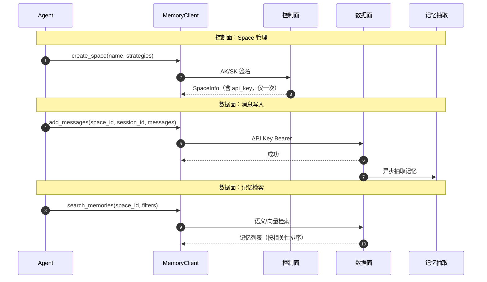

# Memory

> SDK 锚点：`agentarts.sdk.memory`（`client.py` / `async_client.py` / `session.py` / `async_session.py` / `inner/`）。Python 3.10+。
>
> **官方材料基线**：0916《托管与运行智能体》第 5 章「记忆库」（147–195 页）+ API 参考 4.6。

## 1. 定位与原理

### 1.1 一句话定义

记忆库是智能体用于**存储、管理和检索历史信息**的核心组件：通过控制台创建并配置不同类型的记忆能力，对交互过程中产生的信息进行**提取、整理和保存**，使智能体能在后续交互中按需获取相关历史上下文。

它与知识库是两条互补的数据通路：**知识库解决"Agent 知道什么"（静态、共享），记忆库解决"Agent 记得什么"（动态、按 actor 隔离）**。完整对比见 [09-knowledge-base/knowledge_base.md](../09-knowledge-base/knowledge_base.md) 第 1 节。

企业 Agent 的 Memory **不是聊天记录**。聊天记录是原始消息流；长期记忆是从消息中抽取、归类、可检索的**结构化知识**。

### 1.2 分层记忆架构（0916 官方模型）

```
用户 ↔ Agent 交互
        │
        ▼
   ①短期记忆（Session 内原始消息：user / assistant / system / tool）
        │
        │  满足触发条件（会话空闲 / 累计 Token / 累计消息数，OR 关系）
        ▼  异步生成
   ②长期记忆（策略驱动抽取 → 整合 → 向量化 → 持久化）
        │
        │  后续交互按需检索
        ▼
   ③检索召回（语义召回 → 相关性过滤 → 融合排序 → 可选精排 → top_k）
```

| 层 | 保存内容 | 隔离单元 | 生命周期 |
| --- | --- | --- | --- |
| **短期记忆** | 原始交互消息（user / assistant / system / tool），不做长期记忆抽取或结构化转换 | **Session**，不支持跨 Session 查询 | 可配置保留期，**默认 90 天**，范围 7–365 天，超期系统自动清理 |
| **长期记忆** | 策略驱动的结构化记忆记录（记忆内容 + 向量表示 + 元数据） | **用户级（跨会话复用）** 或 **会话级（会话内使用）**，生成与检索均遵循该级别 | **默认持久化保存，不设自动过期**；直到用户显式删除、所属空间被删除触发关联清理，或超出租户配额 |

**短期记忆特点**：会话级隔离、支持多种消息角色、支持分页与排序查询（按消息顺序或时间）。

**长期记忆特点**：
- **策略驱动生成**：不同策略提取不同类型信息
- **结构化记录**：内容 + 向量 + 元数据
- **支持语义检索与相关性排序**：结合相关性阈值与排序配置返回
- **支持多维过滤**：按策略、用户、会话、时间等条件筛选

### 1.3 记忆策略（官方 5 内置 + 自定义）

**策略决定"从短期记忆中提取什么信息、以什么形式存入长期记忆"**。可同时启用多种策略，每次触发提取时各策略**独立运行**，分别产生不同类型的长期记忆记录。

| 策略 | 提取内容 | 什么时候用 |
| --- | --- | --- |
| **总结 Summary** | 会话主题、任务过程、关键决策等摘要信息 | 对话较长，需要压缩保留核心信息。例：客服会话摘要、会议纪要 |
| **语义记忆 Semantic Memory** | 事实信息、概念和上下文知识 | 对话中出现关键事实和知识。例：用户提到的项目名称、技术栈 |
| **用户偏好 User Preference** | 用户行为模式、偏好和选择 | 需要记住用户的喜好和习惯。例：用户喜欢中文回复、偏好简洁 |
| **情景记忆 Episodic Memory** | 具有时间、场景和经历特征的具体事件信息 | 从完整经历中学习，不仅记录"发生了什么"，还沉淀教训与反思 |
| **程序性记忆 Procedural Memory** | 可复用的任务流程、操作步骤和执行经验 | 需要固化操作流程、行动步骤和关键提示，形成可复用的执行指南。例：代码仓探索流程、运维操作执行纲要 |
| **自定义 CUSTOM** | 由用户编写提示模板决定 | 5 个内置策略不满足需求时 |

**语义记忆 vs 情景记忆**（官方对比）：

| 对比项 | 语义记忆 | 情景记忆 |
| --- | --- | --- |
| 举例 | "Python 3.11" | "上次遇到这个问题，是这样解决的" |
| 作用 | Agent **知道什么** | Agent **学到了什么** |
| 时效性 | 相对稳定 | 随经历积累 |
| 检索匹配 | 按事实关键词 | 按情境相似度 |

> ⚠️ **SDK 枚举与官方口径的差异**：SDK `StrategyType` 中存在 `EVENT`（事件记忆），而 0916 官方列出的 5 个内置策略中**没有独立的 EVENT**，取而代之的是**程序性记忆（Procedural Memory）**。设计时以官方控制台可选策略为准，`EVENT` 是否仍受支持需在实验局实测确认。

#### 程序性记忆（0916 新增，编码/运维场景最高价值）

**定位**：Agent 的"流程与经验库"。解决 Agent 每次面对相似任务都从零推理、重复探索、浪费 token 的问题；同时**约束 LLM 推理边界**，提供前置条件检查、步骤拆解、检查点机制和回滚预案等结构化执行纲要。

**字段结构**（自然语言分条目）：

| 字段 | 含义 |
| --- | --- |
| 标题 Title | 简洁描述性标题 |
| 适用场景 Use Cases | 触发条件、适用场景和目标类型（"什么时候用"） |
| 操作步骤 Action Steps | 编号步骤序列（"具体做什么"） |
| 关键提示 Key Hints | 工具使用模式、决策标准、什么有效、什么该避免 |
| 失败模式 Failure Modes | 已知失败场景及恢复策略（可选） |

**三档结构化程度**：Level 1 纯文本摘要（标题 + 适用场景 + 关键提示）→ Level 2 自然语言经验（+ 操作步骤 + 失败模式）→ Level 3 结构化文档（全部字段）。

**适用场景**：Agent 需固化成功操作流程、编码智能体需固化代码仓认知/代码审查流程、运维智能体需结构化执行纲要、需要约束 LLM 推理边界并提供检查点与回滚预案的复杂任务。

#### 自定义策略（0916 新增）

内置策略的提取逻辑由平台预定义，用户**无法修改提取规则与输出格式**。自定义策略把提取逻辑完全交给用户——用户编写提示模板（Prompt）告诉模型从对话中提取什么、以什么格式输出，平台按触发条件调用模型执行提取并存入长期记忆。

**配置三段提示词模板**：

| 阶段 | 作用 |
| --- | --- |
| **抽取 Extraction** | 从大量数据中提取关键信息和重要特征。可用默认用户提示或自定义提示 |
| **整合 Consolidation** | 将提取出的信息汇总、合并和优化，确保完整性与一致性 |
| **反思 Reflection** | 对过去的经验、行为或数据进行分析和总结，提取有价值的信息和洞察 |

**提示词模板编写原则**：明确提取目标 / 定义输出格式（给出 JSON 结构示例）/ 提供正例（1–2 个输入对话与期望输出）/ 说明忽略内容 / 控制输出长度。

约束：自定义策略可与内置策略同时启用、互不影响；**策略名称不可重复**（a-z、A-Z、0-9、中划线，≤48 字符）。自定义策略的创建与维护在控制台「托管与运行 > 记忆库 > 详情 > 基本信息 > 长期记忆提取策略」完成。

### 1.4 长期记忆生成机制

长期记忆由系统基于短期记忆中的历史消息**异步生成**。满足任一触发条件启动提取任务：

| 触发参数 | 配置范围 | 默认 | 说明 |
| --- | --- | --- | --- |
| 会话空闲时间 | 10 ~ 86,400 秒 | **10 秒** | 会话在指定时间内未产生新消息时触发 |
| 最大累计 Token 数 | 1,000 ~ 1,073,741,824 | **4,096** | 累计消息 Token 达到阈值触发 |
| 最大累计消息数 | 3 ~ 10,000 | **10** | 累计消息数量达到阈值触发 |

**多个触发条件之间是 OR 关系**，任一满足即触发。

**生成流程**：① 信息抽取（Extraction，按启用策略分析短期记忆，提取候选记忆）→ ② 记忆整合（Consolidation，去重/合并/更新，不同策略整合方式可能不同）→ ③ 向量化（Embedding）→ ④ 持久化存储（内容 + 向量 + 策略/用户/会话等元数据）。

> ⚠️ **异步的工程后果**：提取采用异步处理机制，触发后需完成抽取、整合、向量化，**结果可能不会立即可用**。官方建议：短期记忆写入后 **等待 3–5 分钟**再进行长期记忆查询。

### 1.5 长期记忆检索机制

```
查询 + 过滤条件
   → ①召回（语义检索，获取语义相关候选）
   → ②相关性过滤（按 min_score 过滤低相关候选）
   → ③融合排序（语义相关性 + 实体关联信号 + 可选 BM25 词法匹配）
   → ④精排 Rerank（可选，默认开启）
   → ⑤top_k 截取返回
```

| 环节 | 参数 / 说明 |
| --- | --- |
| 相关性过滤 | `min_score` 取值范围 **0–1，默认 0.75**（官方口径；SDK 侧 `MemorySearchFilter.min_score` 默认值不同，见第 5 节） |
| 融合排序 | 当前支持**实体关联信号**，并可配置启用 **BM25 词法匹配信号** |
| 精排 Rerank | **默认开启**；可通过全局配置或单次检索请求关闭；未开启时回退至融合排序结果 |
| 结果返回 | `top_k` 支持 **1–100 条，默认返回 10 条** |

**返回结果的 `score`**：开启精排时返回精排得分；未开启时返回融合排序得分。

**多维过滤**：支持按策略、用户、助手、会话、记忆类型和时间范围限制检索范围。

### 1.6 记忆组织与隔离

| 隔离维度 | 说明 |
| --- | --- |
| **空间（space）** | 每个记忆库是一个独立空间，对应一个 `space_id` |
| **用户（actor）** | 按 `actor_id` 隔离不同终端用户的记忆，**用户 A 的记忆对用户 B 不可见** |
| **会话（session）** | 短期记忆按 Session 隔离；长期记忆也可限在单 Session 内 |

**访问控制（0916 新增）**：**空间级密钥可执行全部操作**；**会话级密钥仅可读、追加消息和检索记忆，禁止创建/删除会话与记忆**。

> **实践铁律**：同一用户的不同会话应使用**相同** `actor_id`（长期记忆才能跨会话共享）；不同用户**必须**使用不同 `actor_id`（否则记忆数据串扰）；建议使用业务系统中的用户 ID 作为 `actor_id`。

### 1.7 规格与限制

| 项 | 限额 |
| --- | --- |
| 记忆库 / 租户 | 默认最多 **10 个**（需增加配额请提工单） |
| 自定义策略 / 记忆库 | 最多 **10 个** |
| 短期记忆事件过期时间 | 7–365 天（默认 90 天） |
| 长期记忆记录 | 持久保存，可通过检索与删除管理 |
| 网络访问 | 创建时公网/私网**至少选一种**，**开启后不支持关闭** |
| 策略选择 | 创建时内置策略与自定义策略**至少选一种** |
| 加密 | 使用云服务默认密钥（`agentarts/default`）或自定义密钥，**创建后不可修改** |
| 单条消息大小 | 建议不超过平台规定最大长度 |
| API 调用频率 | 超频请求会被流控，可在观测指标中查看流控情况 |
| 容量 | 占用套餐包存储额度（体验版 1GB … 企业旗舰版 800GB/1200GB，见 [release_delta_0916.md](../00-overview/release_delta_0916.md) 第 4 节） |

## 2. 两平面分离

Memory 严格分离控制面与数据面：

| 平面 | 职责 | 认证 | 环境变量 |
| --- | --- | --- | --- |
| 控制面 | Space CRUD（资源管理） | AK/SK 签名 | `HUAWEICLOUD_SDK_AK` / `HUAWEICLOUD_SDK_SK` |
| 数据面 | session/message/memory 读写 | API Key Bearer | `HUAWEICLOUD_SDK_MEMORY_API_KEY` |

**为什么分离**：建 Space 是低频管理动作，可用强 AK/SK；每条消息的读写是高频且需最小权限，用 Space 级 API Key 更安全。API Key 在创建 Space 时生成，**仅显示一次**，须妥善保存。

## 3. SDK 客户端结构

三组客户端，按使用场景选择：

| 客户端 | 模式 | 适用场景 |
| --- | --- | --- |
| `MemoryClient` | 同步，全功能 | 需要控制所有操作 |
| `AsyncMemoryClient` | 异步（控制面仍同步、数据面 async） | 高并发数据面操作 |
| `MemorySession` / `AsyncMemorySession` | 预绑定 space_id+session_id+actor_id | 单一会话场景，代码最简洁 |

## 4. 快速开始

### Client 模式

```python
import time
from agentarts.sdk.memory import MemoryClient
from agentarts.sdk.memory.inner.config import TextMessage, MemorySearchFilter

with MemoryClient() as client:
    # 1. 创建 Space（控制面，AK/SK）
    space = client.create_space(
        name="my-memory-space",
        message_ttl_hours=168,
        description="示例记忆空间",
        memory_strategies_builtin=["semantic", "user_preference", "episodic"],
    )
    space_id = space.id
    api_key = space.api_key  # 仅此一次可见，妥善保存

    # 2. 创建会话（数据面，需 API Key）
    session_data = client.create_memory_session(
        space_id=space_id,
        actor_id="user-001",
        assistant_id="assistant-001",
    )
    session_id = session_data.id

    # 3. 添加消息
    client.add_messages(
        space_id=space_id,
        session_id=session_id,
        messages=[
            TextMessage(role="user", content="你好，我想了解机器学习", actor_id="user-001"),
            TextMessage(role="assistant", content="机器学习是 AI 的一个分支...", actor_id="assistant-001"),
        ],
    )

    # 4. 等待记忆生成（系统异步抽取，官方建议等待 3–5 分钟再检索长期记忆）
    time.sleep(300)  # 仅演示用；生产中不要阻塞，改为稍后异步查询

    # 5. 搜索记忆
    results = client.search_memories(
        space_id=space_id,
        filters=MemorySearchFilter(query="机器学习", top_k=3),
    )
```

### Session 模式

```python
from agentarts.sdk.memory import MemoryClient
from agentarts.sdk.memory.session import MemorySession
from agentarts.sdk.memory.inner.config import TextMessage

with MemoryClient() as client:
    space = client.create_space(name="session-mode-space", memory_strategies_builtin=["semantic"])
    session = MemorySession(space_id=space.id, actor_id="user-002", assistant_id="assistant-002")
    # session_id 自动创建并绑定

    session.add_messages([TextMessage(role="user", content="我是一名 Python 开发者")])
    memories = session.list_memories(limit=10)
    results = session.search_memories(filters=MemorySearchFilter(query="Python", top_k=3))
```

## 5. API 参考

### MemoryClient 初始化

```python
MemoryClient(region_name="cn-southwest-2", api_key=None)
```

| 参数 | 类型 | 默认 | 说明 |
| --- | --- | --- | --- |
| `region_name` | str | cn-southwest-2 | 华为云区域 |
| `api_key` | str | None | 数据面 API Key，不传则从 `HUAWEICLOUD_SDK_MEMORY_API_KEY` 读取 |

### Space 管理（控制面）

| 方法 | 说明 | 关键参数 |
| --- | --- | --- |
| `create_space` | 创建记忆空间 | `name`（1-128）、`message_ttl_hours`（1-8760，默认 168）、`description`、`tags`、`memory_strategies_builtin`、`public_access_enable`（默认 True）、`private_vpc_id` |
| `list_spaces(limit=20, offset=0)` | 列出 Space | — |
| `get_space(space_id)` | 获取详情 | — |
| `update_space(space_id, ...)` | 更新配置 | `name` / `description` / `message_ttl_hours` |
| `delete_space(space_id)` | 删除（级联删 session/message/memory） | — |

`create_space` 返回 `SpaceInfo`：`id` / `name` / `api_key`（仅创建时可见）/ `api_key_id` / `status` / `created_at`。

### Session 管理（数据面）

| 方法 | 说明 | 关键参数 |
| --- | --- | --- |
| `create_memory_session` | 创建会话 | `space_id`、`id`（可选，指定 session_id）、`actor_id`、`assistant_id`、`meta` → `SessionInfo` |
| `list_sessions` | 列出会话 | `space_id`、`actor_id`（可选过滤）、`limit`（默认 20）、`offset` |
| `get_session` | 获取会话详情 | `space_id`、`session_id` → `SessionInfo` |
| `delete_session` | 删除会话 | `space_id`、`session_id` |

`MemorySession` 同样提供 `get_info()` / `delete()` / `close()`，并支持 `with` 上下文管理器自动关闭。

### 消息管理

```python
add_messages(
    space_id, session_id, messages,
    timestamp=None, idempotency_key=None, is_force_extract=False,
) -> MessageBatchResponse
```

消息类型（`inner/config.py`）：

| 类型 | 字段 | 说明 |
| --- | --- | --- |
| `TextMessage` | `role`（user/assistant/system）、`content`、`actor_id`、`assistant_id` | 文本消息 |
| `ToolCallMessage` | `id`、`name`、`arguments` | 工具调用 |
| `ToolResultMessage` | `tool_call_id`、`content` | 工具结果 |

其他消息方法：`list_messages` / `get_message` / `get_last_k_messages(session_id, k, space_id)`。

### 记忆检索

```python
search_memories(space_id, filters: MemorySearchFilter) -> MemorySearchResponse
list_memories(space_id, limit=10, offset=0, filters: MemoryListFilter) -> MemoryListResponse
get_memory(space_id, memory_id) / delete_memory(space_id, memory_id)
```

`MemorySearchFilter` 参数：

| 参数 | 说明 |
| --- | --- |
| `query` | 搜索查询字符串 |
| `strategy_type` | 策略类型过滤 |
| `strategy_id` / `actor_id` / `assistant_id` / `session_id` | 各维过滤 |
| `memory_type` | "memory" \| "episode" \| "reflection" |
| `start_time` / `end_time` | 时间范围 |
| `top_k` | 返回前 K 个（默认 10） |
| `min_score` | 最小相关性分数 0-1（默认 0.5） |

`MemoryListFilter`：同上 + `sort_by`（created_at/updated_at）+ `sort_order`（asc/desc）。

## 6. CLI 命令

`agentarts memory` 子组（AK/SK 环境变量）：

| 命令 | 说明 |
| --- | --- |
| `create` | `--ttl/-t 168`、`--strategies/-s`、`--tags key=val`、`--public/--private`、`--vpc-id`、`--subnet-id` |
| `get` / `list` / `update` / `delete` / `status` | Space 管理 |
| `install` / `uninstall` | 把记忆插件安装/卸载到 Claude Code / Codex / OpenCode / Hermes，见 [memory_plugin.md](memory_plugin.md) |
| `--output table\|json` | 输出格式 |

## 7. Long Loop 与任务记忆

长任务的可中断恢复依赖 Memory。Task Memory 保存：

- **Goal** — 任务目标
- **Plan** — 执行计划
- **Observation** — 每步观察
- **Decision** — 决策点
- **Artifact** — 产出物
- **Error** — 异常

对应 SDK 机制：

| 用途 | SDK 调用 |
| --- | --- |
| 暂停恢复 | `session_id` 持久化 + `get_last_k_messages` 取回上下文 |
| 任务续跑 | `search_memories` 按 `strategy_type` + `session_id` 召回 |
| 异常重规划 | `EPISODIC` 存 Error，`search_memories` 召回历史决策 |

结构化字段承载在 `TextMessage.meta` 中，`strategy_type=EPISODIC/EVENT` 供检索分类。

## 8. 框架适配

LangGraph 集成（`sdk.integration.langgraph`）：

- `AgentArtsMemorySessionSaver(BaseCheckpointSaver)` — Checkpointer，`thread_id` 即 `session_id`；除 `get_tuple`/`put` 外，v0.1.6 起支持 `put_writes`（pending writes 独立 session）、`list`、`delete_thread`、`close`/`aclose` 与 `with`/`async with`
- `AgentArtsMemoryStore(BaseStore)` — LangGraph Store 语义，namespace 存于 message meta；`PutOp(value=None)` 即删除记忆（不再是 no-op）

详见 [06-integration/partner_agent_adaptation.md](../06-integration/partner_agent_adaptation.md)。

### 插件集成（AI 编程助手）

除在自研 Agent 中调用 Memory 外，还可把 Memory 挂载到 Claude Code / Codex / OpenCode / Hermes，见 [memory_plugin.md](memory_plugin.md)。

## 9. 数据流



## 10. 最佳实践

1. **AK/SK 用环境变量**：避免硬编码；生产环境用密钥管理服务
2. **API Key 妥善保存**：创建 Space 时仅返回一次
3. **记忆生成有延迟**：发送消息后建议等待 30s 再查询
4. **用上下文管理器**：`with MemoryClient() as client` 自动释放资源
5. **参数边界**：Space 名称 1-128 字符、消息内容最大 10000 字符、actor_id/assistant_id ≤ 64 字符
6. **按策略分类存储**：用 `strategy_type` 把不同性质的记忆分开，检索时按类型过滤
7. **TTL 按需设置**：`message_ttl_hours` 范围 1-8760（1 小时到 1 年），按业务保留期设置

## 11. 观测记忆指标（0916 新增）

记忆库支持指标观测与告警，用于发现流控、容量与检索质量问题。

| 能力 | 说明 |
| --- | --- |
| 支持的观测指标 | 记忆库运行指标（含 API 流控情况） |
| 查看观测指标 | 控制台记忆库详情页 |
| 创建告警规则 | 可对观测指标配置告警规则 |

**为什么重要**：官方明确"超过频率限制的请求会被流控，可在观测指标中查看流控情况"。这意味记忆库写入是**有限流**的资源——高频写入场景（如逐 token 写消息）必须设计缓冲与退避，否则会静默丢数据。

关联观测入口见 [07-operation/observability.md](../07-operation/observability.md)（1.6.1 查看智能体运行时数据信息）。

## 12. 记忆相关的最佳实践补充（0916 官方口径）

1. **短期记忆写入后等待 3–5 分钟再查长期记忆**：长期记忆提取是异步的，立即检索会查不到
2. **`actor_id` 用业务系统用户 ID**：同用户跨会话共享长期记忆，不同用户必须隔离
3. **触发参数按场景调**：默认（空闲 10s / 累计 4096 Token / 累计 10 条消息，OR 关系）适合通用对话；客服等长会话场景可考虑用"总结"策略控制记忆体量，避免碎片化记忆爆炸
4. **策略组合按场景选**（官方推荐）：
   - 客服场景：**总结 + 用户偏好**（压缩要点 + 记住沟通习惯）
   - 知识助手场景：**语义记忆 + 总结**（事实知识 + 讨论主题）
   - 个人助理场景：**用户偏好 + 情景记忆**（喜好 + 完整经历；情景记忆 Token 消耗更高）
   - 编码与运维场景：**程序性记忆 + 语义记忆**（怎么做 + 用什么做）
5. **检索阈值用官方默认起步**：`min_score` 默认 0.75、`top_k` 默认 10、Rerank 默认开启
6. **空间级密钥 vs 会话级密钥按需选择**：终端用户态只给会话级密钥（可读/可追加/可检索，不可增删会话与记忆）
7. **加密密钥创建后不可改**：涉及合规时在创建期就选定自定义密钥
