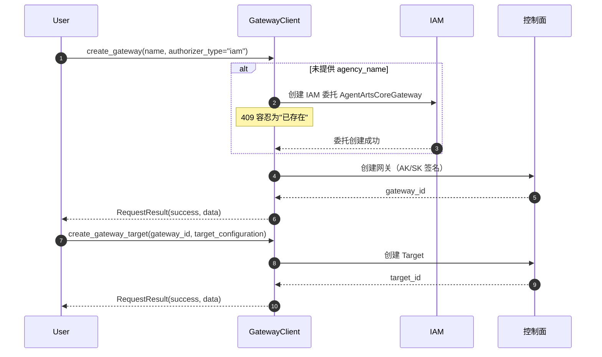

# Gateway（MCP 网关）

> SDK 锚点：`agentarts.sdk.gateway.GatewayClient`（**原 `mcpgateway` 已重命名为 `gateway`**，模块路径、CLI 命令、文档同步更名）。Python 3.10+。

## 1. 定位与原理

Gateway 负责 Agent 与**外部能力**的连接。它不是简单的 API 代理，而是带授权、路由、审计的企业级网关。

**为什么需要 Gateway**：Agent 调外部 API 时面临三个问题——密钥从哪来（不能硬编码进 Agent）、调用谁授权（用户级还是 Agent 级）、多个外部能力怎么统一管理。Gateway 用 **Gateway + Target** 两层模型解决：Gateway 管授权与协议，Target 管具体外部能力的连接配置。

模型：

```
Gateway（授权 + 协议）
  ├── Target A（外部能力 1 的连接配置）
  ├── Target B（外部能力 2 的连接配置）
  └── Target C（...）
```

支持：
- **协议**：`protocol_type="mcp"`（Model Context Protocol），`protocol_configuration` 自由 dict 透传
- **授权类型**：`iam` / `api_key` / `custom_jwt`
- **Target 管理**：Gateway 下挂多个 Target，每个 Target 有独立的 `target_configuration` 和 `credential_provider_configuration`

## 2. 快速开始

```python
from agentarts.sdk.gateway import GatewayClient

client = GatewayClient()

# 创建网关
result = client.create_gateway(
    name="my-gateway",
    description="我的网关",
    protocol_type="mcp",
    authorizer_type="iam",
)
gateway_id = result.data.get("gateway_id")

# 创建目标
target_result = client.create_gateway_target(
    gateway_id=gateway_id,
    name="my-target",
    description="我的目标",
    target_configuration={
        "mcp_server": {
            "endpoint": "https://example.com/mcp",
            "server_type": "sse",
        }
    },
)
target_id = target_result.data.get("target").get("target_id")

# 列出网关
list_result = client.list_gateways()
for gw in list_result.data.get("gateways", []):
    print(f"- {gw.get('name')} (ID: {gw.get('gateway_id')})")
```

认证配置：

```bash
export HUAWEICLOUD_SDK_AK="your-access-key"
export HUAWEICLOUD_SDK_SK="your-secret-key"
```

## 3. API 参考

### GatewayClient 初始化

```python
GatewayClient(verify_ssl: bool = True)
```

基址 `{control_plane}/v1/core`，AK/SK 签名。

### 网关管理

| 方法 | 说明 | 关键参数 |
| --- | --- | --- |
| `create_gateway` | 创建网关 | 见下 |
| `update_gateway(gateway_id, ...)` | 更新 | `description` / `protocol_configuration` / `log_delivery_configuration` / `tags` |
| `delete_gateway(gateway_id)` | 删除 | — |
| `get_gateway(gateway_id)` | 获取详情 | — |
| `list_gateways(...)` | 列表 | `name` / `status` / `gateway_id` / tag 过滤 / `limit` / `offset` |

`create_gateway` 完整参数：

| 参数 | 类型 | 默认 | 说明 |
| --- | --- | --- | --- |
| `name` | str | `gateway-<random8>` | 网关名称 |
| `description` | str | None | 描述 |
| `protocol_type` | str | "mcp" | 协议类型 |
| `authorizer_type` | str | "iam" | 授权器：`custom_jwt` / `iam` / `api_key` |
| `agency_name` | str | None | 代理名称；缺省自动创建 IAM 委托 `AgentArtsCoreGateway`（信任策略 `service.WorkloadSandboxMetadata` + 策略 `AgentArtsCoreGatewayIdentityAgencyPolicy`，409 容忍为"已存在"） |
| `authorizer_configuration` | Dict | None | 授权器配置 |
| `protocol_configuration` | Dict | None | 协议配置，如 `{"mcp": {"search_configuration": {...}}}` |
| `log_delivery_configuration` | Dict | `{"enabled": False}` | 日志投递配置 |
| `outbound_network_configuration` | Dict | `{"network_mode": "public"}` | 出站网络配置 |
| `tags` | List[Dict] | None | 资源标签 |

### 目标管理（Gateway 子资源）

| 方法 | 说明 | 关键参数 |
| --- | --- | --- |
| `create_gateway_target` | 创建目标 | `gateway_id`、`name`（缺省 `target-<random8>`）、`description`、`target_configuration`、`credential_provider_configuration`（默认 `{"credential_provider_type": "none"}`） |
| `update_gateway_target(gateway_id, target_id, ...)` | 更新 | `name` / `description` / `target_configuration` / `credential_provider_configuration` |
| `delete_gateway_target(gateway_id, target_id)` | 删除 | — |
| `get_gateway_target(gateway_id, target_id)` | 获取详情 | — |
| `list_gateway_targets(gateway_id, limit, offset)` | 列表 | — |

所有方法返回 `RequestResult`：

| 属性 | 类型 | 说明 |
| --- | --- | --- |
| `success` | bool | 是否成功 |
| `data` | dict/list | 响应数据 |
| `error` | str | 失败时的错误消息 |
| `status_code` | int | HTTP 状态码 |

## 4. CLI 命令

`agentarts gateway` 子组（10 条命令）：

**网关管理**：`create` / `update` / `delete` / `get` / `list`
**目标管理**：`create-target` / `update-target` / `delete-target` / `get-target` / `list-targets`

JSON 字符串选项：`--authorizer-configuration`、`--protocol-configuration`、`--log-delivery-configuration`、`--outbound-network-configuration`、`--tags`。通用：`--skip-ssl-verification/-k`。

> **文档/代码偏差**：中文文档 `gateway_cli.md` 把命令写作 `create-gateway`/`update-gateway` 等，但代码实际注册的是 `gateway create`/`update`/...。以代码为准。

## 5. 授权器选择

| 授权器 | 适用场景 |
| --- | --- |
| `iam` | 华为云内部服务调用 |
| `api_key` | 外部系统集成，简单易用 |
| `custom_jwt` | 需要自定义认证逻辑 |

## 6. Skill 四元组映射

伙伴 Agent 接入外部能力时，应把外部 API 封装为标准 **Skill**，而非简单的 `Prompt + API`：

```
Skill = Knowledge + Policy + Executor + Verifier
```

对应 SDK 映射：

| Skill 组成 | SDK 对应 |
| --- | --- |
| Executor | Target 的 `target_configuration` |
| Policy | Gateway 的 `authorizer_type` + `credential_provider_configuration` |
| Knowledge | Memory 的 SEMANTIC 策略（见 [03-memory](../03-memory/memory.md)） |
| Verifier | Runtime 的 `/ping` + async task 注册表 + 实验局验收（见 [07-operation](../07-operation/field_validation.md)） |

**为什么是四元组**：Executor 解决"怎么调"，Policy 解决"谁授权调"，Knowledge 解决"调什么/上下文是什么"，Verifier 解决"调对了吗"。缺任何一项都不构成企业级 Skill——只有 Executor 就是裸 API 调用，没有权限边界和结果校验。

## 7. 网关创建流程



## 8. 伙伴适配要点

1. **外部 API → Target**：每个外部能力封装为一个 Target，`target_configuration` 描述连接细节
2. **认证 → credential_provider_configuration**：Target 级凭证配置，避免密钥进 Agent 代码
3. **授权 → Gateway authorizer_type**：网关级授权策略，统一管控
4. **网络 → outbound_network_configuration**：public 模式公网访问，VPC 内网模式更安全
5. **日志 → log_delivery_configuration**：开启后投递调用日志，用于审计

## 9. 最佳实践

1. **网关命名规范**：`{project}-{environment}-{function}`，如 `myapp-prod-api-gateway`
2. **及时清理**：先删 Target 再删 Gateway；用标签分类管理
3. **生产用 VPC 内网**：`outbound_network_configuration` 设为 private，安全性更高
4. **定期轮换密钥**：AK/SK 定期轮换，用密钥管理服务
5. **删除前检查**：确保网关下无运行中任务，先删所有关联 Target
6. **上线前验证日志**：`log_delivery_configuration.enabled=true` 后执行一次 Target 调用，确认网关详情和“智能体运行分析”可检索。详见 [可观测性](../07-operation/observability.md)。
