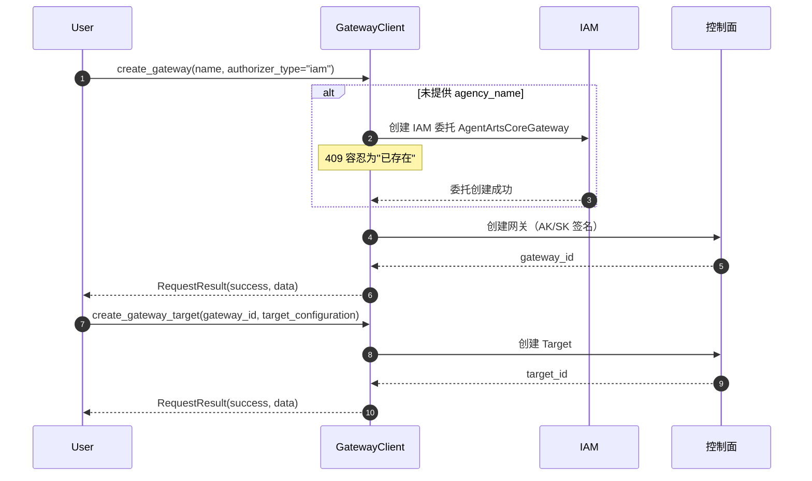

# Gateway（MCP 网关）

> SDK 锚点：`agentarts.sdk.gateway.GatewayClient`（**原 `mcpgateway` 已重命名为 `gateway`**，模块路径、CLI 命令、文档同步更名）。Python 3.10+。
>
> **官方材料基线**：0916《托管与运行智能体》第 6 章「网关」（196–247 页）+ API 参考 4.5。

## 1. 定位与原理

Gateway 负责 Agent 与**外部能力**的连接。它不是简单的 API 代理，而是带授权、路由、审计的企业级网关。

**为什么需要 Gateway**：Agent 调外部 API 时面临三个问题——密钥从哪来（不能硬编码进 Agent）、调用谁授权（用户级还是 Agent 级）、多个外部能力怎么统一管理。Gateway 用 **Gateway + Target** 两层模型解决：Gateway 管授权与协议，Target 管具体外部能力的连接配置。

模型：

```
Gateway（授权 + 协议）
  ├── Target A（外部能力 1 的连接配置）
  ├── Target B（外部能力 2 的连接配置）
  └── Target C（...）
```

支持：
- **协议**：`protocol_type="mcp"`（Model Context Protocol），`protocol_configuration` 自由 dict 透传；**MCP 版本 2025-03-26**
- **入站授权类型**：`iam` / `api_key` / `custom_jwt`（对应官方 IAM / API Key / OAuth 2.0）
- **Target 管理**：Gateway 下挂多个 Target，每个 Target 有独立的 `target_configuration` 和出站身份
- **出站身份（OutBound 身份）**：API Key / OAuth / IAM / 无认证，可复用、多 Target 绑定

### 1.1 工作原理（0916 官方口径）

Agent 通过网关发现和调用外部工具（MCP 协议）：

1. Agent 向网关发送 `tools/list` 请求
2. 网关汇总所有 MCP Target 暴露的工具，返回**统一**的工具列表
3. Agent 根据工具描述选择目标工具
4. Agent 向网关发送 `tools/call` 请求
5. 网关路由到对应 Target 执行
6. Target 返回结果，网关转发给 Agent

**工具发现机制（分页拉取，重要实现细节）**：

1. Agent 发送 `tools/list`
2. 网关遍历 MCP Target，**单次请求仅返回一个 Target 的工具列表**，并返回 `cursor` 游标
3. Agent 携带 `cursor` 继续调用 `tools/list`，网关返回下一个 Target 的工具列表，循环直至全部 Target 遍历完成
4. 每个 Target 返回自己暴露的工具列表
5. Agent 循环拉取，汇总得到完整工具列表——**不需要关心工具在哪个 Target 上**

每个工具包含：`name`、`description`、`inputSchema`。

> ⚠️ **实现提醒**：工具列表是**分页的**。客户端必须循环到 `cursor` 为空才能拿到全量工具，否则会静默丢失后面 Target 的工具。

### 1.2 认证与鉴权：入站与出站两层（0916 新增明确）

| 方向 | 说明 | 配置位置 |
| --- | --- | --- |
| **入站认证** | 验证"谁在调用网关"。Agent 或应用向网关发请求时，网关验证调用方身份（IAM / OAuth 2.0 / API Key） | **创建网关时配置** |
| **出站认证** | 网关"代表调用方访问后端"。网关向 Target 后端转发请求时，自动附加后端服务所需的认证信息（API Key / OAuth / IAM） | **创建 Target 时配置** |

**入站与出站配置互不影响**：入站用 IAM，出站完全可以用 API Key。

> **核心设计价值**：出站认证把后端凭证集中管理在网关侧。Agent 只需携带网关的入站认证，**Agent 代码中不出现后端服务凭证**。解决三个问题：① 凭证硬编码泄露风险；② 换后端/轮换密钥无需改 Agent 代码重新部署；③ 多 Agent 调同一后端不必重复配置凭证。

## 2. 快速开始

```python
from agentarts.sdk.gateway import GatewayClient

client = GatewayClient()

# 创建网关
result = client.create_gateway(
    name="my-gateway",
    description="我的网关",
    protocol_type="mcp",
    authorizer_type="iam",
)
gateway_id = result.data.get("gateway_id")

# 创建目标
target_result = client.create_gateway_target(
    gateway_id=gateway_id,
    name="my-target",
    description="我的目标",
    target_configuration={
        "mcp_server": {
            "endpoint": "https://example.com/mcp",
            "server_type": "sse",
        }
    },
)
target_id = target_result.data.get("target").get("target_id")

# 列出网关
list_result = client.list_gateways()
for gw in list_result.data.get("gateways", []):
    print(f"- {gw.get('name')} (ID: {gw.get('gateway_id')})")
```

认证配置：

```bash
export HUAWEICLOUD_SDK_AK="your-access-key"
export HUAWEICLOUD_SDK_SK="your-secret-key"
```

## 3. API 参考

### GatewayClient 初始化

```python
GatewayClient(verify_ssl: bool = True)
```

基址 `{control_plane}/v1/core`，AK/SK 签名。

### 网关管理

| 方法 | 说明 | 关键参数 |
| --- | --- | --- |
| `create_gateway` | 创建网关 | 见下 |
| `update_gateway(gateway_id, ...)` | 更新 | `description` / `protocol_configuration` / `log_delivery_configuration` / `tags` |
| `delete_gateway(gateway_id)` | 删除 | — |
| `get_gateway(gateway_id)` | 获取详情 | — |
| `list_gateways(...)` | 列表 | `name` / `status` / `gateway_id` / tag 过滤 / `limit` / `offset` |

`create_gateway` 完整参数：

| 参数 | 类型 | 默认 | 说明 |
| --- | --- | --- | --- |
| `name` | str | `gateway-<random8>` | 网关名称 |
| `description` | str | None | 描述 |
| `protocol_type` | str | "mcp" | 协议类型 |
| `authorizer_type` | str | "iam" | 授权器：`custom_jwt` / `iam` / `api_key` |
| `agency_name` | str | None | 代理名称；缺省自动创建 IAM 委托 `AgentArtsCoreGateway`（信任策略 `service.WorkloadSandboxMetadata` + 策略 `AgentArtsCoreGatewayIdentityAgencyPolicy`，409 容忍为"已存在"） |
| `authorizer_configuration` | Dict | None | 授权器配置 |
| `protocol_configuration` | Dict | None | 协议配置，如 `{"mcp": {"search_configuration": {...}}}` |
| `log_delivery_configuration` | Dict | `{"enabled": False}` | 日志投递配置 |
| `outbound_network_configuration` | Dict | `{"network_mode": "public"}` | 出站网络配置 |
| `tags` | List[Dict] | None | 资源标签 |

### 目标管理（Gateway 子资源）

| 方法 | 说明 | 关键参数 |
| --- | --- | --- |
| `create_gateway_target` | 创建目标 | `gateway_id`、`name`（缺省 `target-<random8>`）、`description`、`target_configuration`、`credential_provider_configuration`（默认 `{"credential_provider_type": "none"}`） |
| `update_gateway_target(gateway_id, target_id, ...)` | 更新 | `name` / `description` / `target_configuration` / `credential_provider_configuration` |
| `delete_gateway_target(gateway_id, target_id)` | 删除 | — |
| `get_gateway_target(gateway_id, target_id)` | 获取详情 | — |
| `list_gateway_targets(gateway_id, limit, offset)` | 列表 | — |

所有方法返回 `RequestResult`：

| 属性 | 类型 | 说明 |
| --- | --- | --- |
| `success` | bool | 是否成功 |
| `data` | dict/list | 响应数据 |
| `error` | str | 失败时的错误消息 |
| `status_code` | int | HTTP 状态码 |

## 4. CLI 命令

`agentarts gateway` 子组（10 条命令）：

**网关管理**：`create` / `update` / `delete` / `get` / `list`
**目标管理**：`create-target` / `update-target` / `delete-target` / `get-target` / `list-targets`

JSON 字符串选项：`--authorizer-configuration`、`--protocol-configuration`、`--log-delivery-configuration`、`--outbound-network-configuration`、`--tags`。通用：`--skip-ssl-verification/-k`。

> **文档/代码偏差**：中文文档 `gateway_cli.md` 把命令写作 `create-gateway`/`update-gateway` 等，但代码实际注册的是 `gateway create`/`update`/...。以代码为准。

## 5. Target 类型（0916 官方四类）

网关把 MCP 协议调用转换为后端能接受的请求。**Target 类型决定转换目标**：

| Target 类型 | 说明 |
| --- | --- |
| **REST API** | 对接普通第三方 HTTP REST API，把 MCP 协议调用转成普通 REST HTTP 请求 |
| **MCP** | 对接标准 MCP Server 后端，走原生 MCP 协议。需配置**传输方式**（如 Streamable HTTP）与 **MCP 地址** |
| **APIG** | 对接华为云 APIG，把 MCP 协议调用转成注册在 APIG 上的 REST HTTP 请求 |
| **云服务** | 对接华为云各云服务 OpenAPI，把 MCP 协议调用转成华为云服务开放的 REST HTTP 请求。需额外创建 IAM 信任委托并授权 |

> ⚠️ **术语变更**：0804 材料把第一类称为 **`OpenAPI Schemas`**；0916 材料改称 **`REST API`**。这是同一个能力的更名，不是新能力。引用旧结论时注意。

### 5.0 出站认证方式（0916 新增）

出站认证适用于**所有类型**的 Target：

| 认证方式 | 认证流程 | 适用场景 |
| --- | --- | --- |
| **API Key** | 网关转发请求时把 API Key 附加到请求头（如 `Authorization: Bearer {api_key}` 或自定义头），后端校验 Key 合法性 | 大多数 REST API、外部模型提供商（OpenAI / DeepSeek 等）、需简单密钥认证的服务 |
| **OAuth** | 网关用配置的 OAuth 2.0 凭证（Client ID / Client Secret）向授权服务器获取 Access Token，附加到转发请求；**Token 过期后自动刷新** | 需标准 OAuth 2.0 授权流程的服务、企业 SSO 对接、华为云云服务 |
| **IAM** | 网关用配置的华为云 IAM 凭证（AK/SK）对转发请求签名，后端通过签名验证网关身份。**签名过程自动完成**，无需手动生成 | 华为云云服务（OBS、ECS、ModelArts 等）、需华为云 IAM 身份认证的后端 |
| **无认证** | 网关直接转发请求，不附加任何认证信息 | 内网服务（同一 VPC 内）、已有其他鉴权机制的后端、测试环境 |

**出站身份的复用**：出站身份是**一组可复用的认证配置**。创建后可绑定到多个 Target，无需在每个 Target 中重复填写；**修改出站身份配置后，所有绑定的 Target 同步生效**。

## 5.1 授权器选择（入站）

| 授权器 | 适用场景 |
| --- | --- |
| `iam` | 华为云内部服务调用；运行时/网关对网关的 Agent-to-Agent 调用 |
| `api_key` | 外部系统集成，简单易用（官方示例常用） |
| `custom_jwt`（OAuth 2.0） | 需要第三方身份提供商（Okta / Cognito 等）签发的 JWT |

**OAuth 2.0 入站配置参数**：`Discovery URL`（须以 `https://` 开头、`/.openid-configuration` 结尾）、允许的受众（≤100）、允许的客户端（≤100）、允许的范围（≤100）、自定义声明匹配。

## 5.2 调测与调用网关（0916）

集成到 Agent 前，必须依次验证三件事，否则会在调用阶段出意外错误：

1. **网关是否可以正常连接** —— 确认入站认证、网络可达
2. **Target 的工具是否可以被发现** —— 确认 Target 后端服务正常、工具列表不为空
3. **工具调用是否返回正确结果** —— 确认出站认证正确、参数格式正确、后端服务响应符合预期

| 操作 | 说明 |
| --- | --- |
| 调测网关 | 控制台「调测」页签 → 连接测试（网关 URL 系统默认写入）→ 工具检索 → 工具调试。入站为 OAuth 2.0 时可填 Access token：不填则调**默认调测网关**（内部测试），填了则调**租户网关**（实际业务） |
| 列出网关工具 | 请求体指定 `method: "tools/list"`，返回工具名称、描述、参数定义 |
| 调用网关工具 | `method: "tools/call"` |
| 检索网关工具 | 网关开启**语义检索**后，可按关键字筛选匹配工具；系统按配置的 **Top N** 与**相似阈值**筛选展示。工具调试页可切「全部」查看 Target 全部工具 |
| 查看网关日志 | 创建网关时开启日志后，调测日志在「日志」页签可查看 |

**语义检索的价值**：当 Target 数量与工具数量增长后，把全量工具列表塞进模型上下文会迅速耗尽窗口。语义检索按关键字+相似阈值先筛一层，只把相关工具暴露给模型。

原文请求体示例：

```json
{
  "jsonrpc": "2.0",
  "id": "list-tools-request",
  "method": "tools/list",
  "params": { "cursor": "<CURSOR>" }
}
```

## 5.3 网关创建时的关键参数（官方示例）

| 参数 | 说明 |
| --- | --- |
| 名称 / 描述 | 自定义 |
| **MCP 版本** | `2025-03-26` |
| 委托 | 使用平台默认值（报"委托缺少 CSMS/KMS 相关 action 权限"时需补齐授权） |
| **入站身份认证** | API Key / IAM / OAuth 2.0 |
| API Key 名称 | 入站为 API Key 时必填 |
| 日志记录 | 开启后投递调用日志 |

## 6. Skill 四元组映射

伙伴 Agent 接入外部能力时，应把外部 API 封装为标准 **Skill**，而非简单的 `Prompt + API`：

```
Skill = Knowledge + Policy + Executor + Verifier
```

对应 SDK 映射：

| Skill 组成 | SDK 对应 |
| --- | --- |
| Executor | Target 的 `target_configuration` |
| Policy | Gateway 的 `authorizer_type` + `credential_provider_configuration` |
| Knowledge | Memory 的 SEMANTIC 策略（见 [03-memory](../03-memory/memory.md)） |
| Verifier | Runtime 的 `/ping` + async task 注册表 + 实验局验收（见 [07-operation](../07-operation/field_validation.md)） |

**为什么是四元组**：Executor 解决"怎么调"，Policy 解决"谁授权调"，Knowledge 解决"调什么/上下文是什么"，Verifier 解决"调对了吗"。缺任何一项都不构成企业级 Skill——只有 Executor 就是裸 API 调用，没有权限边界和结果校验。

## 7. 网关创建流程



## 8. 伙伴适配要点

1. **外部 API → Target**：每个外部能力封装为一个 Target，按官方四类（REST API / MCP / APIG / 云服务）选择，`target_configuration` 描述连接细节
2. **出站认证 → 出站身份**：把后端凭证做成可复用的出站身份，多 Target 共享；**这是"密钥不进 Agent 代码"的实现机制**
3. **入站认证 → Gateway authorizer_type**：网关级授权策略，统一管控
4. **网络 → outbound_network_configuration**：public 模式公网访问，VPC 内网模式更安全
5. **日志 → log_delivery_configuration**：开启后投递调用日志，用于审计
6. **工具发现要循环 cursor**：`tools/list` 单次只返回一个 Target 的工具，必须循环到 cursor 为空
7. **工具规模大时开语义检索**：避免全量工具列表撑爆模型上下文

## 9. 最佳实践

1. **网关命名规范**：`{project}-{environment}-{function}`，如 `myapp-prod-api-gateway`
2. **及时清理**：先删 Target 再删 Gateway；用标签分类管理
3. **生产用 VPC 内网**：`outbound_network_configuration` 设为 private，安全性更高
4. **定期轮换密钥**：AK/SK 定期轮换，用密钥管理服务
5. **删除前检查**：确保网关下无运行中任务，先删所有关联 Target
6. **上线前验证日志**：`log_delivery_configuration.enabled=true` 后执行一次 Target 调用，确认网关详情和「观测与优化 > 观测 > 查看托管智能体数据」可检索。详见 [可观测性](../07-operation/observability.md)。
