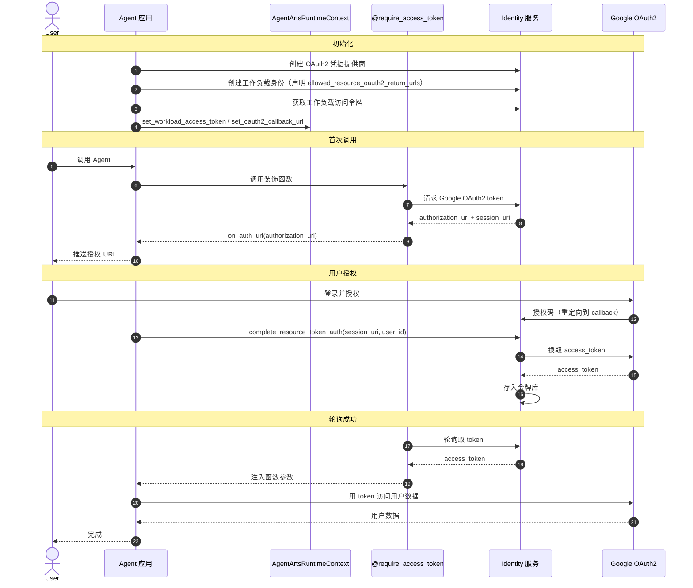

# Identity（身份认证与授权）

> SDK 锚点：`agentarts.sdk.identity`（装饰器 + Config）+ `agentarts.sdk.service.identity.IdentityClient`。Python 3.10+。
>
> **官方材料基线**：0916《托管与运行智能体》4.4「权限与访问控制」、第 10 章「身份认证」、第 11 章「网络配置」+《资源与成员管理》第 2/3 章 + API 参考第 6 章「权限和授权项」。

## 1. 定位与原理

企业 Agent 必须回答一个问题：**Agent 代表谁执行？**

模型不能直接拥有生产权限。所有涉及副作用的操作（调外部 API、访问用户数据、操作云资源）都必须经过身份认证与授权，且权限边界可控、可审计。

AgentArts Identity 解决四层身份问题：

| 层 | 说明 |
| --- | --- |
| User Identity | 最终用户身份（谁在用 Agent） |
| Agent Identity（Workload Identity） | Agent 自身的工作负载身份 |
| Tool Identity（Credential Provider） | 工具/外部能力的凭证提供者 |
| Resource Permission（STS Token / Agency） | 访问具体资源的临时凭证与权限边界 |

### 1.1 0916 补充：三种"身份方向"必须分开设计

0804 材料只讲了**出站**（Agent 拿凭据去访问外部）。0916 材料把身份拆成三个方向，设计时必须分别确认：

| 方向 | 问题 | 机制 | 详见 |
| --- | --- | --- | --- |
| **入站** | 谁在调用运行时/网关？ | 运行时与网关入站三认证：**IAM（AK/SK 签名）/ API Key / OAuth 2.0** | 本文件第 2.0 节 |
| **出站** | Agent 代表谁访问云资源？ | **IAM 委托** + `require_*` 装饰器换取 API Key / OAuth2 Token / STS 临时凭证 | 本文件第 2 节 + 第 2.1 节 |
| **平台侧** | 谁有权操作 AgentArts？ | IAM 身份策略：`AgentArtsFullAccessPolicy`、`AgentIdentityFullAccessPolicy` + 自定义策略 | 本文件第 2.2 节 |

## 2. 入站与出站的身份机制（0916）

### 2.0 入站身份认证

运行时与网关都支持三种入站认证，凭据放在 `Authorization` 请求头：

| 方式 | 凭据 | 请求头格式 |
| --- | --- | --- |
| IAM（AK/SK 签名认证） | AK + SK 通过签名算法生成签名 | `Authorization: V11-HMAC-SHA256 Access={AK}, SignedHeaders=..., Signature=...` |
| API Key 认证 | API Key 字符串 | `Authorization: Bearer {API Key}` |
| OAuth 2.0 认证 | 第三方身份提供商签发的 JWT Token | `Authorization: Bearer {JWT Token}` |

**IAM 签名过程**：① 构造规范请求（HTTP 方法、URI、查询参数、消息头、消息体按规范拼接并计算 SHA-256）→ ② 创建待签字符串（算法标识 + 请求时间 + 规范请求哈希）→ ③ 用 SK 作密钥经 HMAC-SHA256 计算签名 → ④ 把 AK、签名头列表、签名值组装到 `Authorization` 头。

完整签名示例：

```
GET /v1/runtimes/my-runtime/invocations?input=hello HTTP/1.1
Host: agentarts.cn-southwest-2.myhuaweicloud.com
Content-Type: application/json
X-Sdk-Date: 20260909T033655Z
Authorization: V11-HMAC-SHA256 Access=QTWA***KYUC, SignedHeaders=content-type;host;x-sdk-date,
               Signature=f12f84a5ecf9eff3206499c4a55b13d1adad745dc8624a2e31f15c6b381d5b80
```

| 签名算法 | 说明 |
| --- | --- |
| `V11-HMAC-SHA256` | 基于 HMAC-SHA256，SK 作密钥，支持 Region 级密钥派生 |
| `SDK-ECDSA-P256SHA256` | ECDSA P-256 非对称签名 |

> ⚠️ **签名范围差异**：**运行时数据面接口（`/runtimes/{runtime_name}/invocations` 等）不支持对请求 body 签名，仅对请求头和查询参数签名验证**；其他 AgentArts 接口仍需对 body 签名。做统一签名中间件时不能一刀切。

**IAM 认证约束**：
- 仅支持消息体 ≤ **12MB**
- AK/SK 可用永久访问密钥，也可用**临时访问密钥（STS）**，后者需额外携带 `X-Security-Token` 请求头
- API 网关校验 `X-Sdk-Date` 与服务器时差，**超过 15 分钟的请求将被拒绝**，客户端需时间同步
- 签名 SDK 仅提供签名功能，与各服务提供的 SDK 不同

**API Key 获取路径**：控制台「托管与运行 > 运行时」→ 运行时详情 → 「权限与访问控制」区域访问 URN → 进入 **AgentIdentity 智能体身份服务** → 基本信息页获取 API Key 值 → 请求头加 `Authorization: Bearer {API Key}`。

**OAuth 2.0 配置参数**：`Discovery URL`（须以 `https://` 开头、`/.well-known/openid-configuration` 结尾）、允许的受众（≤100）、允许的客户端（≤100）、允许的范围（≤100）、自定义声明匹配。JWT 由第三方身份提供商签发（如 GitHub 应用的 JWT 生成流程）。

### 2.1 IAM 委托：出站身份的地基（0916 新增）

委托是华为云 IAM 的**信任关系机制**：把自己的资源操作权限委托给其他账号/公司/云服务，被委托方按权限代为运维。

| 委托类型 | 说明 |
| --- | --- |
| 普通账号委托 | 把资源操作权限委托给其他华为云账号 |
| **云服务委托** | 云服务之间协同工作所需；让该服务以你的身份使用其他云服务 |

**AgentArts 运行时涉及两个委托**：

| 委托 | 名称 | 用途 | 是否必须 |
| --- | --- | --- | --- |
| **服务部署委托** | `AgentArtsRuntimeDeploymentAgency`（固定名） | 委托给沙箱服务，用于**下载用户镜像**、**挂载 SFS Turbo 共享文件存储** | **必须**，服务内部使用，**不可删除** |
| **用户运行时委托**（智能体身份委托） | 用户自定义，服务开通时自动创建 `DefaultAgentArtsRuntimeAgency` | 在智能体运行时内部**代表用户身份**与其他华为云云服务交互 | 推荐配置，用默认委托可开箱即用 |

手动创建用户运行时委托时：**信任主体类型选"云服务"，云服务搜索 `service.WorkloadSandboxMetadata`**。

**策略与 Action**：

| 策略 | 用途 | Action | 级别 |
| --- | --- | --- | --- |
| `AgentArtsRuntimeDeploymentAgencyPolicy` | 服务部署委托 | `swr::createAuthorizationToken` | 写入 |
| | | `swr:repo:download` | 读取 |
| | | `sts::createServiceBearerToken` | 写入 |
| | | `sfsturbo:shares:getShare` | 读取 |
| `AgentArtsCoreRunRuntimeIdentityAgencyPolicy` | 出站认证凭据 | `agentIdentity::getResourceApiKey` | 读取 |
| | | `agentIdentity::getResourceOauth2Token` | 读取 |
| | | `agentIdentity::getResourceStsToken` | 读取 |
| | | `csms:secret:getVersion` | 读取 |
| | | `kms:cmk:decryptDataKey` | 写入 |
| `AgentArtsCoreRunRuntimeOpsAgencyPolicy` | 可观测性 | `apm:application:get` | 读取 |
| | | `aom:metric:list` | 列举 |
| | | `aom:icmgr:get` | 读取 |

**Action 语义**：
- `agentIdentity::getResourceApiKey`：从 Agent Identity 服务获取 API Key，用于以 API Key 认证方式访问外部云服务
- `agentIdentity::getResourceOauth2Token`：通过 OAuth2 流程（**M2M 或 USER_FEDERATION**）获取访问令牌
- `agentIdentity::getResourceStsToken`：从 STS 凭证提供者获取 IAM 临时凭证（AK/SK/SecurityToken），**以华为云用户身份访问其他云服务**
- `csms:secret:getVersion`：查询凭据管理服务中存储的凭据明文值
- `kms:cmk:decryptDataKey`：解密 CSMS 中加密存储的数据密钥

运行时 SDK 提供 **`MetadataProvider`** 自动获取用户运行时委托对应的临时凭据。

> **设计含义**：伙伴侧不需要（也不应该）把 AK/SK 塞进运行时的环境变量。正确做法是让运行时通过**用户运行时委托**自动获得临时凭据——凭据不落盘、随委托权限收窄、可随时吊销。

### 2.2 平台侧权限（0916 新增）

| 场景 | 策略 |
| --- | --- |
| 租户管理员 | 华为账号开通 AgentArts 后默认属于 admin 用户组，具有所有必要权限 |
| IAM 用户基础权限 | `AgentArtsFullAccessPolicy` |
| 智能体身份服务权限 | `AgentIdentityFullAccessPolicy` |
| 自定义策略（按需） | 例：代码解释器创建需 `iam:agencies:pass`；出网公网需 `eip:publicIps:associateInstance`；出网私网需 `vpc:nativePorts:create`、`vpc:routeTables:update` |

**成员许可机制**：AgentArts 套餐包有成员数限制，默认采用**先到先得的自动许可机制**——新成员加入时系统自动授予访问许可并占用席位，席位不足则无法访问；套餐变更导致超额时**自动释放最后加入的成员许可**。拥有 `agentarts::updateMemberPermit` 权限的用户可释放闲置成员、分配/释放许可、禁止/解除禁止访问。

**云审计（CTS）**：平台提供云审计服务记录与 AgentArts 相关的操作事件，便于查询、审计和回溯。资源类型包括 `AgentManager` 等，事件如 `create_functions`、`update_functions`、`create_mcp_deploy`、`create_mcp_service_tools_test` 等。

## 3. 三种出站凭证流程

Identity 支持三种凭证获取流程，均通过装饰器自动注入业务函数，**业务代码不接触密钥**：

### API Key 流程

最简单，适用于调 LLM 等外部服务：

```python
from agentarts.sdk import require_api_key

@require_api_key(provider_name="openai")
def call_llm(api_key: str = None):
    # api_key 由装饰器自动注入
    from openai import OpenAI
    client = OpenAI(api_key=api_key)
    return client.chat.completions.create(...)
```

### OAuth2 流程

适用于访问用户数据（Google/Microsoft/GitHub 等）。分两种：

- **M2M**（客户端凭据授权）：机器对机器，直取 token
- **USER_FEDERATION**（3LO）：需用户浏览器授权，走 `on_auth_url` 回调 + 轮询

```python
from agentarts.sdk import require_access_token

# M2M
@require_access_token(provider_name="my-company-api", auth_flow="M2M")
async def call_internal(access_token: str = None):
    ...

# USER_FEDERATION
@require_access_token(
    provider_name="google",
    scopes=["https://www.googleapis.com/auth/userinfo.email"],
    auth_flow="USER_FEDERATION",
    on_auth_url=handle_auth_url,  # 把授权 URL 推给用户
)
async def fetch_google_data(access_token: str = None):
    ...
```

### STS Token 流程

适用于访问华为云原生资源，通过 IAM 委托换取临时 AK/SK/SecurityToken：

```python
from agentarts.sdk import require_sts_token
from agentarts.sdk.identity.types import StsCredentials

@require_sts_token(
    provider_name="huaweicloud-iam",
    agency_session_name="example-session",
    policy=...,  # 限定临时凭证权限边界
)
async def access_huawei_resource(sts_credentials: StsCredentials = None):
    # sts_credentials.access_key_id / secret_access_key / security_token
    ...
```

## 4. 装饰器参考

三者均 sync/async 自适应，把凭证注入被装饰函数的 `into=` 参数：

| 装饰器 | 注入参数 | 关键选项 |
| --- | --- | --- |
| `require_access_token` | `access_token` | `provider_name`、`scopes`、`auth_flow`（"M2M" \| "USER_FEDERATION"）、`on_auth_url`、`callback_url`、`force_authentication`、`token_poller`、`custom_state`、`custom_parameters`、`into`、`ignore_ssl_verification` |
| `require_api_key` | `api_key` | `provider_name`、`into`、`ignore_ssl_verification` |
| `require_sts_token` | `sts_credentials`（StsCredentials） | `provider_name`、`agency_session_name`、`duration_seconds`、`policy`、`source_identity`、`tags`、`transitive_tag_keys`、`into`、`ignore_ssl_verification` |

> `into` 用于自定义注入到业务函数的参数名；`ignore_ssl_verification` 便于本地/测试环境自签证书场景。

装饰器从 `AgentArtsRuntimeContext.get_workload_access_token()` 取工作负载访问令牌；缺省时走 `_set_up_local_auth`（确保 `.agent_identity.json` 中的 workload identity + user id）。

## 5. IdentityClient

用于手动控制（如 Web 回调中完成会话绑定）：

```python
from agentarts.sdk import IdentityClient
from huaweicloudsdkagentidentity.v1.model import UserIdentifier

client = IdentityClient(region="cn-north-4")

# 手动获取 STS 凭证
sts = client.get_resource_sts_token(
    provider_name="huaweicloud-iam",
    workload_access_token="...",
    agency_session_name="my-session",
)

# 完成 3LO 会话绑定
client.complete_resource_token_auth(
    session_uri="urn:uuid:...",
    user_identifier=UserIdentifier(user_id="user-123"),
)
```

构造：`IdentityClient(region, ignore_ssl_verification=None)`，重试 `tenacity`（429/5xx，3 次，EQUAL_JITTER 抖动）。

### Workload Identity

| 方法 | 说明 |
| --- | --- |
| `create_workload_identity(name, allowed_resource_oauth2_return_urls, authorizer_type, authorizer_configuration)` | name 缺省 `workload-<hex8>` |
| `update_workload_identity` / `get_workload_identity` / `list_workload_identities` | — |

### Credential Provider

| 方法 | 说明 |
| --- | --- |
| `create_api_key_credential_provider(name, api_key)` | API Key 提供者 |
| `create_oauth2_credential_provider(name, vendor, client_id, client_secret, tenant_id, oauth_discovery, tags)` | OAuth2 提供者；`vendor`: GITHUBOAUTH2 / GOOGLEOAUTH2 / MICROSOFTOAUTH2 / CUSTOMOAUTH2 |
| `create_sts_credential_provider(name, agency_urn, tags)` | STS 提供者 |
| 各类型 `get_*` / `list_*` | — |

### 工作负载访问令牌与资源令牌

| 方法 | 说明 |
| --- | --- |
| `create_workload_access_token(workload_name, user_token, user_id)` | 三路径：JWT via user_token / user-id / basic |
| `get_resource_api_key(provider_name, workload_access_token)` | 取 API Key |
| `get_resource_sts_token(provider_name, workload_access_token, agency_session_name, ...)` | 取 STS 凭证 |
| `get_resource_oauth2_token(provider_name, scopes, workload_access_token, on_auth_url, auth_flow, ...)` | async；M2M 直返，USER_FEDERATION 返 `authorization_url`+`session_uri`，调 `on_auth_url` 后轮询 |
| `complete_resource_token_auth(session_uri, user_identifier)` | 3LO 确认 |

## 6. 轮询机制

USER_FEDERATION 流程需轮询等待用户授权完成：

| 类 | 说明 |
| --- | --- |
| `TokenPoller`（ABC） | 轮询器抽象基类 |
| `DefaultApiTokenPoller(auth_url, func)` | 默认实现，5s 间隔，300s 超时，FAILED 抛错 |
| `PollingStatus` | IN_PROGRESS / FAILED |

## 7. 本地配置

Pydantic 模型持久化到 `.agent_identity.json`：`workload_identity_name`、`user_id`、`path`。本地开发时装饰器缺省走此配置，无需手动设置工作负载访问令牌。

## 8. AgentArtsRuntimeContext

身份相关上下文通过全局 contextvars 管理（异步安全）：

```python
from agentarts.sdk import AgentArtsRuntimeContext

AgentArtsRuntimeContext.set_user_id("user-123")
AgentArtsRuntimeContext.set_workload_access_token(token)
AgentArtsRuntimeContext.set_oauth2_callback_url("https://yourapp.com/callback")
AgentArtsRuntimeContext.set_oauth2_custom_state("session-uuid-123")

current_user = AgentArtsRuntimeContext.get_user_id()
```

基于 `contextvars` 实现，asyncio 任务间天然隔离——每个请求协程可独立设置身份而互不干扰。

## 9. OAuth2 USER_FEDERATION 完整流程



## 10. 高风险操作的安全闭环

涉及高风险操作（如删除资源、资金操作）时，Identity 提供完整的安全闭环：

```
Plan → Risk Check → Human Approval → Execute → Verify
```

对应 SDK 机制：

| 阶段 | SDK 机制 |
| --- | --- |
| Risk Check | `require_sts_token` 的 `policy` 字段（限定临时凭证权限边界） |
| Human Approval | USER_FEDERATION 3LO 的 `on_auth_url` 回调 + `force_authentication` |
| Execute | STS 凭证注入业务函数 |
| Verify | `complete_resource_token_auth` + Runtime `/ping` + 审计日志 |

## 11. 环境变量

| 变量 | 说明 |
| --- | --- |
| `HUAWEICLOUD_SDK_AK` / `HUAWEICLOUD_SDK_SK` | 华为云访问密钥（IdentityClient 认证） |
| `HUAWEICLOUD_SDK_AGENTIDENTITY_ENDPOINT` | Agent Identity 服务端点（默认 `https://agent-identity.{region}.myhuaweicloud.com`） |
| `HUAWEICLOUD_SDK_IAM_ENDPOINT` | IAM 服务端点 |

## 12. 最佳实践

1. **优先用装饰器**：业务代码不接触密钥，装饰器自动注入
2. **STS 用 policy 限定边界**：临时凭证最小权限原则
3. **高风险操作走 USER_FEDERATION**：人工授权 + `force_authentication`
4. **回调 URL 白名单化**：`allowed_resource_oauth2_return_urls` 严格限定
5. **本地开发用 `.agent_identity.json`**：避免手动设置 token
6. **contextvars 隔离**：多用户并发时每个协程独立设置 `user_id`，互不干扰
