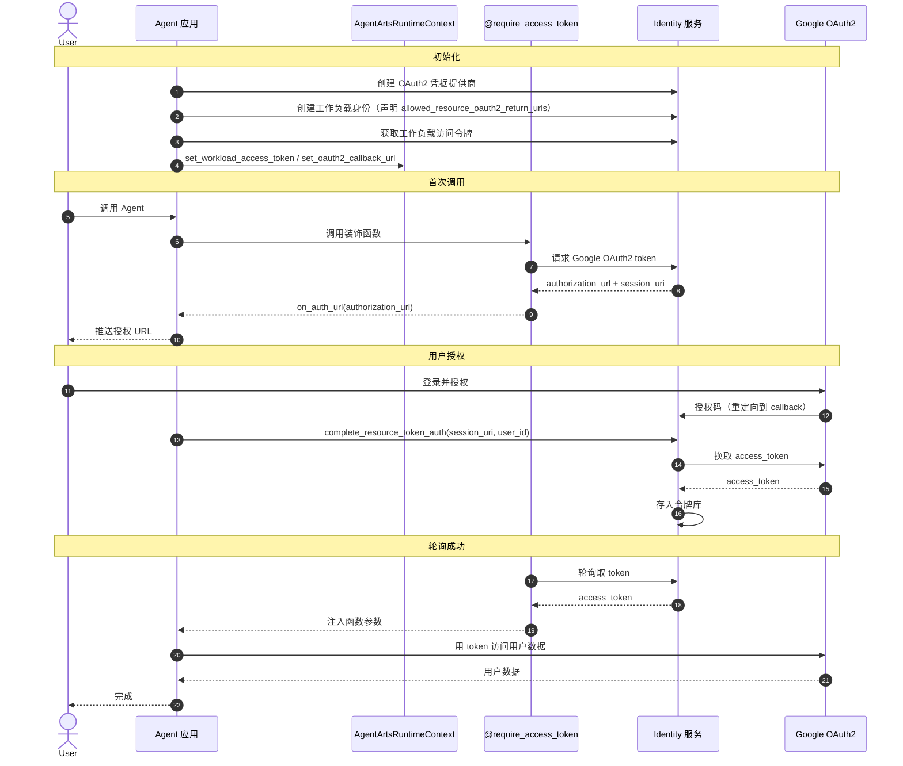

# Identity（身份认证与授权）

> SDK 锚点：`agentarts.sdk.identity`（装饰器 + Config）+ `agentarts.sdk.service.identity.IdentityClient`。Python 3.10+。

## 1. 定位与原理

企业 Agent 必须回答一个问题：**Agent 代表谁执行？**

模型不能直接拥有生产权限。所有涉及副作用的操作（调外部 API、访问用户数据、操作云资源）都必须经过身份认证与授权，且权限边界可控、可审计。

AgentArts Identity 解决四层身份问题：

| 层 | 说明 |
| --- | --- |
| User Identity | 最终用户身份（谁在用 Agent） |
| Agent Identity（Workload Identity） | Agent 自身的工作负载身份 |
| Tool Identity（Credential Provider） | 工具/外部能力的凭证提供者 |
| Resource Permission（STS Token / Agency） | 访问具体资源的临时凭证与权限边界 |

## 2. 三种认证流程

Identity 支持三种凭证获取流程，均通过装饰器自动注入业务函数，**业务代码不接触密钥**：

### API Key 流程

最简单，适用于调 LLM 等外部服务：

```python
from agentarts.sdk import require_api_key

@require_api_key(provider_name="openai")
def call_llm(api_key: str = None):
    # api_key 由装饰器自动注入
    from openai import OpenAI
    client = OpenAI(api_key=api_key)
    return client.chat.completions.create(...)
```

### OAuth2 流程

适用于访问用户数据（Google/Microsoft/GitHub 等）。分两种：

- **M2M**（客户端凭据授权）：机器对机器，直取 token
- **USER_FEDERATION**（3LO）：需用户浏览器授权，走 `on_auth_url` 回调 + 轮询

```python
from agentarts.sdk import require_access_token

# M2M
@require_access_token(provider_name="my-company-api", auth_flow="M2M")
async def call_internal(access_token: str = None):
    ...

# USER_FEDERATION
@require_access_token(
    provider_name="google",
    scopes=["https://www.googleapis.com/auth/userinfo.email"],
    auth_flow="USER_FEDERATION",
    on_auth_url=handle_auth_url,  # 把授权 URL 推给用户
)
async def fetch_google_data(access_token: str = None):
    ...
```

### STS Token 流程

适用于访问华为云原生资源，通过 IAM 委托换取临时 AK/SK/SecurityToken：

```python
from agentarts.sdk import require_sts_token
from agentarts.sdk.identity.types import StsCredentials

@require_sts_token(
    provider_name="huaweicloud-iam",
    agency_session_name="example-session",
    policy=...,  # 限定临时凭证权限边界
)
async def access_huawei_resource(sts_credentials: StsCredentials = None):
    # sts_credentials.access_key_id / secret_access_key / security_token
    ...
```

## 3. 装饰器参考

三者均 sync/async 自适应，把凭证注入被装饰函数的 `into=` 参数：

| 装饰器 | 注入参数 | 关键选项 |
| --- | --- | --- |
| `require_access_token` | `access_token` | `provider_name`、`scopes`、`auth_flow`（"M2M" \| "USER_FEDERATION"）、`on_auth_url`、`callback_url`、`force_authentication`、`token_poller`、`custom_state`、`custom_parameters`、`into`、`ignore_ssl_verification` |
| `require_api_key` | `api_key` | `provider_name`、`into`、`ignore_ssl_verification` |
| `require_sts_token` | `sts_credentials`（StsCredentials） | `provider_name`、`agency_session_name`、`duration_seconds`、`policy`、`source_identity`、`tags`、`transitive_tag_keys`、`into`、`ignore_ssl_verification` |

> `into` 用于自定义注入到业务函数的参数名；`ignore_ssl_verification` 便于本地/测试环境自签证书场景。

装饰器从 `AgentArtsRuntimeContext.get_workload_access_token()` 取工作负载访问令牌；缺省时走 `_set_up_local_auth`（确保 `.agent_identity.json` 中的 workload identity + user id）。

## 4. IdentityClient

用于手动控制（如 Web 回调中完成会话绑定）：

```python
from agentarts.sdk import IdentityClient
from huaweicloudsdkagentidentity.v1.model import UserIdentifier

client = IdentityClient(region="cn-north-4")

# 手动获取 STS 凭证
sts = client.get_resource_sts_token(
    provider_name="huaweicloud-iam",
    workload_access_token="...",
    agency_session_name="my-session",
)

# 完成 3LO 会话绑定
client.complete_resource_token_auth(
    session_uri="urn:uuid:...",
    user_identifier=UserIdentifier(user_id="user-123"),
)
```

构造：`IdentityClient(region, ignore_ssl_verification=None)`，重试 `tenacity`（429/5xx，3 次，EQUAL_JITTER 抖动）。

### Workload Identity

| 方法 | 说明 |
| --- | --- |
| `create_workload_identity(name, allowed_resource_oauth2_return_urls, authorizer_type, authorizer_configuration)` | name 缺省 `workload-<hex8>` |
| `update_workload_identity` / `get_workload_identity` / `list_workload_identities` | — |

### Credential Provider

| 方法 | 说明 |
| --- | --- |
| `create_api_key_credential_provider(name, api_key)` | API Key 提供者 |
| `create_oauth2_credential_provider(name, vendor, client_id, client_secret, tenant_id, oauth_discovery, tags)` | OAuth2 提供者；`vendor`: GITHUBOAUTH2 / GOOGLEOAUTH2 / MICROSOFTOAUTH2 / CUSTOMOAUTH2 |
| `create_sts_credential_provider(name, agency_urn, tags)` | STS 提供者 |
| 各类型 `get_*` / `list_*` | — |

### 工作负载访问令牌与资源令牌

| 方法 | 说明 |
| --- | --- |
| `create_workload_access_token(workload_name, user_token, user_id)` | 三路径：JWT via user_token / user-id / basic |
| `get_resource_api_key(provider_name, workload_access_token)` | 取 API Key |
| `get_resource_sts_token(provider_name, workload_access_token, agency_session_name, ...)` | 取 STS 凭证 |
| `get_resource_oauth2_token(provider_name, scopes, workload_access_token, on_auth_url, auth_flow, ...)` | async；M2M 直返，USER_FEDERATION 返 `authorization_url`+`session_uri`，调 `on_auth_url` 后轮询 |
| `complete_resource_token_auth(session_uri, user_identifier)` | 3LO 确认 |

## 5. 轮询机制

USER_FEDERATION 流程需轮询等待用户授权完成：

| 类 | 说明 |
| --- | --- |
| `TokenPoller`（ABC） | 轮询器抽象基类 |
| `DefaultApiTokenPoller(auth_url, func)` | 默认实现，5s 间隔，300s 超时，FAILED 抛错 |
| `PollingStatus` | IN_PROGRESS / FAILED |

## 6. 本地配置

Pydantic 模型持久化到 `.agent_identity.json`：`workload_identity_name`、`user_id`、`path`。本地开发时装饰器缺省走此配置，无需手动设置工作负载访问令牌。

## 7. AgentArtsRuntimeContext

身份相关上下文通过全局 contextvars 管理（异步安全）：

```python
from agentarts.sdk import AgentArtsRuntimeContext

AgentArtsRuntimeContext.set_user_id("user-123")
AgentArtsRuntimeContext.set_workload_access_token(token)
AgentArtsRuntimeContext.set_oauth2_callback_url("https://yourapp.com/callback")
AgentArtsRuntimeContext.set_oauth2_custom_state("session-uuid-123")

current_user = AgentArtsRuntimeContext.get_user_id()
```

基于 `contextvars` 实现，asyncio 任务间天然隔离——每个请求协程可独立设置身份而互不干扰。

## 8. OAuth2 USER_FEDERATION 完整流程



## 9. 高风险操作的安全闭环

涉及高风险操作（如删除资源、资金操作）时，Identity 提供完整的安全闭环：

```
Plan → Risk Check → Human Approval → Execute → Verify
```

对应 SDK 机制：

| 阶段 | SDK 机制 |
| --- | --- |
| Risk Check | `require_sts_token` 的 `policy` 字段（限定临时凭证权限边界） |
| Human Approval | USER_FEDERATION 3LO 的 `on_auth_url` 回调 + `force_authentication` |
| Execute | STS 凭证注入业务函数 |
| Verify | `complete_resource_token_auth` + Runtime `/ping` + 审计日志 |

## 10. 环境变量

| 变量 | 说明 |
| --- | --- |
| `HUAWEICLOUD_SDK_AK` / `HUAWEICLOUD_SDK_SK` | 华为云访问密钥（IdentityClient 认证） |
| `HUAWEICLOUD_SDK_AGENTIDENTITY_ENDPOINT` | Agent Identity 服务端点（默认 `https://agent-identity.{region}.myhuaweicloud.com`） |
| `HUAWEICLOUD_SDK_IAM_ENDPOINT` | IAM 服务端点 |

## 11. 最佳实践

1. **优先用装饰器**：业务代码不接触密钥，装饰器自动注入
2. **STS 用 policy 限定边界**：临时凭证最小权限原则
3. **高风险操作走 USER_FEDERATION**：人工授权 + `force_authentication`
4. **回调 URL 白名单化**：`allowed_resource_oauth2_return_urls` 严格限定
5. **本地开发用 `.agent_identity.json`**：避免手动设置 token
6. **contextvars 隔离**：多用户并发时每个协程独立设置 `user_id`，互不干扰
