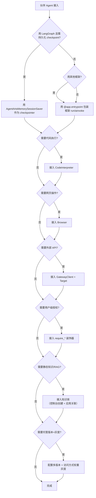

# 伙伴 Agent 联合开发适配指南

> SDK 锚点：`agentarts.sdk.integration`（懒加载 `__getattr__`）。当前实现 LangGraph 适配器，其余框架通过 `AgentArtsRuntimeApp` 的 `@app.entrypoint` 通用接入。
>
> **官方材料基线**：0916《托管与运行智能体》《Managed Agents》《最佳实践》。

## 0. 先选形态：Runtime 还是 Managed Agents（0916 新增前置决策）

在讨论"怎么适配"之前，必须先定"适配到哪"。0916 材料把这条决策正式化：

| 判据 | Managed Agents | 运行时 |
| --- | --- | --- |
| 上手方式 | 配置驱动，零代码 | 代码驱动，打包镜像 |
| 基础设施 | 全托管 | 用户管理版本/实例 |
| 定制灵活度 | 通过配置项调整 | 代码层面完全可控 |
| 适用场景 | 快速验证 / 标准场景 | 深度定制 / 复杂逻辑 |

**伙伴 Agent 的实操判据**：

| 伙伴侧特征 | 结论 |
| --- | --- |
| 已有成熟 Agent 代码 / 框架（LangGraph 等） | **走运行时**。Managed Agents 不接受自定义代码 |
| 需要自定义依赖、中间件、私有库 | **走运行时** |
| 需要 MCP 入站协议（被其他 Agent 当 MCP Server 调用） | **走运行时** |
| 需要版本灰度发布、多端点、自定义镜像 | **走运行时** |
| 只需要"模型 + 提示词 + 文件/shell 工具"就能完成任务 | 可评估 Managed Agents |
| 想快速验证、不想碰 Docker/SWR | 可评估 Managed Agents |
| 需要 Skill 技能包 | Managed Agents（注意：须**私网访问 + 挂 OBS**） |

> **本文档余下章节全部针对"走运行时"的适配**。若选 Managed Agents，见 [00-overview/managed_agents.md](../00-overview/managed_agents.md)。

## 0.1 运行时侧的三条硬约束（适配前必须确认）

1. **镜像必须 ARM64**，x86 镜像调用直接失败
2. **本地磁盘不可依赖**：沙箱空闲释放时本地磁盘数据全部丢失
3. **区域仅 `cn-southwest-2`**

## 1. 接入模型

## 1. 接入模型

AgentArts 的标准接入路径是 **Adapter Layer**，而非直接绑定平台接口：

```
Partner Agent（业务智能）
        ↓  Adapter Layer（按平台规范适配）
AgentArts Infra（企业级基础设施）
```

**为什么用 Adapter 而非直接绑定**：伙伴 Agent 最懂自己的业务逻辑，但不应关心平台细节（HTTP 端点、session 协议、密钥管理）。Adapter 把"伙伴 Agent 的 run/ainvoke"包装为"平台的 `@app.entrypoint`"，把"伙伴的 state"映射到"Memory session"，把"伙伴的工具"映射到"Gateway Target"。伙伴代码改动最小，平台能力全部可用。

## 2. 通用接入：`@app.entrypoint`

任何框架的 Agent 都可通过 `@app.entrypoint` 包装上云。模式：**在模块加载时一次性构建昂贵对象（Agent、LLM），在 entrypoint 内仅做轻量 invoke**。

```python
from agentarts.sdk import AgentArtsRuntimeApp, RequestContext

app = AgentArtsRuntimeApp()

# 模块加载时构建 Agent（只建一次）
agent_executor = build_my_agent()

@app.entrypoint
async def handler(payload: dict, context: RequestContext = None) -> dict:
    message = payload.get("message", "")
    # entrypoint 内仅 invoke
    result = await agent_executor.ainvoke({"input": message})
    return {"response": result["output"]}

if __name__ == "__main__":
    app.run()
```

这是"包装已有 Agent 上云"的最典型范式——框架侧无需任何改动，`AgentArtsRuntimeApp` 只做外层 HTTP 适配。

## 3. LangGraph 深度适配

LangGraph 有专用适配器（`sdk.integration.langgraph`），把 Memory Service 作为 LangGraph 的 checkpointer 和 store，实现状态持久化与语义检索。

### AgentArtsMemorySessionSaver（Checkpointer）

```python
from agentarts.sdk import AgentArtsRuntimeApp
from agentarts.sdk.integration.langgraph import AgentArtsMemorySessionSaver
from langgraph.graph import MessagesState, StateGraph
from langchain_openai import ChatOpenAI

app = AgentArtsRuntimeApp()

def create_agent():
    model = ChatOpenAI(model="gpt-4o-mini", api_key=..., base_url=...)
    def call_model(state: MessagesState):
        return {"messages": [model.invoke(state["messages"])]}
    workflow = StateGraph(MessagesState)
    workflow.add_node("agent", call_model)
    workflow.set_entry_point("agent")
    workflow.set_finish_point("agent")

    # 用 AgentArts Memory 作为 checkpointer
    checkpointer = AgentArtsMemorySessionSaver(
        space_id=os.getenv("AGENTARTS_MEMORY_SPACE_ID"),
        api_key=os.getenv("HUAWEICLOUD_SDK_MEMORY_API_KEY"),
    )
    return workflow.compile(checkpointer=checkpointer)

agent = create_agent()

@app.entrypoint
async def handler(payload: dict, context: RequestContext = None) -> dict:
    message = payload.get("message", "")
    thread_id = payload.get("thread_id") or os.urandom(8).hex()
    config = {"configurable": {"thread_id": thread_id}}
    result = await agent.ainvoke({"messages": [HumanMessage(content=message)]}, config=config)
    return {"response": result["messages"][-1].content, "thread_id": thread_id}
```

**关键设计**：
- `thread_id` 即 LangGraph 的会话标识，同时映射到 Memory Service 的 `session_id`——同一 `thread_id` 跨多次调用自动续接历史
- delta tracking：`put` 只发新增消息（`messages[last_count:]`），`_persisted_count` 按 session 维护，避免重复
- pending writes 存到独立的 UUID5 派生 session，与对话消息隔离；读取时普通 writes 取首次、ERROR/INTERRUPT/RESUME/SCHEDULED 取最后一次
- `delete_thread(thread_id)` 会同时删除对话 session 与 writes session（软删除，后端异步清理）
- sync 用 `MemoryClient`，async 用 `AsyncMemoryClient`（无线程池开销）；支持 `close()` / `aclose()` 与 `with` / `async with`
- **整个应用生命周期应复用同一个 saver 实例**，不要为同一 session 创建多个实例

构造签名：

```python
AgentArtsMemorySessionSaver(
    space_id: str,
    region: str | None = None,
    api_key: str | None = None,
    max_messages: int = 10,
    serde: JsonPlusSerializer | None = None,
    verify_ssl: bool | str = True,
)
```

### AgentArtsMemoryStore（BaseStore）

提供跨线程语义记忆存储，实现 LangGraph Store 语义：

```python
from agentarts.sdk.integration.langgraph import AgentArtsMemoryStore

store = AgentArtsMemoryStore(
    space_id=os.getenv("AGENTARTS_MEMORY_SPACE_ID"),
    api_key=os.getenv("HUAWEICLOUD_SDK_MEMORY_API_KEY"),
)
```

| 特性 | 说明 |
| --- | --- |
| `batch(ops)` / `async abatch(ops)` | 批量执行 PutOp / SearchOp / GetOp / ListNamespacesOp |
| Put | `op.value` 须含 `session_id` 和 `content`；写消息触发后端自动抽取记忆 |
| Get | 以 `op.key` 作为 `memory_id` |
| Search | 有 `query` 走语义搜索（带 score）；无 `query` 走 list |
| Namespace | 层级路径（如 `("memories", "user-001")`），存于 message meta `store_namespace` |
| `supports_ttl` | False（后端管理生命周期） |
| Delete | `PutOp(value=None)` 时按 `op.key` 作为 `memory_id` 调用 `delete_memory`（v0.1.6 起真正删除） |

### 消息转换

四个函数实现 LangGraph 与 Memory 消息互转：

```python
from agentarts.sdk.integration.langgraph import (
    langgraph_to_memory_message,
    memory_to_langgraph_message,
    langgraph_messages_to_memory,
    memory_messages_to_langgraph,
)
```

映射规则（`langgraph_to_memory_message`）：

| LangGraph | Memory |
| --- | --- |
| HumanMessage | TextMessage(role="user") |
| AIMessage 无 tool_calls | TextMessage(role="assistant") |
| AIMessage 有 tool_calls | ToolCallMessage(id, name, arguments) |
| SystemMessage | TextMessage(role="system") |
| ToolMessage | ToolResultMessage(tool_call_id, content) |
| FunctionMessage | ToolResultMessage(tool_call_id=name, ...) |

> v0.1.6 起转换器会保留 `additional_kwargs` 与 `response_metadata`（写入 message meta），避免工具调用/模型元信息在往返中丢失。

### CheckpointerConfig

```python
class CheckpointerConfig(BaseModel):
    thread_id: str
    actor_id: str | None = None
    assistant_id: str | None = None
    checkpoint_ns: str | None = None
    checkpoint_id: str | None = None

    @property
    def session_id(self) -> str:           # 直接返回 thread_id
        return self.thread_id

    @classmethod
    def from_runnable_config(cls, config) -> CheckpointerConfig: ...
    def to_runnable_config(self) -> RunnableConfig: ...
```

## 4. 其他框架接入

LangChain / AutoGen / CrewAI / Google ADK：**无需专用适配器**，用 `@app.entrypoint` 包装框架的 `run` / `ainvoke` 即可。

| 框架 | 安装 | 接入方式 |
| --- | --- | --- |
| LangChain | `pip install agentarts-sdk[langchain]` | 包装 `AgentExecutor.invoke` |
| AutoGen | `pip install agentarts-sdk[autogen]` | 包装 `AssistantAgent.run` |
| CrewAI | `pip install agentarts-sdk[crewai]` | 包装 `Crew.kickoff` |
| Google ADK | 模板 `google-adk` | 包装 `Runner.run_async` |

## 5. 开发负责人职责

### 5.1 架构评估

输出：
- Agent 架构图
- Runtime 依赖（`AgentArtsRuntimeApp`，端点 `/invocations`+`/ping`+`/ws`）
- Tool 清单（Code Interpreter / Browser / Gateway Target / 自定义 Tool）
- Memory 需求（Space + strategy_type 选择 + session 粒度）

### 5.2 接入设计

定义：

| 项 | 映射到 |
| --- | --- |
| Agent 入口 | `@app.entrypoint async def handler(payload, context: RequestContext) -> dict` |
| Session 协议 | `x-hw-agentarts-session-id` 头 或 `RequestContext.session_id` |
| Gateway 调用 | `GatewayClient` + Target `target_configuration`（四类型：REST API / MCP / APIG / 云服务）+ 出站身份 |
| Memory 接口 | `MemoryClient`/`AsyncMemoryClient` 或 `MemorySession`；策略按场景组合（见 [03-memory](../03-memory/memory.md) 1.3） |
| 代码执行 | `CodeInterpreter` + `code_session` 上下文管理器 |
| 浏览器 | `Browser` + `browser_session` 上下文管理器 |
| 入站认证 | 运行时创建时选 IAM / API Key / OAuth 2.0（见 [05-identity](../05-identity/identity.md) 2.0） |
| 会话/存储 | `X-Hw-Agentarts-Session-Id` 头 + 存储配置（SFS Turbo / 会话存储 / OBS） |

### 5.3 云能力映射

| 伙伴能力 | 平台能力 | SDK 入口 |
| --- | --- | --- |
| Agent 运行 | Runtime | AgentArtsRuntimeApp + `agentarts launch` |
| 代码执行 | 代码解释器 | CodeInterpreter.execute_code |
| 网页操作 | 浏览器 | Browser + browser_session |
| 短期上下文 | Memory 短期记忆 | MemoryClient + AgentArtsMemorySessionSaver |
| 长期记忆召回 | Memory 长期记忆 | AgentArtsMemoryStore + search_memories |
| 静态知识 / RAG | 知识库 | 控制台创建知识库，在应用中关联（无 SDK；第三方走 General/KooSearch/RAGFlow） |
| 外部 API 接入 | Gateway | GatewayClient + Target + 出站身份 |
| 权限控制（出站） | Identity | require_* 装饰器 + IdentityClient + IAM 委托 |
| 权限控制（入站） | Runtime 入站认证 | 创建运行时选 IAM / API Key / OAuth 2.0 |
| 镜像构建 | SWR | SWRClient（deploy 内部） |
| 版本灰度 | Runtime Endpoints | 控制台创建访问方式 + 权重灰度 |

### 5.4 实验局验证

完整闭环验证（见 [07-operation](../07-operation/field_validation.md)）：

```
用户请求
  ↓
Gateway（GatewayClient，授权 + Target 路由）
  ↓
Runtime（AgentArtsRuntimeApp，/invocations）
  ↓
Agent（@app.entrypoint handler）
  ↓
Skill（Gateway Target 封装）
  ↓
Sandbox（CodeInterpreter，隔离执行）
  ↓
Memory（MemorySession，session 级持久化）
  ↓
结果反馈（/ping + async task + search_memories 召回）
```

## 6. 接入决策树


