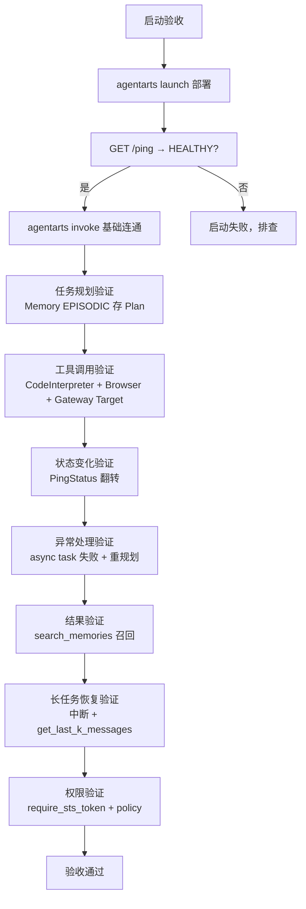

# 实验局验收

> 验收 AgentArts 接入是否达到企业级上线标准。核心原则：**不能只验证问答，必须验证完整 Agent 闭环**。
>
> **官方材料基线**：0916 全部 12 分册。验收清单已按 0916 增补 **运行时入站认证/委托/会话与存储/灰度**、**浏览器**、**知识库**、**Managed Agents**、**平台四类优化任务** 等能力项。

## 1. 验收理念

Demo 级验收只看"问答对不对"；企业级验收要看**完整 Agent 行为**：任务规划、工具调用、状态变化、异常处理、结果验证。这两者的差距就是 demo 与生产的差距。

验收必须覆盖这条完整链路：

```
用户请求 → Gateway → Runtime → Planner → Memory → Tool → Sandbox → 结果验证 → 反馈用户
```

任何一环缺失都不算通过。

## 2. 技术指标

| 指标 | 验证方法 | 目标 |
| --- | --- | --- |
| Agent 启动成功率 | `GET /ping` 返回 `PingStatus.HEALTHY`；`agentarts launch` 后 `agentarts invoke` 连通 | 100% |
| 任务完成率 | `@app.entrypoint` handler 返回有效响应；async task 经 `_active_tasks` 注册表追踪 | ≥ 90% |
| Tool 调用成功率 | `CodeInterpreter.execute_code/command`、`Browser` 自动化操作 + `GatewayClient` Target 调用成功率 | ≥ 95% |
| 长任务恢复能力 | session 级 Memory（`get_last_k_messages` + `search_memories`）+ `exec-command` 超时上限 3600s | 中断后可恢复 |
| 权限控制有效性 | `require_*` 装饰器 + STS `policy` 权限边界 + USER_FEDERATION 3LO `on_auth_url` 人工确认 | 无越权 |

## 3. 业务指标

| 指标 | 说明 |
| --- | --- |
| 自动化比例 | Agent 自动完成 vs 需人工介入 |
| 人工减少量 | 接入前后人力节省 |
| 问题解决时间 | 端到端耗时 |
| 用户满意度 | 主观反馈 |

## 4. SDK 可验证路径

每项验收都对应具体的 SDK 调用或端点观测：

| 验收项 | 验证方法 |
| --- | --- |
| Runtime 健康 | `GET /ping` → Healthy / HealthyBusy / Unhealthy |
| 并发隔离 | 并发打 `/invocations` 超 `max_concurrency=15` → 503 |
| 流式正确 | handler 返 generator → SSE `text/event-stream` |
| 沙箱隔离 | `CodeInterpreter` session 独立 + `execute_command` 元字符阻断；`Browser` session 独立 + 域名白名单 |
| 记忆持久 | `add_messages` → `search_memories` 召回 + `get_last_k_messages` |
| 网关路由 | `create_gateway` + `create_gateway_target` → Target 调用可达 |
| 身份授权 | `require_sts_token` 注入 `StsCredentials` + `policy` 限定生效 |
| 框架适配 | LangGraph `AgentArtsMemorySessionSaver` checkpoint 写入后 `aget_tuple` 读回一致 |
| 上传通道 | `upload_files` tar 检测 → `application/x-tar`；默认路径 `/tmp/` |
| V11 签名 | `V11Signer` 不对 query string 签名（数据面网关重写 query），`/` 保持不编码 |

## 5. Demo 必须体现

不能只展示问答。必须展示以下五项能力：

| 能力 | 如何展示 |
| --- | --- |
| 任务规划 | Memory EPISODIC 存 Plan，可检索回看 |
| 工具调用 | CodeInterpreter 执行代码 / Browser 操作网页 / Gateway Target 调外部 API |
| 状态变化 | PingStatus: Healthy → HealthyBusy → Healthy |
| 异常处理 | async task 失败 + Memory 存 Error + 重规划 |
| 结果验证 | `search_memories` 召回 + `/ping` 终态 |

## 6. 验收流程



## 7. 验收检查清单

### Runtime 层（0916 增补）
- [ ] `agentarts launch` 成功，输出 Agent ID / Region / Status / Endpoint
- [ ] `GET /ping` 返回 HEALTHY
- [ ] `agentarts invoke '<json>'` 返回有效响应
- [ ] 并发超 15 时返回 503（而非排队）
- [ ] 流式 handler 返回 SSE
- [ ] **镜像为 ARM64**（x86 镜像会因 `python: exec format error` 失败）
- [ ] **入站认证方式已确认**（IAM / API Key / OAuth 2.0）并完成一次对应方式的成功调用
- [ ] **`X-Hw-Agentarts-Session-Id` 路由生效**：同会话 ID 两次调用落到同一沙箱；换会话 ID 上下文重置
- [ ] **会话生命周期参数生效**：空闲超时 / 最大存活时间按配置终止
- [ ] **停止会话 ≠ 清除状态**：`sessions-stop` 后持久化数据仍可访问
- [ ] **不依赖本地磁盘**：重启/沙箱回收后关键状态未丢失
- [ ] **访问方式与版本**：Latest 默认端点存在；如需灰度，已创建带灰度策略的访问方式且权重和为 100
- [ ] **灰度验证使用新会话 ID**（否则会话存储会导致版本不一致→调用超时）
- [ ] **存储挂载正确**：SFS Turbo / OBS 仅在私网模式；挂载路径无 `..` 且互不包含
- [ ] **两个委托就位**：`AgentArtsRuntimeDeploymentAgency` 未被删除；用户运行时委托已绑定必需策略
- [ ] **无状态验证**：确认代码未把 SQLite / 本地日志 / 本地缓存当持久层

### 代码解释器层
- [ ] `execute_code` 返回 stdout/stderr/exitcode
- [ ] `execute_command` 阻断 shell 元字符（如 `;`、`|`、`$`）
- [ ] `upload_file` + `download_file` 往返一致
- [ ] session 超时设置生效
- [ ] 数据面会话头使用 `X-Hw-Agentarts-Code-InterpreterSession-Id`（不与 Agent 的头混用）
- [ ] 创建所需的 IAM 权限已授权（`iam:agencies:pass`；出网公网 `eip:publicIps:associateInstance`；私网 `vpc:nativePorts:create`、`vpc:routeTables:update`）

### 浏览器层（0916 新增）
- [ ] `create_browser` + `start_session` 成功，会话状态为"运行中"
- [ ] `navigate` / `mouse_click` / `key_type` / `screenshot` 均可用
- [ ] **域名边界生效**：`allowed_domains` 与 `blocked_domains` 未同时设置；越界域名被拦截
- [ ] **Profile 复用生效**：`save_profile` 后新会话加载 Profile，登录态保持
- [ ] **代理配置生效**：≤5 个代理、每代理 ≤100 域名模式、bypass ≤100 条、仅 HTTP/HTTPS/SOCKS5
- [ ] **代理不可变**：确认修改代理需重建会话
- [ ] **LiveView 可用**：`generate_live_view_url` 可打开实时画面，且多人可同时观看
- [ ] **人工接管可用**：`take_control` → 人工操作 → `release_control` 后自动化恢复
- [ ] 数据面会话头使用 `X-Hw-Agentarts-Browser-Session-Id`
- [ ] 空闲 900s 后会话自动终止

### Memory 层（0916 增补）
- [ ] `create_space` 返回 API Key（仅一次）
- [ ] **短期记忆**：`add_messages` 后 `get_last_k_messages` 返回最近 k 条，会话级隔离（跨会话查不到）
- [ ] **长期记忆**：`add_messages` 后**等待 3–5 分钟**（异步提取），`search_memories` 能召回
- [ ] **`actor_id` 隔离生效**：用户 A 的记忆对用户 B 不可见；同用户跨会话可共享
- [ ] **触发机制验证**：会话空闲 / 累计 Token / 累计消息数（OR 关系）至少一条可触发提取
- [ ] **检索链路验证**：`min_score`（默认 0.75）、`top_k`（默认 10）、Rerank 开关行为符合预期
- [ ] **策略生效**：启用的内置策略各自产出对应类型的长期记忆记录
- [ ] **自定义策略**（如启用）：抽取/整合/反思三段模板生效，输出符合约定 JSON 结构
- [ ] **程序性记忆**（如启用）：产出包含标题/适用场景/操作步骤/关键提示/失败模式
- [ ] **访问控制分级**：会话级密钥无法创建/删除会话与记忆
- [ ] **流控观测**：在观测指标中能看到限流情况，且客户端有退避策略
- [ ] **配额**：记忆库数量 ≤10，自定义策略 ≤10
- [ ] `delete_space` 级联删除 session/message/memory

### Knowledge Base 层（0916 新增）
- [ ] 平台知识库已创建，支持格式（doc/docx/pdf/ofd/txt/md/wps/xls/xlsx/csv/et/ppt/pptx/dps/图片类）可上传
- [ ] 文档解析与**分段配置**符合预期；命中测试结果相关
- [ ] 单文件大小在套餐限内（体验版 20MB / 付费版 60MB；OBS 接入 128MB）
- [ ] 召回数量（最大文本切片数 50）满足业务需求
- [ ] FAQ 文件无空行（空行后数据会被忽略）、Excel ≤100,000 条
- [ ] 如需第三方知识库：General 已按接入规范适配，或 KooSearch / RAGFlow 连接成功且命中测试通过
- [ ] 第三方知识库检索**数据不落地平台**（合规确认）
- [ ] 在单智能体与工作流中分别验证检索策略一致（官方明确两者策略可能不一致）

### Gateway 层（0916 增补）
- [ ] `create_gateway` 成功（IAM 委托自动创建或 409 容忍）
- [ ] `create_gateway_target` 成功，Target 类型按官方四类选择（REST API / MCP / APIG / 云服务）
- [ ] Target 调用可达
- [ ] **`tools/list` 循环 cursor 到空**，能拿到全部 Target 的工具（单次只返回一个 Target）
- [ ] **入站认证**（谁调用网关）与**出站身份**（网关代表谁访问后端）分别验证通过
- [ ] **出站身份复用**：修改出站身份后所有绑定 Target 同步生效
- [ ] **Agent 代码中不含后端凭证**（凭证全部收敛在网关侧）
- [ ] 工具规模大时已开启**语义检索**（Top N + 相似阈值），工具列表未撑爆上下文
- [ ] `list_gateways` tag 过滤生效
- [ ] 报"委托缺少 CSMS/KMS 相关 action 权限"时已补齐授权

### Managed Agents 层（0916 新增，如选用该形态）
- [ ] 功能已提交工单开通
- [ ] 环境已创建且**出网网络配置**满足需求（公网/私网）；已确认"公网访问不支持 Skill"
- [ ] 存储配置满足约束：SFS Turbo ≤5 / OBS ≤10（≤5 桶）/ 会话存储 1；路径合法且互不包含
- [ ] 智能体已创建并关联环境；创建/更新产生新版本可在"版本"页签查看
- [ ] 内置工具按需勾选（`bash` / `read_file` / `write_file` / `edit_file` / `glob` / `list_files` / `grep`）
- [ ] **入站身份认证**（IAM / OAuth 2.0 / API Key）与调用方式一致
- [ ] WebSocket 调用连通：`ws://{endpoint}/runtimes/{runtime_name}/ws`
- [ ] 能收到 `e2a.chunk` 流式帧与 `e2a.complete` 完成帧
- [ ] **工具权限审批帧**（`TOOL_PERMISSION`）出现且被正确处理
- [ ] 会话空闲超时 / 最大存活时间符合业务预期
- [ ] 可观测配置已按需开启（默认开启）；"日志"页签可查到运行日志
- [ ] **计费确认**：如用 API Key 认证，确认"创建即计费"与 DEW 托管费用已被知悉
- [ ] 如使用 Skill：环境为**私网访问且挂载 OBS**

### Identity 层
- [ ] `require_api_key` 注入 api_key
- [ ] `require_sts_token` 注入 StsCredentials，`policy` 限定生效
- [ ] USER_FEDERATION 3LO：`on_auth_url` 回调 → `complete_resource_token_auth` → 轮询成功
- [ ] contextvars 并发隔离：多协程 user_id 互不干扰

### Long Loop 层
- [ ] async task 进入 `_active_tasks`，ping 变 HEALTHY_BUSY
- [ ] 中断后 `get_last_k_messages` 恢复上下文
- [ ] `search_memories` 按 `strategy_type` 召回历史决策
- [ ] `exec-command` 长执行（超时 ≤ 3600s）

### 观测层（0916 术语更新）
- [ ] 使用真实 API 调用触发数据，业务指标、Trace 和会话可用 `trace_id` / `session_id` 串联
- [ ] 能从 Root Span 下钻到 Model/Tool Span，查看输入输出、耗时、元数据和错误
- [ ] 运行时、代码解释器、网关开启日志后，「观测与优化 > 观测 > 查看托管智能体数据」可检索到测试调用
- [ ] 已验证「Trace 标注 → 评测集回流」，并保留 `trace_id`
- [ ] Prompt、对话、工具输入/输出已脱敏，日志无 API Key、AK/SK 或 Token
- [ ] 第三方框架接入（LangChain/LangGraph 或 **AgentScope**）上报通路验证通过

### 评估层
- [ ] 评测集已发布，覆盖正向、对抗和边界样本
- [ ] 评估器与场景匹配，`input` / `actual_output` / `reference_output` / `context` 映射正确
- [ ] 在线评估的粒度、Trace 筛选和采样范围可获取到数据
- [ ] 低分和争议样本经人工校准，未将 LLM 裁判无条件当作真值

### 优化层（0916 新增平台能力验收项）
- [ ] BadCase 已按 Prompt/Model/RAG/Tool/Skill/Flow/数据/评估器归因
- [ ] 每次优化仅改动一个主要变量，并记录版本和假设
- [ ] 新旧版本使用同一评测集和评估器对比，核心指标提升且关键指标无退化
- [ ] 高分样本与 BadCase 分别回流并发布新评测集版本
- [ ] **优化路径选型正确**：描述问题→工具优化；文档问题→Skill 优化；模型问题→模型优化；说不清→先轨迹分析
- [ ] **轨迹分析**已运行，失效分析结果能下探到 Session ID / Span ID 级
- [ ] 轨迹分析 / 工具优化 / Skill 优化所需的 **IAM 信任委托**已创建并授权（云服务填"智果 Agent 优化"；`AgentArtsRLAnalysisTaskAgencyPolicy` / `AgentArtsRLAgentTuningTaskAgencyPolicy`）
- [ ] 优化对象的 **Trace 数据量充足**（时间范围内）
- [ ] **工具优化**产出可用的工具描述文案 / 前置校验规则 / 使用限制
- [ ] **Skill 优化**产出包含补充执行步骤、准入条件与边界处理逻辑的新文档
- [ ] **模型优化**：优化对象满足配置要求（无工作流/子工作流、插件 ≤5、MCP ≤5、路径上无用户交互节点、被优化节点不在循环中）
- [ ] **模型优化**：数据集符合官方格式与质量标准（`input` + `reference_output`）
- [ ] **模型优化**：奖惩机制与场景匹配（规则/生成式/自定义）；生成式奖励评分标准含权重划分、分数段量化、一票否决红线
- [ ] **模型优化**：自定义奖励所用代码解释器已创建并初始化（依赖 + 自定义 Python 文件）
- [ ] **模型优化**：训练后有模型快照，能挑选最优模型并完成部署接入
- [ ] **模型优化**：已确认裁判模型/部署资源的费用承担方

完整路径见 [智能体观测](observability.md)、[智能体评估](evaluation.md) 和 [智能体优化](optimization.md)。

## 8. 常见验收失败点

| 失败点 | 原因 | 排查 |
| --- | --- | --- |
| ping 返回 UNHEALTHY | handler 启动异常 / 依赖缺失 | 看 Runtime 日志，检查 `@app.entrypoint` 函数 |
| invoke 超时 | handler 执行过慢 / 并发满 | 检查 `max_concurrency`，优化 handler |
| search_memories 无结果 | 记忆未生成 / 查询不相关 | 等待 **3–5 分钟**（异步抽取）；检查 strategy_type；确认 Space status=running |
| Gateway Target 不可达 | 网络配置 / 认证配置 | 检查 `outbound_network_configuration`、`credential_provider_configuration` |
| STS policy 越权 | policy 过宽 | 收紧 `require_sts_token` 的 `policy` 字段 |
| 长任务无法恢复 | session_id 未持久化 | 确认 `thread_id` / `session_id` 透传到 Memory |
| `python: exec format error` | 用 x86 机器打了镜像 | 换 ARM64 机器重新构建镜像 |
| 调用超时（灰度期间） | 会话存储 + 会话 ID 跨版本 | 灰度验证换**新会话 ID** |
| `search_memories` 立即查无结果 | 长期记忆提取是异步的 | 等待 **3–5 分钟**再查（官方建议） |
| 记忆数据串扰 | 不同用户复用了同一 `actor_id` | 不同用户必须使用不同 `actor_id`，建议用业务系统用户 ID |
| 运行时创建失败 / 镜像下载异常 | `AgentArtsRuntimeDeploymentAgency` 被删除 | 恢复该委托（不可删除） |
| 网关 `tools/list` 工具不全 | 未循环 cursor | 携带 cursor 循环拉取直到为空 |
| 网关报委托缺权限 | 缺 CSMS/KMS action | 补齐 CSMS/KMS 授权 |
| Managed Agents 无法添加 Skill | 环境为公网访问或未挂 OBS | 改为**私网访问 + 挂载 OBS** |
| OBS 挂载数据丢失 | 回写模式下进程崩溃/hard kill，文件未 `close()` | 关键数据写入后检查 `close()` 返回值，必要时 `fsync()`，或启用 `use_cache` |
| 沙箱内数据丢失 | 依赖了本地磁盘 | 状态走 Memory，文件走 SFS Turbo / OBS |
