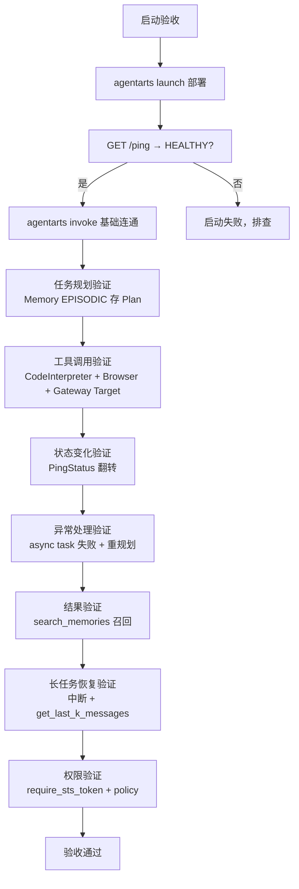

# 实验局验收

> 验收 AgentArts 接入是否达到企业级上线标准。核心原则：**不能只验证问答，必须验证完整 Agent 闭环**。

## 1. 验收理念

Demo 级验收只看"问答对不对"；企业级验收要看**完整 Agent 行为**：任务规划、工具调用、状态变化、异常处理、结果验证。这两者的差距就是 demo 与生产的差距。

验收必须覆盖这条完整链路：

```
用户请求 → Gateway → Runtime → Planner → Memory → Tool → Sandbox → 结果验证 → 反馈用户
```

任何一环缺失都不算通过。

## 2. 技术指标

| 指标 | 验证方法 | 目标 |
| --- | --- | --- |
| Agent 启动成功率 | `GET /ping` 返回 `PingStatus.HEALTHY`；`agentarts launch` 后 `agentarts invoke` 连通 | 100% |
| 任务完成率 | `@app.entrypoint` handler 返回有效响应；async task 经 `_active_tasks` 注册表追踪 | ≥ 90% |
| Tool 调用成功率 | `CodeInterpreter.execute_code/command`、`Browser` 自动化操作 + `GatewayClient` Target 调用成功率 | ≥ 95% |
| 长任务恢复能力 | session 级 Memory（`get_last_k_messages` + `search_memories`）+ `exec-command` 超时上限 3600s | 中断后可恢复 |
| 权限控制有效性 | `require_*` 装饰器 + STS `policy` 权限边界 + USER_FEDERATION 3LO `on_auth_url` 人工确认 | 无越权 |

## 3. 业务指标

| 指标 | 说明 |
| --- | --- |
| 自动化比例 | Agent 自动完成 vs 需人工介入 |
| 人工减少量 | 接入前后人力节省 |
| 问题解决时间 | 端到端耗时 |
| 用户满意度 | 主观反馈 |

## 4. SDK 可验证路径

每项验收都对应具体的 SDK 调用或端点观测：

| 验收项 | 验证方法 |
| --- | --- |
| Runtime 健康 | `GET /ping` → Healthy / HealthyBusy / Unhealthy |
| 并发隔离 | 并发打 `/invocations` 超 `max_concurrency=15` → 503 |
| 流式正确 | handler 返 generator → SSE `text/event-stream` |
| 沙箱隔离 | `CodeInterpreter` session 独立 + `execute_command` 元字符阻断；`Browser` session 独立 + 域名白名单 |
| 记忆持久 | `add_messages` → `search_memories` 召回 + `get_last_k_messages` |
| 网关路由 | `create_gateway` + `create_gateway_target` → Target 调用可达 |
| 身份授权 | `require_sts_token` 注入 `StsCredentials` + `policy` 限定生效 |
| 框架适配 | LangGraph `AgentArtsMemorySessionSaver` checkpoint 写入后 `aget_tuple` 读回一致 |
| 上传通道 | `upload_files` tar 检测 → `application/x-tar`；默认路径 `/tmp/` |
| V11 签名 | `V11Signer` 不对 query string 签名（数据面网关重写 query），`/` 保持不编码 |

## 5. Demo 必须体现

不能只展示问答。必须展示以下五项能力：

| 能力 | 如何展示 |
| --- | --- |
| 任务规划 | Memory EPISODIC 存 Plan，可检索回看 |
| 工具调用 | CodeInterpreter 执行代码 / Browser 操作网页 / Gateway Target 调外部 API |
| 状态变化 | PingStatus: Healthy → HealthyBusy → Healthy |
| 异常处理 | async task 失败 + Memory 存 Error + 重规划 |
| 结果验证 | `search_memories` 召回 + `/ping` 终态 |

## 6. 验收流程



## 7. 验收检查清单

### Runtime 层
- [ ] `agentarts launch` 成功，输出 Agent ID / Region / Status / Endpoint
- [ ] `GET /ping` 返回 HEALTHY
- [ ] `agentarts invoke '<json>'` 返回有效响应
- [ ] 并发超 15 时返回 503（而非排队）
- [ ] 流式 handler 返回 SSE

### Sandbox 层
- [ ] `execute_code` 返回 stdout/stderr/exitcode
- [ ] `execute_command` 阻断 shell 元字符（如 `;`、`|`、`$`）
- [ ] `upload_file` + `download_file` 往返一致
- [ ] session 超时设置生效

### Memory 层
- [ ] `create_space` 返回 API Key（仅一次）
- [ ] `add_messages` 后等待 30s，`search_memories` 能召回
- [ ] `get_last_k_messages` 返回最近 k 条
- [ ] `delete_space` 级联删除 session/message/memory

### Gateway 层
- [ ] `create_gateway` 成功（IAM 委托自动创建或 409 容忍）
- [ ] `create_gateway_target` 成功
- [ ] Target 调用可达
- [ ] `list_gateways` tag 过滤生效

### Identity 层
- [ ] `require_api_key` 注入 api_key
- [ ] `require_sts_token` 注入 StsCredentials，`policy` 限定生效
- [ ] USER_FEDERATION 3LO：`on_auth_url` 回调 → `complete_resource_token_auth` → 轮询成功
- [ ] contextvars 并发隔离：多协程 user_id 互不干扰

### Long Loop 层
- [ ] async task 进入 `_active_tasks`，ping 变 HEALTHY_BUSY
- [ ] 中断后 `get_last_k_messages` 恢复上下文
- [ ] `search_memories` 按 `strategy_type` 召回历史决策
- [ ] `exec-command` 长执行（超时 ≤ 3600s）

### 观测层
- [ ] 使用真实 API 调用触发数据，业务指标、Trace 和会话可用 `trace_id` / `session_id` 串联
- [ ] 能从 Root Span 下钻到 Model/Tool Span，查看输入输出、耗时、元数据和错误
- [ ] Runtime、Gateway、Sandbox 开启日志后，“智能体运行分析”可检索到测试调用
- [ ] 已验证“Trace 标注 -> 评测集回流”，并保留 `trace_id`
- [ ] Prompt、对话、工具输入/输出已脱敏，日志无 API Key、AK/SK 或 Token

### 评估层
- [ ] 评测集已发布，覆盖正向、对抗和边界样本
- [ ] 评估器与场景匹配，`input` / `actual_output` / `reference_output` / `context` 映射正确
- [ ] 在线评估的粒度、Trace 筛选和采样范围可获取到数据
- [ ] 低分和争议样本经人工校准，未将 LLM 裁判无条件当作真值

### 优化层
- [ ] BadCase 已按 Prompt/Model/RAG/Tool/Flow/数据/评估器归因
- [ ] 每次优化仅改动一个主要变量，并记录版本和假设
- [ ] 新旧版本使用同一评测集和评估器对比，核心指标提升且关键指标无退化
- [ ] 高分样本与 BadCase 分别回流并发布新评测集版本

完整路径见 [智能体观测](observability.md)、[智能体评估](evaluation.md) 和 [智能体优化闭环](optimization.md)。

## 8. 常见验收失败点

| 失败点 | 原因 | 排查 |
| --- | --- | --- |
| ping 返回 UNHEALTHY | handler 启动异常 / 依赖缺失 | 看 Runtime 日志，检查 `@app.entrypoint` 函数 |
| invoke 超时 | handler 执行过慢 / 并发满 | 检查 `max_concurrency`，优化 handler |
| search_memories 无结果 | 记忆未生成 / 查询不相关 | 等待 30s；检查 strategy_type；确认 Space status=running |
| Gateway Target 不可达 | 网络配置 / 认证配置 | 检查 `outbound_network_configuration`、`credential_provider_configuration` |
| STS policy 越权 | policy 过宽 | 收紧 `require_sts_token` 的 `policy` 字段 |
| 长任务无法恢复 | session_id 未持久化 | 确认 `thread_id` / `session_id` 透传到 Memory |
