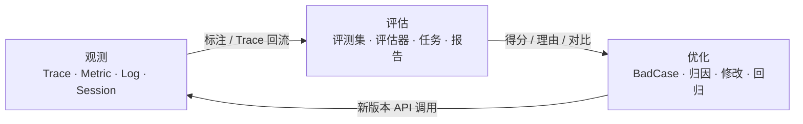

# 智能体观测（Observation）

> 主要来源：《智果（AgentArts）智能体平台 智能体运营运维》，文档版本 01（2026-08-04），第 1.1-1.9 节。《高代码开发》仅用于交叉验证 Runtime/Gateway/Sandbox 的 SDK 配置入口。

## 1. 运营运维闭环

AgentArts 运营运维不只是“看日志”，而是一条持续质量闭环：



- **观测**：将动态、多步的 Agent 运行过程从“黑箱”转换为可查询的 Trace/Span、指标、日志和会话。
- **评估**：用在线或离线任务对输出质量、正确性、工具调用、安全性等维度量化打分。详见 [智能体评估](evaluation.md)。
- **优化**：从指标和 BadCase 归因，修改 Prompt、模型、知识库或工具，再用对比评估与回归测试验证。详见 [优化闭环](optimization.md)。

“优化”是《智能体运营运维》中跨观测、数据回流、评估报告和对比任务的工作流，不是左侧导航中与“观测”、“评估”并列的独立产品页签。

## 2. 观测对象与数据

| 页面 / 能力 | 观测内容 | 主要用途 |
| --- | --- | --- |
| 智能体概览 - 业务指标 | Tokens、模型调用、平均耗时、成功率、会话数、用户数、QPS/QPM | 性能、成功率和成本异常 |
| 智能体概览 - 运营指标 | 应用总数/新增/活跃数、调用量和资源消耗 Top5 | 应用活跃度、资源分配与成本管理 |
| 智能体列表 | 平台原生与第三方托管智能体 | 统一查看上报的 Trace/Metric/Log |
| 调用链分析 | Trace 调用树、Span 输入/输出、元数据、标注、指标和日志 | 节点耗时、错误与逻辑根因定位 |
| 会话分析 | 会话上下文、耗时、Token、关联 Trace | 多轮对话质量和慢会话定位 |
| 智能体运行分析 | 高代码 Runtime、沙箱工具、网关日志 | 高代码资源故障排查 |
| 人工标注 | Span 上的业务标签或评分 | 分类、筛选和定向回流 Trace |
| 数据回流 | Trace 或评估结果到评测集 | 构建黄金集、BadCase 库和回归集 |

## 3. Trace 与 Span

- **Trace**：一次请求从发起到最终响应的完整生命周期。
- **Span**：Trace 中的独立操作步骤，如模型调用、函数执行或工具调用。
- **Root Span**：Trace 根节点，表示用户请求的端到端输入和最终输出。
- **Model Span**：底层真实调用 LLM API 的节点，可观察组装后的 Prompt 和模型原始输出。
- **ALL Span**：当前 Trace 的全部节点，包括 Root、Model、工具、知识检索等中间过程。

调用链详情的五类下钻信息：

| 类型 | 内容 |
| --- | --- |
| 链路信息 | 选中 Span 的输入、输出和报错详情 |
| 元数据 | 应用版本、运行环境、模型名称等 Key-Value 扩展信息 |
| 标注 | 人工附加的分类/事件信息，可用于筛选和评测集回流 |
| 指标 | 当前 Span 前后 15 分钟（最大到当前时间）的 Token 和平均响应时间趋势 |
| 日志 | 思考过程、工具原始输入/输出和错误事件 |

调用链列表可按 30 天内时间、应用类型/应用、ALL/Root/Model Span、Trace ID、请求状态、输入、输出、会话 ID 和标注筛选。

## 4. 业务指标与运营指标

### 业务指标

| 指标 | 口径 |
| --- | --- |
| Tokens 消耗 | 大模型 Input Tokens + Output Tokens |
| 模型调用次数 | 选定时间范围的累计调用次数 |
| 模型调用平均耗时 | 模型调用总耗时 / 模型调用总数 |
| 模型调用成功率 | 成功模型调用次数 / 总模型调用次数 |
| 会话数 / 用户数 | 会话总数 / 去重用户数 |
| QPS/QPM | 仅统计 Root Span，分成功和失败请求 |
| 响应成功率 | 指定时间内成功请求数 / 总请求数 |
| Top5 | 模型 Token 消耗、调用次数和平均耗时排行 |

可按单智能体/工作流/多智能体、具体应用和时间范围过滤。自定义时间仅支持最近 30 天。

### 运营指标

- 当前租户下单智能体、工作流、多智能体总数（不受时间筛选影响）。
- 指定时间内的新增净数：新增数减同期删除数。
- 活跃智能体数：指定时间内至少完成一次用户问答的已发布应用。
- Top5：智能体调用量、智能体 Token 消耗、模型 Token 消耗、模型调用次数、模型平均耗时。

运营指标通常约有 1 分钟延迟，数据保留 30 天。只统计 API 调用，不包含控制台调试和编排预览。

## 5. 会话分析

会话将同一 `session_id` 下的多次交互串联起来。列表展示：会话 ID、端到端总耗时、输入/输出/总 Tokens、调用链数、用户 ID、触发类型和开始时间。进入会话详情后可查看完整对话和关联 Trace，并通过 Trace ID 下钻到调用链。

空数据排查顺序：检查时间/应用筛选 -> 确认使用 API 调用 -> 确认已开启数据上报 -> 等待数据延迟后刷新。

## 6. 三种数据上报模式

| 开发/部署方式 | 上报模式 | 关键说明 |
| --- | --- | --- |
| AgentArts 内创建的单智能体、工作流、多智能体 | 平台原生自动上报 | 提交版本时默认开启，可关闭；仅 API 调用数据上报 |
| 本地高代码并托管到 AgentArts Runtime | 托管后上报 | 开启 Runtime/Sandbox/Gateway 日志后，在“智能体运行分析”查看 |
| 非 AgentArts 开发/部署的第三方智能体 | 观测 OpenAPI | Trace/Metric 遵循 OpenTelemetry，Log 调用 LTS REST API |

### 高代码上报边界

托管高代码智能体当前明确开放的是 **Runtime、Sandbox、Gateway 日志**。运营运维文档明确标注：托管智能体的调用链与指标查看功能正在规划，暂未开放。因此，不应因 SDK 配置中存在 `tracing` / `metrics` 字段就宣称当前控制台已支持高代码 Trace/Metric 可视化。

日志开启与查看：

- Runtime：“部署运行 > 智能体运行时 > 托管智能体 > 日志记录”。
- Sandbox：“开发中心 > 组件库 > 沙箱工具 > 创建代码解释器 > 日志记录”。
- Gateway：“开发中心 > 组件库 > 网关 > 创建网关 > 日志记录”。
- 聚合验证：触发一次调用后，进入“运营运维 > 观测 > 智能体运行分析”，分别查看“智能体运行时”、“沙箱工具”和“网关”页签。
- SDK 会在所有控制面/数据面请求的 `User-Agent` 末尾追加 `os/<system>/<release> agentarts-sdk-python/<version>`，便于在服务端日志中定位调用方版本与操作系统，不影响业务逻辑。

SDK 配置示例：

```yaml
runtime:
  observability:
    tracing:
      enabled: false
    metrics:
      enabled: false
    logs:
      enabled: true
```

```python
from agentarts.sdk.gateway import GatewayClient

GatewayClient().create_gateway(
    name="my-gateway",
    log_delivery_configuration={"enabled": True},
)
```

### 第三方智能体接入

1. 进入“运营运维 > 观测 > 智能体列表”，单击“智能体接入”。
2. 选择单智能体/工作流/多智能体类型，创建智能体实体。
3. 保存平台生成的接入信息：

| 数据 | 接入信息 | 后端 |
| --- | --- | --- |
| Trace | `agent_id`、`trace_endpoint`、`trace_token` | APM |
| Metric | `metric_endpoint`、`metric_token`、`project_id`、`promID` | AOM |
| Log | LTS 完整接入地址、`__label__.task_name`、`__label__.task_type` | LTS |

Trace 上报的核心 OTel 环境变量：

```bash
export OTEL_SERVICE_NAME='AgentArts.<agent_id>.default'
export OTEL_EXPORTER_OTLP_TRACES_HEADERS='Authentication=<trace_token>'
export OTEL_EXPORTER_OTLP_TRACES_ENDPOINT='<trace_endpoint>'
export OTEL_EXPORTER_OTLP_TRACES_INSECURE=true
```

Metric 上报使用 `Authorization=Bearer <metric_token>`、`projectID`、`promID` 和 `Content-Type=application/x-protobuf` 组合头；Log 上报调用 LTS REST API，使用 `X-Auth-Token` 的 IAM 用户 Token 鉴权。这些 Token 和接入地址必须当作敏感配置管理，不应写入业务日志或代码库。

#### OTel 字段映射

第三方 Trace 若要被 AgentArts 正确聚合和检索，应至少写入以下属性。注意 Trace 使用 `user.id`，Metric 使用 `gen_ai.user.id`，两者不要混用。

| Trace 属性 | 要求与用途 |
| --- | --- |
| `gen_ai.span.type` | 必填；根节点为 `root`，其余节点按文档映射为 `model` |
| `gen_ai.resource.id` / `gen_ai.resource.type` | 必填；资源类型为 `agent`、`multiagents` 或 `workflow` |
| `gen_ai.conversation.id` | 必填；会话 ID，最大 64 字节 |
| `user.id` / `domain.id` | 必填；用户与租户标识 |
| `input.value` / `output.value` | 必填；节点输入与输出 |
| `gen_ai.agent.name` | 必填；智能体名称 |
| `gen_ai.application_name` / `gen_ai.environment` | 必填，当前均设为 `default` |
| `gen_ai.call.type` / `resource_version` | 必填，当前分别设为 `API` / `default` |

Model Span 可补充 `gen_ai.request.model`、`gen_ai.usage.input_tokens`、`gen_ai.usage.output_tokens`、`gen_ai.usage.total_tokens`、`gen_ai.server.time_to_first_token` 和 `gen_ai.client.operation.duration`。平台按 Trace/会话统计 Token 时读取 Root Span，因此关闭 Root Span 前还应把所有 Model Span 的 Token 汇总写回 Root Span，否则列表可能显示为 0。

Skill 调用信息写在对应工具 Span 上，不需要另建 Skill Span：使用 `gen_ai.operation.name=load_skill|release_skill`、`gen_ai.skill.name`、`gen_ai.skill.id`，可选填描述和版本；加载/释放事件名分别为 `skill.loaded`、`skill.released`。

平台约定的标准 Metric 包括：

| 类别 | 指标名与类型 |
| --- | --- |
| 状态与请求 | `gen_ai.usage.status`（Gauge）、`gen_ai.session.count`（Gauge）、`total.requests`（Counter）、`gen_ai.total.requests`（Counter） |
| 延迟与 Token | `client.operation.duration`（Histogram）、`gen_ai.client.operation.duration`（Histogram）、`gen_ai.server.time_to_first_token`（Histogram）、`gen_ai.usage.input_tokens` / `gen_ai.usage.output_tokens`（Counter） |
| Skill | `gen_ai.skill.call.count`（Counter）、`gen_ai.skill.duration`（Histogram）、`gen_ai.skill.error.count`（Counter）、`gen_ai.skill.token.usage`（Counter） |

Metric 公共维度应包含 `gen_ai.resource.id`、`gen_ai.resource.type`、`domain.id`、`gen_ai.project.id`、`gen_ai.user.id`、`gen_ai.conversation.id`、`gen_ai.model.id` 和 `gen_ai.call.status`。Skill 指标还需 Skill 名称；版本、系统和请求模型等维度按指标需要选填。

## 7. 人工标注与 Trace 回流

人工标注可将 Trace 分类为“优质回答”、“Prompt 指令弱”、“工具参数错误”等业务场景，再按标注筛选并回流到评测集。每条调用链最多可添加 20 个标注。

Trace 回流的 Span 选择：

| 回流对象 | 优先使用场景 |
| --- | --- |
| Root Span | 用户原始 input + 智能体最终 output |
| Model Span | 模型实际看到的完整 Prompt + 原始模型 output |
| ALL Span | 工具、检索等底层深度排障和溯源 |

可回流字段包括：`input`、`output`、`duration`、`tokens`、`input_tokens`、`output_tokens`、`start_time`、`trace_id`、`span_id`、`session_id`、`is_error`、`call_type`、`span_type`、`span_name`、`status_code`、`feedback_operation`、`metadata`、`resource_id`、`resource_name`、`resource_type`。建议保留 `trace_id` 用于从评估 BadCase 反查完整运行记录。

回流约束：

- 单次最多选择 200 条 Trace，更多数据需分批。
- 源字段与评测集目标字段的数据类型必须一致，不支持多个 Trace 字段映射到同一列。
- 单个评测集最多 5000 条数据。
- “追加数据”保留已有数据；“全量覆盖”清空当前版本，但可通过评测集版本历史还原。
- 智能创作类可回流 input/output 后做离线评估，但应先人工将 output 修正为标准答案。
- RAG 幻觉评估需知识召回 context，工具评估需中间工具 Span；当前离线 Trace 回流难以完整映射这些中间信息，优先选择在线评估。

## 8. 费用、限制与数据安全

- 观测页面展示不收费；数据上报会使用 APM（Trace）、AOM（Metric）和 LTS（Log），按相应服务计费。
- 平台原生观测、业务/运营指标、会话分析与在线评估只由 **API 调用**产生数据；控制台调试、编排预览不纳入统计。
- 调用链详情的“日志”页签不支持第三方托管智能体；需在“智能体列表 > 目标智能体 > 日志”查看。
- Trace 与日志可包含 Prompt、工具原始输入/输出和对话内容。上线前必须确定脱敏、访问权限、保留周期和审计策略，严禁上报 API Key、AK/SK、OAuth/STS Token 等凭证。

## 9. 观测验收清单

- [ ] 明确应用属于平台原生、高代码托管或第三方 OTel 接入，并选择正确上报方式
- [ ] 用真实 API 发起可识别的测试调用，而不是只在控制台调试
- [ ] 业务指标、Trace、会话和日志均能用 `trace_id` / `session_id` / 资源 ID 串联
- [ ] 高代码 Runtime、Sandbox、Gateway 的 LTS 日志开关、授权和聚合查看均已验证
- [ ] 对话、Prompt、工具输入/输出已脱敏，上报 Token 和接入凭证未进入日志
- [ ] 至少完成一条“Trace 标注 -> 回流评测集 -> 评估”链路
