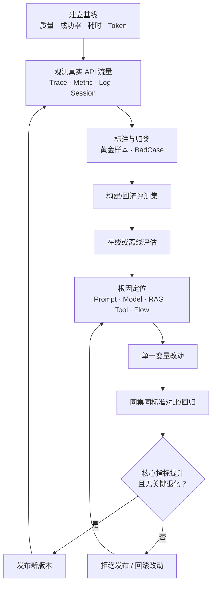

# 智能体优化闭环（Optimization）

> 主要来源：《智果（AgentArts）智能体平台 智能体运营运维》，文档版本 01（2026-08-04），第 1.1、1.8、1.9、2.2、2.3、2.6.2-2.6.5 节。本章是对文档中分散优化步骤的闭环化整理；平台并无独立的“优化”页签。

## 1. 优化的目标

优化不是凭感觉调 Prompt，而是用观测数据发现问题、用评估确认问题、用对照实验验证改动的可重复过程。

## 2. 从现象到修复手段

| 现象 | 观测证据 | 典型根因 | 优化手段 | 回归验证 |
| --- | --- | --- | --- | --- |
| 端到端响应慢 | Root Span 耗时、最慢子 Span、模型平均耗时 | 工具/模型慢、冗余节点、重复生成 | 精简调用链、优化工具逻辑、调整模型、并行/缓存 | 耗时分位数、任务完成度均不退化 |
| Token 成本飙升 | Tokens 总量、模型消耗 Top5、Model Span 输入 | 过长上下文、反复调高成本模型、无缓存 | 剪枝上下文、加判断与缓存、设频率/Token 阈值、分层选模型 | 单次 Token、成本、正确性和深度性 |
| 答案不符合预期 | Model Span Prompt/输出、工具输入/输出 | Prompt 含义不清、参数名不匹配、上下文拼接错 | 增强 Prompt 约束、统一参数语义、修复上下文组装 | 正确性、指令遵从、参数正确性 |
| RAG 幻觉 | Trace 中的问题、回答和检索 context | 知识缺失、检索不准、无证据仍生成 | 补文档、优化分段/召回/精排、加“无依据则拒答”规则 | 幻觉现象、引用相关性、真实准确 |
| 工具选错或参数错 | 工具 Span、轨迹、工具请求体 | 工具描述模糊、参数约束不清、调用时机不对 | 修改插件/MCP 描述和 schema，在 Prompt 限定时机与必填参数 | 工具选择质量、工具参数正确性、轨迹质量 |
| 安全/拒答边界失败 | 低分会话、对抗评测集、安全评估器 | 护栏缺失、红线样本不足 | 补拒答规则、护栏和合成对抗/红线样本 | 拒答检测、安全风险漏放、有害性、恶意性 |

## 3. BadCase 归因流程

1. **看整体**：用总体得分、雷达图、业务指标和评估器指标确定最薄弱维度。
2. **抓 BadCase**：按低分、失败、高耗时、高 Token 或人工标注筛选具体样本。
3. **反查 Trace**：使用回流保留的 `trace_id`，查 Root/Model/Tool Span 的输入、输出、元数据和日志。
4. **校准裁判**：人工检查评估器得分理由；对误判修正得分，对典型缺陷打标签。
5. **分配责任面**：将问题归到 Prompt、Model、RAG、Tool/Gateway、工作流、数据或评估器本身。
6. **单一变量修改**：一次只改一个主要因子，保留版本和实验说明，避免无法归因。

## 4. 评测集迭代策略

| 数据类型 | 来源 | 处理 | 用途 |
| --- | --- | --- | --- |
| 黄金样本 | 高分且人工复核的真实对话 | 校对为标准答案并发布版本 | 新版本上线门禁 |
| BadCase | 低分、失败、高延迟、人工投诉 | 保留 `trace_id`，按根因标签 | 专项修复和回归 |
| 边界/对抗样本 | 人工设计 + AI 合成 | 复核安全性与多样性 | 能力边界和护栏测试 |
| 生产分布样本 | Trace 随机/分层抽样 | 按场景、用户和流量比例保持分布 | 防止只优化少量典型问题 |

评估结果回流可选择新建评测集或追加到已有评测集。对已有评测集做全量覆盖前，应确认版本可恢复；源字段与目标列数据类型必须一致，所有必填列必须完成映射。

## 5. 对比与回归门禁

平台的评估任务对比采用基线组/对照组思路，可查看综合得分、雷达图、各评估器得分、模型调用耗时和 Tokens，并下钻到单条数据的输出/得分差异。

对比约束：

- 仅支持离线评估任务对比。
- 任务状态必须为成功或部分成功。
- 对比任务必须基于同一评测集。
- 单次最多对比 5 个评估任务。

推荐发布门禁：

1. 核心质量指标达到业务目标。
2. 相比基线，目标指标有提升或保持。
3. 安全、拒答、工具参数和其他关键维度无显著退化。
4. 耗时与 Token 成本处于预算。
5. 所有高风险 BadCase 经人工复核。

上述阈值由业务自行定义；《智能体运营运维》未给出通用固定阈值。

## 6. 优化记录模板

| 字段 | 说明 |
| --- | --- |
| 问题 / 假设 | 预计改动哪个根因，影响哪个评估维度 |
| 基线 | 智能体版本、评测集版本、评估器版本和基线得分 |
| 改动 | Prompt / Model / RAG / Tool / Flow 的具体变更 |
| 对照条件 | 同一评测集、评估器、采样策略和关键模型参数 |
| 结果 | 质量得分、耗时、Token、失败率、BadCase 数变化 |
| 决策 | 发布 / 继续优化 / 回滚，以及证据链接（Trace ID、任务 ID） |

## 7. 优化验收清单

- [ ] 每项优化都有可检验的假设和量化指标，不是“感觉更好”
- [ ] 基线任务、评测集版本、评估器版本和关键参数均已固定
- [ ] BadCase 保留 `trace_id` 并按 Prompt/Model/RAG/Tool/Flow/数据/评估器归类
- [ ] 一次只改一个主要变量，改动可回滚
- [ ] 对比评估使用同一评测集，并检查关键非目标指标是否退化
- [ ] 高分样本和低分 BadCase 分别沉淀，评测集发布新版本
- [ ] 新版本发布后继续在线观测，异常时可追溯与回滚
