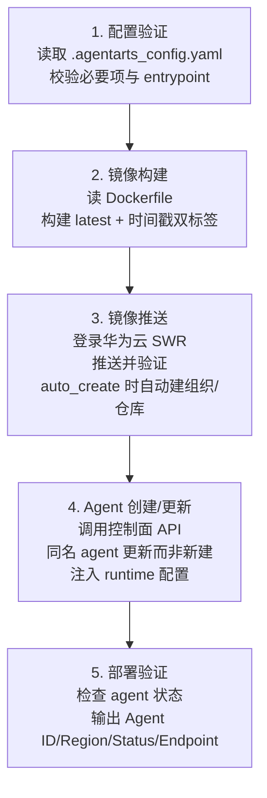
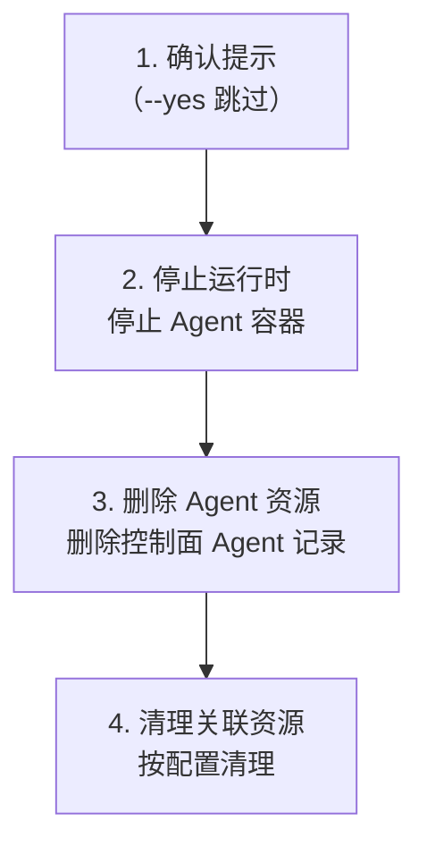

# 部署与远程运维

> `agentarts launch` / `destroy` / `runtime exec-command` 等命令覆盖 Agent 的云端部署与远程运维。
>
> **官方材料基线**：0916《托管与运行智能体》4.6「部署 Agent」、4.7「部署 MCP Server」、4.8「调用运行时」、4.9「会话管理」、4.10「存储配置」、4.12「管理运行时」+ API 参考 4.7「智能体运行时」+《最佳实践》第 5 章「API 调用实践」。
>
> **两种部署路径等价**：**控制台可视化部署**（4.6.2）与 **SDK/CLI 部署**（4.6.3）。控制台路径适合首次接入与排查，SDK/CLI 路径适合 CI/CD。此外还可以**直接调用管理面 REST API**，见第 0 节。


## 0. 管理面 API：不经 CLI 直接创建与管理运行时

> 这是"用 API 的方式创建 runtime"的完整答案。CLI（`agentarts launch`）本质上是这套 API 的封装。

### 0.1 端点与认证

| 平面 | 端点 | 认证 |
| --- | --- | --- |
| 控制面 | `https://agentarts.{region}.myhuaweicloud.com`（可被 `AGENTARTS_CONTROL_ENDPOINT` 覆盖） | **AK/SK 签名** |
| 数据面 | `https://{runtime_name}.{region}...` 或自定义 `AGENTARTS_RUNTIME_DATA_ENDPOINT` | **API Key Bearer** 或 **IAM V11 签名** |

**区域**：0916 仅支持 `cn-southwest-2`。

**IAM 签名注意**：运行时**数据面**接口不支持对请求 body 签名，仅对请求头与查询参数签名验证；其他 AgentArts 接口仍需签 body。签名算法支持 `V11-HMAC-SHA256` 与 `SDK-ECDSA-P256SHA256`。

### 0.2 运行时管理 API 全集（API 参考 4.7.2）

| 操作 | 官方 API | HTTP |
| --- | --- | --- |
| 创建 runtime | `CreateCoreRuntime` | `POST /v1/core/runtimes` |
| 批量查询 runtime | `ListCoreRuntimes` | `GET /v1/core/runtimes` |
| 查询单个 runtime 及指定版本详情 | `ShowCoreRuntime` | `GET /v1/core/runtimes/{runtime_id}` |
| 更新 runtime | `UpdateCoreRuntime` | `PUT /v1/core/runtimes/{runtime_id}` |
| 删除 runtime | `DeleteCoreRuntime` | `DELETE /v1/core/runtimes/{runtime_id}` |
| 查询当前可用的运行时规格 | `ListCoreRuntimeSpecs` | — |

`CreateCoreRuntime` 的能力口径（官方原文）：用于创建 Agent 运行时，支持为该运行时进行**入站认证、网络访问、可观测配置**等；**该接口会同时创建运行时以及对应的初始版本**。适用场景：部署一个已开发完成的 Agent 应用、为 Agent 应用配置入站认证、为 Agent 应用配置入口和出口网络。

**请求体关键字段**：`name`（必填，2–48 字符，小写字母/数字/中划线，小写字母开头、小写字母或数字结尾，同账号下不可重复）、`description`、`artifact_source`（必填）、`identity_configuration`（入站认证配置）、`invoke_config`、`network_config`、`observability`、`storage_config`、`environment_variables`、`agent_gateway_id`、`execution_agency_name`、`arch`、`tags`。

**授权项**：`agentarts:runtime:createCoreRuntime`（Write，资源类型 `runtime`），**依赖授权项**：`iam:agencies:pass`、`vpc:nativePorts:create`、`vpc:routeTables:update`、`eip:publicIps:associateInstance`。条件键包含 `agentarts:AllowIngressPublicAccess`、`agentarts:AllowEgressPublicAccess`。

### 0.3 版本、访问方式与入站网络

| 组 | API | 说明 |
| --- | --- | --- |
| 运行时版本（4.7.3） | `ListCoreRuntimeVersions` | 批量查询版本 |
| 运行时访问方式（4.7.4） | `ListCoreRuntimeEndpoints` / `CreateCoreRuntimeEndpoint` / `ShowCoreRuntimeEndpoint` / `UpdateCoreRuntimeEndpoint` / `DeleteCoreRuntimeEndpoint` | 端点（即"访问方式"）CRUD |
| 入站网络（4.7.5） | `ListCoreIngresses` / `CreateCoreIngress` / `ShowCoreIngress` / `UpdateCoreIngress` / `DeleteCoreIngress` | 网关（入站）CRUD |
| VPC 入站网络（4.7.5） | `CreateCoreIngressNetwork` / `ListCoreIngressNetworks` / `ShowCoreIngressNetwork` / `DeleteCoreIngressNetwork` | VPC 入站网络 |
| 运行时标签（4.7.6） | `ListCoreRuntimeByTags` / `ShowCoreRuntimeNumsByTags` / `BatchCreateCoreRuntimeTags` / `BatchDeleteCoreRuntimeTags` / `ListCoreRuntimeTags` / `ListAllCoreRuntimeTags` | 标签管理 |
| 访问方式标签（4.7.7） | 同上模式（RuntimeEndpoint） | 标签管理 |

### 0.4 用 SDK 代替裸 HTTP（推荐）

SDK 的 `RuntimeClient`（`agentarts.sdk.service.runtime_client`）封装了上述控制面 API，并提供**幂等 upsert**：

```python
from agentarts.sdk.service.runtime_client import RuntimeClient
from agentarts.sdk.utils.constant import get_control_plane_endpoint

client = RuntimeClient(control_endpoint=get_control_plane_endpoint("cn-southwest-2"))

agent = client.create_or_update_agent(
    agent_name="my-agent",
    description="DemoAgent V2 运行时",
    artifact_source_config={
        "url": "swr.cn-southwest-2.myhuaweicloud.com/my-org/my-agent:latest",
        "commands": [],              # 启动命令，最多 10 条
    },
    invoke_config={
        "protocol": "HTTP",          # HTTP | MCP | WEBSOCKET
        "port": 8080,
        "file_transfer_config": {"enabled": False},   # 开启文件上传下载 API
        "url_match_type": "ACCURATE_MATCH",           # ACCURATE_MATCH | PREFIX_MATCH
    },
    identity_config={                # 入站认证：IAM | API_KEY | CUSTOM_JWT
        "authorizer_type": "API_KEY",
        "authorizer_configuration": {"key_auth": {"api_keys": [...]}},
    },
    network_config={"network_mode": "PUBLIC"},        # PUBLIC | VPC
    observability_config={
        "tracing": {"enabled": False},
        "metrics": {"enabled": False},
        "logs": {"enabled": True},
    },
    storage_config={
        "sfs_turbo": [{"sfs_turbo_id": "...", "sfs_path": "/", "mount_path": "/mnt/data", "read_only": False}],
        "session_storage": {"mount_path": "/mnt/session"},
    },
    env_vars=[{"key": "MODEL_NAME", "value": "deepseek-v4-flash"}],
    tags_config=[{"key": "project", "value": "dipu"}],
    agent_gateway_id=None,
    execution_agency_name=None,        # 不传则用默认 DefaultAgentArtsRuntimeAgency
    arch="arm64",                      # arm64 | x86_64 —— 注意官方要求 ARM64
)
```

**`create_or_update_agent` 的 upsert 语义**（读源码确认）：先 `find_agent_by_name`，命中则走 `PUT /v1/core/runtimes/{id}` 更新，否则 `POST /v1/core/runtimes` 创建。**这正是"幂等部署"的实现**——可以在 CI 里无脑重复执行。

其他可用方法：`create_agent` / `update_agent` / `get_agents` / `find_agent_by_name` / `find_agent_by_id` / `delete_agent_by_name`、端点 `create_agent_endpoint` / `update_agent_endpoint` / `delete_agent_endpoint` / `find_agent_endpoint`。

> **`RuntimeClient` 同时承担数据面调用**：`invoke_agent`（`/runtimes/{agent_name}/invocations`）、`exec_command`（`/commands`）、`upload_files`（`/upload-files`）、`download_files`（`/download-files`）、`start_session`（`/sessions-start`）、`stop_session`（`/sessions-stop`）。

### 0.5 数据面 API 全集（API 参考 4.7.1）

| 操作 | 官方 API | 路径 |
| --- | --- | --- |
| 创建运行时会话 | `StartRuntimeSession` | `POST /runtimes/{runtime_name}/sessions-start` |
| 调用运行时 | `ExecuteRuntime` | `POST /runtimes/{runtime_name}/invocations` |
| 调用运行时自定义接口 | `ExecuteRuntimeWithPrefix` | 自定义路径（对应 CLI `--custom-path`） |
| 调用运行时—执行命令 | `ExecuteRuntimeCommands` | `POST /runtimes/{runtime_name}/commands` |
| 上传文件 | `ExecuteRuntimeUploadFiles` | `POST /runtimes/{runtime_name}/upload-files` |
| 下载文件 | `ExecuteRuntimeDownloadFiles` | `GET /runtimes/{runtime_name}/download-files` |
| 停止运行时会话 | `StopRuntimeSession` | `POST /runtimes/{runtime_name}/sessions-stop` |

另有对外集成入口（API 参考 4.1.1）：**`InvokeRuntime`** —— "调用运行时"，用于业务系统直接集成。

**调用时指定访问方式**：`POST https://{域名}/runtimes/{runtime_name}/invocations?endpoint={endpoint_name}`。

### 0.6 最小可跑示例（幂等创建 + 调用）

```python
import os
from agentarts.sdk.service.runtime_client import RuntimeClient
from agentarts.sdk.utils.constant import get_control_plane_endpoint

REGION = "cn-southwest-2"
NAME = "demoagent-v2"

os.environ.setdefault("HUAWEICLOUD_SDK_AK", "<AK>")
os.environ.setdefault("HUAWEICLOUD_SDK_SK", "<SK>")

# 1) 幂等创建/更新运行时（控制面，AK/SK）
client = RuntimeClient(control_endpoint=get_control_plane_endpoint(REGION))
agent = client.create_or_update_agent(
    agent_name=NAME,
    description="DemoAgent V2",
    artifact_source_config={
        "url": f"swr.{REGION}.myhuaweicloud.com/dipu/{NAME}:latest",
        "commands": [],
    },
    invoke_config={"protocol": "HTTP", "port": 8080,
                   "file_transfer_config": {"enabled": True},
                   "url_match_type": "ACCURATE_MATCH"},
    identity_config={"authorizer_type": "API_KEY",
                     "authorizer_configuration": {"key_auth": {"api_keys": []}}},
    network_config={"network_mode": "PUBLIC"},
    observability_config={"logs": {"enabled": True}},
    arch="arm64",
)
print("runtime:", agent.get("id"), agent.get("latest_version"))

# 2) 调用（数据面，API Key 或 IAM 签名）
resp = client.invoke_agent(
    agent_name=NAME,
    payload={"message": "你好"},
    headers={"X-Hw-Agentarts-Session-Id": "session-001"},
)
print(resp)
```

> ⚠️ **`RuntimeClient` 的 `invoke_agent` 走数据面**，需要数据面认证（API Key 或 IAM 签名）。`LocalRuntimeClient` 则用于 `agentarts dev` 的本地调试（`invoke_agent` / `ping_agent`，不打云端）。

## 1. launch：云端部署

### 前置条件

- 已运行 `agentarts config` 生成配置和 Dockerfile
- Docker 已运行
- cloud 模式需 `HUAWEICLOUD_SDK_AK` / `HUAWEICLOUD_SDK_SK`

### 镜像 URL 优先级

部署时镜像 URL 按以下优先级确定：

1. **配置文件 `runtime.artifact_source.url`**（最高优先级）
2. **命令行参数拼接** `swr.{region}.myhuaweicloud.com/{org}/{repo}:{tag}`（`--tag` 默认 `latest`，`--swr-org`/`--swr-repo` 缺省时用配置文件值，再缺省则自动生成）
3. **`--skip-build`** 强制使用配置文件 URL（无 URL 则报错；仅 cloud 模式）

### cloud 模式流程（5 步）



成功输出示例：

```
Agent ID: agent-xxxxx
Region: cn-southwest-2
Status: running
Endpoint: https://agent-xxxxx.cn-southwest-2.myhuaweicloud.com
```

### local 模式流程

构建镜像 → 本地 Docker 运行（`--local-port` 端口映射）。

```bash
agentarts launch --mode local --local-port 8080
```

### --skip-build 适用场景

- 预构建镜像（CI/CD 已构建好）
- 多阶段部署（构建与部署分离）
- 外部镜像仓库（Docker Hub / 阿里云）

```bash
# 先在 CI 构建并推送
docker build -t my-org/my-agent:v1.0 .
docker push my-org/my-agent:v1.0

# 配置使用外部镜像
agentarts config set runtime.artifact_source.url "my-org/my-agent:v1.0"

# 跳过构建直接部署
agentarts launch --skip-build
```

## 2. destroy：销毁部署

**不可逆操作**，默认带确认提示。

```bash
agentarts destroy --agent my-agent --region cn-southwest-2 --yes
```

### 4 步删除流程



### 删除/保留的资源

| 资源 | 处理 |
| --- | --- |
| Agent 运行时 | ✅ 删除 |
| 控制面 Agent 记录 | ✅ 删除 |
| SWR 镜像 | ❌ 保留（需手动清理） |
| 本地配置文件 | ❌ 保留 |
| Memory Space | ❌ 保留（需手动 `agentarts memory delete`） |
| Gateway | ❌ 保留（需手动 `agentarts gateway delete`） |

### 删除前检查清单

- [ ] 确认无活跃会话（`runtime start-session` 创建的）
- [ ] 确认无依赖此 Agent 的上游服务
- [ ] 确认 Memory Space 数据已备份或可删
- [ ] 确认 Gateway Target 无其他 Agent 依赖

## 3. runtime exec-command：远程执行

在运行中的 Agent 容器内执行命令：

```bash
agentarts runtime exec-command "pip list" \
  --agent my-agent \
  --session $session_id \
  --timeout 120 \
  --chunked
```

| 参数 | 说明 |
| --- | --- |
| `command` | 要执行的命令（位置参数，必填） |
| `--agent/-a` | Agent 名称 |
| `--session/-s` | 会话 ID |
| `--chunked` | 启用 `application/x-ndjson` 流式输出 |
| `--timeout` | 默认 60s，**最大 3600s** |
| `--bearer-token/-bt` | Bearer token |
| `--region/-r` | 区域 |
| `--endpoint/-e` | 端点 |
| `--user-id/-u` | OAuth2 出站凭据用户 ID |

**shell 元字符处理**：命令含 shell 元字符时自动包装为 `["sh", "-c", command]`，支持管道、重定向等复杂 shell 逻辑。

```bash
# 简单命令
agentarts runtime exec-command "ls -la /tmp" --agent my-agent

# 复杂 shell（自动 sh -c 包裹）
agentarts runtime exec-command "cat /tmp/data.csv | head -10 | sort" --agent my-agent

# 长执行（最多 3600s）
agentarts runtime exec-command "python /app/long_task.py" --agent my-agent --timeout 3600
```

## 4. 文件传输

### upload-files

```bash
agentarts runtime upload-files \
  --agent my-agent \
  --session $session_id \
  --files ./data.csv \
  --files ./config.json \
  --path /tmp/ \
  --file-mode 0644
```

| 参数 | 说明 |
| --- | --- |
| `--agent/-a` | 必填 |
| `--session/-s` | 必填 |
| `--files/-f` | 可多次使用，指定要上传的文件 |
| `--path/-p` | 目标路径，**必须以 `/` 结尾**，默认 `/tmp/` |
| `--file-user-id` | 文件属主 UID（默认 1000） |
| `--file-group-id` | 文件属组 GID（默认 1000） |
| `--file-mode/-m` | 文件权限（默认 0644） |

约束：
- 单文件最大 **100MB**
- 需 `file_transfer_config.enabled: true`（配置中开启）
- **不支持修改已有 Agent 的 file_transfer_config**，需新建 Agent

### download-files

```bash
agentarts runtime download-files \
  --agent my-agent \
  --session $session_id \
  --path /tmp/output/ \
  --output ./local_output/ \
  --recursive
```

| 参数 | 说明 |
| --- | --- |
| `--path/-p` | 要下载的路径（必填） |
| `--output/-o` | 本地保存路径 |
| `--recursive` | 递归下载目录（打包为 tar） |

`--recursive` 下载目录时走 tar 格式（`application/x-tar`）。

## 5. 会话管理

```bash
# 创建会话
agentarts runtime start-session --agent my-agent --region cn-southwest-2
# 输出: {"session_id": "sess-xxxxx"}

# 在会话中调用
agentarts invoke '{"message": "hello"}' --agent my-agent --session sess-xxxxx

# 停止会话
agentarts runtime stop-session --agent my-agent --session sess-xxxxx
```

会话用于保持 Agent 运行时的状态上下文，同一 session_id 的多次调用共享状态（如 Memory 召回、变量上下文）。

## 6. CI/CD 集成示例

### GitHub Actions 部署

```yaml
name: Deploy Agent
on:
  push:
    tags: ['v*']
jobs:
  deploy:
    runs-on: ubuntu-latest
    env:
      HUAWEICLOUD_SDK_AK: ${{ secrets.HW_AK }}
      HUAWEICLOUD_SDK_SK: ${{ secrets.HW_SK }}
    steps:
      - uses: actions/checkout@v4
      - run: pip install agentarts-sdk
      - run: agentarts config
      - run: agentarts launch --agent my-agent --tag ${{ github.ref_name }}
```

### 定时清理脚本

```bash
#!/bin/bash
# 每周清理旧版本镜像
agentarts runtime exec-command "docker image prune -a --filter 'until=168h'" \
  --agent my-agent --timeout 600
```

## 7. 常见部署问题

| 问题 | 原因 | 解决 |
| --- | --- | --- |
| SWR 推送失败 | AK/SK 无 SWR 权限 | 授予 SWR Admin 权限 |
| Agent 创建失败 | 同名 Agent 已存在且状态异常 | 先 `destroy` 再 `launch` |
| 启动超时 | 镜像过大 / 依赖过多 | 优化 Dockerfile，用多阶段构建 |
| ping 不健康 | handler 启动异常 | `exec-command` 查看容器日志 |
| file_transfer 不生效 | 已有 Agent 不支持修改 | 新建 Agent 并开启 `file_transfer_config.enabled` |
| exec-command 超时 | 默认 60s 不够 | 设置 `--timeout`（最大 3600） |
| `python: exec format error` | 用 x86 机器制作镜像 | **必须用 ARM64（鲲鹏）机器打镜像** |
| 运行时列表"正常"但调用失败 | 控制面状态 ≠ 实例健康 | 检查 `/ping`、LTS 日志与实际调用 |
| 创建 runtime 报委托错误 | `AgentArtsRuntimeDeploymentAgency` 缺失 | 该委托为运行时前提，不可删除，需恢复 |
| 灰度期间调用超时 | 配置了会话存储 + 会话 ID 跨版本 | 灰度验证**使用新的会话 ID** |
| pip install 慢/超时 | 默认源慢 | `pip install agentarts-sdk -i https://repo.huaweicloud.com/repository/pypi/simple --trustedhost repo.huaweicloud.com`；Dockerfile 内亦加镜像源与 `--timeout 100` |
| SWR 基础版不支持 OCI 镜像格式（Docker 27+） | BuildKit OCI media type | `export DOCKER_BUILDKIT=0` 或 `export BUILDKIT_USE_OCI_MEDIA_TYPES=0` |
| 本地无法解析域名 | ECS DNS | 检查 ECS DNS 配置（常见问题 2.4） |
| 拉取基础镜像超时 | 默认 docker.io | 配置 Docker 国内镜像加速器（常见问题 2.3） |

## 8. 部署后验证

```bash
# 1. 健康检查
agentarts invoke '{"message": "ping"}' --agent my-agent
# 或直接 curl
curl https://agent-xxxxx.cn-southwest-2.myhuaweicloud.com/ping

# 2. 功能验证
agentarts invoke '{"message": "test"}' --agent my-agent --session test-session

# 3. 远程检查
agentarts runtime exec-command "env | grep AGENTARTS" --agent my-agent
agentarts runtime exec-command "ls -la /app" --agent my-agent
```

完整验收流程见 [07-operation/field_validation.md](../07-operation/field_validation.md)。

## 9. 版本、访问方式与灰度发布（0916 官方流程）

### 9.1 核心概念

| 概念 | 定义 |
| --- | --- |
| **版本（Versions）** | 运行时的**不可变版本**。每次编辑运行时配置都会产生新版本。单运行时最多 **1,000 个版本** |
| **访问方式（Endpoints）** | 运行时的访问入口，可指向具体版本，或**按权重指向多版本**实现蓝绿/灰度。每运行时最多 **10 个** |
| Latest 默认访问方式 | 系统自动创建，关联最新版本，**无法编辑或删除**，**无法配置灰度策略** |

### 9.2 创建访问方式

控制台：「托管与运行 > 运行时」→ 运行时详情 → 「访问方式」区域 → 「创建访问方式」。

| 参数 | 说明 |
| --- | --- |
| 名称 | 以字母开头、字母或数字结尾，可含字母/数字/中划线，**2–48 字符** |
| 灰度策略 | 开关 + 主要/次要版本流量分配 |
| 版本 | 灰度关闭时选择要交互的版本 |
| 描述 | 0–255 字符，不能含 `<`、`>` |
| 标签 | 最多 20 个，可复用 TMS 预定义标签 |

使用：`POST .../runtimes/{runtime_name}/invocations?endpoint={endpoint_name}`。

### 9.3 灰度发布（0916 官方步骤）

**机制**：流量按权重分发到两个版本，底层通过 **Miracle 沙箱平台的 `PolicyItem` 路由规则**实现；每个版本对应一个沙箱模板，平台按权重路由到对应版本的沙箱实例。未配置灰度时所有流量路由到单一目标版本（权重 1）。

| 约束 | 说明 |
| --- | --- |
| 版本数 | 需**至少 2 个版本**才可启用 |
| 策略数 | 每个访问方式**仅支持一组**灰度策略（1 主要 + 1 次要） |
| 版本互斥 | 主要版本与次要版本不能选同一版本 |
| 权重 | 0–100 整数，**两版本权重之和必须等于 100**（次要版本为 0 时全部下发主要版本） |
| 默认端点 | Latest 默认访问方式无法配置灰度，需**新建访问方式** |
| 会话存储 | **灰度验证必须使用新的会话 ID**，否则会因版本不一致导致调用超时 |

**操作步骤**：

1. **准备新版本**：把新代码打包镜像，部署为运行时新版本（如 v2）
2. **创建灰度访问方式**：开启「灰度策略」→ 选主要/次要版本 → 配流量比例（如 90%/10%）→ 确定
3. **验证新版本**：
   ```bash
   POST https://{域名}/runtimes/{runtime_name}/invocations?endpoint=gray-release
   Headers: X-Hw-Agentarts-Session-Id: new-session-id
   Body: {"message": "测试新版本功能"}
   ```
   观察新版本运行状态与日志
4. **逐步扩大流量**：推荐节奏 90/10 → 70/30 → 50/50 → 20/80，每阶段观察运行状态、日志与监控指标
5. **全量切换**：确认稳定后把主要版本切为新版本（100%）

### 9.4 更新运行时镜像

「托管与运行 > 运行时」→ 运行时列表操作列「编辑」→「来源方式」区域选择目标镜像 → 确定。

> 目标：智能体代码修改后重新打包新镜像上传，确保**更新过程有序、可控**。

## 10. 控制台部署要点（与 SDK 部署等价）

控制台路径：「托管与运行 > 运行时」→ 创建运行时。需配置：

| 配置块 | 要点 |
| --- | --- |
| 来源方式 | 选择 SWR 镜像（对应 `artifact_source`） |
| **权限与访问控制** | **入站身份认证**：IAM / OAuth 2.0 / API Key（含 API Key 名称）；访问 URN 可进入 AgentIdentity 获取 API Key |
| **生命周期配置** | **空闲会话超时**（默认 900s）、**最大存活时间**（默认 86400s） |
| 网络配置 | 公网 / 私网（VPC），对应 `network_config` |
| 存储配置 | SFS Turbo / 会话存储 / OBS，对应 `storage_config` |
| 可观测配置 | 追踪 / 指标 / 日志开关 |
| 环境变量 | 表单编辑或 JSON 两种方式 |
| 启动命令 | 最多 10 条 |
| 标签 | 最多 20 个 |

## 11. 部署 MCP Server（0916 新增）

运行时可托管**智能体代码或 MCP 工具**。部署 MCP Server 的路径：

1. **什么是 MCP Server 部署**（4.7.1）：把 MCP Server 打包为镜像部署到运行时，使运行时以 **MCP 入站协议**对外提供工具能力，供其他 Agent 发现与调用
2. **制作 MCP Server 镜像**（4.7.2）
3. **部署到运行时**（4.7.3）

**价值**：这条路径让"Agent 调用 Agent"标准化——伙伴 Agent 可以把内部能力以 MCP Server 形式托管到运行时，其他 Agent 通过 MCP 协议发现并调用，无需点对点集成。入站协议见 [01-runtime/runtime.md](../01-runtime/runtime.md) 2.5。
