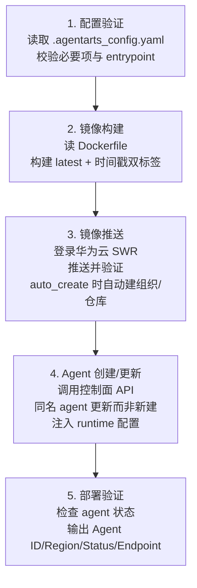
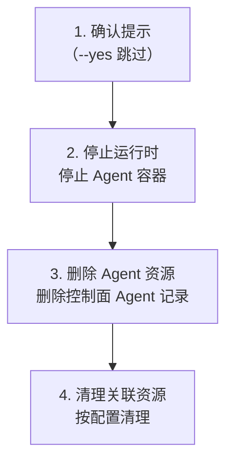

# 部署与远程运维

> `agentarts launch` / `destroy` / `runtime exec-command` 等命令覆盖 Agent 的云端部署与远程运维。

## 1. launch：云端部署

### 前置条件

- 已运行 `agentarts config` 生成配置和 Dockerfile
- Docker 已运行
- cloud 模式需 `HUAWEICLOUD_SDK_AK` / `HUAWEICLOUD_SDK_SK`

### 镜像 URL 优先级

部署时镜像 URL 按以下优先级确定：

1. **配置文件 `runtime.artifact_source.url`**（最高优先级）
2. **命令行参数拼接** `swr.{region}.myhuaweicloud.com/{org}/{repo}:{tag}`（`--tag` 默认 `latest`，`--swr-org`/`--swr-repo` 缺省时用配置文件值，再缺省则自动生成）
3. **`--skip-build`** 强制使用配置文件 URL（无 URL 则报错；仅 cloud 模式）

### cloud 模式流程（5 步）



成功输出示例：

```
Agent ID: agent-xxxxx
Region: cn-southwest-2
Status: running
Endpoint: https://agent-xxxxx.cn-southwest-2.myhuaweicloud.com
```

### local 模式流程

构建镜像 → 本地 Docker 运行（`--local-port` 端口映射）。

```bash
agentarts launch --mode local --local-port 8080
```

### --skip-build 适用场景

- 预构建镜像（CI/CD 已构建好）
- 多阶段部署（构建与部署分离）
- 外部镜像仓库（Docker Hub / 阿里云）

```bash
# 先在 CI 构建并推送
docker build -t my-org/my-agent:v1.0 .
docker push my-org/my-agent:v1.0

# 配置使用外部镜像
agentarts config set runtime.artifact_source.url "my-org/my-agent:v1.0"

# 跳过构建直接部署
agentarts launch --skip-build
```

## 2. destroy：销毁部署

**不可逆操作**，默认带确认提示。

```bash
agentarts destroy --agent my-agent --region cn-southwest-2 --yes
```

### 4 步删除流程



### 删除/保留的资源

| 资源 | 处理 |
| --- | --- |
| Agent 运行时 | ✅ 删除 |
| 控制面 Agent 记录 | ✅ 删除 |
| SWR 镜像 | ❌ 保留（需手动清理） |
| 本地配置文件 | ❌ 保留 |
| Memory Space | ❌ 保留（需手动 `agentarts memory delete`） |
| Gateway | ❌ 保留（需手动 `agentarts gateway delete`） |

### 删除前检查清单

- [ ] 确认无活跃会话（`runtime start-session` 创建的）
- [ ] 确认无依赖此 Agent 的上游服务
- [ ] 确认 Memory Space 数据已备份或可删
- [ ] 确认 Gateway Target 无其他 Agent 依赖

## 3. runtime exec-command：远程执行

在运行中的 Agent 容器内执行命令：

```bash
agentarts runtime exec-command "pip list" \
  --agent my-agent \
  --session $session_id \
  --timeout 120 \
  --chunked
```

| 参数 | 说明 |
| --- | --- |
| `command` | 要执行的命令（位置参数，必填） |
| `--agent/-a` | Agent 名称 |
| `--session/-s` | 会话 ID |
| `--chunked` | 启用 `application/x-ndjson` 流式输出 |
| `--timeout` | 默认 60s，**最大 3600s** |
| `--bearer-token/-bt` | Bearer token |
| `--region/-r` | 区域 |
| `--endpoint/-e` | 端点 |
| `--user-id/-u` | OAuth2 出站凭据用户 ID |

**shell 元字符处理**：命令含 shell 元字符时自动包装为 `["sh", "-c", command]`，支持管道、重定向等复杂 shell 逻辑。

```bash
# 简单命令
agentarts runtime exec-command "ls -la /tmp" --agent my-agent

# 复杂 shell（自动 sh -c 包裹）
agentarts runtime exec-command "cat /tmp/data.csv | head -10 | sort" --agent my-agent

# 长执行（最多 3600s）
agentarts runtime exec-command "python /app/long_task.py" --agent my-agent --timeout 3600
```

## 4. 文件传输

### upload-files

```bash
agentarts runtime upload-files \
  --agent my-agent \
  --session $session_id \
  --files ./data.csv \
  --files ./config.json \
  --path /tmp/ \
  --file-mode 0644
```

| 参数 | 说明 |
| --- | --- |
| `--agent/-a` | 必填 |
| `--session/-s` | 必填 |
| `--files/-f` | 可多次使用，指定要上传的文件 |
| `--path/-p` | 目标路径，**必须以 `/` 结尾**，默认 `/tmp/` |
| `--file-user-id` | 文件属主 UID（默认 1000） |
| `--file-group-id` | 文件属组 GID（默认 1000） |
| `--file-mode/-m` | 文件权限（默认 0644） |

约束：
- 单文件最大 **100MB**
- 需 `file_transfer_config.enabled: true`（配置中开启）
- **不支持修改已有 Agent 的 file_transfer_config**，需新建 Agent

### download-files

```bash
agentarts runtime download-files \
  --agent my-agent \
  --session $session_id \
  --path /tmp/output/ \
  --output ./local_output/ \
  --recursive
```

| 参数 | 说明 |
| --- | --- |
| `--path/-p` | 要下载的路径（必填） |
| `--output/-o` | 本地保存路径 |
| `--recursive` | 递归下载目录（打包为 tar） |

`--recursive` 下载目录时走 tar 格式（`application/x-tar`）。

## 5. 会话管理

```bash
# 创建会话
agentarts runtime start-session --agent my-agent --region cn-southwest-2
# 输出: {"session_id": "sess-xxxxx"}

# 在会话中调用
agentarts invoke '{"message": "hello"}' --agent my-agent --session sess-xxxxx

# 停止会话
agentarts runtime stop-session --agent my-agent --session sess-xxxxx
```

会话用于保持 Agent 运行时的状态上下文，同一 session_id 的多次调用共享状态（如 Memory 召回、变量上下文）。

## 6. CI/CD 集成示例

### GitHub Actions 部署

```yaml
name: Deploy Agent
on:
  push:
    tags: ['v*']
jobs:
  deploy:
    runs-on: ubuntu-latest
    env:
      HUAWEICLOUD_SDK_AK: ${{ secrets.HW_AK }}
      HUAWEICLOUD_SDK_SK: ${{ secrets.HW_SK }}
    steps:
      - uses: actions/checkout@v4
      - run: pip install agentarts-sdk
      - run: agentarts config
      - run: agentarts launch --agent my-agent --tag ${{ github.ref_name }}
```

### 定时清理脚本

```bash
#!/bin/bash
# 每周清理旧版本镜像
agentarts runtime exec-command "docker image prune -a --filter 'until=168h'" \
  --agent my-agent --timeout 600
```

## 7. 常见部署问题

| 问题 | 原因 | 解决 |
| --- | --- | --- |
| SWR 推送失败 | AK/SK 无 SWR 权限 | 授予 SWR Admin 权限 |
| Agent 创建失败 | 同名 Agent 已存在且状态异常 | 先 `destroy` 再 `launch` |
| 启动超时 | 镜像过大 / 依赖过多 | 优化 Dockerfile，用多阶段构建 |
| ping 不健康 | handler 启动异常 | `exec-command` 查看容器日志 |
| file_transfer 不生效 | 已有 Agent 不支持修改 | 新建 Agent 并开启 `file_transfer_config.enabled` |
| exec-command 超时 | 默认 60s 不够 | 设置 `--timeout`（最大 3600） |

## 8. 部署后验证

```bash
# 1. 健康检查
agentarts invoke '{"message": "ping"}' --agent my-agent
# 或直接 curl
curl https://agent-xxxxx.cn-southwest-2.myhuaweicloud.com/ping

# 2. 功能验证
agentarts invoke '{"message": "test"}' --agent my-agent --session test-session

# 3. 远程检查
agentarts runtime exec-command "env | grep AGENTARTS" --agent my-agent
agentarts runtime exec-command "ls -la /app" --agent my-agent
```

完整验收流程见 [07-operation/field_validation.md](../07-operation/field_validation.md)。
