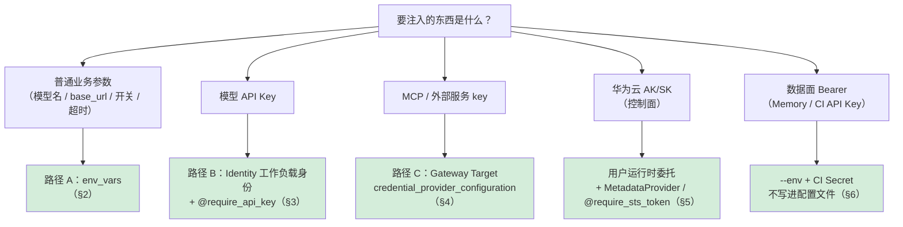

# Runtime 环境变量注入（Environment Variable Injection）

> **信息来源说明（务必先读）**：本文混合两类信息，正文用徽标区分，**不可混用**。
>
> - 🟢 **【官方】** —— 已从 `AgentArts原始材料-0916` 或 SDK 源码检索到原文依据，含分册与章节位置。
> - 🟡 **【需求方输入】** —— 来自项目需求方与架构设计推导，**尚未在 0916 官方材料中检索到对应条目**，属于待补充确认项，不得作为官方能力对外承诺。
>
> **官方材料基线**：0916《托管与运行智能体》4.1（运行时配置项）、4.4.2（入站身份认证）、4.10（委托）；《API 参考》`POST /v1/core/runtimes` 请求体 `environment_variables` 字段；SDK `agentarts-sdk-python` v0.1.6 `RuntimeClient.create_or_update_agent` / `update_agent` 签名；`toolkit/cli/runtime/config.py` 的 `set-env` / `remove-env` / `list-env` 子命令。

## 0. 一句话结论

**不是所有"变量"都该塞进 `env_vars`**。按变量类型分三条路径：

| 变量类型 | 推荐路径 | 为什么不直接塞 env_vars |
|---|---|---|
| **模型 API Key**（OpenAI / DeepSeek 等） | **Identity 工作负载身份** + `@require_api_key` 装饰器（§3） | 凭据不落盘、可轮换、可审计；env_vars 会写进运行时配置明文 |
| **MCP / 外部能力 key** | **Gateway Target 的 `credential_provider_configuration`**（§4） | 密钥不进 Agent 代码；换后端 / 轮换密钥不用重新部署 Agent |
| **普通业务参数**（模型名、base_url、开关、超时） | **`env_vars`**（§2） | 本就是非敏感配置，env_vars 是正确位置 |
| **华为云 AK/SK**（控制面） | **绝不进 Runtime**——由"用户运行时委托"自动取临时凭证（§5） | identity.md 第 6 节明确："伙伴侧不需要（也不应该）把 AK/SK 塞进运行时的环境变量" |

## 1. env_vars 的官方契约 🟢

### 1.1 请求体字段

| 项 | 官方口径 | 位置 |
|---|---|---|
| 字段名 | `environment_variables` | API 参考 `POST /v1/core/runtimes` 请求体 |
| SDK 参数 | `env_vars: list[dict] \| None`，元素形如 `{"key": "K", "value": "V"}` | `RuntimeClient.create_agent` / `update_agent` / `create_or_update_agent` |
| 配置文件段 | `.agentarts_config.yaml` 的 `runtime.environment_variables`（dict 形式） | scaffolding.md §4 |
| CLI 管理 | `agentarts config set-env <k> <v>` / `remove-env` / `list-env` | cli_reference.md §6.1 |
| 部署时覆盖 | `agentarts deploy --env KEY=VALUE`（可多次；**优先级高于配置文件**） | cli_reference.md §3 |
| 运行时配置项归属 | "环境变量（表单 / JSON）、启动命令（最多 10 条）、存储扩展、标签（最多 20 个）" | 托管与运行智能体 4.1 |

### 1.2 SDK 调用示例 🟢

```python
from agentarts.sdk.service.runtime_client import RuntimeClient

client = RuntimeClient(control_endpoint=get_control_plane_endpoint("cn-southwest-2"))

agent = client.create_or_update_agent(
    agent_name="my-agent",
    artifact_source_config={"url": "swr.cn-southwest-2.myhuaweicloud.com/my-org/my-agent:latest"},
    invoke_config={"protocol": "HTTP", "port": 8080,
                   "file_transfer_config": {"enabled": False},
                   "url_match_type": "ACCURATE_MATCH"},
    env_vars=[
        {"key": "MODEL_NAME",         "value": "deepseek-v4-flash"},
        {"key": "OPENAI_BASE_URL",    "value": "https://api.example.com/v1"},
        {"key": "RUNTIME_AS_SANDBOX_TOOL", "value": "true"},
    ],
    # ...
)
```

### 1.3 配置文件形式 🟢

```yaml
# .agentarts_config.yaml
agents:
  my-agent:
    runtime:
      environment_variables:
        OPENAI_MODEL_NAME: gpt-4o-mini
        OPENAI_BASE_URL: ""
        # 敏感值留空，由部署时 --env 或 Secret 覆盖
```

### 1.4 部署时临时覆盖 🟢

```bash
agentarts deploy --env OPENAI_API_KEY=sk-xxx --env ANOTHER_KEY=yyy
# --env 优先级高于配置文件；同名 key 会被 --env 覆盖
```

### 1.5 验证注入是否生效 🟢

```bash
agentarts runtime exec-command "env | grep AGENTARTS" --agent my-agent
agentarts runtime exec-command "env | grep MODEL_NAME"  --agent my-agent
```

## 2. 路径 A：普通业务参数 → env_vars 🟢

**适用**：模型名、base_url、功能开关、超时、路径等**非敏感**配置。

```python
env_vars=[
    {"key": "MODEL_NAME",            "value": "deepseek-v4-flash"},
    {"key": "OPENAI_BASE_URL",       "value": "https://api.example.com/v1"},
    {"key": "RUNTIME_AS_SANDBOX_TOOL", "value": "true"},
    {"key": "AGENTARTS_MEMORY_SPACE_ID", "value": "space-xxx"},   # 见 §6 关于 Space ID 的说明
]
```

CLI 等价操作：

```bash
agentarts config set-env MODEL_NAME deepseek-v4-flash
agentarts config set-env RUNTIME_AS_SANDBOX_TOOL true
agentarts config list-env
agentarts config remove-env MODEL_NAME
```

> ⚠️ **关键约束**：`env_vars` 会出现在运行时配置里，**不要放任何明文密钥**。敏感值要么留空 + 部署时用 `--env` 从 CI Secret 注入，要么走 §3 / §4。

## 3. 路径 B：模型凭证 → Identity 工作负载身份 🟢

**适用**：OpenAI / DeepSeek 等模型 API Key。**这是 V2 架构推荐的标准做法**，参考实现见 `demo/identity.py`。

### 3.1 一次性 bootstrap：把模型 key 存进 Identity 服务

```python
from agentarts.sdk import IdentityClient

client = IdentityClient(region="cn-southwest-2")
client.create_api_key_credential_provider(
    name="demoagent-llm-key",
    api_key="sk-xxx",        # 明文只在此处出现一次，之后由平台托管
)
client.create_workload_identity(name="demoagent-workload")
```

### 3.2 业务代码：装饰器自动注入，代码里永远看不到明文

```python
from agentarts.sdk import require_api_key, AgentArtsRuntimeContext

@require_api_key(provider_name="demoagent-llm-key")
def call_llm(api_key: str | None = None) -> str:
    # api_key 由装饰器自动注入，函数签名里只是占位
    from openai import OpenAI
    return OpenAI(api_key=api_key).chat.completions.create(...).choices[0].message.content
```

### 3.3 本地调试：换工作负载令牌写进上下文

```python
token = client.create_workload_access_token(workload_name="demoagent-workload", user_id=actor_id)
AgentArtsRuntimeContext.set_workload_access_token(token)
# 之后 call_llm() 即可，装饰器从 contextvars 取令牌
```

### 3.4 已部署到 Runtime 时

工作负载令牌由请求头 `X-HW-AgentGateway-Workload-Access-Token` 注入（由 AgentArts 网关注入），**完全不需要 env_vars**。未配置 Identity 时回落 `OPENAI_API_KEY` 环境变量（降级路径，见 §7）。

### 3.5 为什么不塞 env_vars

| 维度 | env_vars 直注 | Identity 工作负载身份 |
|---|---|---|
| 凭据落盘 | ❌ 写进运行时配置明文 | ✅ 不落盘，平台托管 |
| 轮换 | 改配置 + 重新部署 | 在 Identity 侧更新，Agent 无感 |
| 审计 | 只能看运行时配置变更 | 凭据访问有独立审计链路 |
| 多 Agent 共享 | 每个 Agent 各存一份 | 同一 provider 可被多 Agent 引用 |
| 权限收窄 | 全有或全无 | 工作负载身份可限定可访问的 provider |

## 4. 路径 C：MCP / 外部能力 key → Gateway Target 凭据 🟢

**适用**：MCP Server key、外部 REST API key、第三方服务凭据。**密钥不进 Agent 代码，Agent 侧只配 `agent_gateway_id`**。

```python
from agentarts.sdk import GatewayClient

gw_client = GatewayClient()
gw = gw_client.create_gateway(
    name="demoagent-gw",
    authorizer_type="iam",                          # 入站认证
    log_delivery_configuration={"enabled": True},   # 调用日志投递 LTS
)
gateway_id = gw.data["gateway_id"]

# 把外部服务的 key 挂在 Target 上，不进 Agent env_vars
gw_client.create_gateway_target(
    gateway_id=gateway_id,
    name="ext-search-svc",
    target_configuration={"mcp_server": {"endpoint": "https://ext-svc/mcp",
                                         "server_type": "sse"}},
    credential_provider_configuration={
        "credential_provider_type": "api_key",
        "api_key": "ext-svc-key-xxx",
    },
)
```

Agent 侧只把 `agent_gateway_id` 传给 `create_or_update_agent`：

```python
agent = client.create_or_update_agent(
    agent_name="my-agent",
    agent_gateway_id=gateway_id,     # 只引用，不带 key
    # env_vars 里不放任何外部服务 key
    ...
)
```

**官方价值**（gateway.md §60 原话）：出站认证把后端凭证集中管理在网关侧。Agent 只需携带网关的入站认证，**Agent 代码中不出现后端服务凭证**。解决三个问题：① 凭证硬编码泄露风险；② 换后端 / 轮换密钥无需改 Agent 代码重新部署；③ 多 Agent 调同一后端不必重复配置凭证。

## 5. 华为云 AK/SK：绝不进 Runtime env_vars 🟢

### 5.1 官方红线

> identity.md 第 6 节：**"伙伴侧不需要（也不应该）把 AK/SK 塞进运行时的环境变量。正确做法是让运行时通过用户运行时委托自动获得临时凭据——凭据不落盘、随委托权限收窄、可随时吊销。"**

### 5.2 正确做法

| 场景 | 做法 |
|---|---|
| 控制面操作（创建 / 更新 Runtime、Space、Gateway） | AK/SK 放在**部署机器**的环境变量 `HUAWEICLOUD_SDK_AK` / `HUAWEICLOUD_SDK_SK`，或 CI Secret，**不进 Runtime 容器** |
| Runtime 内访问华为云资源（OBS / ECS / ModelArts） | 用"用户运行时委托" + `MetadataProvider` 自动取 STS 临时凭证，或 `@require_sts_token(policy=...)` |
| Memory / Code Interpreter 数据面 | 用 Space 级 API Key（`HUAWEICLOUD_SDK_MEMORY_API_KEY` / `HUAWEICLOUD_SDK_CODE_INTERPRETER_API_KEY`），**这些是数据面 Bearer，不是 AK/SK**，可以进 env_vars 但建议走 Secret |

### 5.3 为什么区分

AK/SK 是**账户级根凭据**，泄露等于整个云账户失陷；数据面 API Key 是**资源级 Bearer**，权限仅限单个 Space / Interpreter，泄露影响可控。两者安全等级不同，处理方式不同。

## 6. 数据面 API Key（Memory / Code Interpreter）的注入 🟡

Memory Space 和 Code Interpreter 各有一个数据面 API Key，属于"资源级 Bearer"，**可以**进 env_vars，但仍建议走 Secret 管理。

| 变量 | 用途 | 获取方式 | 推荐注入方式 |
|---|---|---|---|
| `AGENTARTS_MEMORY_SPACE_ID` | Memory Space 标识 | `agentarts memory create` 返回 | env_vars（非敏感，仅是 ID） |
| `HUAWEICLOUD_SDK_MEMORY_API_KEY` | Memory 数据面 Bearer | 创建 Space 时**仅返回一次** | `agentarts deploy --env` 从 CI Secret 注入；不写进 `.agentarts_config.yaml` 提交 git |
| `HUAWEICLOUD_SDK_CODE_INTERPRETER_API_KEY` | Code Interpreter 数据面 Bearer | 控制台 / `CodeInterpreter.create_code_interpreter` | 同上 |
| `AGENTARTS_CODEINTERPRETER_DATA_ENDPOINT` | Code Interpreter 端点 | 创建时返回 | env_vars（非敏感，端点 URL） |

> 🟡 **需求方输入**：是否可用 Identity 工作负载身份统一管理这两个数据面 Bearer，0916 官方材料未检索到明确条目。当前参考实现（`demo/bootstrap.py`）的做法是 bootstrap 时写回 `.env`，部署时由 `--env` 覆盖。

## 7. 降级与未配置行为 🟡

当 Identity / Gateway 未配置时，参考实现的降级约定（`demo/config.py` 的 `capabilities()`）：

| 未配置项 | 降级行为 | 回落到的 env_vars |
|---|---|---|
| Identity 工作负载身份 | 模型凭据回落 `OPENAI_API_KEY` | `OPENAI_API_KEY`（仅降级用，生产不应依赖） |
| Gateway | 无外部能力路由，相关工具不暴露 | —— |
| Memory Space | checkpointer 退回进程内 `InMemorySaver`；不召回 | —— |
| Code Interpreter | 不暴露 `execute_python` 工具 | —— |
| 用户身份请求头 | 使用静态 `AGENTARTS_DEMO_ACTOR_ID`（默认 `demo-user`） | `AGENTARTS_DEMO_ACTOR_ID` |

> 工具失败以 `{"ok": false, "error": ...}` 返回而非抛出，让模型能向用户解释并自我恢复。

## 8. 不可变项与创建时一次定好的字段 🟢

> runtime.md 边界 4：**`file_transfer_config` 与 `identity_configuration` 创建后不可修改，需新建实例。**

这意味着：

| 字段 | 可否后续修改 |
|---|---|
| `env_vars` | ✅ 可修改（`update_agent` 会覆盖） |
| `tags` | ✅ 可修改 |
| `invoke_config.file_transfer_config.enabled` | ❌ 创建时定好 |
| `identity_configuration`（入站认证方式） | ❌ 创建时定好 |
| `storage_config` | ✅ 可修改（但 SFS Turbo 挂载变更需注意数据连续性） |

> ⚠️ **`create_or_update_agent` 的已知疏漏**：update 分支未透传 `identity_config`（见 SDK `runtime_client.py:484-497`）。在"第一次建、之后更新"的幂等语义下，**身份配置只在首次创建时生效，后续更新改不动它**——但这与"创建后不可修改"的官方约束一致，不算 bug，而是设计上就不应该通过 update 改身份配置。要改只能新建实例。

## 9. CI/CD 注入最佳实践 🟢

### 9.1 GitHub Actions 示例

```yaml
name: Deploy Agent
on:
  push:
    tags: ['v*']
jobs:
  deploy:
    runs-on: ubuntu-latest
    env:
      # 控制面 AK/SK：只在部署机器，不进 Runtime 容器
      HUAWEICLOUD_SDK_AK: ${{ secrets.HW_AK }}
      HUAWEICLOUD_SDK_SK: ${{ secrets.HW_SK }}
    steps:
      - uses: actions/checkout@v4
      - run: pip install agentarts-sdk
      - run: agentarts config
      # 部署时把数据面 Bearer 从 CI Secret 注入，不写进配置文件
      - run: |
          agentarts deploy --agent my-agent --tag ${{ github.ref_name }} \
            --env HUAWEICLOUD_SDK_MEMORY_API_KEY=${{ secrets.MEMORY_API_KEY }} \
            --env HUAWEICLOUD_SDK_CODE_INTERPRETER_API_KEY=${{ secrets.CI_API_KEY }}
```

### 9.2 原则清单

1. **AK/SK 只在部署机器**——`HUAWEICLOUD_SDK_AK` / `SK` 走 CI Secret，不传进 Runtime `env_vars`
2. **模型 key 走 Identity**——bootstrap 一次性存入，业务代码用 `@require_api_key`
3. **外部服务 key 走 Gateway Target**——`credential_provider_configuration`，Agent 侧只引用 `agent_gateway_id`
4. **数据面 Bearer 走 `--env` + Secret**——不写进 `.agentarts_config.yaml` 提交 git
5. **非敏感参数走 env_vars**——模型名、base_url、开关等可写进配置文件
6. **验证注入**——部署后 `agentarts runtime exec-command "env | grep <KEY>"` 确认

## 10. 决策流程图



## 11. 最小落地组合（参考实现视角）

假设 DemoAgent 需要：一个模型 key、一个外部 MCP key、一个模型名参数。最干净的做法：

```python
# bootstrap（一次性，demo/bootstrap.py）
from agentarts.sdk import IdentityClient, GatewayClient

IdentityClient(region=...).create_api_key_credential_provider(
    "demoagent-llm-key", api_key="sk-xxx")

gw = GatewayClient(...).create_gateway(name="demoagent-gw", authorizer_type="iam")
GatewayClient(...).create_gateway_target(
    gateway_id=gw.data["gateway_id"], name="ext-mcp",
    target_configuration={"mcp_server": {...}},
    credential_provider_configuration={"credential_provider_type": "api_key",
                                       "api_key": "mcp-key-xxx"})
```

```python
# 业务代码
from agentarts.sdk import require_api_key

@require_api_key(provider_name="demoagent-llm-key")
def call_llm(api_key=None):
    ...
```

```bash
# 部署（只放非敏感参数 + 数据面 Bearer）
agentarts config set-env OPENAI_MODEL_NAME deepseek-v4-flash
agentarts deploy --agent my-agent \
  --env HUAWEICLOUD_SDK_MEMORY_API_KEY=$MEMORY_API_KEY
```

**结果**：模型 key 走 Identity、MCP key 走 Gateway、模型名走 env_vars、数据面 Bearer 走 `--env` + Secret——四类各归其位，代码里 0 明文密钥，轮换密钥不用重新部署 Agent。

## 12. 常见错误与对策

| 错误 | 后果 | 对策 |
|---|---|---|
| 把模型 API Key 写进 `.agentarts_config.yaml` 提交 git | 密钥泄露 | 走 §3 Identity，或留空 + `--env` 从 Secret 注入 |
| 把华为云 AK/SK 塞进 Runtime env_vars | 账户级凭据落盘 | 走 §5 用户运行时委托 |
| 把 MCP key 塞进 Agent env_vars | 换后端要重新部署 Agent | 走 §4 Gateway Target |
| 用 `update_agent` 改 `identity_configuration` | 静默失败（不可变项） | 新建实例 |
| 同名 env_var 在配置文件和 `--env` 都写了，以为用配置文件的 | 实际用 `--env` 的（优先级高） | 知道优先级：`--env` > 配置文件 |
| 部署后不验证 | 变量没注入成功但没人发现 | `agentarts runtime exec-command "env \| grep <KEY>"` |
| 以为 `env_vars` 里放 `OPENAI_API_KEY` 就是生产配置 | 走的是降级路径，无审计无轮换 | 生产应走 §3 Identity；`OPENAI_API_KEY` 仅作本地调试降级 |

## 13. 参考资料

- [01-runtime/runtime.md](../01-runtime/runtime.md) §9 CLI、§10 伙伴 Agent 适配关注
- [05-identity/identity.md](../05-identity/identity.md) §6 委托与"不应把 AK/SK 塞进运行时环境变量"、§3 三种出站凭证流程
- [04-gateway/gateway.md](../04-gateway/gateway.md) §8「伙伴适配要点」中"密钥不进 Agent 代码"的设计价值（§5.0 出站认证方式为其实现机制）
- [08-code-dev/deployment.md](../08-code-dev/deployment.md) §0.4 `create_or_update_agent` 的 `env_vars` 参数、§6 CI/CD 集成
- [08-code-dev/scaffolding.md](../08-code-dev/scaffolding.md) §4 `.agentarts_config.yaml` 结构（`runtime.environment_variables`）
- [08-code-dev/cli_reference.md](../08-code-dev/cli_reference.md) §3 `--env` 优先级、§6.1 `config set-env` / `remove-env` / `list-env`
- [10-security/agent_security.md](agent_security.md) §2.3 "密钥不落代码"的官方口径
- 参考实现：`Langgraph-agentarts-demo/demo/identity.py`、`demo/bootstrap.py`、`.agentarts_config.yaml`
