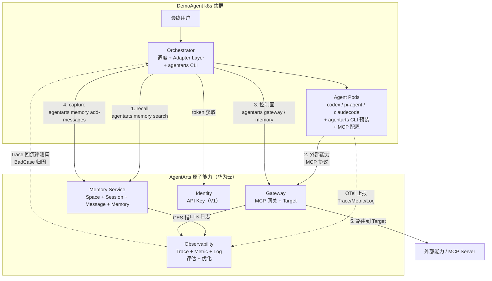
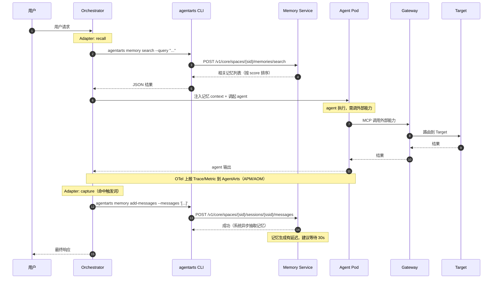
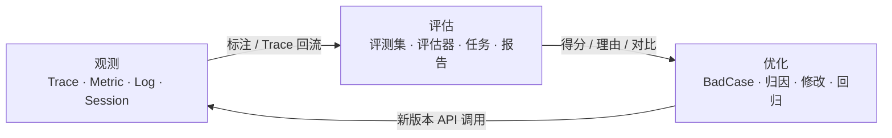
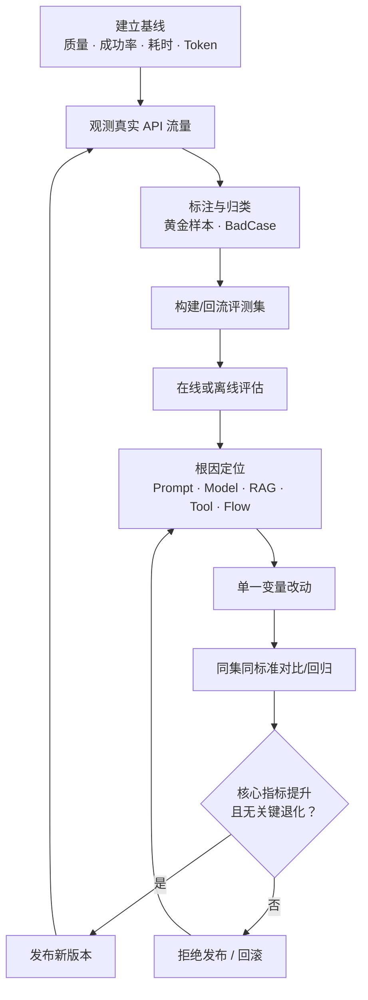

# AgentArts × DemoAgent V1 整体合作架构设计

> ⚠️ **已被取代（历史基线，勿作为设计依据）**：本文档的官方事实来源是 `AgentArts原始材料-0804`（文档版本 02，2026-08-04），该材料**已过期**。最新架构结论见 [整体架构设计v3.md](整体架构设计v3.md)（事实来源 `AgentArts原始材料-0916`）；V2 见 [整体架构设计v2.md](整体架构设计v2.md)。本文档仅保留为演进过程记录。
>
> 本文档是 AgentArts 与 DemoAgent 在 V1 阶段的合作方案设计。基于 [AgentArts 平台架构](../AgentArts_Agent平台Wiki知识包/00-overview/platform_architecture.md) 与 [伙伴 Agent 联合开发适配指南](../AgentArts_Agent平台Wiki知识包/06-integration/partner_agent_adaptation.md)，结合 DemoAgent 产品形态落地。锚点 SDK：`agentarts-sdk-python` v0.1.4（Python 3.10+，包名 `agentarts-sdk`）。

## 1. 文档定位与范围

### 1.1 目标

V1 阶段，AgentArts 以**原子能力**形式接入 DemoAgent 通用 agent 应用。AgentArts 不托管 DemoAgent 的 agent，只提供 Memory / Gateway / Identity 三项云上原子能力；DemoAgent 在自有 k8s 运行时中通过 Adapter Layer 调用这些能力。

### 1.2 范围

| 维度 | V1 是否包含 | 说明 |
|---|---|---|
| Memory 原子能力 | ✅ 包含 | 长期记忆 recall / capture（session + message + memory） |
| Gateway 原子能力 | ✅ 包含 | 外部能力 MCP 路由 + 授权 |
| Identity 原子能力 | ✅ 轻量包含 | 仅 API Key 级，不接 STS / OAuth2 3LO |
| Observability（观测） | ✅ 轻量包含 | 第三方 OTel 接入：Trace/Metric/Log 上报到 AgentArts；Memory CES 指标 + Gateway LTS 日志 |
| Evaluation（评估） | ✅ 轻量包含 | 评测集 + 评估器 + 在线/离线评估任务，对 agent 输出量化打分 |
| Optimization（优化） | ✅ 轻量包含 | BadCase 归因 + 单一变量改动 + 对比回归门禁 |
| Sandbox（Code Interpreter） | ❌ 排除 | V1 不接入安全代码执行 |
| AgentArts Runtime 托管 | ❌ 排除 | DemoAgent 自有 k8s 运行时 |
| AgentArts 控制面 SDK 嵌入 | ❌ 排除 | 统一走 CLI，不把 Python SDK 嵌入 DemoAgent 代码 |

### 1.3 关键决策

| 决策项 | 选择 | 理由 |
|---|---|---|
| Memory 接入方式 | **CLI** | 不改 codex / pi-agent / claudecode 内部代码，统一命令行接入，Adapter 侧 shell out |
| Runtime 归属 | **DemoAgent k8s** | DemoAgent 已有 k8s + 内置 agent 镜像，V1 不引入 AgentArts Runtime 做二次托管 |
| Sandbox | **排除** | V1 聚焦记忆与外部能力接入，安全执行留待 V2 |
| AgentArts 能力形态 | **原子能力** | AgentArts 只作为云上服务被调用，不接管 DemoAgent agent 生命周期 |
| 控制面接入 | **`agentarts` CLI** | Space / Gateway / Target 资源管理走 CLI |
| 数据面接入 | **CLI + MCP 协议** | Memory 走 CLI wrapper，Gateway 走 MCP 直连 |
| 可观测性 | **第三方 OTel 接入 + 平台消费** | DemoAgent agent 是非 AgentArts 第三方智能体，走观测 OpenAPI 上报 Trace/Metric/Log；评估/优化用平台原生能力消费 |

## 2. 双方定位

### 2.1 合作模型

```
DemoAgent（伙伴，业务智能）
        ↓  Adapter Layer（按平台规范适配）
AgentArts（平台，原子能力）
```

DemoAgent 最懂自己的业务逻辑与 agent 行为；AgentArts 提供企业级基础设施。Adapter Layer 把"DemoAgent 的 agent turn"包装为"对 AgentArts 原子能力的标准调用"，DemoAgent 代码改动最小。

### 2.2 职责边界

| 维度 | DemoAgent（伙伴） | AgentArts（平台） |
|---|---|---|
| Agent 进程 | codex / pi-agent / claudecode 镜像维护 | 不托管 |
| 运行时 | k8s Orchestrator + Agent Pods | 不参与 |
| 业务智能 | Agent 行为、领域知识、工作流 | 不参与 |
| 长期记忆 | 消费方（recall / capture） | Memory Service 提供方 |
| 外部能力路由 | 消费方（MCP 调用） | Gateway + Target 提供方 |
| 身份授权 | 消费方（token 注入） | Identity Service 提供方 |
| 安全执行 | V1 不涉及 | Sandbox（V1 排除） |
| 资源管理 | 消费方（CLI 调控制面） | Space / Gateway CRUD 提供方 |
| 日志与指标 | 消费方（聚合 + 告警） | LTS 日志 + CES 指标提供方 |

### 2.3 RACI

| 工作 | DemoAgent | AgentArts 开发负责人 |
|---|---|---|
| 业务场景定义 | R/A | C |
| Agent 镜像维护 | R/A | I |
| Orchestrator + Adapter 开发 | R/A | C |
| Memory Space / Gateway 创建 | C | R/A |
| CLI 扩展（memory session/message/search） | C | R/A |
| MCP 配置接入 | R/A | C |
| 可观测配置（OTel 接入/日志开关） | R/A | C |
| 评测集与评估器设计 | R/A | C |
| 评估任务执行与报告 | R | A |
| BadCase 归因与优化 | R | C |
| 实验局设计 | R | A |
| 问题闭环 | R | A |

## 3. 整体架构

### 3.1 架构总图



### 3.2 一次完整 Agent turn 的数据流



> Trace 经 OTel 上报后可用于评估（在线评估采样）与优化（BadCase 反查 `trace_id`）。详见 §4.4.2 与 §4.6.2。

### 3.3 三条接入路径

| 路径 | 触发方 | 调用方式 | 用途 |
|---|---|---|---|
| 自动 recall | Orchestrator（agent turn 前） | shell out `agentarts memory search` | 把相关记忆注入 agent context |
| 自动 capture | Orchestrator（agent turn 后） | shell out `agentarts memory add-messages` | 把本轮消息写入 Memory，后端异步抽取长期记忆 |
| 外部能力调用 | Agent 进程（执行中） | MCP 协议直连 Gateway | 调外部 API / MCP Server |

> **关键修正**：AgentArts Memory 的数据面模型是"写消息 → 后端异步抽取记忆 → 语义检索记忆"，而非"直接 store 一条记忆"。capture 阶段写入的是 `TextMessage`，长期记忆由平台异步生成；recall 阶段检索的是抽取后的 `memory`。详见 [4.1.2](#412-数据面-session--message--memory-需扩展-cli)。

## 4. 原子能力接入设计

### 4.1 Memory 接入（CLI）

Memory 严格区分控制面与数据面，CLI 接入也分两层。

#### 4.1.1 控制面：Space 管理（AK/SK）

用 `agentarts memory` CLI 做 Space CRUD，由运维或 Orchestrator 启动时一次性调用：

```bash
# 创建 Space（AK/SK 认证）
agentarts memory create "demoagent-agentarts-memory" \
  --strategies semantic,episodic,user_preference \
  --ttl 720 \
  --region cn-southwest-2 \
  --output json
# 返回 space_id 和 api_key（api_key 仅此一次可见，妥善保存）

# 查询 / 列表 / 状态
agentarts memory get <space_id> --region cn-southwest-2
agentarts memory list --region cn-southwest-2
agentarts memory status <space_id>
```

环境变量：
```bash
export HUAWEICLOUD_SDK_AK="..."        # 控制面
export HUAWEICLOUD_SDK_SK="..."        # 控制面
export AGENTARTS_MEMORY_SPACE_ID="..." # 数据面
export AGENTARTS_MEMORY_API_KEY="..."  # 数据面（即 HUAWEICLOUD_SDK_MEMORY_API_KEY）
```

#### 4.1.2 数据面：session / message / memory（需扩展 CLI）

> **Gap 说明**：当前 `agentarts memory` CLI 只覆盖控制面 Space CRUD，**没有**数据面 `create-session / add-messages / search / get / list / get-last-k-messages` 子命令。V1 需基于 `MemoryClient` 扩展这些子命令，保持"CLI 接入"的统一形态。

数据面三段式模型：

| 阶段 | 操作 | 说明 |
|---|---|---|
| 1. 会话 | `create-session` | 绑定 `actor_id` + `assistant_id`，返回 `session_id` |
| 2. 消息 | `add-messages` | 写入 `TextMessage` / `ToolCallMessage` / `ToolResultMessage`；**触发后端异步抽取记忆** |
| 3. 记忆 | `search` / `get` / `list` / `get-last-k-messages` | 检索抽取后的长期记忆，或取回最近 k 条原始消息 |

扩展子命令设计：

```bash
# 创建会话（数据面，需 API Key）
agentarts memory create-session \
  --space-id "$AGENTARTS_MEMORY_SPACE_ID" \
  --api-key "$AGENTARTS_MEMORY_API_KEY" \
  --actor-id "user-001" \
  --assistant-id "demoagent-agent" \
  --output json
# → {"session_id": "sess-xxx"}

# 写入消息（capture 的实际动作；触发后端异步抽取记忆）
agentarts memory add-messages \
  --space-id "$AGENTARTS_MEMORY_SPACE_ID" \
  --api-key "$AGENTARTS_MEMORY_API_KEY" \
  --session-id "$SESSION_ID" \
  --messages '[{"role":"user","content":"...","actor_id":"user-001"},
               {"role":"assistant","content":"...","assistant_id":"demoagent-agent"}]'
# → 写入成功；记忆生成有延迟，建议等待 30s 再检索

# 语义检索（recall）
agentarts memory search \
  --space-id "$AGENTARTS_MEMORY_SPACE_ID" \
  --api-key "$AGENTARTS_MEMORY_API_KEY" \
  --query "用户问题" \
  --top-k 5 \
  --min-score 0.5 \
  --strategy-type episodic \
  --session-id "$SESSION_ID" \
  --output json
# → {"records": [{"id", "content", "score", "strategy_type", ...}]}

# 取回最近 k 条原始消息（用于上下文续接 / Long Loop 恢复）
agentarts memory get-last-k-messages \
  --space-id "$AGENTARTS_MEMORY_SPACE_ID" \
  --api-key "$AGENTARTS_MEMORY_API_KEY" \
  --session-id "$SESSION_ID" \
  --k 10 \
  --output json

# 读取单条记忆
agentarts memory get \
  --space-id "$AGENTARTS_MEMORY_SPACE_ID" \
  --api-key "$AGENTARTS_MEMORY_API_KEY" \
  --memory-id "mem-xxx"
```

实现要点：基于 `agentarts.sdk.memory.MemoryClient`（同步客户端）与 `agentarts.sdk.memory.inner.config`（`TextMessage` / `MemorySearchFilter`）封装为 Typer 子命令，复用现有 CLI 框架。`MemorySearchFilter` 支持 `query` / `strategy_type` / `strategy_id` / `actor_id` / `assistant_id` / `session_id` / `memory_type` / `start_time` / `end_time` / `top_k` / `min_score`。

#### 4.1.3 Orchestrator 侧 Memory Adapter

```python
# DemoAgent Orchestrator 伪代码
import subprocess, json, os, time

SPACE_ID = os.environ["AGENTARTS_MEMORY_SPACE_ID"]
API_KEY  = os.environ["AGENTARTS_MEMORY_API_KEY"]

def create_session(actor_id: str, assistant_id: str = "demoagent-agent") -> str:
    out = subprocess.check_output([
        "agentarts", "memory", "create-session",
        "--space-id", SPACE_ID,
        "--api-key", API_KEY,
        "--actor-id", actor_id,
        "--assistant-id", assistant_id,
        "--output", "json",
    ])
    return json.loads(out)["session_id"]

def recall(query: str, session_id: str, top_k: int = 5,
           strategy_type: str | None = None) -> list[dict]:
    cmd = [
        "agentarts", "memory", "search",
        "--space-id", SPACE_ID,
        "--api-key", API_KEY,
        "--query", query,
        "--session-id", session_id,
        "--top-k", str(top_k),
        "--output", "json",
    ]
    if strategy_type:
        cmd += ["--strategy-type", strategy_type]
    out = subprocess.check_output(cmd)
    return json.loads(out)["records"]

def capture(messages: list[dict], session_id: str):
    """写入消息；后端异步抽取记忆，不阻塞返回。"""
    subprocess.run([
        "agentarts", "memory", "add-messages",
        "--space-id", SPACE_ID,
        "--api-key", API_KEY,
        "--session-id", session_id,
        "--messages", json.dumps(messages),
    ], check=True)

def get_recent(session_id: str, k: int = 10) -> list[dict]:
    """取最近 k 条原始消息，用于上下文续接。"""
    out = subprocess.check_output([
        "agentarts", "memory", "get-last-k-messages",
        "--space-id", SPACE_ID,
        "--api-key", API_KEY,
        "--session-id", session_id,
        "--k", str(k),
        "--output", "json",
    ])
    return json.loads(out)["messages"]

def agent_turn(user_input: str, session_id: str, actor_id: str):
    # 1. recall（语义检索长期记忆）
    memories = recall(user_input, session_id, strategy_type="episodic")
    # 2. invoke agent pod（DemoAgent 自有运行时）
    context = build_prompt(user_input, memories)
    agent_output = invoke_agent_pod(context, session_id)
    # 3. capture（保守触发：仅 durable 信息写入消息流）
    durable = extract_durable(agent_output)
    if durable:
        capture(
            messages=[
                {"role": "user",      "content": user_input,    "actor_id": actor_id},
                {"role": "assistant", "content": durable,       "assistant_id": "demoagent-agent"},
            ],
            session_id=session_id,
        )
        # 记忆生成有延迟；不在此阻塞等待，下一轮 recall 自然可见
    return agent_output
```

#### 4.1.4 记忆策略使用

| 策略 | DemoAgent 使用场景 |
|---|---|
| `semantic` | 领域知识、产品文档摘要 |
| `summary` | 长对话摘要、阶段性总结 |
| `episodic` | 任务执行记录、Plan / Observation / Error |
| `user_preference` | 用户偏好、习惯 |
| `event` | 关键事件节点 |
| `custom` | 自定义业务分类（按需） |

#### 4.1.5 参数边界与延迟

| 项 | 约束 |
|---|---|
| Space 名称 | 1-128 字符 |
| `message_ttl_hours` | 1-8760（1 小时到 1 年），默认 168 |
| 消息内容 | 最大 10000 字符 |
| `actor_id` / `assistant_id` | ≤ 64 字符 |
| 记忆生成延迟 | `add-messages` 后建议等待 30s 再 `search` |
| API Key | 创建 Space 时仅返回一次，须妥善保存 |

### 4.2 Gateway 接入（MCP 协议 + CLI 管理）

> SDK 模块已从 `mcpgateway` 重命名为 `gateway`，CLI 子组为 `agentarts gateway`。

#### 4.2.1 控制面：Gateway / Target 管理（AK/SK）

```bash
# 创建网关（IAM 委托自动创建）
agentarts gateway create \
  --name "demoagent-gw" \
  --description "DemoAgent 外部能力网关" \
  --authorizer-type iam \
  --region cn-southwest-2 \
  --output json
# → gateway_id

# 创建 Target：外部 MCP Server
agentarts gateway create-target "$GATEWAY_ID" \
  --name "ext-search-svc" \
  --target-configuration '{"mcp_server": {"endpoint": "https://ext-svc/mcp", "server_type": "sse"}}' \
  --credential-provider-configuration '{"credential_provider_type": "api_key", "api_key": "..."}'

# 创建 Target：外部 API（streamable_http）
agentarts gateway create-target "$GATEWAY_ID" \
  --name "ext-rest-api" \
  --target-configuration '{"mcp_server": {"endpoint": "https://api.example.com/mcp", "server_type": "streamable_http"}}'
```

授权器选择：

| 授权器 | 适用场景 |
|---|---|
| `iam` | 华为云内部服务调用（默认；缺省自动创建 IAM 委托 `AgentArtsCoreGateway`，409 容忍为"已存在"） |
| `api_key` | 外部系统集成，简单易用 |
| `custom_jwt` | 需要自定义认证逻辑 |

#### 4.2.2 数据面：Agent 通过 MCP 直连 Gateway

codex / pi-agent / claudecode 均原生支持 MCP。在 agent 启动配置中指向 AgentArts Gateway 的 MCP endpoint，无需改 agent 内部代码：

```yaml
# agent MCP 配置（示意，各 agent 配置格式略有差异）
mcp_servers:
  - name: agentarts-gateway
    endpoint: https://gateway.{region}.huaweicloud-agentarts.com/mcp
    auth:
      type: bearer
      token_env: AGENTARTS_GATEWAY_TOKEN
```

Agent 调外部能力时，经 MCP 协议由 Gateway 路由到 Target。Gateway 负责：授权（`authorizer_type`）、路由（Target 选择）、审计（`log_delivery_configuration`）。

#### 4.2.3 网络与审计配置

```bash
# 生产用 VPC 内网（更安全）+ 日志投递
agentarts gateway create \
  --name "demoagent-gw-prod" \
  --outbound-network-configuration '{"network_mode": "private", "vpc_id": "...", "subnet_id": "..."}' \
  --log-delivery-configuration '{"enabled": true}'
```

`log_delivery_configuration.enabled=true` 后，调用日志投递到 LTS，可在"开发中心 > 组件库 > 网关 > 网关名称 > 日志"查看。

### 4.3 Identity 接入（V1 轻量）

V1 阶段 Identity 做最小接入，**不使用** `require_*` 装饰器（需 Python SDK 嵌入 DemoAgent 代码，违背"CLI 接入"原则）。

| V1 能力 | 接入方式 |
|---|---|
| API Key 级认证 | Orchestrator 从环境变量读，注入 agent 调用 header |
| Gateway 授权 | Gateway 创建时 `authorizer_type=iam`，自动 IAM 委托 |
| STS / OAuth2 3LO | **V2 再接入** |

V2 扩展 CLI 获取 STS token（不嵌入 SDK）：
```bash
# V2 计划
agentarts identity get-sts-token \
  --provider-name "huaweicloud-iam" \
  --agency-session-name "demoagent-session"
```

### 4.4 观测-评估-优化三阶段闭环

AgentArts 运营运维是一条持续质量闭环，而非单点"看日志"。DemoAgent 作为第三方智能体接入，消费这条闭环：



| 阶段 | 平台提供 | DemoAgent 消费方式 |
|---|---|---|
| 观测 | Trace/Span、业务/运营指标、会话分析、LTS 日志、CES 指标 | OTel 上报 + 控制台查看 + 告警 |
| 评估 | 评测集、评估器、在线/离线评估任务、报告 | 定义评测集 + 选评估器 + 跑评估任务 |
| 优化 | BadCase 归因、对比任务、回归门禁 | 看报告 + 单一变量改动 + 对比回归 |

#### 4.4.1 观测：第三方 OTel 接入

DemoAgent agent（codex / pi-agent / claudecode）是非 AgentArts 开发/部署的**第三方智能体**，对应三种数据上报模式中的"观测 OpenAPI"：Trace/Metric 遵循 OpenTelemetry，Log 调用 LTS REST API。

| 信号 | 来源 | 后端 | DemoAgent 接入 |
|---|---|---|---|
| Trace | Agent Pod（OTel SDK 上报） | APM | OTLP/gRPC 上报到 `trace_endpoint` |
| Metric | Agent Pod（OTel SDK 上报） | AOM | Bearer + projectID + promID 上报到 `metric_endpoint` |
| Log | Agent Pod / Gateway | LTS | LTS REST API（`X-Auth-Token` IAM Token） |
| Memory CES 指标 | Memory Space | CES（`SYS.AgentArts`） | 平台原生，无需上报 |
| 健康状态 | DemoAgent Orchestrator | 自有探针 | DemoAgent 侧探测；AgentArts `/ping` 不适用（V1 不托管 Runtime） |

**接入流程**：在"运营运维 > 观测 > 智能体列表"单击"智能体接入"，选择单智能体类型，保存平台生成的接入信息（`agent_id` / `trace_endpoint` / `trace_token` / `metric_endpoint` / `metric_token` / `project_id` / `promID` / LTS 接入地址）。这些 Token 和接入地址作为敏感配置管理，不进业务日志或代码库。

**OTel 环境变量**（注入 Agent Pod）：
```bash
export OTEL_SERVICE_NAME='AgentArts.<agent_id>.default'
export OTEL_EXPORTER_OTLP_TRACES_HEADERS='Authentication=<trace_token>'
export OTEL_EXPORTER_OTLP_TRACES_ENDPOINT='<trace_endpoint>'
export OTEL_EXPORTER_OTLP_TRACES_INSECURE=true
```

**OTel 字段映射**：第三方 Trace 若要被 AgentArts 正确聚合检索，至少写入以下属性（Trace 用 `user.id`，Metric 用 `gen_ai.user.id`，不可混用）：

| Trace 属性 | 要求 |
|---|---|
| `gen_ai.span.type` | 必填；根节点 `root`，其余按文档映射 |
| `gen_ai.resource.id` / `gen_ai.resource.type` | 必填；资源类型 `agent` / `multiagents` / `workflow` |
| `gen_ai.conversation.id` | 必填；会话 ID，最大 64 字节 |
| `user.id` / `domain.id` | 必填；用户与租户标识 |
| `input.value` / `output.value` | 必填；节点输入与输出 |
| `gen_ai.agent.name` | 必填；智能体名称 |

Model Span 补充 `gen_ai.request.model`、`gen_ai.usage.input_tokens` / `output_tokens` / `total_tokens`、`gen_ai.server.time_to_first_token`、`gen_ai.client.operation.duration`。Skill 调用信息写在工具 Span 上（`gen_ai.operation.name=load_skill|release_skill`、`gen_ai.skill.name`、`gen_ai.skill.id`），不另建 Skill Span。

#### 4.4.2 Trace / Span 模型

| 概念 | 说明 |
|---|---|
| Trace | 一次请求从发起到最终响应的完整生命周期 |
| Root Span | Trace 根节点，端到端输入与最终输出 |
| Model Span | 真实调用 LLM API 的节点，可观察组装后 Prompt 与模型原始输出 |
| ALL Span | Trace 全部节点，含 Root / Model / 工具 / 知识检索等中间过程 |

调用链详情五类下钻：链路信息（输入/输出/报错）、元数据（应用版本/运行环境/模型名称）、标注（人工分类/事件）、指标（前后 15 分钟 Token 与耗时趋势）、日志（思考过程/工具原始 IO/错误事件）。列表可按 30 天内时间、应用、Span 类型、Trace ID、请求状态、会话 ID、标注筛选。

**会话分析**：同一 `session_id` 下多次交互串联，展示会话 ID、端到端耗时、Tokens、调用链数、用户 ID、触发类型；详情可查看完整对话与关联 Trace，通过 Trace ID 下钻调用链。DemoAgent 侧 `session_id` 与 Memory `session_id` 一致，便于跨 Memory / trace 关联。

#### 4.4.3 业务指标与运营指标

| 类别 | 指标 | 口径 |
|---|---|---|
| 业务 | Tokens 消耗 | Input + Output Tokens |
| 业务 | 模型调用平均耗时 / 成功率 | 总耗时/总数；成功数/总数 |
| 业务 | 会话数 / 用户数 | 会话总数 / 去重用户数 |
| 业务 | QPS/QPM | 仅统计 Root Span，分成功/失败 |
| 业务 | 响应成功率 | 成功请求数/总请求数 |
| 业务 | Top5 | 模型 Token 消耗 / 调用次数 / 平均耗时排行 |
| 运营 | 应用总数 / 新增净数 / 活跃数 | 活跃 = 指定时间内至少完成一次问答的已发布应用 |
| 运营 | Top5 | 智能体调用量 / Token 消耗 / 模型调用次数 / 平均耗时 |

业务指标可按单智能体/工作流/多智能体、具体应用、时间范围过滤；自定义时间仅支持最近 30 天。运营指标约 1 分钟延迟，保留 30 天，只统计 API 调用（不含控制台调试/编排预览）。

#### 4.4.4 Memory CES 指标

命名空间 `SYS.AgentArts`，维度 `agentarts_memory_space_id`，1 分钟周期：

| 指标 ID | 含义 |
|---|---|
| `requests` / `throttled_calls` / `req_count_error` / `avg_latency` | 访问 QPS / 流控 / 失败 / 平均时延 |
| `memory_requests` / `memory_req_count_error` / `memory_avg_latency` / `memory_count` | 长期记忆访问 / 失败 / 时延 / 数量 |
| `events_requests` / `events_req_count_error` / `events_avg_latency` / `events_count` | 短期记忆访问 / 失败 / 时延 / 数量 |

#### 4.4.5 人工标注与 Trace 回流

人工标注将 Trace 分类为"优质回答"、"Prompt 指令弱"、"工具参数错误"等业务场景（每条调用链最多 20 个标注），按标注筛选回流到评测集。回流 Span 选择：

| 回流对象 | 场景 |
|---|---|
| Root Span | 用户原始 input + 智能体最终 output |
| Model Span | 模型实际看到的完整 Prompt + 原始 output |
| ALL Span | 工具、检索等底层深度排障与溯源 |

回流约束：单次最多 200 条 Trace；源字段与目标列数据类型必须一致；单个评测集最多 5000 条；"全量覆盖"可经评测集版本历史还原。RAG 幻觉评估需 context、工具评估需中间工具 Span，离线回流难完整映射这些中间信息，**优先选择在线评估**。

#### 4.4.6 告警与脱敏

- 告警规则覆盖：Memory 失败次数上升、流控出现、延迟持续超阈值；通知走 SMN（邮件 / 短信 / HTTP(S)）。
- **脱敏红线**：Trace 与日志可含 Prompt、工具原始 IO、对话内容；上线前必须确定脱敏、访问权限、保留周期与审计策略，严禁上报 API Key、AK/SK、OAuth/STS Token。
- **关键边界**：运行时列表的"正常"仅表示资源操作成功，不等于实例健康；V1 中 DemoAgent 自有运行时健康由 DemoAgent Orchestrator 探测，AgentArts 侧看 Trace / 指标 / 日志。
- **高代码上报边界**：托管高代码智能体当前明确开放的是 Runtime / Sandbox / Gateway **日志**；调用链与指标查看正在规划，暂未开放。DemoAgent 走第三方 OTel 接入，不受此限制，但需自行保证 OTel 字段映射正确。

### 4.5 评估接入

评估用在线或离线任务对 agent 输出质量、正确性、工具调用、安全性等维度量化打分。

#### 4.5.1 评估模型

```text
评测集（考卷） + 评估对象（考生） + 评估器（阅卷官）
                               ↓
                       评估任务（模考）
                               ↓
                  得分 + 评分理由 + 运行时指标
```

| 要素 | 责任 | DemoAgent 侧 |
|---|---|---|
| 评测集 | 提供 input、reference_output、context 等字段 | DemoAgent 定义业务场景 |
| 评估对象 | 智能体 / 工作流 / 评测集数据本身 | DemoAgent agent（经 OTel 接入后注册） |
| 评估器 | 定义评估维度、评分规则、输出格式 | 选预置或自定义 |
| 评估任务 | 组合要素，执行采样/调用/打分 | 配额内创建 |

#### 4.5.2 在线 vs 离线评估

| 维度 | 离线评估 | 在线评估 |
|---|---|---|
| 阶段 | 开发、上线前、版本回归 | 生产运维、持续质量监测 |
| 数据源 | 已发布评测集 | API 调用产生的 Trace |
| 是否运行 agent | "评估智能体"模式运行；"评估评测集"模式不运行 | 由线上 API 调用自然触发 |
| 适合问题 | 标准问答、版本对比、回归 | 真实流量、RAG context、工具 Span、轨迹质量 |
| 限制 | 只能选评测集最新已发布版本 | 控制台调试不触发；必须有 Trace 上报 |

DemoAgent agent 走第三方 OTel 接入，**在线评估依赖 Trace 上报**，需先完成 §4.4.1 OTel 接入。RAG 幻觉与工具调用评估优先选在线（需中间 Span）。

#### 4.5.3 评测集设计

字段跟着评估目标走：

| 评估目标 | 建议字段 | 评估器示例 |
|---|---|---|
| 常规问答正确性 | `input`、`reference_output`，运行时生成 `actual_output` | 正确性 |
| RAG 幻觉 | `input`、`reference_output`、`context` | 幻觉现象、知识问答-真实准确 |
| 文案格式 | 带排版指令的 `input` | 格式检查 |
| 工具调用 | 工具轨迹、工具名、参数（在线 Span 变量） | 工具选择质量、工具参数正确性 |
| 多轮对话 | 完整 turns 或轨迹变量 | 轮次相关性、知识保持、对话完整性 |

容量与版本约束：单评测集列数 ≤ 50、数据项 ≤ 5000、单次手动添加 ≤ 10、评测集数 ≤ 100、单集容量 ≤ 50MB / 总容量 ≤ 1GB、多轮每项 ≤ 10 轮。评测集须提交正式版本才能用于评估任务；版本号 `a.b.c`，每段 0-999。开发期每场景准备 30-50 条典型数据，覆盖正向、对抗/拒答、意图模糊边界；运营期持续回流真实 Trace BadCase。

#### 4.5.4 评估器

| 类型 | 机制 | 适用 |
|---|---|---|
| 模型判定 | LLM 按 Prompt 对语义一致性/完整性/逻辑性打分 | 开放文本、对话、创意 |
| 代码判定 | 正则、JSON 解析、数学计算等确定性逻辑 | 格式、结构、数值、精确匹配 |
| 自适应判定 | LLM 把自然语言规则转结构化评估步骤 | 非技术运营、简单业务规则 |

预置评估器按任务支持分三类（仅离线 / 仅在线 / 离线+在线）。DemoAgent 常用场景：
- **RAG**：知识问答-真实准确 + 知识问答-精炼性 + 引用相关性
- **内容安全**：恶意性 + 犯罪性 + 性别歧视 + 安全风险漏放
- **工具调用**（仅在线）：轨迹质量、工具参数正确性、工具选择质量
- **通用对话**：正确性 + 对话完整性 + 指令遵从度

评估器不是越多越好，由评估目标决定。自定义模型判定当前仅支持 `deepseek-v3.2`；多轮文本变量必须为 `turns`；自适应判定只支持单轮离线，最多 10 条评分规则。

#### 4.5.5 评估任务配额与流程

通用配额：智能体/评测集/自定义评估器须用已发布版本；必须开启数据上报并授权 APM/AOM；最多 10 个在线+离线任务；每任务最多 5 个评估器；评估任务仅支持"智能体管理"中创建的智能体。

**离线流程**：选离线评估 → 选立即/稍后执行 → 选评估对象（智能体或评测集）→ 选已发布评测集与评估器 → 核对字段映射（`input`→`input`，实际输出→`actual_output`，参考答案→`reference_output`）→ 发起任务。

**在线流程**：选已发布智能体版本 → 选评估粒度（整条调用链/模型/Root Span/工具）→ 配 Trace 筛选、采样比例、采样上限、时间范围、重复频率 → 选匹配评估器 → 发起任务 → 用 API 调用触发 → 采样条件达到后自动评估。在线参数边界：会话持续时间默认 10 分钟（1-60）、采样总数默认 500（1-500）、历史 Trace 最多回流最近 30 天。

#### 4.5.6 评估报告与回流

评估结果：数据级（原始输入、实际输出、预期输出、得分、评分理由）→ 报告级（平均分/最高/最低/总分/各评估器指标/模型耗时与 Tokens）→ 智能分析（LLM 总结综合得分、问题排行、缺陷依据、修改建议，消耗 Tokens）→ 人工校准（修正误判得分与理由）→ 人工标注（每条最多 5 个标注，最多 500 个标注，分类标注最多 20 个选项）→ 结果回流（新建或追加/全量覆盖评测集，高分构建黄金集，低分构建 BadCase 库）。

**费用边界**：评估器运行 Tokens 由评估模块预置资源承担，不消耗用户自购；离线"评估智能体"会实际调用智能体，按智能体正常规则计费；"评估评测集"不运行智能体；智能分析与自定义评估器调试另有 MaaS 费用。

### 4.6 优化闭环

优化不是凭感觉调 Prompt，而是用观测数据发现问题、用评估确认问题、用对照实验验证改动的可重复过程。



#### 4.6.1 从现象到修复手段

| 现象 | 观测证据 | 典型根因 | 优化手段 | 回归验证 |
|---|---|---|---|---|
| 端到端响应慢 | Root Span 耗时、最慢子 Span、模型平均耗时 | 工具/模型慢、冗余节点、重复生成 | 精简调用链、优化工具、调模型、并行/缓存 | 耗时分位数、任务完成度不退化 |
| Token 成本飙升 | Tokens 总量、模型消耗 Top5、Model Span 输入 | 过长上下文、反复调高成本模型、无缓存 | 剪枝上下文、加判断与缓存、设阈值、分层选模型 | 单次 Token、成本、正确性 |
| 答案不符预期 | Model Span Prompt/输出、工具 IO | Prompt 含义不清、参数名不匹配、上下文拼接错 | 增强 Prompt 约束、统一参数语义、修复组装 | 正确性、指令遵从、参数正确性 |
| RAG 幻觉 | Trace 中问题、回答、检索 context | 知识缺失、检索不准、无证据仍生成 | 补文档、优化分段/召回/精排、加"无依据拒答" | 幻觉、引用相关性、真实准确 |
| 工具选错或参数错 | 工具 Span、轨迹、请求体 | 工具描述模糊、参数约束不清、时机不对 | 修改 MCP 描述与 schema，Prompt 限定时机 | 工具选择质量、参数正确性、轨迹质量 |
| 安全/拒答边界失败 | 低分会话、对抗评测集、安全评估器 | 护栏缺失、红线样本不足 | 补拒答规则、护栏、合成对抗/红线样本 | 拒答检测、安全漏放、有害性 |

#### 4.6.2 BadCase 归因流程

1. **看整体**：总体得分、雷达图、业务指标、评估器指标确定最薄弱维度
2. **抓 BadCase**：按低分、失败、高耗时、高 Token 或人工标注筛选具体样本
3. **反查 Trace**：用回流保留的 `trace_id` 查 Root/Model/Tool Span 的输入、输出、元数据、日志
4. **校准裁判**：人工检查评估器得分理由；误判修正得分，典型缺陷打标签
5. **分配责任面**：归到 Prompt / Model / RAG / tool(Gateway) / 工作流 / 数据 / 评估器本身
6. **单一变量修改**：一次只改一个主要因子，保留版本与实验说明

#### 4.6.3 评测集迭代策略

| 数据类型 | 来源 | 用途 |
|---|---|---|
| 黄金样本 | 高分且人工复核的真实对话，校对为标准答案 | 新版本上线门禁 |
| BadCase | 低分、失败、高延迟、人工投诉，保留 `trace_id` | 专项修复与回归 |
| 边界/对抗样本 | 人工设计 + AI 合成，复核安全性与多样性 | 能力边界与护栏测试 |
| 生产分布样本 | Trace 随机/分层抽样，保持场景/用户/流量分布 | 防止只优化少量典型问题 |

AI 合成可基于种子评测集做语义泛化、风格迁移、场景扩展、质量筛选，补齐长尾/对抗/边界/安全红线样本。仅支持 String 类型；基础版最多 1 个合成任务；合成数量 1-500，建议不超过种子 10 倍。

#### 4.6.4 对比与回归门禁

平台对比采用基线组/对照组思路，可查看综合得分、雷达图、各评估器得分、模型耗时与 Tokens，下钻到单条数据输出/得分差异。对比约束：仅支持离线评估任务对比；任务状态须成功或部分成功；必须基于同一评测集；单次最多对比 5 个任务。

**发布门禁建议**：
1. 核心质量指标达到业务目标
2. 相比基线，目标指标有提升或保持
3. 安全、拒答、工具参数等关键维度无显著退化
4. 耗时与 Token 成本处于预算
5. 所有高风险 BadCase 经人工复核

阈值由 DemoAgent 按业务定义，平台未给通用固定阈值。

#### 4.6.5 优化记录模板

| 字段 | 说明 |
|---|---|
| 问题 / 假设 | 预计改动哪个根因，影响哪个评估维度 |
| 基线 | 智能体版本、评测集版本、评估器版本、基线得分 |
| 改动 | Prompt / Model / RAG / Tool / Flow 的具体变更 |
| 对照条件 | 同一评测集、评估器、采样策略、关键模型参数 |
| 结果 | 质量得分、耗时、Token、失败率、BadCase 数变化 |
| 决策 | 发布 / 继续优化 / 回滚，附证据链接（Trace ID、任务 ID） |


## 5. Adapter Layer 设计

### 5.1 三层 Adapter

| Adapter | 职责 | V1 实现 |
|---|---|---|
| Runtime Adapter | 请求转换、session 管理、生命周期 | DemoAgent Orchestrator 自实现（k8s 调度） |
| Memory Adapter | session 创建 / add-messages / search / get-last-k-messages | shell out `agentarts memory` CLI |
| Tool Adapter | 外部能力 → Gateway Target | MCP 配置 + `agentarts gateway` CLI 管理 |

### 5.2 Session / 身份映射

| DemoAgent 概念 | AgentArts Memory 字段 | 说明 |
|---|---|---|
| DemoAgent `session_id` | `session_id` | 会话级隔离；Long Loop 续接 key |
| DemoAgent `user_id` | `actor_id` | 用户身份 |
| DemoAgent `agent_id`（codex/pi-agent/claudecode） | `assistant_id` | 区分哪个 agent 产生 |

Orchestrator 在 `create-session` / `add-messages` / `search` 时透传这三个 ID，保证会话级隔离与多 agent 区分。首次调用无 `session_id` 时由 `create-session` 生成并回传，后续轮次复用。

### 5.3 Long Loop 支持

长任务可中断恢复依赖 Memory，任务状态存入 `strategy_type=episodic`：

| 持久化字段 | 用途 |
|---|---|
| `task_id` | 任务唯一标识 |
| `goal` | 任务目标 |
| `plan` | 执行计划 |
| `current_step` | 当前步骤 |
| `observation` | 每步观察 |
| `artifact` | 产出物 |
| `error` | 异常 |

恢复流程：
```python
# 中断后恢复
# 方式 A：取最近 k 条原始消息重建上下文
recent = get_recent(session_id, k=20)
# 方式 B：按 strategy_type 召回抽取后的任务记忆
state = recall(query=task_id, session_id=session_id, strategy_type="episodic")
plan, current_step = parse_state(state)
resume_agent_from(plan, current_step)
```

DemoAgent 侧长执行还可配合 `agentarts runtime exec-command`（超时上限 3600s）与 `upload-files` / `download-files`（单文件 100MB，`--recursive` 走 tar）做文件态恢复，但这些命令面向 AgentArts 托管运行时；V1 中 DemoAgent 自有运行时用等价机制实现。

### 5.4 保守 capture 触发

避免把所有会话都写入长期记忆。Orchestrator 仅在命中触发词或满足条件时 capture：

- **触发词**：`记住` / `请记住` / `偏好` / `决定` / `以后` / `remember` / `we decided`
- **结构化信号**：任务完成、Plan 变更、Error 发生
- **显式调用**：agent 主动请求记录（通过 MCP tool 回调 Orchestrator）

> 触发词与 [openclaw_agentarts Memory Extension](../../../openclaw_agentarts/AGENTARTS_MEMORY_EXTENSION_GUIDE.zh-CN.md) 的保守触发词保持一致，便于后续插件化复用。

## 6. 部署形态

### 6.1 DemoAgent k8s 集群

```text
demoagent namespace:
  orchestrator deployment (1+ replica)
    env:
      AGENTARTS_MEMORY_SPACE_ID
      AGENTARTS_MEMORY_API_KEY
      AGENTARTS_REGION
      HUAWEICLOUD_SDK_AK / SK   # 仅控制面操作时需要
    image: demoagent-orchestrator:v1
      + agentarts CLI（预装）
      + agentarts memory create-session/add-messages/search/get/get-last-k-messages 扩展子命令

  agent-codex deployment
  agent-pi-agent deployment
  agent-claudecode deployment
    image: 原镜像 + agentarts CLI 层 + OTel SDK + MCP 配置
    env:
      AGENTARTS_GATEWAY_TOKEN
      OTEL_SERVICE_NAME / OTEL_EXPORTER_OTLP_TRACES_ENDPOINT
      OTEL_EXPORTER_OTLP_TRACES_HEADERS / OTEL_EXPORTER_OTLP_TRACES_INSECURE
      metric_endpoint / metric_token / project_id / promID
      LTS 接入地址 + __label__.task_name / task_type
    config:
      mcp_servers → AgentArts Gateway endpoint
      OTel 字段映射：gen_ai.span.type / gen_ai.conversation.id / user.id / gen_ai.agent.name ...
```

> OTel 接入信息（`trace_endpoint` / `trace_token` / `metric_endpoint` / `metric_token` / `project_id` / `promID` / LTS 地址）在"运营运维 > 观测 > 智能体列表 > 智能体接入"创建后由平台生成，作为 K8s Secret 注入 Agent Pod。

### 6.2 AgentArts 侧（华为云）

V1 仅需以下资源，**无 Runtime、无 Sandbox**：

| 资源 | 创建方式 | 数量 |
|---|---|---|
| Memory Space | `agentarts memory create` 一次 | 1+（可按业务域分） |
| Gateway | `agentarts gateway create` 一次 | 1 |
| Gateway Target | `agentarts gateway create-target` | 按外部能力数 |
| IAM 委托 | Gateway 创建时自动 | 1 |
| 第三方智能体接入 | "观测 > 智能体列表 > 智能体接入" | 按 agent 数（codex/pi-agent/claudecode） |
| APM / AOM 授权 | 评估任务前置；开通并授权 | 1 |
| LTS 日志 | Gateway `log_delivery_configuration.enabled=true` + Agent Pod OTel Log | 按网关 + 按 agent |
| CES 告警规则 | Memory 指标阈值告警 + SMN 通知 | 按需 |
| 评测集 | 控制台创建 + 提交正式版本 | 按业务场景 |
| 评估器 | 选预置或自定义 | 按评估维度 |
| 评估任务 | 在线/离线，配额内 | ≤ 10 |

### 6.3 镜像构建

DemoAgent agent 镜像在原有基础上追加 `agentarts` CLI 层：

```dockerfile
# 基于原 agent 镜像追加
FROM demoagent/agent-codex:base

# 安装 agentarts CLI + SDK
RUN pip install agentarts-sdk

# 追加 CLI 扩展（memory 数据面子命令）
COPY agentarts-cli-extension /usr/local/bin/agentarts-memory-ext
# 或合并进 agentarts 主 CLI

# MCP 配置指向 AgentArts Gateway
COPY mcp-config.yaml /app/mcp-config.yaml
ENV AGENTARTS_GATEWAY_ENDPOINT=https://gateway.cn-southwest-2.huaweicloud-agentarts.com/mcp
```

## 7. V1 验收

### 7.1 验收原则

不能只验证 CLI 调通，必须验证**完整 Agent 闭环**（排除 Sandbox）：

```
用户请求 → Memory recall → Agent invoke → Gateway Target → Memory capture → 反馈用户
```

### 7.2 验收清单

**控制面（资源创建）**
- [ ] `agentarts memory create` 返回 `space_id` + `api_key`（仅一次）
- [ ] `agentarts gateway create` 成功（IAM 委托自动创建或 409 容忍）
- [ ] `agentarts gateway create-target` 成功
- [ ] Gateway `log_delivery_configuration.enabled=true` 后 LTS 可检索到测试调用

**Memory 数据面（CLI 扩展）**
- [ ] `agentarts memory create-session` 返回 `session_id`
- [ ] `agentarts memory add-messages` 写入成功
- [ ] `add-messages` 后等待 30s，`agentarts memory search` 能召回抽取后的记忆
- [ ] `agentarts memory get-last-k-messages` 返回最近 k 条原始消息
- [ ] `agentarts memory get` 返回完整 memory 记录
- [ ] session 级隔离：不同 `session_id` 记忆互不可见
- [ ] `strategy_type` 过滤生效（semantic / summary / episodic / user_preference / event）
- [ ] `actor_id` / `assistant_id` / `session_id` 透传正确，多 agent 记忆按 `assistant_id` 区分

**Gateway 数据面（MCP）**
- [ ] agent 通过 MCP 连 Gateway endpoint 成功
- [ ] agent 经 Gateway 调 Target 可达
- [ ] Gateway 授权生效（未授权调用被拒）
- [ ] `log_delivery_configuration` 开启后调用日志可在 LTS 查到

**Adapter 层**
- [ ] Orchestrator recall 注入 context 生效（agent 能看到记忆）
- [ ] Orchestrator capture 写入消息流生效（等待 30s 后下一轮可召回）
- [ ] `session_id` / `actor_id` / `assistant_id` 透传正确
- [ ] 保守 capture 触发词生效（非触发词不写入）

**Long Loop**
- [ ] 长任务中断后 `memory get-last-k-messages` 可恢复上下文
- [ ] `memory search --strategy-type episodic` 可召回 Plan / current_step / error
- [ ] 多 agent（codex / pi-agent / claudecode）记忆按 `assistant_id` 区分，0 串扰

**观测层**
- [ ] 第三方智能体接入完成，`agent_id` / `trace_endpoint` / `trace_token` 等接入信息已作为 Secret 注入 Agent Pod
- [ ] 用真实 API 调用触发数据，业务指标、Trace 和会话可用 `trace_id` / `session_id` 串联
- [ ] 能从 Root Span 下钻到 Model/Tool Span，查看输入输出、耗时、元数据、错误
- [ ] OTel 字段映射正确（`gen_ai.span.type` / `gen_ai.conversation.id` / `user.id` / `gen_ai.agent.name` 等必填）
- [ ] Memory 的 `SYS.AgentArts` CES 指标有数据，时间范围与统计周期选择正确
- [ ] Runtime/Gateway 开启日志后，"智能体运行分析"可检索到测试调用
- [ ] 已验证"Trace 标注 → 评测集回流"，并保留 `trace_id`
- [ ] 记忆失败、流控或延迟告警能通过 SMN 到达责任人
- [ ] 日志/Trace 无 API Key、AK/SK、Token 或未脱敏敏感数据
- [ ] 健康验收使用 DemoAgent 自有探针，未用控制面资源"正常"状态替代实例健康

**评估层**
- [ ] 评测集已发布正式版本，覆盖正向、对抗/拒答、意图模糊边界样本（每场景 30-50 条）
- [ ] 评估器与场景匹配（RAG / 内容安全 / 工具调用 / 通用对话），`input` / `actual_output` / `reference_output` / `context` 字段映射正确
- [ ] 在线评估的粒度、Trace 筛选、采样范围可获取到数据（会话持续 1-60 分钟、采样总数 1-500）
- [ ] 评估任务配额未超限（≤ 10 任务，每任务 ≤ 5 评估器）
- [ ] 低分和争议样本经人工校准，未将 LLM 裁判无条件当作真值
- [ ] 高分样本回流构建黄金集，低分样本回流构建 BadCase 库

**优化层**
- [ ] BadCase 已按 Prompt / Model / RAG / Tool(Gateway) / Flow / 数据 / 评估器归因
- [ ] 每次优化仅改动一个主要变量，并记录版本、假设与对照条件
- [ ] 新旧版本使用同一评测集和评估器对比，核心指标提升且安全/拒答/工具参数等关键维度无显著退化
- [ ] 高分样本与 BadCase 分别回流并发布新评测集版本
- [ ] 新版本发布后继续在线观测，异常可追溯与回滚

### 7.3 不验收项（V1 排除）

- Sandbox / Code Interpreter 执行
- AgentArts Runtime 托管（`/ping`、`/invocations`、`max_concurrency`）
- Identity STS / OAuth2 USER_FEDERATION 3LO
- `require_*` 装饰器注入

### 7.4 技术指标

**基础设施**
| 指标 | 目标 |
|---|---|
| Memory recall 延迟 | P95 < 500ms（`avg_latency` / `memory_avg_latency`） |
| Memory capture 成功率 | ≥ 99%（`req_count_error` / `requests`） |
| Gateway Target 调用成功率 | ≥ 95% |
| Long Loop 中断恢复成功率 | ≥ 90% |
| 多 agent 记忆隔离 | 0 串扰 |
| Memory 流控 | `throttled_calls` 在告警阈值以下 |

**观测**
| 指标 | 目标 |
|---|---|
| Trace 上报完整率 | OTel 必填字段 100% 写入；`trace_id` 可串联 |
| 业务指标可见性 | Tokens / 平均耗时 / 成功率 / QPS 在控制台可查 |
| Trace 标注→回流链路 | 至少完成一条"标注 → 回流评测集 → 评估"链路 |

**评估**
| 指标 | 目标 |
|---|---|
| 评测集覆盖度 | 每业务场景 30-50 条，覆盖正向/对抗/边界 |
| 评估任务成功率 | 任务状态为成功或部分成功 |
| 评估器映射正确率 | `input` / `actual_output` / `reference_output` / `context` 映射 0 错位 |

**优化**
| 指标 | 目标 |
|---|---|
| BadCase 归因率 | 每个 BadCase 有明确责任面（Prompt/Model/RAG/Tool/Flow/数据/评估器） |
| 单一变量改动 | 每次优化仅改一个主要因子，有版本与假设记录 |
| 回归门禁 | 新版本核心指标提升且关键维度无显著退化才发布 |

## 8. 风险与对策

| 风险 | 影响 | 对策 |
|---|---|---|
| `agentarts memory` CLI 无数据面子命令 | recall/capture 无法走 CLI | V1 先扩展 `create-session / add-messages / search / get / get-last-k-messages` 子命令 |
| 记忆生成有 30s 延迟 | capture 后立即 recall 拿不到 | Orchestrator 不阻塞等待；下一轮自然可见；需要即时上下文用 `get-last-k-messages` 取原始消息 |
| CLI shell out 性能开销 | 高频调用时延迟累积 | 批量化 `add-messages`；Orchestrator 侧缓存 recall 结果 |
| agent 镜像升级成本 | 三个 agent 镜像都要追加 CLI 层 | 用统一 base image 层，CI/CD 自动化 |
| Memory API Key 泄露 | 数据面被越权读写 | K8s Secret 管理；不进镜像明文；日志脱敏 |
| Gateway 网络不通 | agent 调外部能力失败 | VPC 对接 + 网络联通性预检 |
| 保守 capture 误判 | 该记的没记 / 不该记的记了 | 触发词 + 结构化信号双判断，可配置 |
| 控制面"正常"误读为实例健康 | 故障漏报 | 实例健康用 DemoAgent 探针 + Memory/Gateway 实际调用验证 |
| Memory 流控 / 失败上升 | recall/capture 受影响 | CES 告警 + SMN 通知；Orchestrator 侧降级（跳过 recall） |
| OTel 字段映射缺失 | Trace 无法被平台聚合检索 | 严格写入 `gen_ai.span.type` / `gen_ai.conversation.id` / `user.id` 等必填属性 |
| Trace/日志含敏感数据 | 凭证泄露 / 合规风险 | 上线前脱敏策略；严禁上报 API Key/AK-SK/Token；K8s Secret 管理接入信息 |
| 在线评估无数据 | Trace 上报未开 / 采样过低 | 先完成 OTel 接入；会话持续 1-60 分钟、采样总数 1-500 内合理设置 |
| LLM 裁判误判 | 评估结果失真 | 人工校准低分/争议/高影响样本；不把 LLM 得分当真值 |
| 多变量同时改动 | BadCase 无法归因 | 一次只改一个主要因子，保留版本与实验说明 |
| 评测集过拟合 | 只优化少量典型问题 | 持续回流生产分布样本；黄金/BadCase/对抗/分布四类并行 |

## 9. 后续演进（V2+）

1. **Identity 深度接入**：STS + OAuth2 USER_FEDERATION，支持用户级授权与高风险操作人工确认
2. **Sandbox 接入**：Code Interpreter 安全执行，agent 生成代码在隔离 session 运行
3. **AgentArts Runtime 托管（可选）**：部分 agent 上 AgentArts 控制面，享受 `/ping`、并发控制、审计透传
4. **LangGraph 适配器复用**：若 DemoAgent 引入 LangGraph，直接用 `AgentArtsMemorySessionSaver`（checkpointer）+ `AgentArtsMemoryStore`（store），`thread_id` 即 `session_id`，省去自研 Adapter
5. **CLI 扩展回贡献**：把 `memory create-session / add-messages / search / get / get-last-k-messages` 子命令贡献回 `agentarts` 主 CLI
6. **多 Space 策略**：按业务域 / 租户分 Space，精细化隔离
7. **记忆策略调优**：按场景配置 `semantic / summary / episodic / user_preference / event / custom` 提取参数
8. **Gateway 高级路由**：按用户 / agent / 标签路由到不同 Target
9. **可观测性深化**：接入 AgentArts LTS 日志 + CES 指标 + DemoAgent 自有监控，统一 trace；Runtime/Gateway/Sandbox 指标清单在目标 region 实测确认
10. **评估体系深化**：扩充评测集至多业务域；引入 AI 合成补齐长尾/对抗/安全红线；自定义评估器覆盖 DemoAgent 专属维度
11. **优化自动化**：BadCase 自动归因 + 对比回归门禁接入 CI/CD，新版本自动跑评估任务，未达门禁拒绝发布
12. **Trace-评估-优化全链路自动化**：在线评估采样 → BadCase 自动回流 → 归因报告 → 门禁，形成无人值守闭环

## 10. 参考资料

- [AgentArts 平台架构](../AgentArts_Agent平台Wiki知识包/00-overview/platform_architecture.md)
- [Runtime](../AgentArts_Agent平台Wiki知识包/01-runtime/runtime.md)（V1 不托管，仅参考）
- [Sandbox](../AgentArts_Agent平台Wiki知识包/02-sandbox/sandbox.md)（V1 排除，仅参考）
- [Memory](../AgentArts_Agent平台Wiki知识包/03-memory/memory.md)
- [Gateway](../AgentArts_Agent平台Wiki知识包/04-gateway/gateway.md)
- [Identity](../AgentArts_Agent平台Wiki知识包/05-identity/identity.md)
- [伙伴 Agent 适配指南](../AgentArts_Agent平台Wiki知识包/06-integration/partner_agent_adaptation.md)
- [实验局验收](../AgentArts_Agent平台Wiki知识包/07-operation/field_validation.md)
- [可观测性](../AgentArts_Agent平台Wiki知识包/07-operation/observability.md)
- [智能体评估](../AgentArts_Agent平台Wiki知识包/07-operation/evaluation.md)
- [优化闭环](../AgentArts_Agent平台Wiki知识包/07-operation/optimization.md)
- [CLI 参考](../AgentArts_Agent平台Wiki知识包/08-code-dev/cli_reference.md)
- [部署与远程运维](../AgentArts_Agent平台Wiki知识包/08-code-dev/deployment.md)
- [框架集成](../AgentArts_Agent平台Wiki知识包/08-code-dev/framework_integration.md)
- [项目脚手架](../AgentArts_Agent平台Wiki知识包/08-code-dev/scaffolding.md)
- [AgentArts CLI 指导](../../../openclaw_agentarts/AGENTARTS_CLI_GUIDE.zh-CN.md)
- [AgentArts Memory Extension 指南](../../../openclaw_agentarts/AGENTARTS_MEMORY_EXTENSION_GUIDE.zh-CN.md)
