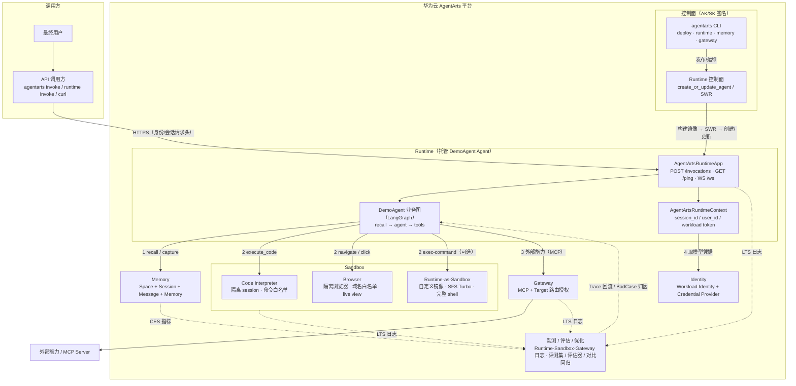
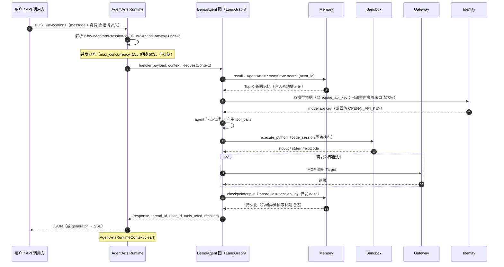
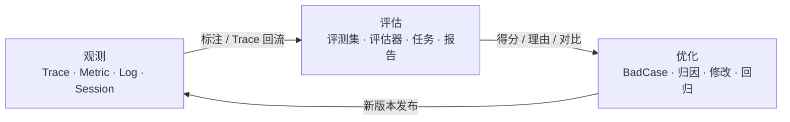

# AgentArts × DemoAgent V2 整体合作架构设计

> ⚠️ **已被取代（事实来源已过期）**：本文档的官方事实来源是 `AgentArts原始材料-0804`（文档版本 02，2026-08-04）。0916 材料相对 0804 是**结构性变化**，本文档中**已确认过时**的结论至少有：长期记忆"约 30s 可检索"（应为 **3–5 分钟**）、记忆策略清单（应为 5 内置含**程序性记忆**，`EVENT` 待实测）、Sandbox 统称"沙箱工具"（应为**代码解释器 + 浏览器**）、Gateway Target 旧名 `OpenAPI Schemas`（应为 **REST API**）、优化"仅方法论无平台页签"（0916 已有**四类优化任务**）。**最新架构结论见 [整体架构设计v3.md](整体架构设计v3.md)**，完整修订清单见其第 0 节与 [release_delta_0916.md](../AgentArts_Agent平台Wiki知识包/00-overview/release_delta_0916.md)。本文档保留为历史基线。
>
> 本文档是 AgentArts 与 DemoAgent 在 **V2 阶段**的合作方案设计：伙伴智能体 DemoAgent 的架构整体**依托 AgentArts 平台能力**落地，由 AgentArts 承担运行托管（Runtime）与安全执行（Sandbox），并在其上叠加 Memory / Gateway / Identity 与观测-评估-优化闭环。
>
> 事实来源：知识包 [AgentArts 平台架构](../AgentArts_Agent平台Wiki知识包/00-overview/platform_architecture.md)（锚点 SDK `agentarts-sdk-python` **v0.1.6**，Python 3.10+，包名 `agentarts-sdk`）；参考实现 [`Langgraph-agentarts-demo`](../../README.md)（`demo/app.py`、`demo/graph.py`、`demo/sandbox.py`、`demo/memory.py`、`demo/identity.py`、`docs/runtime-as-sandbox.md`）。
>
> 与 V1 的关系：V1 见 [整体架构设计v1.md](整体架构设计v1.md)（AgentArts 仅作原子能力，Runtime/Sandbox 排除）。**本文档（V2）取代 V1 的架构结论**，V1 保留为历史基线。

## 1. 文档定位与范围

### 1.1 目标

V2 阶段，DemoAgent 从"自有 k8s 运行时 + 仅消费 Memory/Gateway/Identity 原子能力"演进为**以 AgentArts 为运行底座的高代码伙伴智能体**：

- **Runtime 托管**：DemoAgent 的业务图（参考实现为 LangGraph）以 `AgentArtsRuntimeApp` 为标准 HTTP/WebSocket 服务运行在 AgentArts Runtime 上，平台负责并发控制、上下文隔离、健康探针、会话与审计透传、长任务追踪。
- **Sandbox 安全执行**：模型生成的代码与网页操作在平台隔离环境执行（Code Interpreter / Browser）；需要自定义镜像、持久存储与完整 shell 时，使用 Runtime-as-Sandbox 增强路径。
- **Memory/Gateway/Identity 深接**：Memory 同时承担会话状态（checkpointer）与长期记忆（store）；Identity 覆盖终端用户身份与模型凭据；Gateway 统一外部能力出入口。
- **运营运维闭环**：观测 → 评估 → 优化 → 回归，对托管智能体与平台资源统一治理。

一句话：**伙伴保留业务智能与 Agent 行为设计，平台提供从执行、状态、权限到质量闭环的全部基础设施。**

### 1.2 V2 范围

| 维度 | V2 是否包含 | 说明 |
|---|---|---|
| AgentArts Runtime 托管 | ✅ **包含（核心）** | DemoAgent agent 以高代码形态运行在 AgentArts Runtime；`/invocations` + `/ping` + `/ws` |
| Sandbox（Code Interpreter） | ✅ **包含** | 模型生成代码在隔离 session 执行；`code_session` 封装为工具 |
| Sandbox（Browser） | ✅ 包含 | 网页自动化：导航/点击/输入/截图/多标签；域名白名单 + 人工接管 |
| Runtime-as-Sandbox（增强路径） | ✅ 可选 | 自定义镜像 + SFS Turbo 持久存储 + 完整 shell，用于内部可信数据任务 |
| Memory | ✅ 包含 | 会话状态 `AgentArtsMemorySessionSaver` + 长期召回 `AgentArtsMemoryStore` |
| Memory 插件（AI 编程助手） | ✅ 可选 | `agentarts memory install` 接入 Claude Code / Codex / OpenCode / Hermes |
| Gateway | ✅ 包含 | MCP 网关 + Target 路由 + 授权 + 日志投递 |
| Identity | ✅ 包含 | 终端用户身份（`actor_id` 归属）+ 工作负载身份换取模型凭据 |
| Identity 高级流（STS / OAuth2 3LO） | ⏳ V3 | 高风险操作人工确认与用户级授权 |
| 观测（Trace/Metric/Log/Session） | ✅ 包含 | 托管智能体 Runtime/Sandbox/Gateway **日志**；第三方 OTel 上报路径可选 |
| 评估 | ✅ 包含 | 评测集 + 评估器 + 在线/离线任务 + 报告与校准 |
| 优化 | ✅ 包含 | BadCase 归因 + 单一变量改动 + 对比回归门禁 |

### 1.3 与 V1 的关键差异

| 决策项 | V1 | **V2** | 变更理由 |
|---|---|---|---|
| Runtime 归属 | DemoAgent 自有 k8s | **AgentArts Runtime 托管** | 免除自建运行时的并发/健康/会话/审计成本，直接获得平台标准契约 |
| Sandbox | 排除 | **Code Interpreter + Browser + Runtime-as-Sandbox 三选** | 模型执行不可信代码与网页操作需要平台级隔离 |
| 接入方式 | shell out `agentarts memory` CLI | **Python SDK 内嵌（`agentarts-sdk`）+ CLI 运维** | agent 已在平台运行时内，SDK 直连数据面更自然、更低延迟 |
| 会话状态 | Orchestrator 自管 session | **LangGraph checkpointer（`thread_id` = `session_id`）** | 状态随进程无关，可跨实例/重启续接 |
| 长期记忆召回 | Orchestrator 拼 prompt | **图中 `recall` 节点 + `recall_memory` 工具** | 召回进入 Agent 图，模型可自主深入检索 |
| 身份 | API Key 级（env 注入） | **请求头用户身份 + 工作负载身份换凭据** | 多租户记忆按 `actor_id` 天然隔离，模型密钥不落盘 |
| 可观测 | 第三方 OTel 接入 | **平台托管日志 + 可选 OTel** | 托管后 Runtime/Sandbox/Gateway 日志由平台直接采集 |

### 1.4 关键决策

| 决策项 | 选择 | 理由 |
|---|---|---|
| Agent 形态 | 高代码（`@app.entrypoint`） | 保留 DemoAgent 业务逻辑；平台只做外层 HTTP 适配 |
| 运行入口 | `AgentArtsRuntimeApp` + `app.run()` | 统一 `/invocations` / `/ping` / `/ws` 契约 |
| 发布方式 | `agentarts deploy`（构建 → SWR → 创建/更新运行时） | 一键、可重复、同名即更新 |
| 代码执行默认路径 | Code Interpreter（`code_session`） | 不可信代码的高隔离、白名单、按次计费 |
| 代码执行增强路径 | Runtime-as-Sandbox（`RUNTIME_AS_SANDBOX_TOOL=true`） | 自定义镜像 / SFS Turbo / 完整 shell 场景 |
| 网页操作 | Browser（`browser_session`） | 隔离浏览器 + 域名白名单 + live view 人工接管 |
| 状态持久化 | `AgentArtsMemorySessionSaver` | `thread_id` 即 `session_id`，天然多会话隔离 |
| 长期记忆 | `AgentArtsMemoryStore.search(filter={"actor_id": ...})` | 语义检索 + 用户级隔离 |
| 外部能力 | Gateway + Target + MCP | 密钥不进 Agent 代码，统一授权与审计 |
| 模型凭据 | Agent Identity 工作负载身份（回落 env） | 凭据可轮换、可审计，支持离线降级 |
| 平台能力不可用 | 逐能力降级 | 未配置的能力不暴露对应工具，图仍可运行 |

## 2. 双方定位

### 2.1 合作模型

```
DemoAgent（伙伴，业务智能 + Agent 行为）
        ↓  Adapter Layer（@app.entrypoint + 工具装配 + 上下文/身份映射）
AgentArts 平台（Runtime + Sandbox + Memory + Gateway + Identity + 运营运维）
```

V2 的边界比 V1 更靠上：**AgentArts 不只提供云上原子能力，而是承载 Agent 的运行与执行**。DemoAgent 侧只保留三类资产：业务图与提示词、工具/能力装配、身份与上下文映射。

### 2.2 职责边界

| 维度 | DemoAgent（伙伴） | AgentArts（平台） |
|---|---|---|
| Agent 业务逻辑 | 图 / 提示词 / 领域知识 / 工作流 | 不参与 |
| Agent 运行托管 | 提供 `@app.entrypoint` + 镜像 | **AgentArtsRuntimeApp + Runtime 实例 + 并发/健康/审计** |
| 会话与状态 | 定义 `thread_id` 语义与恢复策略 | Memory 提供 checkpointer 持久化 |
| 安全执行 | 定义工具语义与白名单策略 | **Sandbox 提供隔离执行环境（Code Interpreter / Browser）** |
| 长期记忆 | 定义召回时机与记忆策略 | Memory 提供抽取、存储、语义检索 |
| 外部能力路由 | 定义工具清单与调用意图 | Gateway + Target 提供路由、授权、审计 |
| 身份授权 | 消费身份、决定业务权限 | Identity 提供用户身份透传与凭据注入 |
| 观测/评估/优化 | 定义评测集与业务门禁 | 平台提供 Trace/指标/日志/评估任务/对比回归 |

### 2.3 RACI

| 工作 | DemoAgent | AgentArts 开发负责人 |
|---|---|---|
| 业务场景与 Agent 行为设计 | R/A | C |
| 高代码入口（`@app.entrypoint`）与工具装配 | R/A | C |
| Agent 镜像与 `agentarts deploy` 发布 | R/A | C |
| Runtime 实例 / SWR / 网络 / 存储配置 | C | R/A |
| Sandbox 资源（Code Interpreter / Browser）创建与授权 | C | R/A |
| Memory Space / Gateway / Target 创建 | C | R/A |
| 工作负载身份与凭据提供商配置 | C | R/A |
| 会话/身份映射（`thread_id` ↔ `session_id`、`actor_id`） | R/A | C |
| 平台日志与 OTel 接入配置 | R/A | C |
| 评测集与评估器设计 | R/A | C |
| 评估任务执行与报告 | R | A |
| BadCase 归因与优化 | R | C |
| 实验局设计与问题闭环 | R | A |

## 3. 整体架构

### 3.1 架构总图



### 3.2 能力依赖矩阵

| 能力 | V2 必需性 | 缺失时的行为 | 参考实现 |
|---|---|---|---|
| Runtime 托管 | **必需** | 无法上云；仅本地 `agentarts dev` 可跑 | `demo/app.py` |
| Memory | 强烈建议 | 会话退回进程内 `InMemorySaver`；不召回、不暴露 `recall_memory` | `demo/memory.py` |
| Code Interpreter | 建议 | 不暴露 `execute_python` 工具 | `demo/sandbox.py` |
| Browser | 按场景 | 不暴露浏览器工具 | `agentarts.sdk.tools.browser` |
| Runtime-as-Sandbox | 可选 | 回落到 Code Interpreter | `demo/executepython.py` |
| Identity（工作负载） | 建议 | 模型凭据回落 `OPENAI_API_KEY` | `demo/identity.py` |
| Gateway | 按场景 | 无外部能力路由 | `GatewayClient` |
| 观测/评估/优化 | 建议 | 仅本地日志，无法形成质量闭环 | 平台控制台 |

### 3.3 一次完整 Agent turn 的数据流



> 与 V1 的关键区别：**recall / tool / capture 都发生在托管运行时内部**，不再由外部 Orchestrator 通过 CLI shell out 编排；Orchestrator 角色由 Runtime + 图节点承担。

## 4. 平台能力接入设计

### 4.1 Runtime：运行底座（托管）

#### 4.1.1 定位

`AgentArtsRuntimeApp` 是 Starlette 应用，把任意 Agent 包装为符合 AgentArts 控制面标准的服务。DemoAgent 只需实现 `@app.entrypoint`，即可获得并发控制、上下文隔离、健康探针、会话透传与审计。

```python
from agentarts.sdk import AgentArtsRuntimeApp, RequestContext
from agentarts.sdk.runtime.model import PingStatus

app = AgentArtsRuntimeApp()          # max_concurrency=15（默认）

@app.entrypoint
def handler(payload: dict, context: RequestContext | None = None) -> dict:
    thread_id = payload.get("thread_id") or (context.session_id if context else None)
    ...
    return {"response": ..., "thread_id": ...}

@app.ping
def health() -> PingStatus:
    return PingStatus.HEALTHY

if __name__ == "__main__":
    app.run(host="0.0.0.0", port=8080)
```

#### 4.1.2 服务契约

| 端点 | 方法 | 说明 |
|---|---|---|
| `/invocations` | POST | Agent 调用入口；handler 返回生成器时自动包装为 SSE（`text/event-stream`） |
| `/ping` | GET | 健康检查，返回 `PingStatus`：`Healthy` / `HealthyBusy` / `Unhealthy` |
| `/ws` | WebSocket | 双向流式通信（DemoAgent 如需流式交互可实现） |

初始化参数：`debug` / `lifespan` / `middleware` / `protocol`（`http`\|`https`）/ `max_concurrency`（默认 15）。
`app.run(host=None, port=8080)` 的 host 探测顺序：`AGENTARTS_BIND_IP` → Docker/K8s eth0 IP → `127.0.0.1`；容器内必须监听 `0.0.0.0` 才能被端口映射访问。

**请求头约定**（由 AgentArts 网关注入，DemoAgent 直接消费）：

| 头 | 用途 |
|---|---|
| `x-hw-agentarts-session-id` | 会话 ID → 默认 `thread_id` |
| `X-HW-AgentGateway-User-Id` | 终端用户身份 → 记忆归属 `actor_id` |
| `X-HW-AgentGateway-Workload-Access-Token` | 工作负载访问令牌 → 换取模型凭据 |
| `X-Hw-AgentArts-Runtime-Custom-*` | 自定义头前缀 |

**上下文**：`RequestContext`（请求级不可变快照，含 `session_id` / `request_id` / `request`）与 `AgentArtsRuntimeContext`（基于 `contextvars` 的全局上下文，可在调用栈任意深处读写 `session_id` / `user_id` / `workload_access_token`）。

#### 4.1.3 发布方式

| 方式 | 命令 | 适用场景 | 约束 |
|---|---|---|---|
| CLI 一键部署 | `agentarts deploy`（别名 `launch`） | 常规发布 | Docker 运行中 + `Dockerfile` + SWR 权限 |
| 复用已有镜像 | `agentarts deploy --skip-build` | CI/CD、外部镜像仓库 | 需配置 `runtime.artifact_source.url`，仅 cloud 模式 |
| 控制面 API | `RuntimeClient.create_or_update_agent(...)` | 脚本化、批量、平台集成 | 需自备控制面 endpoint 与鉴权 |

流程：校验 `.agentarts_config.yaml` → 构建镜像（latest + 时间戳）→ 推送 SWR → 创建/更新运行时（同名即更新）→ 校验状态并输出访问端点。本地自检可用 `agentarts deploy --mode local`（同端口映射，`-l` 必须等于 `runtime.invoke_config.port`）。

#### 4.1.4 并发、隔离与 Long Loop

- **并发上限**：默认 `max_concurrency=15`，超出立即返回 503（非排队）。伙伴需据此设计重试/降级。
- **上下文隔离**：每请求 `contextvars` 相互隔离；调用结束后 `AgentArtsRuntimeContext.clear()`。
- **健康状态**：`HEALTHY_BUSY` 表示有任务执行中（`@app.async_task` 注册表非空）；有状态 Agent 建议自定义 `@app.ping`。
- **Long Loop**：任务状态机 `INIT → PLAN → EXECUTING → WAITING → COMPLETED`（含 `FAILED` / `REPLAN`）；SDK 侧由 async task 注册表 + 会话级 Memory 持久化 + `exec-command` 3600s 超时支撑。详见 §5.3。

#### 4.1.5 边界与注意事项

1. `max_concurrency` 超限是**拒绝**而非排队，客户端需处理 503。
2. 健康 ≠ 控制面状态：`/ping` 是实例健康，控制面“正常”仅表示资源操作成功。
3. LangGraph ≥ 1.0.0、LangChain ≥ 1.0.0（新 Checkpoint 格式含 `step` / `pending_sends` / `parents`）。
4. `file_transfer_config` 与 `identity_configuration` 创建后不可修改，需新建实例。
5. 云上运行时访问 Sandbox/Memory 走运行时网络出口；VPC 模式需打通 `*.huaweicloud-agentarts.com`。

### 4.2 Sandbox：安全执行与网页操作

DemoAgent 的“执行类”能力全部放在平台 Sandbox，Agent 进程本身不执行模型生成的代码。

#### 4.2.1 Code Interpreter（默认路径）

不可信代码（模型/用户生成）默认走 Code Interpreter，工具实现为对 `code_session` 的一层封装：

```python
from agentarts.sdk import code_session

def execute_python(code: str, description: str = "") -> dict:
    with code_session(region, interpreter_name,
                      auth_type=auth_type, api_key=api_key) as client:
        return client.invoke(
            operate_type="execute_code",
            api_key=api_key,
            arguments={"code": code, "language": "python", "clear_context": False},
        )
```

| 维度 | 说明 |
|---|---|
| 隔离 | 华为云隔离 session，独立于 Agent 进程；每次调用可新建并销毁 |
| 认证 | `auth_type="API_KEY"`（需 `HUAWEICLOUD_SDK_CODE_INTERPRETER_API_KEY`）或 `"IAM"`（AK/SK V11 签名，无需 API Key） |
| 端点 | 需 `AGENTARTS_CODEINTERPRETER_DATA_ENDPOINT`（SDK 无默认值） |
| 命令 | `execute_command` 用正则 `^[a-zA-Z0-9_\-\.=\s\/\.:]+$` 阻断 shell 元字符；复杂逻辑拆多次或走 Runtime-as-Sandbox |
| 文件 | 归一化到 `/home/user` 下；`upload_file(s)` / `download_file(s)`；str→text，bytes→base64 |
| 依赖 | `install_packages(packages, upgrade=False)`，阻断注入元字符 |
| 会话 | `session_timeout` 60~86400s，默认 900s |
| 计费 | 执行/命令/上传/下载逐次计费 |

> 工程要点：SDK 的 `ToolsAPIError` 继承自 `BaseException`，`except Exception` 抓不到；参考实现在 `demo/sandbox.py` 显式捕获。未配置时**不向模型暴露**该工具，避免模型调用必定失败的工具。

#### 4.2.2 Browser（网页操作）

当 DemoAgent 需要打开网页、检索页面、填表或留证时，使用平台 Browser（`agentarts.sdk.tools.browser`）：

```python
from agentarts.sdk.tools import browser_session

with browser_session(region, "my-browser", "session-name",
                     allowed_domains=["example.com"]) as browser:
    browser.navigate("https://example.com")
    browser.key_type("query")
    browser.key_press("Enter")
    info = browser.get_page_info()
    browser.screenshot(format="png", full_page=True)
```

| 维度 | 说明 |
|---|---|
| 隔离 | 华为云托管隔离浏览器 session，独立于 Agent 容器 |
| 操作 | `navigate` / `go_back` / `go_forward` / `refresh` / `mouse_*` / `key_*` / `screenshot` / `wait` / `list_tabs` / `switch_tab` / `close_tab` / `new_tab` |
| 网络边界 | `network_config`（PUBLIC/VPC）+ `allowed_domains` / `blocked_domains`（互斥） |
| 状态复用 | Browser Profile + `save_profile` 复用登录态 |
| 人机协同 | live view 流 + `take_control` / `release_control`（高风险动作先接管） |
| 会话 | `session_timeout` 默认 900s |

#### 4.2.3 Runtime-as-Sandbox（增强路径，可选）

当需求是「代码必须跑在自己的镜像里」「产物要落到持久存储」「需要完整 shell」时，Code Interpreter 无法满足（不支持自定义镜像、不支持挂载、命令受限）。此时复用 Runtime 的创建/执行面拼装一个“沙箱工具”：

| 支撑点 | 说明 |
|---|---|
| 控制面参数化 | `RuntimeClient.create_or_update_agent(artifact_source_config=..., storage_config=..., network_config=..., invoke_config=...)` |
| 自定义镜像 | `artifact_source.url` 指向任意 SWR 镜像 + `commands` 启动命令 |
| 持久存储 | `storage_config.sfs_turbo`（`sfs_turbo_id` / `sfs_path` / `mount_path` / `read_only`）+ `session_storage.mount_path` |
| 完整 shell | 数据面 `exec_command`，含元字符自动 `sh -c` 包装，超时上限 3600s |
| 文件通道 | `upload_files` / `download_files`（`file_transfer_config.enabled=true`） |
| 会话 | `start_session` → `exec_command` → `stop_session` |

参考实现开关：`RUNTIME_AS_SANDBOX_TOOL=true` 时用 `runtime_execute_python` 替代 `execute_python`（见 `demo/executepython.py`）。

**已知限制（必须在设计中消化）**：

1. **冷启动**：创建运行时涉及镜像拉取与调度，绝不能按调用创建，必须池化 + `create_or_update_agent` 幂等。
2. **会话无 TTL**：`start_session` 的 `timeout` 是 HTTP 超时，不是会话存活时间；无 `get_session` 查询，需自行回收兜底。
3. **`start_session` 可能返回空**：需显式校验 `session_id` 并报错。
4. **`stop_session` 是 best-effort**：不能据此判断远端已清理。
5. **并发共享**：同实例多会话共享容器与 SFS 挂载，路径需按任务分目录。
6. **无强隔离**：容器边界即唯一边界，安全责任在伙伴侧。

#### 4.2.4 选型矩阵

| 判据 | Code Interpreter | Browser | Runtime-as-Sandbox |
|---|---|---|---|
| 代码可信度 | 不可信 | —— | 相对可信（内部数据任务） |
| 自定义镜像 | ❌ | ❌ | ✅ |
| 持久存储 | ❌ | ❌（用 Profile 复用状态） | ✅ SFS Turbo |
| 完整 shell | ❌（白名单） | —— | ✅（`sh -c`，≤3600s） |
| 网页操作 | ❌ | ✅ | ❌ |
| 隔离等级 | 高 | 高 | 中（自建容器） |
| 计费 | 按次 | 按会话时长 | 常驻实例占资源 |

### 4.3 Memory：会话状态 + 长期记忆

#### 4.3.1 数据模型

AgentArts Memory 严格区分控制面与数据面：

| 平面 | 职责 | 认证 | SDK |
|---|---|---|---|
| 控制面 | Space CRUD | AK/SK 签名 | `MemoryClient.create_space` 等 |
| 数据面 | session / message / memory 读写 | Space 级 API Key Bearer | `MemoryClient` / `AsyncMemoryClient` / `MemorySession` |

职责分两层：

- **短期（会话状态）**：每轮对话的 checkpoint 持久化，进程/实例重启后可按 `thread_id` 续聊。
- **长期（抽取记忆）**：平台按策略从消息中异步抽取结构化记忆，供语义检索召回。

记忆策略：`semantic` / `summary` / `user_preference` / `episodic` / `event` / `custom`；参考实现在 Space 创建时启用 `semantic, episodic, user_preference, summary`。

#### 4.3.2 LangGraph 适配器（参考实现）

```python
from agentarts.sdk.integration.langgraph import (
    AgentArtsMemorySessionSaver,   # checkpointer：会话状态
    AgentArtsMemoryStore,          # store：长期语义召回
)

checkpointer = AgentArtsMemorySessionSaver(
    space_id=..., region=..., api_key=...,
    max_messages=10,               # 从 Memory 取回的历史消息上限
)
store = AgentArtsMemoryStore(space_id=..., region=..., api_key=...)

agent = builder.compile(checkpointer=checkpointer, store=store)
```

| 组件 | 关键行为 |
|---|---|
| `AgentArtsMemorySessionSaver` | `thread_id` 直接映射 `session_id`；`put` 仅发送 delta；v0.1.6 起支持 `put_writes`（pending writes 独立 session）、`list`、`delete_thread`、`close`/`aclose` 与 `with`/`async with` |
| `AgentArtsMemoryStore` | `search` 语义检索（带 score）、`batch` 支持 Put/Get/Search/ListNamespaces；`PutOp(value=None)` 即删除记忆；namespace 存于 meta `store_namespace`；`supports_ttl=False` |
| 消息转换 | `langgraph_to_memory_message` 等四函数；v0.1.6 起保留 `additional_kwargs` / `response_metadata` |

**关键设计**：整个应用生命周期复用同一个 saver / store 实例；不要为同一 session 创建多个 saver。

#### 4.3.3 Session / 身份映射

| DemoAgent 概念 | AgentArts 字段 | 说明 |
|---|---|---|
| 对话线程 `thread_id` | Memory `session_id` | 会话级隔离；Long Loop 续接 key |
| 终端用户 `user_id` | Memory `actor_id` | 记忆归属；不同用户天然隔离 |
| Agent 标识 | `assistant_id` | 区分不同 agent / 子图产出 |

`thread_id` 解析优先级：请求体 `thread_id` → 请求体 `session_id` → 运行时请求头 `session_id` → 自动生成 UUID。
`actor_id` 解析优先级：请求体 `user_id` → `AgentArtsRuntimeContext.get_user_id()`（请求头注入）→ 配置项 → 静态默认值。

#### 4.3.4 记忆策略与边界

| 项 | 约束 |
|---|---|
| Space 名称 | 1-128 字符 |
| `message_ttl_hours` | 1-8760（默认 168） |
| 消息内容 | ≤ 10000 字符 |
| `actor_id` / `assistant_id` | ≤ 64 字符 |
| 记忆生成延迟 | `add_messages` 后约 30s 才可检索；不要阻塞等待，下一轮自然可见 |
| 召回过滤 | `MemorySearchFilter`：`query` / `strategy_type` / `strategy_id` / `actor_id` / `assistant_id` / `session_id` / `memory_type` / 时间范围 / `top_k` / `min_score` |
| 会话管理（v0.1.6） | `list_sessions` / `get_session` / `delete_session` |
| API Key | 创建 Space 时仅返回一次，须走 K8s/配置中心 Secret 管理 |

#### 4.3.5 记忆插件（AI 编程助手形态，可选）

当 DemoAgent 的某些形态是交互式 AI 编程助手（Claude Code / Codex / OpenCode / Hermes）而非 HTTP Agent 时，不必改造其源码，直接用 `agentarts memory install <platform>` 挂载平台 Memory（内置 Hook / Plugin / MCP Server，暴露 `search_memories` / `add_messages` / `list_memories` / `search_summary` 等工具）。详见 [Memory 插件](../AgentArts_Agent平台Wiki知识包/03-memory/memory_plugin.md)。

### 4.4 Gateway：外部能力

Gateway 用 **Gateway（授权 + 协议）+ Target（连接配置）** 两层模型统一外部能力入口。

```python
from agentarts.sdk import GatewayClient

client = GatewayClient()
gw = client.create_gateway(name="demoagent-gw", authorizer_type="iam",
                           log_delivery_configuration={"enabled": True})
gateway_id = gw.data["gateway_id"]
client.create_gateway_target(
    gateway_id=gateway_id, name="ext-search-svc",
    target_configuration={"mcp_server": {"endpoint": "https://ext-svc/mcp",
                                         "server_type": "sse"}},
    credential_provider_configuration={"credential_provider_type": "api_key",
                                       "api_key": "..."},
)
```

| 维度 | 说明 |
|---|---|
| 协议 | `protocol_type="mcp"`；`protocol_configuration` 自由透传 |
| 授权 | `authorizer_type`：`iam`（默认，缺省自动创建 IAM 委托 `AgentArtsCoreGateway`，409 容忍）/ `api_key` / `custom_jwt` |
| 凭据 | Target 级 `credential_provider_configuration`，密钥不进 Agent 代码 |
| 网络 | `outbound_network_configuration`：`public` / VPC 内网 |
| 审计 | `log_delivery_configuration.enabled=true` → LTS，控制台“组件库 > 网关 > 日志”可查 |
| CLI | `agentarts gateway create/update/delete/get/list` + `create-target/update-target/delete-target/get-target/list-targets` |
| 返回 | 所有方法返回 `RequestResult`（`success` / `data` / `error` / `status_code`） |

### 4.5 Identity：用户身份 + 凭据身份

V2 的 Identity 有两条独立链路，参考实现分别落在 `demo/identity.py` 与请求头透传：

| 链路 | 目的 | 机制 |
|---|---|---|
| 终端用户身份 | 决定记忆与业务的归属 | 运行时把 `X-HW-AgentGateway-User-Id` 解析进 `AgentArtsRuntimeContext`，`resolve_actor_id()` 用作 `actor_id` |
| 工作负载凭据 | 让模型密钥不落盘、可轮换 | `@require_api_key(provider_name=...)` + `IdentityClient.create_workload_access_token`；已部署时令牌来自请求头，本地调试现场换取 |
| 资源访问（V3） | 访问华为云资源 / 用户数据 | `@require_sts_token`（`policy` 限定边界）/ `@require_access_token`（OAuth2 M2M / USER_FEDERATION 3LO） |

```python
from agentarts.sdk import AgentArtsRuntimeContext, IdentityClient, require_api_key

@require_api_key(provider_name="langgraph-agentarts-demo-llm-key")
def _load(api_key: str | None = None) -> str | None:
    return api_key     # 装饰器已把从 Agent Identity 取回的密钥注入

# 本地调试：先换取工作负载访问令牌并写入上下文
client = IdentityClient(region=region, ignore_ssl_verification=not verify_ssl)
token = client.create_workload_access_token(workload_name=..., user_id=actor_id)
AgentArtsRuntimeContext.set_workload_access_token(token)
```

**为什么两条链路分离**：用户身份解决“这是谁的数据”，工作负载身份解决“Agent 以什么身份取凭据”。前者决定 Memory 隔离与业务权限，后者决定凭据来源与轮换；混在一起会导致越权或凭据泄露。

初始化资源：`IdentityClient.create_api_key_credential_provider(name, api_key)` + `create_workload_identity(name)`（参考实现 `demo.bootstrap identity`），再按需 `create_oauth2_credential_provider` / `create_sts_credential_provider`。

### 4.6 观测-评估-优化闭环



#### 4.6.1 观测

V2 中 DemoAgent 由 AgentArts 托管，属于**平台原生高代码智能体**，观测边界与 V1（第三方 OTel）不同：

| 信号 | 来源 | 说明 |
|---|---|---|
| 日志 | Runtime / Sandbox / Gateway | 托管高代码当前**明确开放**的观测面；控制台“部署运行 / 组件库 > 日志记录”开启 |
| Trace / Metric（高代码托管） | 平台 | 托管智能体的调用链与指标查看**正在规划，暂未开放**；不要因 SDK 配置存在 `tracing`/`metrics` 就宣称已可视化 |
| Trace / Metric（第三方 OTel） | 自建 OTel SDK | 若伙伴需要额外链路，可走“第三方智能体接入”，严格写入 `gen_ai.*` / `user.id` 等必填属性 |
| 会话分析 | 平台 | 同一 `session_id` 串联多轮；DemoAgent 的 `thread_id` 与 Memory `session_id` 一致，便于跨系统关联 |
| Memory 指标 | CES `SYS.AgentArts` | 维度 `agentarts_memory_space_id`；含 requests / throttled / error / avg_latency 与 memory/events 系列 |
| 健康 | Runtime `/ping` | `Healthy` / `HealthyBusy` / `Unhealthy`；控制面“正常”≠实例健康 |

SDK 在所有控制面/数据面请求的 `User-Agent` 末尾追加 `os/<system>/<release> agentarts-sdk-python/<version>`，便于服务端日志定位调用方版本。

**脱敏红线**：Trace/日志可能含 Prompt、工具原始 IO 与对话内容；上线前确定脱敏、权限、保留周期与审计策略，严禁上报 API Key / AK-SK / OAuth / STS Token。

#### 4.6.2 评估

`评测集（考卷） + 评估对象（考生） + 评估器（阅卷官） → 评估任务（模考） → 得分 + 理由 + 运行时指标`

| 维度 | 离线评估 | 在线评估 |
|---|---|---|
| 阶段 | 开发、上线前、版本回归 | 生产运维、持续质量监测 |
| 数据源 | 已发布评测集 | API 调用产生的 Trace |
| 是否运行 agent | “评估智能体”模式运行；“评估评测集”模式不运行 | 由线上 API 调用自然触发 |
| 适合问题 | 标准问答、版本对比、回归 | 真实流量、RAG context、工具 Span、轨迹质量 |

评估器三类：模型判定（LLM 打分）、代码判定（正则/JSON/数值）、自适应判定（自然语言规则转结构化）。DemoAgent 常用组合：RAG（真实准确 + 精炼性 + 引用相关性）、内容安全（恶意性/犯罪性/歧视/漏放）、工具调用（仅在线：轨迹质量、参数正确性、选择质量）、通用对话（正确性、完整性、指令遵从）。

边界：自定义模型判定当前仅支持 `deepseek-v3.2`；多轮文本变量必须为 `turns`；自适应判定仅单轮离线且 ≤10 条规则；最多 10 个在线+离线任务，每任务最多 5 个评估器；数据项 ≤5000。

#### 4.6.3 优化

闭环五步：**建立基线 → 看 Trace/指标定位阶段 → 标注 BadCase → 根因归类（Prompt / Model / RAG / Tool(Gateway) / Flow / Data / 评估器）→ 单一变量改动 → 同集同标准对比回归 → 门禁决策**。

评测集四类并行：黄金样本（上线门禁）、BadCase（专项修复，保留 `trace_id`）、边界/对抗（护栏）、生产分布样本（防过拟合）。

发布门禁建议：① 核心质量达标；② 对比基线目标指标提升或保持；③ 安全/拒答/工具参数无显著退化；④ 耗时与 Token 在预算内；⑤ 高风险 BadCase 人工复核。平台未给通用阈值，由 DemoAgent 按业务定义。

## 5. DemoAgent 侧工程设计

### 5.1 参考实现工程结构（`Langgraph-agentarts-demo`）

| 文件 | 职责 | 对应平台能力 |
|---|---|---|
| `demo/app.py` | `AgentArtsRuntimeApp` + `@app.entrypoint` + `@app.ping` | Runtime |
| `demo/graph.py` | LangGraph 图：`recall → agent → tools`；系统提示词拼接召回 | Runtime + Memory |
| `demo/tools.py` | 工具装配（按能力开关） | Sandbox / Memory / Identity |
| `demo/sandbox.py` | `code_session` 封装，`execute_python` 工具 | Sandbox（Code Interpreter） |
| `demo/executepython.py` | Runtime 会话执行，`runtime_execute_python` 工具 | Sandbox（Runtime-as-Sandbox） |
| `demo/memory.py` | checkpointer + store + 语义召回 | Memory |
| `demo/identity.py` | `actor_id` 解析 + 工作负载身份换模型凭据 | Identity |
| `demo/bootstrap.py` | 一次性创建 Memory Space / 工作负载身份 / 绑定沙箱 | 控制面 |
| `demo/config.py` | 能力开关与降级判定（`capabilities()`） | 全部 |
| `.agentarts_config.yaml` | `base` / `swr_config` / `runtime.*` 部署配置 | Runtime 部署 |

### 5.2 工具装配与降级

```python
def build_tools() -> list[BaseTool]:
    tools = []
    if settings.runtime_sandbox_ready:      # 增强路径优先
        tools.append(_runtime_execute_python)
    elif sandbox.is_configured():           # 默认安全路径
        tools.append(execute_python)
    if settings.memory_enabled:
        tools.append(recall_memory)
    tools.append(whoami)
    return tools
```

| 未配置项 | 降级行为 |
|---|---|
| Memory Space | checkpointer 退回进程内 `InMemorySaver`；不自动召回；不暴露 `recall_memory` |
| Code Interpreter | 不暴露 `execute_python`（避免模型调用注定失败的工具） |
| Agent Identity | 模型凭据回落 `OPENAI_API_KEY` |
| 用户身份请求头 | 使用静态 `AGENTARTS_DEMO_ACTOR_ID`（默认 `demo-user`） |

工具失败以 `{"ok": false, "error": ...}` 返回而非抛出，让模型能向用户解释并自我恢复。

### 5.3 Long Loop 支持

长任务可中断恢复依赖三条机制：

| 机制 | 用途 |
|---|---|
| Memory checkpointer（`thread_id`） | 跨进程/重启恢复对话与任务状态 |
| `strategy_type=episodic` 抽取记忆 | 召回 Plan / current_step / error 等任务级状态 |
| `@app.async_task` + `PingStatus.HEALTHY_BUSY` | 运行中任务可见，`/ping` 反映 busy |
| `runtime exec-command`（≤3600s）+ `upload-files`/`download-files` | 长执行与文件态转移（托管运行时） |

持久化字段建议：`task_id` / `goal` / `plan` / `current_step` / `observation` / `artifact` / `error`。

### 5.4 多形态 Agent 落地

| 形态 | 落地方式 |
|---|---|
| LangGraph 高代码 Agent | **主路径**：`AgentArtsRuntimeApp` 托管 + `AgentArtsMemorySessionSaver`/`Store`（参考实现） |
| 自研框架 Agent | 同主路径，用 `@app.entrypoint` 包装 `run`/`ainvoke`，直接用 `MemoryClient` |
| LangChain Agent | `@app.entrypoint` 包装 `AgentExecutor.invoke` |
| Google ADK Agent | `agentarts init -t google-adk` 模板 + `@app.entrypoint` |
| 交互式 AI 编程助手（codex/pi-agent/claudecode 类） | 若可封装为 HTTP/运行时契约 → 各自打包为 Runtime 实例；若为交互式 CLI → 用 `agentarts memory install` 挂载 Memory |

### 5.5 离线/降级运行

无云资源时服务与图仍可运行：`agentarts dev` 或 `python -m demo.app` 本地起 ASGI，Memory/Sandbox/Identity 按 §5.2 降级。这保证开发期不依赖云资源，也保证生产侧单点能力故障时不整体不可用。

## 6. 部署形态

### 6.1 构建与发布

```text
DemoAgent 工程
  ├── demo/（业务图 + 工具 + 能力封装）
  ├── requirements.txt（agentarts-sdk + langgraph/langchain + httpx/python-dotenv）
  ├── Dockerfile（python:3.12-slim → 非 root → pip install → CMD python -m demo.app）
  └── .agentarts_config.yaml
        ↓ agentarts deploy
  构建镜像 → 推送 SWR → create_or_update_agent → 校验状态 → 输出访问端点
```

`.agentarts_config.yaml` 关键项：`base.entrypoint`（如 `demo.app:app`）、`base.platform`（`linux/arm64`）、`base.base_image`、`runtime.invoke_config`（HTTP/8080/`file_transfer_config`）、`runtime.network_config`（PUBLIC/VPC）、`runtime.identity_configuration`（IAM/custom_jwt/key_auth）、`runtime.artifact_source`、`runtime.storage_config`（SFS Turbo + session storage）、`runtime.observability`、`runtime.arch`、`runtime.execution_agency_name`、`runtime.agent_gateway_id`。

### 6.2 云资源清单（V2）

| 资源 | 创建方式 | 数量 |
|---|---|---|
| Runtime 实例（DemoAgent Agent） | `agentarts deploy` / `RuntimeClient.create_or_update_agent` | 1+（按 agent 形态） |
| Runtime（as-Sandbox 增强，可选） | 同上，专用镜像 + SFS Turbo | 0-1（池化） |
| SWR 组织/仓库 | `deploy` 自动或手工 | 1+ |
| Code Interpreter | 控制台 / `CodeInterpreter.create_code_interpreter` | 1+ |
| Browser（可选） | `Browser.create_browser` | 按需 |
| Memory Space | `agentarts memory create` / `bootstrap memory` | 1+（可按业务域分） |
| Gateway + Target | `agentarts gateway create` / `create-target` | 1 + 按外部能力数 |
| 工作负载身份 + 凭据提供商 | `IdentityClient` / `bootstrap identity` | 1+ |
| LTS 日志 / CES 告警 | 控制台开关 + SMN | 按需 |
| 评测集 / 评估器 / 评估任务 | 控制台 | 按业务场景 |

### 6.3 网络与存储

- **网络**：生产建议 `network_mode=VPC`；运行时需能访问 Memory/Code Interpreter 等 `*.huaweicloud-agentarts.com` 端点；Gateway 出站按需 public/VPC。
- **存储**：Code Interpreter 文件域固定在 `/home/user`；需要持久化落盘时用 Runtime-as-Sandbox 的 SFS Turbo（`mount_path` 必填）+ `session_storage.mount_path`。
- **密钥**：AK/SK、API Key、工作负载凭据走 Secret/配置中心，不进镜像与代码库。

### 6.4 初始化流程（参考实现 `demo.bootstrap`）

| 步骤 | 命令 | 作用 |
|---|---|---|
| 1 | `python -m demo.bootstrap memory` | 创建 Memory Space（启用 `semantic/episodic/user_preference/summary`，空闲 30s 触发抽取），写回 `.env` |
| 2 | `python -m demo.bootstrap sandbox [--name ...]` | 列出/创建/绑定 Code Interpreter，写回名称、认证方式与访问端点 |
| 3 | `python -m demo.bootstrap identity` | 创建 API Key 凭据提供商 + 工作负载身份，写回名称 |
| 4 | `python -m demo.bootstrap status` | 查看 memory / sandbox / identity 能力状态 |
| 5 | `agentarts deploy` | 发布到 AgentArts Runtime |

## 7. V2 验收

### 7.1 验收原则

不能只验证"问答对不对"，必须验证**完整 Agent 闭环**（V2 已包含 Sandbox 与 Runtime）：

```
用户请求 → Runtime /invocations → 身份/会话解析 → Memory recall → Agent 推理
        → Sandbox 执行（代码/网页）→（可选）Gateway Target → Memory capture
        → 观测/评估 → 反馈用户
```

### 7.2 验收清单

**Runtime 托管**
- [ ] `agentarts deploy` 成功，输出 Agent ID / Region / Status / Endpoint
- [ ] `POST /invocations` 返回 `{response, thread_id, user_id, tools_used}`；`GET /ping` 返回 `Healthy`
- [ ] 生成器响应自动转 SSE（若实现流式）
- [ ] 同一 `thread_id` 多次调用状态续接，服务重启后不丢
- [ ] 并发超 `max_concurrency` 返回 503（而非挂起）
- [ ] 请求头身份/会话正确解析进 `AgentArtsRuntimeContext`

**Sandbox**
- [ ] `execute_python` 在隔离 session 执行，返回 stdout/stderr；Agent 进程无副作用
- [ ] 未配置沙箱时工具不暴露给模型
- [ ] `execute_command` 元字符被阻断；`install_packages` 可用
- [ ] 文件上传/下载限定 `/home/user`，大小与类型符合预期
- [ ] （Browser）`navigate`/`key_type`/`screenshot` 可用；`allowed_domains` 生效；高风险动作可用 `take_control`
- [ ] （Runtime-as-Sandbox）自定义镜像可执行完整 shell，SFS 落盘可复读；实例池化且可回收

**Memory**
- [ ] checkpointer 生效：不同 `thread_id` 会话互不干扰
- [ ] 长期抽取：写入后约 30s 可 `search` 召回
- [ ] `actor_id` 隔离：不同用户互不可见
- [ ] 策略过滤（semantic/episodic/user_preference/summary）生效
- [ ] `delete_thread` 能清理对应会话

**Gateway / Identity**
- [ ] Gateway Target 可达，未授权调用被拒；LTS 可查调用日志
- [ ] 用户身份决定记忆归属；`whoami` 返回一致
- [ ] 工作负载身份可换取模型凭据（或未配置时回落 env）

**观测 / 评估 / 优化**
- [ ] Runtime / Sandbox / Gateway 日志开启后，"智能体运行分析"可检索到测试调用
- [ ] 用真实 API 调用触发数据（非控制台调试）
- [ ] 至少完成一条"Trace 标注 → 回流评测集 → 评估"链路
- [ ] 对比评估基于同一评测集，门禁阈值可判定
- [ ] Prompt/对话/工具 IO 已脱敏，无凭证进入日志

### 7.3 技术指标

| 指标 | 验证方法 | 目标 |
|---|---|---|
| Agent 启动成功率 | `agentarts launch` 后 `/ping` 健康 + `invoke` 连通 | 100% |
| 任务完成率 | `@app.entrypoint` 返回有效响应 | ≥ 90% |
| Tool 调用成功率 | `CodeInterpreter` / `Browser` / Runtime-as-Sandbox / Gateway Target | ≥ 95% |
| 长任务恢复 | `thread_id` 续接 + episodic 召回 + async task 状态 | 中断可恢复 |
| 记忆隔离 | 不同 `actor_id` / `thread_id` 交叉检索 | 0 串扰 |
| 权限控制 | 用户身份透传 + 工作负载凭据边界 | 无越权 |
| 并发保护 | 超 `max_concurrency` 快速失败 | 503 生效 |

### 7.4 不验收项（V3）

- Identity 高级流：STS 临时凭证、OAuth2 USER_FEDERATION 3LO、高风险操作人工确认
- 托管高代码 Trace/Metric 可视化（平台仍在规划）
- 多 Space 多租户精细分域（V3 展开）

## 8. 风险与对策

| 风险 | 影响 | 对策 |
|---|---|---|
| 并发超限（`max_concurrency`） | 请求 503 | 客户端退避重试；必要时拆多个 Runtime 实例；避免同步长阻塞 |
| Sandbox 计费叠加 | 成本上升 | Code Interpreter 按次、Browser 按会话时长；Runtime-as-Sandbox 池化回收 |
| 记忆生成 30s 延迟 | 刚写的记忆检索不到 | 不阻塞等待；即时上下文用 `get_last_k_messages` 取原始消息 |
| 长期记忆抽取误判 | 该记的没记 / 不该记的记了 | 策略与触发条件按业务配置；参考实现的保守触发 + 结构化信号 |
| Memory API Key 泄露 | 数据面越权读写 | Secret 管理；不进镜像明文；日志脱敏 |
| Sandbox 配置缺失 | 工具不可用 | 启动即自检 `sandbox.status().ready`；未就绪不暴露工具 |
| Runtime-as-Sandbox 冷启动 | 首次调用超时 | 预创建+池化；`create_or_update_agent` 幂等；不要按调用创建 |
| Runtime-as-Sandbox 会话无 TTL | 资源泄漏 | 自建回收兜底；`stop_session` 不视为强保证 |
| 运行时不可变更项 | 反复重建 | `file_transfer_config`/`identity_configuration` 创建时定好 |
| VPC 网络不通 | 数据面调用失败 | 网络联通性预检；确认 `*.huaweicloud-agentarts.com` 可达 |
| 控制面"正常"误读为健康 | 故障漏报 | 以 `/ping` + 实际调用为准 |
| 托管 Trace/Metric 未开放 | 观测不完整 | 以日志为主；必要时走第三方 OTel 旁路 |
| Trace/日志含敏感数据 | 合规风险 | 脱敏策略；严禁上报凭证 |
| 在线评估无数据 | 评估空跑 | 先完成数据上报；会话持续 1-60 分钟、采样 1-500 内合理设置 |
| LLM 裁判误判 | 评估失真 | 人工校准低分/争议/高影响样本 |
| 多变量同时改动 | 无法归因 | 一次只改一个主要因子，保留版本与实验说明 |
| 评测集过拟合 | 只优化少量典型问题 | 持续回流生产分布样本，四类数据集并行 |

## 9. 后续演进（V3+）

1. **Identity 高级流**：STS 临时凭证（`policy` 最小权限）+ OAuth2 USER_FEDERATION 3LO，高风险操作人工确认闭环
2. **Browser 深度场景**：登录态 Profile 复用、live view 前端嵌入、人工接管审计
3. **Runtime-as-Sandbox 平台化**：把参考实现封装为可复用的"容器沙箱"模块（会话池、任务目录约定、结果归一化）
4. **多 Runtime 实例编排**：按 agent 形态/租户拆分实例，配 Gateway 做统一入口
5. **观测补齐**：托管高代码 Trace/Metric 开放后接入；统一 trace_id 贯穿 Runtime/Sandbox/Gateway/Memory
6. **评估体系深化**：多业务域评测集；AI 合成补齐长尾/对抗/安全红线；自定义评估器覆盖 DemoAgent 专属维度
7. **优化自动化**：BadCase 自动归因 + 对比回归门禁接入 CI/CD，未达门禁拒绝发布
8. **多 Space / 多租户**：按业务域或租户分 Space，结合 `actor_id` / `assistant_id` 精细隔离
9. **记忆策略调优**：按场景配置抽取参数与 TTL，降低噪音与成本
10. **离线/边缘形态**：在无云环境下保持降级可运行，联网后增量同步记忆

## 10. 参考资料

**知识包（锚点 v0.1.6）**
- [AgentArts 平台架构](../AgentArts_Agent平台Wiki知识包/00-overview/platform_architecture.md)
- [Runtime](../AgentArts_Agent平台Wiki知识包/01-runtime/runtime.md)
- [Sandbox（Code Interpreter）](../AgentArts_Agent平台Wiki知识包/02-sandbox/sandbox.md)
- [Sandbox（Browser）](../AgentArts_Agent平台Wiki知识包/02-sandbox/browser.md)
- [Memory](../AgentArts_Agent平台Wiki知识包/03-memory/memory.md)
- [Memory 插件](../AgentArts_Agent平台Wiki知识包/03-memory/memory_plugin.md)
- [Gateway](../AgentArts_Agent平台Wiki知识包/04-gateway/gateway.md)
- [Identity](../AgentArts_Agent平台Wiki知识包/05-identity/identity.md)
- [伙伴 Agent 联合开发适配指南](../AgentArts_Agent平台Wiki知识包/06-integration/partner_agent_adaptation.md)
- [可观测性](../AgentArts_Agent平台Wiki知识包/07-operation/observability.md)
- [实验局验收](../AgentArts_Agent平台Wiki知识包/07-operation/field_validation.md)
- [智能体评估](../AgentArts_Agent平台Wiki知识包/07-operation/evaluation.md)
- [优化闭环](../AgentArts_Agent平台Wiki知识包/07-operation/optimization.md)
- [CLI 参考](../AgentArts_Agent平台Wiki知识包/08-code-dev/cli_reference.md)
- [部署与远程运维](../AgentArts_Agent平台Wiki知识包/08-code-dev/deployment.md)
- [框架集成](../AgentArts_Agent平台Wiki知识包/08-code-dev/framework_integration.md)
- [项目脚手架](../AgentArts_Agent平台Wiki知识包/08-code-dev/scaffolding.md)

**参考实现**
- [`Langgraph-agentarts-demo`](../../README.md)：Runtime 托管 + Code Interpreter 沙箱 + Memory（saver/store）+ Identity
- [用 Runtime 冒充沙箱：可行性与实现指南](../../docs/runtime-as-sandbox.md)
- [整体架构设计v1.md](整体架构设计v1.md)（V1 基线，AgentArts 仅作原子能力）

**历史 V1 文档引用**
- [AgentArts CLI 指导](../../../openclaw_agentarts/AGENTARTS_CLI_GUIDE.zh-CN.md)
- [AgentArts Memory Extension 指南](../../../openclaw_agentarts/AGENTARTS_MEMORY_EXTENSION_GUIDE.zh-CN.md)
