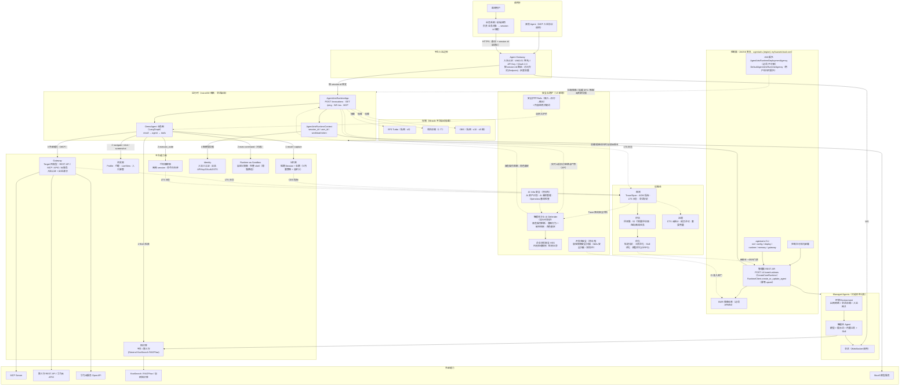
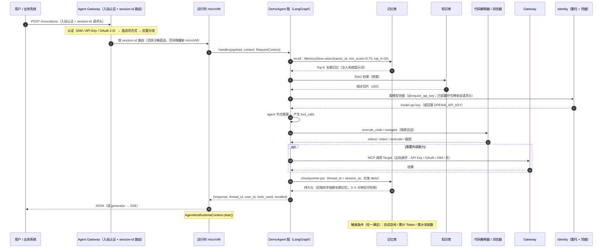
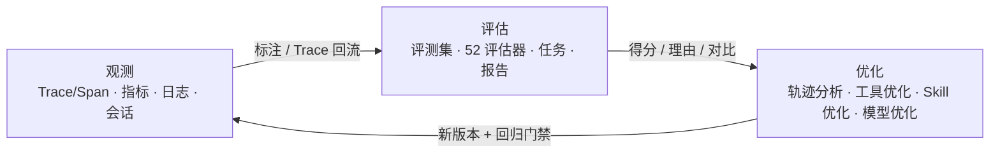

# AgentArts × DemoAgent V3 整体合作架构设计

> 本文档是 AgentArts 与 DemoAgent 合作方案的 **V3 阶段整体架构设计**：伙伴智能体 DemoAgent 依托 AgentArts 平台能力落地，由 AgentArts 承担运行托管（Runtime 或 Managed Agents）、安全执行（代码解释器 / 浏览器）、状态与知识（记忆库 / 知识库），并在其上叠加 Gateway / Identity 与观测-评估-优化闭环。
>
> **官方事实来源：`AgentArts原始材料-0916`**（2026-09-14 ~ 2026-09-16，12 分册 / 4,864 页）。此前 V1/V2 的事实来源是 `AgentArts原始材料-0804`（文档版本 02，2026-08-04）。0916 相对 0804 是**结构性变化**（分册重排 + 新增能力域），不是补充修订；完整差异清单见 [release_delta_0916.md](../AgentArts_Agent平台Wiki知识包/00-overview/release_delta_0916.md)。
>
> SDK 锚点：`agentarts-sdk-python` **v0.1.6**（Python ≥ 3.10，包名 `agentarts-sdk`，**仅支持 `cn-southwest-2`**）。
>
> 与既有版本的关系：V1 见 [整体架构设计v1.md](整体架构设计v1.md)（AgentArts 仅作原子能力，Runtime/Sandbox 排除）；V2 见 [整体架构设计v2.md](整体架构设计v2.md)（AgentArts 作运行底座，但事实来源仍是 0804 版材料）。**本文档（V3）取代 V1 与 V2 的架构结论**，V1/V2 保留为历史基线。
>
> 配套产出：[架构图 Prompt（gpt-image-2）](架构图Prompt.md)。

## 0. 相对 V2 的修订摘要（本版核心价值）

V3 不是 V2 的增量补充，而是**按 0916 官方材料对 V2 的事实性纠错 + 能力域补齐**。下表是可追溯的修订清单，逐条对应 V2 中已过时或缺失的内容。

### 0.1 事实性纠错（V2 写法 → 0916 正确口径）

| # | V2 中的写法 | 0916 正确口径 | 影响章节 |
|---|---|---|---|
| 1 | 长期记忆"`add_messages` 后约 **30s** 可检索" | 长期记忆异步生成，官方建议**写入后等待 3–5 分钟**再查询；触发条件是"会话空闲 / 累计 Token / 累计消息数 **OR** 关系" | §4.3、§7、§8 |
| 2 | 记忆策略 `semantic / summary / user_preference / episodic / event / custom` | 官方 **5 个内置策略**：总结 / 语义记忆 / 用户偏好 / 情景记忆 / **程序性记忆（Procedural Memory）**；`EVENT` 是 SDK 枚举残留，**是否受支持需实测** | §4.3 |
| 3 | "沙箱工具"作为 Sandbox 统称 | 拆为 **代码解释器（Code Interpreter）** 与 **浏览器（Browser）** 两个独立托管能力，各有独立控制面/数据面 API | §4.2 |
| 4 | Gateway Target 类型最早写作 `OpenAPI Schemas` | 官方四类型：**REST API / MCP / APIG / 云服务**；`OpenAPI Schemas` 是 0804 旧名 | §4.5 |
| 5 | Sandbox 只有代码解释器，浏览器列为"可选" | 浏览器是**独立能力域**（会话 / Profile / 代理 / LiveView / 人机接管），与代码解释器并列 | §4.2、§1.2 |
| 6 | Gateway 仅描述"Target 路由 + 授权" | 补**入站认证与出站身份双层**、出站四类认证（API Key / OAuth / IAM / 无认证）、`tools/list` cursor 循环、语义检索 | §4.5 |
| 7 | Runtime 只写 SDK 侧 `AgentArtsRuntimeApp` | 补**平台侧托管规范**：microVM 隔离、Agent Gateway 按 `session-id` 路由、版本/访问方式/灰度、存储三类型、会话生命周期、入站三认证、IAM 委托 | §4.1 |
| 8 | Identity 只写"用户身份 + 工作负载凭据" | 补**两个 IAM 委托**（服务部署委托 + 用户运行时委托）与**运行时入站三认证**（IAM / API Key / OAuth 2.0） | §4.6 |
| 9 | 优化 = 自整理的"BadCase 归因 + 单一变量 + 回归门禁" | 0916 **平台已提供独立优化页签与四类任务**：轨迹分析 / 工具优化 / Skill 优化 / 模型优化（GRPO 在线强化学习） | §4.7 |
| 10 | 观测术语"上报高代码智能体数据""智能体运行分析" | 术语改为"**上报智能体运行时数据**""**查看托管智能体数据**"；第三方接入新增 **AgentScope** | §4.7 |
| 11 | 评估器未给数量 | 预置评估器 **52 个**，0916 新增 **Token 效率**类 | §4.7 |
| 12 | 部署只有 `agentarts deploy` / `create_or_update_agent` | 补**控制台可视化部署**与 **SDK/CLI 部署**双路径 + **管理面 REST API 全集**（`POST /v1/core/runtimes` 等） | §4.1、§6.1 |
| 13 | 未提区域/架构硬约束的完整清单 | **镜像必须 ARM64**、**仅 `cn-southwest-2`**、**沙箱空闲释放时本地磁盘数据全部丢失** | §0.2、§6.3 |
| 14 | 记忆检索未给链路参数 | 检索链路：语义召回 → `min_score` 过滤（官方默认 **0.75**）→ 融合排序（实体关联 + 可选 BM25）→ Rerank（**默认开启**）→ `top_k`（默认 **10**） | §4.3 |

### 0.2 V2 完全缺失、V3 新增的能力域

| 新增能力域 | 为什么必须进架构 | V3 位置 |
|---|---|---|
| **知识库（Knowledge Base）** | Agent 的静态知识来源；与记忆库是"知道什么 / 记得什么"的分工 | §4.4 |
| **Managed Agents** | 第三种开发范式（零镜像、表单化、全托管），是运行时之外的形态分支 | §4.8 |
| **IAM 委托** | 平台权限模型的地基；部署委托不可删除，身份委托决定运行时能访问哪些云资源 | §4.6 |
| **运行时入站身份认证** | 决定"谁可以调用 DemoAgent"，是安全边界而非可选配置 | §4.6 |
| **访问方式（Endpoint）与灰度发布** | 版本治理与平滑上线的标准手段 | §4.1 |
| **存储三类型（SFS Turbo / 会话存储 / OBS）** | 运行时无状态，持久化只能走这三条路 | §4.1、§6.3 |
| **成员许可与 CTS 云审计** | 企业级治理与合规留痕 | §6.5 |
| **智能体优化四类任务** | 质量闭环从"方法论"升级为"平台能力" | §4.7 |
| **智能体安全（三层框架）** | V1/V2 **完全没有安全章节**。0916 官方明确「权限与访问控制」是"智能体运行时的安全底座"，且存在**智能体卫士 AI Defender**（高危操作阻断 / 意图行为一致性检测 / 角色限定）与三层**安全护栏 Rails**。注：Defender 在 0804 即已存在，属**此前知识包遗漏**而非 0916 新增 | §4.9 |

### 0.3 术语对照（旧文档会误导）

| 旧说法（0804 / V2） | 新说法（0916 / V3） |
|---|---|
| 沙箱工具 | 代码解释器（Ch7） + 浏览器（Ch8） |
| 上报高代码智能体数据 | 上报智能体运行时数据 |
| 查看高代码应用运行数据 | 查看托管智能体数据 |
| 查看沙箱工具数据信息 | 查看代码解释器数据信息 |
| 组件库（沙箱工具 / 记忆库 / 网关） | 运行时 / 记忆库 / 网关 / 代码解释器 / 浏览器 / 知识库 |
| OpenAPI Schemas（Target 类型） | REST API |

## 1. 文档定位与范围

### 1.1 目标

V3 阶段，DemoAgent 是**以 AgentArts 为运行底座、按 0916 官方能力域完整接入的高代码伙伴智能体**：

- **Runtime 托管（核心）**：DemoAgent 的业务图（参考实现为 LangGraph）以 `AgentArtsRuntimeApp` 为标准 HTTP/WebSocket 服务运行在智能体运行时上；平台负责 microVM 隔离、弹性伸缩、会话亲和路由、版本与灰度、健康探针、日志采集。
- **形态可选**：不满足自定义需求时，可评估 **Managed Agents**（零镜像、表单化、内置工具 + Skill）作为替代路径；本方案主路径仍为运行时。
- **安全执行**：模型生成的代码在**代码解释器**隔离会话执行；网页操作在**浏览器**隔离会话执行；需要自定义镜像、持久存储与完整 shell 时走 Runtime-as-Sandbox 增强路径。
- **状态与知识**：**记忆库**承担会话状态（checkpointer）与长期记忆（store，5 内置策略 + 自定义策略）；**知识库**承担静态 RAG 知识，二者分工明确。
- **权限与网络**：**入站身份认证**决定谁能调用；**IAM 委托**决定运行时能访问哪些云资源；**Gateway 入站认证 + 出站身份**决定外部能力怎么被安全调用。
- **运营闭环**：观测 → 评估 → 优化（轨迹分析 / 工具优化 / Skill 优化 / 模型优化）→ 回归，对托管智能体与平台资源统一治理，并以 CTS 审计留痕。
- **安全防护（V3 新增）**：以**权限与访问控制为安全底座**（入站三认证 + 两个委托 + 最小权限），叠加**运行态行为护栏**（智能体卫士 AI Defender：高危操作阻断 / 意图行为一致性检测 / 角色限定；安全护栏 Rails；内容审核），并以**独立安全评测集 + 一票否决**形成离线安全闭环；开发态扫描与 AI Infra 安全为待补充项（见 §4.9）。

一句话：**伙伴保留业务智能与 Agent 行为设计，平台提供从执行、状态、知识、权限到质量闭环的全部基础设施。**

### 1.2 V3 范围

| 维度 | V3 是否包含 | 说明 |
|---|---|---|
| Agent 运行时托管 | ✅ **包含（核心）** | DemoAgent 以高代码形态运行；`/invocations` + `/ping` + WS `/ws`；入站协议支持 HTTP 与 MCP |
| Managed Agents（形态分支） | ○ 评估项 | 零镜像全托管形态；本方案不作为主路径，但在 §4.8 给出选型判据 |
| 代码解释器（Code Interpreter） | ✅ 包含 | 模型生成代码在隔离 session 执行；`code_session` 封装为工具 |
| 浏览器（Browser） | ✅ 包含 | 网页自动化：导航/点击/输入/截图/多标签；Profile 复用 + 代理 + 域名白名单 + 人工接管 |
| Runtime-as-Sandbox（增强路径） | ✅ 可选 | 自定义镜像 + SFS Turbo 持久存储 + 完整 shell，用于内部可信数据任务 |
| 记忆库 Memory | ✅ 包含 | 分层记忆：短期（Session 原始消息）+ 长期（策略抽取 + 语义检索）；saver + store 双适配 |
| **知识库 Knowledge Base** | ✅ 包含 | 平台知识库 / 第三方（General / KooSearch / RAGFlow）；RAG 检索增强 |
| Gateway | ✅ 包含 | MCP 网关 + Target 四类型 + 入站认证 + 出站身份 + 日志投递 |
| Identity | ✅ 包含 | 入站三认证（IAM / API Key / OAuth 2.0）+ 两个 IAM 委托 + 出站三凭证流（API Key / OAuth2 / STS） |
| 存储（SFS Turbo / 会话存储 / OBS） | ✅ 包含 | 运行时无状态，持久化走三类存储；挂载约束与继承语义见 §6.3 |
| 版本 / 访问方式 / 灰度发布 | ✅ 包含 | 多版本 + 多端点 + 权重灰度；灰度验证必须用新会话 ID |
| 观测（Trace/Span/Metric/Log/Session） | ✅ 包含 | 托管智能体日志 + 代码解释器/网关日志；第三方 OTel（含 AgentScope）可选 |
| 评估 | ✅ 包含 | 评测集 + 52 个预置评估器 + 在线/离线任务 + 报告与人工校准 |
| 优化 | ✅ 包含 | 轨迹分析 / 工具优化 / Skill 优化 / 模型优化（GRPO）+ 传统调优与回归门禁 |
| 成员许可 / 套餐用量 / CTS 审计 | ✅ 包含 | 企业级治理与合规留痕 |
| **智能体安全（运行态防护）** | ✅ 包含（**待实测覆盖范围**） | 智能体卫士 AI Defender：高危操作阻断 / 意图行为一致性检测 / 角色限定。**默认关闭，需在授权管理开通**；但官方入口仅见于低代码形态，**高代码运行时是否支持须实测**（见 §4.9） |
| **智能体安全（权限底座）** | ✅ 包含 | 官方称「权限与访问控制」为"运行时安全底座"：委托 + URN/AgentIdentity + 入站三认证；另有安全护栏 Rails（低代码形态）与内容审核关键词 |
| **智能体安全（开发态 / AI Infra）** | 🟡 待补充 | 容器镜像安全扫描、Skills 安全扫描（规划中）、AI 资产识别、AI 漏洞管理、Openclaw 应用基线检查 —— 需求方输入，官方材料未检索到，**本版不验收** |
| Identity 用户级 3LO 高风险确认 | ⏳ V4 | OAuth2 USER_FEDERATION 完整闭环 |

### 1.3 与 V2 的关键决策变化

| 决策项 | V2 | **V3** | 变更理由 |
|---|---|---|---|
| 事实来源 | 0804 材料 | **0916 材料** | 0804 已过期，0916 为结构性变化 |
| Agent 形态 | 仅高代码 | **高代码为主 + Managed Agents 可选** | 0916 明确第三种范式，需在架构中给选型出口 |
| 静态知识 | 未纳入 | **知识库独立成域** | 与记忆库职责不同，不可混用；RAG 是生产必需 |
| 浏览器 | "可选能力" | **独立能力域，与代码解释器并列** | 0916 拆分托管，API/会话/计费均独立 |
| 权限模型 | 只讲 SDK 侧装饰器 | **入站认证 + 两个 IAM 委托 + 出站身份三层** | 0916 明确委托是权限地基 |
| 持久化 | Memory + SFS Turbo（可选） | **Memory + 三类存储（SFS Turbo / 会话存储 / OBS）** | 运行时无状态，本地磁盘会丢 |
| 发布治理 | 单版本发布 | **多版本 + 访问方式 + 权重灰度** | 平滑上线与回滚的标准手段 |
| 质量闭环 | 自整理方法论 | **平台四类优化任务 + 回归门禁** | 0916 平台已提供独立优化页签 |
| 记忆生成延迟 | 30s | **3–5 分钟（官方建议）** | 官方异步生成口径 |
| **智能体安全** | 未纳入（无安全章节） | **独立能力域：开发态 / 运行态 / AI Infra 三层** | 官方称权限与访问控制为"运行时安全底座"；运行时防护已有 Defender 与 Rails；开发态与 AI Infra 安全为待补充项 |

### 1.4 关键决策

| 决策项 | 选择 | 理由 |
|---|---|---|
| Agent 形态 | 高代码（`@app.entrypoint`） | 伙伴已有 LangGraph 业务代码，需要完全可控的依赖与编排 |
| 运行底座 | AgentArts 运行时（microVM） | 免自建并发/健康/会话/审计；获得标准契约与灰度能力 |
| 会话映射 | 业务对象 → `session-id`，由**伙伴前端应用负责** | 平台只保证会话亲和路由，不按 user-id 自动隔离 |
| 会话状态 | Memory checkpointer（`thread_id` = `session_id`） | 状态与进程解耦，可跨实例/重启续接 |
| 长期记忆 | 语义召回 + 程序性/情景记忆策略 | 兼顾"用户偏好"与"任务经验复用" |
| 静态知识 | 平台知识库（RAG） | 可共享、相对静态、面向全体用户 |
| 代码执行 | 代码解释器（默认） / Runtime-as-Sandbox（增强） | 不可信代码必须隔离；内部可信数据任务才用自建容器 |
| 网页操作 | 浏览器 + 域名白名单 + 人工接管 | 高风险动作需可观测、可接管 |
| 外部能力 | Gateway + Target（REST/MCP/APIG/云服务） | 统一出入口、统一授权、统一审计 |
| 入站认证 | API Key（起步）→ IAM / OAuth 2.0（生产） | 按调用方类型选择，避免长期共享密钥 |
| 权限授予 | 平台自动创建的两个委托 | 部署委托不可删；身份委托决定云资源边界 |
| 存储 | 会话存储（会话态）+ SFS Turbo / OBS（文件态） | 运行时本地磁盘不可依赖 |
| 观测 | 平台托管日志 + 会话分析；OTel 旁路按需 | 托管智能体 Trace/Metric 覆盖面按官方当前口径确认 |
| 质量闭环 | 平台四类优化任务 + 一次一变量 + 同集对比 | 可归因、可回归、可门禁 |
| **安全防护** | **分层设防**：权限与访问控制作底座（必做）→ 运行态 Defender 作行为护栏（待实测后启用）→ 开发态扫描与 AI Infra 安全作待补充项 | 只做运行态防护不够：镜像与 Skill 的供应链风险在运行态看起来是"正常调用" |
| **安全数据来源** | **实时（API 获取上下文与产物）+ 离线（从可观测拉 trace）双通路** | 实时用于阻断，离线用于一致性与趋势评估；两通路能力细节待补充 |
| **安全指标** | 安全类指标**一票否决**，不参与加权平均 | 防止安全风险被功能高分掩盖 |

## 2. 双方定位

### 2.1 合作模型

```
DemoAgent（业务智能与领域能力）        AgentArts（企业级 Agent 基础设施）
  · Agent 行为与编排设计          ←→   · 运行时托管 / Managed Agents
  · 领域知识与业务规则                 · 安全执行（代码解释器 / 浏览器）
  · 工具契约与 Skill 文档              · 记忆库 / 知识库
  · 业务质量门禁                       · Gateway / Identity（认证 + 委托）
  · 业务系统前端与会话映射             · 观测 / 评估 / 优化 / 审计
                    ↘            ↙
                 Adapter Layer（@app.entrypoint + Memory 适配 + 工具映射）
```

**Adapter Layer 是唯一耦合点**：伙伴代码不直接绑定平台细节，平台能力通过适配层注入。

### 2.2 职责边界

| 职责 | 归属 | 平台提供的支撑 |
|---|---|---|
| 业务逻辑与 Agent 行为设计 | **DemoAgent** | 框架无关的运行时宿主 |
| 运行时镜像与依赖 | **DemoAgent** | ARM64 构建规范、SWR、部署流水线 |
| 运行时资源与网络/存储配置 | 双方共担 | 控制台 / CLI / 管理面 API |
| 会话标识映射（业务对象 → session-id） | **DemoAgent（前端应用）** | 会话亲和路由 + 会话存储 |
| 安全执行环境 | AgentArts | 代码解释器 / 浏览器 / Runtime-as-Sandbox |
| 上下文持久化与召回 | AgentArts | Memory 分层记忆 + 策略 |
| 静态知识检索 | AgentArts | 知识库（平台 / 第三方） |
| 外部能力路由 | AgentArts | Gateway + Target 四类型 |
| 身份授权 | AgentArts | 入站三认证 + 两个委托 + 出站三流 |
| 观测/评估/优化 | 双方共担 | 观测数据 + 评估器 + 四类优化任务 |
| **智能体安全：运行态防护** | 双方共担 | 智能体卫士 AI Defender（高危操作阻断 / 意图行为一致性检测 / 角色限定）+ HSS 风险规则与检测记录 |
| **智能体安全：权限与访问控制** | AgentArts | 委托 + URN/AgentIdentity + 入站三认证 + Rails 护栏 + 内容审核 |
| **智能体安全：开发态与 AI Infra** | 🟡 待补充 | 容器镜像扫描、Skills 扫描（规划中）、AI 资产识别与漏洞管理、Openclaw 基线检查 —— 需求方输入，官方材料未检索到 |

### 2.3 RACI

| 工作 | DemoAgent | AgentArts 开发负责人 |
|---|---|---|
| 业务场景与 Agent 行为设计 | R/A | C |
| 高代码入口（`@app.entrypoint`）与工具装配 | R/A | C |
| Agent 镜像（ARM64）与发布 | R/A | C |
| 运行时创建与配置（版本 / 访问方式 / 灰度 / 存储 / 网络） | C | R/A |
| 两个 IAM 委托就位与策略校验 | C | R/A |
| 运行时入站认证方式选择与配置 | C | R/A |
| 代码解释器 / 浏览器资源创建与授权 | C | R/A |
| Memory Space / 知识库 / Gateway / Target 创建 | C | R/A |
| 工作负载身份与凭据提供商配置 | C | R/A |
| 会话映射（业务对象 → `session_id`） | R/A | C |
| 会话/身份映射（`thread_id` ↔ `session_id`、`actor_id`） | R/A | C |
| 平台日志与 OTel 接入配置 | R/A | C |
| 评测集与评估器设计 | R/A | C |
| 评估任务执行与报告 | R | A |
| 优化任务执行（轨迹分析 / 工具优化 / Skill 优化 / 模型优化） | R | C/A |
| 成员许可、套餐用量与 CTS 审计 | C | R/A |
| 智能体卫士 AI Defender 开通与开启（含高代码运行时覆盖范围实测） | C | **R/A** |
| 安全护栏 Rails / 内容审核配置（形态相关） | R/A | C |
| 高危工具清单与角色限定边界定义 | **R/A** | C |
| 安全评测集建设（安全合规与红线探测 / 对抗样本） | **R/A** | C |
| 容器镜像安全扫描纳入 CI/CD 准入 | **R/A** | C |
| Skills 安全扫描准入（能力上线后） | C | R/A |
| AI 资产识别 / 漏洞管理 / Openclaw 基线检查（待补充） | C | R/A |
| 实验局设计与问题闭环 | R | A |

## 3. 整体架构

### 3.1 架构总图（V3，按 0916 能力域重绘）



**读图要点（与 V2 的差异）**：

1. **控制面在左、数据面在右**：控制面（AK/SK）只做资源 CRUD；数据面（API Key / IAM 签名）承载调用。二者端点与认证不同，不可混用。
2. **入站边界是独立一层**：Agent Gateway 同时承担"认证 + 按 session-id 路由 + 访问方式选择 + 灰度分流"四件事。V2 把这一层隐含在 Runtime 里，V3 显式画出。
3. **能力域从 4 个扩到 8 个**：新增知识库、浏览器、Runtime-as-Sandbox、智能体安全；Memory 与 Knowledge Base 必须分开（前者按 `actor_id` 隔离，后者可共享）。
4. **存储是独立一层**：运行时容器无状态，本地磁盘会在沙箱空闲释放时全部丢失，因此**任何需要跨会话保留的东西都必须落到 Memory 或三类存储**。
5. **Managed Agents 是并行分支**，不是子能力：与运行时并列，通过环境 + 智能体 + 会话组织，走 WebSocket 调用。
6. **运维态闭环回到控制面**：优化产出通过管理面 API 形成新版本发布 + 回归门禁，闭环不在文档里而在平台上。
7. **安全层是新增的独立一栏**（右下）：运行时防护（Defender）从运行时**实时**拉执行链路与产物做阻断，同时从**观测**拉 trace 做离线安全评估；权限与访问控制（委托 + 入站认证）是底座而非外挂；开发态与 AI Infra 安全为**待补充**（虚线框）。注意 Defender 的阻断是**作用回运行时**的，因此它的可用性直接决定高危工具能否放行。

### 3.2 能力依赖矩阵

| 能力 | V3 必需性 | 缺失时的行为 | 参考实现 |
|---|---|---|---|
| 运行时托管 | **必需** | 无法上云；仅本地 `agentarts dev` 可跑 | `demo/app.py` |
| 两个 IAM 委托 | **必需** | 部署委托缺失 → 运行时创建失败/镜像下载异常 | 平台自动创建 |
| 运行时入站认证 | **必需** | 无法对外安全开放调用 | 控制台 / 管理面 API |
| Memory | 强烈建议 | 会话退回进程内 `InMemorySaver`；不召回、不暴露 `recall_memory` | `demo/memory.py` |
| 知识库 | 按场景 | 无 RAG；业务知识只能写进系统提示词 | 控制台 |
| 代码解释器 | 建议 | 不暴露 `execute_python` 工具 | `demo/sandbox.py` |
| 浏览器 | 按场景 | 不暴露浏览器工具 | `agentarts.sdk.tools.browser` |
| Runtime-as-Sandbox | 可选 | 回落到代码解释器 | `demo/executepython.py` |
| Identity（工作负载） | 建议 | 模型凭据回落 `OPENAI_API_KEY` | `demo/identity.py` |
| Gateway | 按场景 | 无外部能力路由 | `GatewayClient` |
| 存储（会话存储 / SFS / OBS） | 按场景 | 会话态与文件态无处落盘 | 管理面 API / 控制台 |
| 访问方式与灰度 | 按场景 | 只能整体替换版本，无法平滑灰度 | 控制台 / 管理面 API |
| 观测/评估/优化 | 建议 | 仅本地日志，无法形成质量闭环 | 平台控制台 |
| **权限与访问控制（安全底座）** | **必需** | 无入站认证 → 无法安全开放；无委托 → 运行时不可用 | 控制台 / 管理面 API |
| **智能体卫士 AI Defender（运行时防护）** | 建议（**待实测覆盖范围**） | 无高危操作阻断 / 意图行为一致性检测 / 角色限定，运行态安全仅剩权限底座与护栏 | HSS + 发布部署开关 |
| 安全护栏 Rails / 内容审核 | 按形态 | 仅能靠权限底座与 Defender 兜底 | 低代码形态配置项 |
| 开发态扫描（镜像 / Skills） | 🟡 待补充 | 制品与技能包供应链风险无闸门 | 需求方输入，官方材料未检索到 |
| AI Infra 安全（资产/漏洞/基线） | 🟡 待补充 | 底座资产与漏洞不可见 | 需求方输入，官方材料未检索到 |

### 3.3 一次完整 Agent turn 的数据流



> **与 V2 的关键区别**：入站认证与 session-id 路由发生在 Agent Gateway（平台侧），不在业务代码内；RAG 检索与长期记忆召回是**两条独立通路**（知识库面向全体共享，记忆库按 `actor_id` 隔离）；长期记忆写入后**不是立刻可查**，需等待 3–5 分钟。
>
> **安全旁路（V3 新增，图中未画以保持可读）**：开启智能体卫士 AI Defender 后，平台会**实时旁路获取**本 turn 的执行链路与产物做高危操作检测，并在 `tool_calls` 实际执行前完成阻断判定；同时本 turn 的 trace 进入离线安全评估。因此**安全判定发生在"③ 工具执行"之前/之中**，而不是事后审计——这也是"高危工具必须纳入角色限定"的原因（见 §4.9）。

### 3.4 开发范式选型（0916 新增决策）

| 判据 | 低代码开发 | 高代码开发（本方案） | Managed Agents |
|---|---|---|---|
| 交付物 | 应用配置 | **ARM64 容器镜像** | 配置项（无镜像） |
| 运行底座 | 平台工作流引擎 | 运行时（microVM） | 全托管环境 |
| 定制灵活度 | 节点/插件组合 | **代码完全可控** | 配置项调整 |
| 接受自定义代码 | ❌ | ✅ | ❌ |
| 需要 MCP 入站 | ❌ | ✅ | ❌ |
| 需要版本/端点/灰度 | 部分 | ✅ | 版本管理 |
| 需要 Skill 技能包 | 插件 | 自建（代码内） | ✅（须私网 + OBS） |
| 适用 | 业务人员快速搭建 | **深度定制 / 复杂逻辑** | 快速验证 / 标准场景 |

**DemoAgent 的判据**：已有成熟 LangGraph 代码 + 需要自定义依赖 + 需要 MCP 入站 + 需要灰度 → **走运行时**。Managed Agents 仅作为"标准化子任务快速验证"的旁路（详见 §4.8）。

## 4. 平台能力接入设计

### 4.1 Runtime：运行底座（托管）

#### 4.1.1 两层运行时：平台实体 + SDK 封装

"运行时"在本方案里是两个层次，**不要混用**：

| 层 | 指代 | 谁提供 | 关键内容 |
|---|---|---|---|
| **平台侧运行时** | 平台资源实体（microVM 沙箱模板 + 版本 + 访问方式） | AgentArts 控制台 / 管理面 API | 隔离、弹性、会话路由、版本灰度、委托、存储、入站认证 |
| **SDK 侧运行时** | `AgentArtsRuntimeApp`（Starlette 应用） | `agentarts-sdk-python` | 把伙伴代码包装成符合入站标准的服务 |

伙伴只写第二层，第一层由平台通过控制面创建。

#### 4.1.2 平台侧托管规范（0916 官方口径）

**定位**：安全隔离、框架无关的智能体托管执行环境（LangChain / LangGraph / Google ADK 等皆可）。回答三个问题：代码在哪里跑？多用户并发如何互不干扰？如何弹性伸缩与版本治理？

| 维度 | 官方能力 |
|---|---|
| 安全隔离 | 基于安全沙箱技术的 **microVM 隔离**；每个会话独立 microVM，实现进程级、文件系统级、网络级隔离 |
| 弹性与规格 | 自动弹性伸缩；单账号 **1,000 个运行时**，单运行时 **1,000 个版本** |
| 权限治理 | 入站三认证（IAM / OAuth 2.0 / API Key）+ **IAM 安全委托** + 公网/私网访问 |
| 部署方式 | 控制台可视化部署 + SDK/CLI 部署（等价）+ 管理面 REST API |
| 版本治理 | 不可变版本 + 多访问方式 + **权重灰度** + 平滑镜像更新 |
| 访问控制 | 每运行时最多 **10 个访问方式**；可选开启文件上传下载 API；入站协议 **HTTP 与 MCP** |
| 运行时配置 | 环境变量（表单/JSON）、启动命令（≤ **10** 条）、存储扩展、标签（≤ **20** 个） |
| 可观测 | LTS 实时日志；自定义健康检查端点（`HEALTHY` / `HEALTHY_BUSY` / `UNHEALTHY`） |

**镜像制作硬约束（违反必然失败）**：

1. **必须 ARM64**；x86 镜像调用时报 `python: exec format error`
2. 监听 **8080** 端口、Host **`0.0.0.0`**；HTTP 必须提供 `POST /invocations`；WS 可选 `/ws`
3. **无状态**：运行时部署在弹性伸缩集群，**沙箱空闲触发资源释放时本地磁盘数据全部丢失**。禁止依赖 SQLite / 本地日志 / 本地缓存；状态走 Memory，文件走存储三类型

#### 4.1.3 工作原理：入站网关 + 安全沙箱分层

```
开发者：开发 Agent → 构建 ARM64 镜像 → 推送 SWR → 创建运行时 → 获得访问方式
用户：  业务登录 → 前端应用提取 user-id 并映射到 session-id
        → 调用访问方式的 /invocations（header 带 session-id）
        → Agent Gateway 认证后按 session-id 路由：
             a. 存在活跃 microVM → 直接转发
             b. 不存在         → 唤醒新 microVM 后转发
```

| 概念 | 定义 |
|---|---|
| 智能体运行时 | Agent 核心逻辑的运行环境，可托管智能体代码**或 MCP 工具** |
| 版本 Versions | **不可变版本**；每次编辑配置都产生新版本 |
| 访问方式 Endpoints | 访问入口，可指向单一版本或**按权重指向多个版本**（蓝绿/灰度） |
| 会话 Sessions | 由 `session-id` 唯一标识的独立上下文 |

> **关键设计推论**：平台保证"同一 session-id 落到同一沙箱"（会话亲和性），但**业务对象到会话的映射由伙伴前端应用负责**。伙伴不能假设平台按 user-id 自动隔离——必须显式传入映射后的 session-id。

#### 4.1.4 入站协议

| 协议 | 端点 | 说明 |
|---|---|---|
| **HTTP** | `POST /invocations` | 主交互端点，JSON 入、JSON/SSE 出；适用互动、集成、批量、长任务流式 |
| **MCP** | JSON-RPC | 接收 MCP RPC 消息，完整传递调用负载与标准 MCP 消息；`application/json` 与 `text/event-stream` 响应。适用工具调用与管理、能力发现、多步工作流 |

**MCP 入站是 V3 新增架构价值**：DemoAgent 可同时被其他 Agent 当作 MCP Server 调用，无需额外适配层。

#### 4.1.5 会话生命周期

| 项 | 规范 |
|---|---|
| 会话 ID | 调用方生成；英文/数字/`-`/`_`，≤ 64 字符 |
| 会话 ID 请求头 | Agent：`X-Hw-Agentarts-Session-Id`；代码解释器：`X-Hw-Agentarts-Code-InterpreterSession-Id`；浏览器：`X-Hw-Agentarts-Browser-Session-Id`；网关 MCP：`X-Hw-Agentarts-Session-Id` |
| 空闲会话超时 | `lifecycleConfig.idleSessionTimeoutSec`，60–604,800 秒，默认 **900 秒** |
| 最大存活时间 | `lifecycleConfig.maxAliveTimeSec`，60–604,800 秒，默认 **86,400 秒** |
| 终止条件 | 任一超限即自动终止 |
| 上传文件 | 单文件 ≤ **100MB**，多文件合计 ≤ **500MB** |

| 阶段 | API | 平台动作 |
|---|---|---|
| 创建 | `POST /runtimes/{name}/sessions-start` | 创建沙箱与会话（独立实例） |
| 活跃 | `POST /runtimes/{name}/invocations` / `/commands` / `/upload-files` / `/download-files` | 按会话 ID 路由到同一沙箱 |
| 停止 | `POST /runtimes/{name}/sessions-stop` | 销毁沙箱、释放算力、清除会话内临时文件 |

> **重要边界**：**停止会话 ≠ 删除会话状态**。沙箱销毁后持久化数据仍可保留，需单独清理。参考实现中的 `stop_session` 不应被当作资源回收的强保证。

**跨访问方式的会话路由**：

| 是否配置会话存储 | 路由行为 |
|---|---|
| 未配置 | 按指定访问方式路由；同一会话 ID 可在不同版本中独立使用 |
| **已配置** | 同会话 ID 已激活沙箱：版本一致 → 复用；**版本不一致 → 调用超时** |

**三类典型会话场景**（DemoAgent 全部会用到）：

1. **多轮对话**：请求头带 `X-Hw-Agentarts-Session-Id`；注意该头只提供**路由标识**，上下文是否保持取决于 Agent 代码是否实现了记忆逻辑（DemoAgent 由 Memory checkpointer 保证）
2. **文件处理**：`sessions-start` → `upload-files` → `invocations` → `download-files` → `sessions-stop`
3. **命令执行**：`sessions-start` → `invocations`（推理）→ `commands`（执行）→ `invocations`（再推理）→ `sessions-stop`，中间三步可循环，形成"推理 → 执行 → 再推理"闭环

#### 4.1.6 存储配置：三种类型

| 存储类型 | 最大数量 | 网络要求 | 典型场景 |
|---|---|---|---|
| SFS Turbo | **5 个** | 私网（VPC） | 模型文件、共享数据集、配置文件 |
| 会话存储 | **1 个** | 无限制 | 多轮对话上下文、会话临时数据 |
| OBS | **10 个**（最多 **5 个桶**） | 私网（VPC） | 用户上传文件、生成结果文件 |

由 **Miracle 沙箱平台自动挂载**（无需自定义挂载代码或特权容器）。

**版本更新时的配置继承**：

- 未指定某存储子配置（如 `sfsTurbo` 为 `null`）→ **继承**上一版本完整配置
- 指定了 → 新配置**整体替换**旧配置
- 会话存储支持**字段级继承**

**关键约束**：

- 会话存储配置后**不支持取消**，仅支持修改挂载路径
- 会话存储底层是 **OBS + FUSE**，`umask` / `uid` / `gid` 在挂载时决定，运行时 `chmod` / `chown` **不生效**
- 挂载路径须为 `/home`、`/mnt`、`/data`、`/tmp` 的子目录，不含 `..`；多个挂载禁止相同或包含关系
- SFS Turbo 需 NFS 协议且与运行时同一 VPC；OBS 需为运行时委托配置相应 OBS 权限
- **OBS 回写模式下进程崩溃/hard kill 会丢数据**（文件未 `close()` 则未上传）；关键数据写入后须检查 `close()` 返回值，必要时 `fsync()`

#### 4.1.7 版本、访问方式与灰度发布

| 能力 | 规范 |
|---|---|
| 访问方式参数 | 名称（字母开头，字母/数字/中划线，2–48 字符）、灰度策略、版本、描述（≤255 字符）、标签（≤20 个） |
| 默认端点 | 系统自动创建 **Latest 默认访问方式**，关联最新版本，**无法编辑或删除** |
| 更新镜像 | 「编辑」→ 选择目标镜像 → 确定，实现有序可控的镜像更新 |

**灰度机制**：通过访问方式 + 流量权重实现，底层由 Miracle 平台 `PolicyItem` 路由规则承载；每个版本对应一个沙箱模板，平台按权重把请求路由到对应版本的沙箱实例。

| 约束 | 说明 |
|---|---|
| 版本数 | 灰度需**至少 2 个版本** |
| 策略数 | 每个访问方式**仅支持一组**灰度策略（1 主要 + 1 次要） |
| 权重 | 两版本权重之和**必须等于 100**（0–100 整数） |
| 版本互斥 | 主要版本与次要版本不能相同 |
| 默认端点 | **Latest 默认访问方式无法配置灰度策略**，需新建访问方式 |
| 会话存储 | 灰度验证**必须使用新的会话 ID**（否则版本不一致 → 调用超时） |

**推荐灰度节奏**：`90/10 → 70/30 → 50/50 → 20/80`，每阶段观察运行状态、日志与监控指标，稳定后把主要版本切为新版本（100%）。

#### 4.1.8 服务契约（SDK 侧 `AgentArtsRuntimeApp`）

| 端点 | 方法 | 说明 |
|---|---|---|
| `/invocations` | POST | Agent 调用入口；handler 返回生成器时自动包装为 SSE（`text/event-stream`） |
| `/ping` | GET | 健康检查，返回 `PingStatus`：`Healthy` / `HealthyBusy` / `Unhealthy` |
| `/ws` | WebSocket | 双向流式通信 |

```python
from agentarts.sdk import AgentArtsRuntimeApp, RequestContext
from agentarts.sdk.runtime.model import PingStatus

app = AgentArtsRuntimeApp()          # max_concurrency=15（默认）

@app.entrypoint
def handler(payload: dict, context: RequestContext | None = None) -> dict:
    thread_id = payload.get("thread_id") or (context.session_id if context else None)
    ...
    return {"response": ..., "thread_id": ...}

@app.ping
def health() -> PingStatus:
    return PingStatus.HEALTHY

if __name__ == "__main__":
    app.run(host="0.0.0.0", port=8080)   # 部署时必须 0.0.0.0:8080
```

初始化参数：`debug` / `lifespan` / `middleware` / `protocol`（`http`|`https`）/ `max_concurrency`（默认 15）。
`app.run(host=None, port=8080)` 的 host 探测顺序：`AGENTARTS_BIND_IP` → Docker/K8s eth0 IP → `127.0.0.1`。容器内必须监听 `0.0.0.0` 才能被端口映射访问。

**请求头约定**（由 AgentGateway 注入）：

| 头 | 用途 |
|---|---|
| `X-Hw-Agentarts-Session-Id` | 会话 ID → 默认 `thread_id` |
| `X-HW-AgentGateway-User-Id` | 终端用户身份 → 记忆归属 `actor_id` |
| `X-HW-AgentGateway-Workload-Access-Token` | 工作负载访问令牌 → 换取模型凭据 |
| `X-Hw-AgentArts-Runtime-Custom-*` | 自定义头前缀 |

**上下文**：`RequestContext`（请求级不可变快照，含 `session_id` / `request_id` / `request`）与 `AgentArtsRuntimeContext`（基于 `contextvars` 的全局上下文，可在调用栈任意深处读写 `session_id` / `user_id` / `workload_access_token`）。

#### 4.1.9 发布方式（三条路径等价）

| 方式 | 入口 | 适用场景 | 约束 |
|---|---|---|---|
| **控制台可视化部署** | 控制台「部署 Agent」 | 首次接入、排查 | 需先在控制台完成配置 |
| **CLI 部署** | `agentarts deploy`（别名 `launch`） | 常规发布 | Docker 运行中 + Dockerfile + SWR 权限 |
| **复用已有镜像** | `agentarts deploy --skip-build` | CI/CD、外部镜像仓 | 需配 `runtime.artifact_source.url`，仅 cloud 模式 |
| **管理面 REST API** | `POST /v1/core/runtimes`（`CreateCoreRuntime`） | 平台集成、批量、GitOps | 需 AK/SK 与 `agentarts:runtime:createCoreRuntime` 授权项 |

**管理面 API 全集的架构意义**：CLI 只是这套 API 的封装。**`CreateCoreRuntime` 会同时创建运行时与对应的初始版本**，可直接用于 IaC / CI 流水线。

| 组 | API |
|---|---|
| 运行时 | `CreateCoreRuntime` / `ListCoreRuntimes` / `ShowCoreRuntime` / `UpdateCoreRuntime` / `DeleteCoreRuntime` / `ListCoreRuntimeSpecs` |
| 版本 | `ListCoreRuntimeVersions` |
| 访问方式 | `ListCoreRuntimeEndpoints` / `CreateCoreRuntimeEndpoint` / `ShowCoreRuntimeEndpoint` / `UpdateCoreRuntimeEndpoint` / `DeleteCoreRuntimeEndpoint` |
| 入站网络 | `ListCoreIngresses` / `CreateCoreIngress` / `ShowCoreIngress` / `UpdateCoreIngress` / `DeleteCoreIngress` + VPC 入站网络 4 个 |
| 标签 | 运行时标签 6 个 + 访问方式标签 6 个 |

**授权项**：`agentarts:runtime:createCoreRuntime`（Write，资源类型 `runtime`），依赖授权项 `iam:agencies:pass`、`vpc:nativePorts:create`、`vpc:routeTables:update`、`eip:publicIps:associateInstance`。条件键含 `agentarts:AllowIngressPublicAccess`、`agentarts:AllowEgressPublicAccess`。

**SDK 侧的幂等封装（推荐在 CI 中使用）**：`RuntimeClient.create_or_update_agent(...)` 是 **upsert**——先 `find_agent_by_name`，命中走 `PUT /v1/core/runtimes/{id}`，否则 `POST /v1/core/runtimes`。可在流水线里无脑重复执行：

```python
from agentarts.sdk.service.runtime_client import RuntimeClient
from agentarts.sdk.utils.constant import get_control_plane_endpoint

client = RuntimeClient(control_endpoint=get_control_plane_endpoint("cn-southwest-2"))
agent = client.create_or_update_agent(
    agent_name="demoagent-v3",
    artifact_source_config={"url": "swr.cn-southwest-2.myhuaweicloud.com/dipu/demoagent-v3:latest",
                            "commands": []},                      # 启动命令 ≤ 10 条
    invoke_config={"protocol": "HTTP", "port": 8080,
                   "file_transfer_config": {"enabled": True},
                   "url_match_type": "ACCURATE_MATCH"},
    identity_config={"authorizer_type": "API_KEY",                 # IAM | API_KEY | CUSTOM_JWT
                     "authorizer_configuration": {"key_auth": {"api_keys": []}}},
    network_config={"network_mode": "VPC"},                        # PUBLIC | VPC
    observability_config={"logs": {"enabled": True},
                          "tracing": {"enabled": False}, "metrics": {"enabled": False}},
    storage_config={"session_storage": {"mount_path": "/mnt/session"}},
    env_vars=[{"key": "MODEL_NAME", "value": "deepseek-v4-flash"}],
    arch="arm64",                                                  # 官方要求 ARM64
)
```

`RuntimeClient` **同时承担数据面调用**：`invoke_agent`（`/invocations`）、`exec_command`（`/commands`）、`upload_files`、`download_files`、`start_session`、`stop_session`。调用时可指定访问方式：`POST https://{域名}/runtimes/{runtime_name}/invocations?endpoint={endpoint_name}`。

#### 4.1.10 并发、隔离与 Long Loop

- **并发上限**：默认 `max_concurrency=15`，超出**立即返回 503（非排队）**。伙伴需据此设计重试/降级。
- **上下文隔离**：每请求 `contextvars` 相互隔离；调用结束 `AgentArtsRuntimeContext.clear()`。
- **健康状态**：`HEALTHY_BUSY` 表示有任务执行中（`@app.async_task` 注册表非空）；有状态 Agent 建议自定义 `@app.ping`。
- **Long Loop**：任务状态机 `INIT → PLAN → EXECUTING → WAITING → COMPLETED`（含 `FAILED` / `REPLAN`）；由 async task 注册表 + 会话级 Memory 持久化 + `exec-command` 3600s 超时支撑。详见 §5.3。

#### 4.1.11 边界与注意事项

1. `max_concurrency` 超限是**拒绝**而非排队，客户端必须处理 503。
2. **健康 ≠ 控制面状态**：`/ping` 是实例健康；控制面"正常"只表示资源操作成功。
3. **本地磁盘不可信**：沙箱空闲释放即丢数据，任何"重启后要还在"的东西必须外置。
4. **灰度 + 会话存储必须换新会话 ID**，否则调用超时。
5. LangGraph ≥ 1.0.0、LangChain ≥ 1.0.0（新 Checkpoint 格式含 `step` / `pending_sends` / `parents`）。
6. `file_transfer_config` / `identity_configuration` / 出网配置等属于**创建后不可变**项，需在创建时定好。

### 4.2 Sandbox：安全执行与网页操作

Sandbox 不是普通代码执行环境，而是 Agent 的**安全执行环境**：Agent 生成的代码不可信（模型幻觉或用户输入），直接在 Runtime 进程执行存在逃逸风险。

> **术语更正（0916）**：0804 材料把二者统称**「沙箱工具」**（当时只有代码解释器）；0916 已拆为**代码解释器（Ch7）** 与 **浏览器（Ch8）** 两个独立能力域，各自有独立控制面/数据面 API、独立会话与独立计费。

#### 4.2.1 代码解释器（Code Interpreter，默认路径）

**定位**：运行在安全沙箱中的**动态代码执行能力**。Agent 可在隔离环境生成并运行代码、处理文件、执行系统命令，所有操作限制在沙箱边界内。适用数据分析、数值计算、文件格式转换等动态编程场景。

| 特征 | 说明 |
|---|---|
| 隔离 | 独立 session（非进程级）；文件域归一化到 `/home/user` |
| 认证 | IAM V11-HMAC-SHA256 签名 或 API Key Bearer（控制面 AK/SK） |
| 命令安全 | 正则**阻断 shell 元字符**（`;`、`|`、`$` 等） |
| 计费 | `execute_code` / `execute_command` / `upload` / `download` / `install` **均计费** |
| 日志 | 工具详情页可查看代码解释器使用日志 |

**控制面 API 对照**：`CreateCoreCodeInterpreter`（`POST /v1/core/code-interpreters`）/ `List` / `Show` / `Update` / `Delete` + 标签管理；数据面 `StartCodeInterpreterSession` / `StopCodeInterpreterSession` / `ShowCodeInterpreterSession` / `ExecuteCode`。

**创建权限依赖**：`iam:agencies:pass`（使用委托）；公网出网另需 `eip:publicIps:associateInstance`，私网另需 `vpc:nativePorts:create`、`vpc:routeTables:update`。

**参考实现用法**：`demo/sandbox.py` 用 `code_session` 上下文管理器封装，对外暴露 `execute_python` 工具；文件上传/下载限定 `/home/user`。

#### 4.2.2 浏览器（Browser，V3 独立能力域）

**定位**：在安全隔离的沙箱容器中运行**云端浏览器**，使 Agent 具备访问网站、操作页面、获取截图、多步表单填写等 Web 自动化能力。

**五大业务场景**：信息检索、自动化办公、Web 表单处理、UI 自动化测试、**可视化 Agent**（多模态模型通过截图识别元素并执行**坐标级操作**）。

**工作原理**：Agent/SDK 请求 → 网关 → **inbound 认证** → `browser-server` → 隔离云端浏览器执行 → 响应回传。

| 能力 | 机制 |
|---|---|
| 会话生命周期 | **单容器单会话单端口 1:1 模型**；默认空闲超时 **900 秒**；启动顺序 **Xvfb → Chrome → TigerVNC → browser-server** |
| LiveView 实时画面 | **RFB-over-WebSocket** 传输，可用 noVNC 兼容客户端观看；**纯观看通道**，不影响自动化操作，**支持多人同时观看**；人工接管用 `UpdateBrowserStream` 把自动化通道切为 disabled，操作完恢复 |
| Profile | 跨会话持久化浏览器状态（Cookie / localStorage / sessionStorage）；创建会话时从 **OBS 下载**并通过 **CDP 注入**；停止前通过 CDP 提取并**上传 OBS** |
| 代理 | 支持 HTTP/HTTPS/SOCKS5 代理、代理认证、域名路由与 bypass；**代理配置在会话创建时设定，整个会话生命周期不可变** |

**代理限额**：≤5 个代理/会话、≤100 域名模式/代理、bypass ≤100 条。

**控制面 API 对照**：`CreateCoreBrowser` / `List` / `Show` / `Update` / `Delete` + Profile（`CreateCoreBrowserProfile` / `List` / `Show` / `Delete`）+ 会话（`ShowCoreBrowserSession` / `ListCoreBrowserSessions` / `StopCoreBrowserSession`）；数据面 `StartBrowserSession` / `invoke` / `update_stream` / `save_profile`。

**快捷操作（官方参数口径）**：`navigate`、`mouse_click`（`x` / `y` / `button` / `click_count`）、`key_press`（`presses` 1–100）、`key_shortcut`（≤5 键）、`screenshot`（`format` = `png` | `jpeg`，`quality` 1–100，默认 80）。完整清单见 [browser.md](../AgentArts_Agent平台Wiki知识包/02-sandbox/browser.md)。

**架构风险控制**：浏览器操作副作用强（提交表单、下载文件），必须配合**域名白名单 + LiveView 人工接管 + 审计留痕**三件套；生产环境不要开启"任意域名 + 无人工接管"。

#### 4.2.3 Runtime-as-Sandbox（增强路径，可选）

用**运行时本身**充当沙箱：专用镜像 + SFS Turbo 持久存储 + 完整 shell（`sh -c`，≤3600s）。

| 优势 | 代价 |
|---|---|
| 自定义依赖、私有库、中间件齐全 | 容器边界即唯一边界，**无强隔离**，安全责任在伙伴侧 |
| SFS Turbo 持久化落盘可复读 | 常驻实例占资源，需池化回收 |
| 完整 shell（不受命令白名单限制） | 冷启动慢，绝不能按调用创建 |
| 与主 Agent 同构，调试一致 | 会话无 TTL，需自建回收兜底 |

**适用判据**：仅在**内部可信数据任务**（如内部数据管道、批量格式转换、需要私有依赖的分析）中使用；任何"模型自由生成代码"的场景一律走代码解释器。

#### 4.2.4 选型矩阵

| 判据 | 代码解释器 | 浏览器 | Runtime-as-Sandbox |
|---|---|---|---|
| 代码可信度 | 不可信 | —— | 相对可信（内部数据任务） |
| 自定义镜像 | ❌ | ❌ | ✅ |
| 持久存储 | ❌ | ❌（用 Profile 复用状态） | ✅ SFS Turbo |
| 完整 shell | ❌（元字符阻断） | —— | ✅（`sh -c`，≤3600s） |
| 网页操作 | ❌ | ✅ | ❌ |
| 隔离等级 | 高 | 高 | 中（自建容器） |
| 会话模型 | 独立 session | 单容器单会话 1:1 | 运行时会话（无 TTL） |
| 计费 | 按次 | 按会话时长 | 常驻实例占资源 |

### 4.3 记忆库：会话状态 + 长期记忆

#### 4.3.1 分层记忆架构（0916 官方模型）

```
用户 ↔ Agent 交互
        │
        ▼
   ①短期记忆（Session 内原始消息：user / assistant / system / tool）
        │
        │  满足触发条件（会话空闲 / 累计 Token / 累计消息数，OR 关系）
        ▼  异步生成
   ②长期记忆（策略驱动抽取 → 整合 → 向量化 → 持久化）
        │
        │  后续交互按需检索
        ▼
   ③检索召回（语义召回 → 相关性过滤 → 融合排序 → 可选精排 → top_k）
```

| 层 | 保存内容 | 隔离单元 | 生命周期 |
|---|---|---|---|
| **短期记忆** | 原始交互消息，不做结构化转换 | **Session**，不支持跨 Session 查询 | 保留期 **7–365 天，默认 90 天**，超期自动清理 |
| **长期记忆** | 策略驱动的结构化记忆（内容 + 向量 + 元数据） | **用户级（跨会话复用）** 或 **会话级** | **默认持久保存**，直到显式删除/空间删除/超配额 |

#### 4.3.2 两平面分离

| 平面 | 职责 | 认证 | SDK |
|---|---|---|---|
| 控制面 | Space CRUD | AK/SK 签名 | `MemoryClient.create_space` 等 |
| 数据面 | session / message / memory 读写 | Space 级 API Key Bearer | `MemoryClient` / `AsyncMemoryClient` / `MemorySession` |

**访问控制（0916 新增）**：**空间级密钥可执行全部操作**；**会话级密钥仅可读、追加消息和检索记忆，禁止创建/删除会话与记忆**。DemoAgent 在 Runtime 内使用会话级密钥即可完成任务，降低越权面。

#### 4.3.3 记忆策略：5 个内置 + 自定义

策略决定"从短期记忆中提取什么、以什么形式存入长期记忆"。可同时启用，触发时**各策略独立运行**。

| 策略 | 提取内容 | 什么时候用 |
|---|---|---|
| **总结 Summary** | 会话主题、任务过程、关键决策 | 对话较长，需压缩保留核心信息 |
| **语义记忆 Semantic** | 事实、概念与上下文知识 | 对话中出现关键事实（项目名、技术栈） |
| **用户偏好 User Preference** | 用户行为模式、偏好与选择 | 需记住喜好与习惯（中文回复、偏好简洁） |
| **情景记忆 Episodic** | 具时间/场景/经历特征的事件 | 从经历中学习，沉淀教训与反思 |
| **程序性记忆 Procedural** | 可复用的任务流程、步骤与执行经验 | 固化操作流程与执行纲要 |
| **自定义 CUSTOM** | 由用户提示模板决定 | 5 个内置不满足需求时 |

> ⚠️ **修订**：V2 写作 `semantic / summary / user_preference / episodic / event / custom`。0916 官方 5 内置策略中**没有独立 EVENT**，取而代之的是**程序性记忆**。SDK `StrategyType.EVENT` 是枚举残留，是否受支持**必须在实验局实测**，设计时以控制台可选策略为准。

**程序性记忆（编码/运维场景最高价值）** —— Agent 的"流程与经验库"，解决每次面对相似任务都从零推理、重复探索、浪费 token 的问题，同时约束 LLM 推理边界（前置条件检查、步骤拆解、检查点、回滚预案）。

| 字段 | 含义 |
|---|---|
| 标题 Title | 简洁描述性标题 |
| 适用场景 Use Cases | 触发条件、适用场景与目标类型 |
| 操作步骤 Action Steps | 编号步骤序列 |
| 关键提示 Key Hints | 工具使用模式、决策标准、有效/应避免的做法 |
| 失败模式 Failure Modes | 已知失败场景与恢复策略（可选） |

三档结构化程度：**Level 1** 纯文本摘要 → **Level 2** 自然语言经验（+步骤+失败模式）→ **Level 3** 结构化文档（全字段）。

**自定义策略三段模板**：**抽取 Extraction**（从大量数据提取关键信息）/ **整合 Consolidation**（汇总合并优化，保证一致）/ **反思 Reflection**（分析总结经验与洞察）。编写原则：明确提取目标 / 定义输出格式（给 JSON 结构示例）/ 提供正例 / 说明忽略内容 / 控制输出长度。约束：策略名不可重复（a-z、A-Z、0-9、中划线，≤48 字符），每个记忆库 ≤ **10 个**。

#### 4.3.4 长期记忆生成机制

异步生成。满足**任一**触发条件（**OR 关系**）即启动提取：

| 触发参数 | 范围 | 默认 |
|---|---|---|
| 会话空闲时间 | 10–86,400 秒 | **10 秒** |
| 最大累计 Token 数 | 1,000–1,073,741,824 | **4,096** |
| 最大累计消息数 | 3–10,000 | **10** |

**生成流程**：① 信息抽取 → ② 记忆整合（去重/合并/更新）→ ③ 向量化 → ④ 持久化。

> ⚠️ **重大修订**：V2 写作"`add_messages` 后约 **30s** 可检索"。0916 官方口径是：提取为异步处理，触发后需完成抽取、整合、向量化，**结果不会立即可用，官方建议写入后等待 3–5 分钟**再查询长期记忆。工程含义：**不要把"刚写入就能召回"写进业务假设或验收脚本**；即时上下文用 `get_last_k_messages` 取原始消息。

#### 4.3.5 长期记忆检索机制

```
查询 + 过滤条件
   → ①召回（语义检索，取语义相关候选）
   → ②相关性过滤（min_score）
   → ③融合排序（语义相关性 + 实体关联信号 + 可选 BM25）
   → ④精排 Rerank（默认开启）
   → ⑤top_k 截取返回
```

| 环节 | 参数 / 说明 |
|---|---|
| 相关性过滤 | `min_score` 范围 **0–1，官方默认 0.75**（SDK 侧 `MemorySearchFilter.min_score` 默认值不同，需实测对齐） |
| 融合排序 | 当前支持**实体关联信号**，可配置启用 **BM25 词法匹配信号** |
| 精排 Rerank | **默认开启**；可通过全局配置或单次请求关闭，关闭后回退融合排序结果 |
| 结果返回 | `top_k` **1–100，默认 10** |

返回结果的 `score`：开启精排时为精排得分，未开启时为融合排序得分。支持按策略、用户、助手、会话、记忆类型与时间范围过滤。

#### 4.3.6 记忆组织与隔离

| 维度 | 说明 |
|---|---|
| 空间 space | 每个记忆库是独立空间，对应 `space_id` |
| 用户 actor | 按 `actor_id` 隔离，**用户 A 的记忆对 B 不可见** |
| 会话 session | 短期记忆按 Session 隔离；长期记忆可限在单 Session 内 |

**实践铁律**：同一用户的不同会话必须用**相同** `actor_id`（长期记忆才能跨会话共享）；不同用户**必须**用不同 `actor_id`；建议直接用业务系统用户 ID。

#### 4.3.7 规格与限制

| 项 | 限额 / 约束 |
|---|---|
| 记忆库 / 租户 | 默认最多 **10 个**（增加需提工单） |
| 自定义策略 / 记忆库 | ≤ **10 个** |
| 短期记忆保留期 | 7–365 天，默认 90 天 |
| 长期记忆记录 | 持久保存，可检索与删除 |
| 网络访问 | 创建时公网/私网**至少选一种**，**开启后不支持关闭** |
| 策略选择 | 创建时内置与自定义策略**至少选一种** |
| 加密 | 云服务默认密钥（`agentarts/default`）或自定义密钥，**创建后不可修改** |
| 消息内容 | ≤ 10,000 字符 |
| `actor_id` / `assistant_id` | ≤ 64 字符 |
| Space 名称 | 1–128 字符 |
| `message_ttl_hours` | 1–8760（默认 168） |
| API Key | 创建 Space 时**仅返回一次**，须走 Secret 管理 |
| API 调用频率 | 超频请求会被流控，可在观测指标查看 |
| 容量 | 占用套餐包存储额度（体验版 1GB … 企业旗舰版 800GB/1200GB，见版本差异文件第 4 节） |

#### 4.3.8 LangGraph 适配器（参考实现）

```python
from agentarts.sdk.integration.langgraph import (
    AgentArtsMemorySessionSaver,   # checkpointer：会话状态
    AgentArtsMemoryStore,          # store：长期语义召回
)

checkpointer = AgentArtsMemorySessionSaver(
    space_id=..., region=..., api_key=...,
    max_messages=10,               # 从 Memory 取回的历史消息上限
)
store = AgentArtsMemoryStore(space_id=..., region=..., api_key=...)

agent = builder.compile(checkpointer=checkpointer, store=store)
```

| 组件 | 关键行为 |
|---|---|
| `AgentArtsMemorySessionSaver` | `thread_id` 直接映射 `session_id`；`put` 仅发送 delta；v0.1.6 起支持 `put_writes`（pending writes 独立 session）、`list`、`delete_thread`、`close`/`aclose` 与 `with`/`async with` |
| `AgentArtsMemoryStore` | `search` 语义检索（带 score）、`batch` 支持 Put/Get/Search/ListNamespaces；`PutOp(value=None)` 即删除记忆；namespace 存于 meta `store_namespace`；`supports_ttl=False` |
| 消息转换 | `langgraph_to_memory_message` 等四函数；v0.1.6 起保留 `additional_kwargs` / `response_metadata` |

**关键设计**：整个应用生命周期复用同一个 saver / store 实例；不要为同一 session 创建多个 saver。

#### 4.3.9 Session / 身份映射

| DemoAgent 概念 | AgentArts 字段 | 说明 |
|---|---|---|
| 对话线程 `thread_id` | Memory `session_id` | 会话级隔离；Long Loop 续接 key |
| 终端用户 `user_id` | Memory `actor_id` | 记忆归属；不同用户天然隔离 |
| Agent 标识 | `assistant_id` | 区分不同 agent / 子图产出 |

`thread_id` 解析优先级：请求体 `thread_id` → 请求体 `session_id` → 运行时请求头 `session_id` → 自动生成 UUID。
`actor_id` 解析优先级：请求体 `user_id` → `AgentArtsRuntimeContext.get_user_id()`（请求头注入）→ 配置项 → 静态默认值。

#### 4.3.10 记忆插件（AI 编程助手形态，可选）

当 DemoAgent 的某些形态是交互式 AI 编程助手（Claude Code / Codex / OpenCode / Hermes）而非 HTTP Agent 时，不必改造源码，直接用 `agentarts memory install <platform>` 挂载平台 Memory（内置 Hook / Plugin / MCP Server，暴露 `search_memories` / `add_messages` / `list_memories` / `search_summary` 等工具）。

### 4.4 知识库：静态知识 / RAG 底座（V3 新增）

#### 4.4.1 与记忆库的分工

**知识库解决"Agent 知道什么"，记忆库解决"Agent 记得什么"。**

| 维度 | 知识库 | 记忆库 |
|---|---|---|
| 数据来源 | 上传文档 / 第三方知识库 | 对话过程中产生 |
| 检索时机 | 用户提问时检索相关段落 | 对话过程中按业务需求检索 |
| 典型场景 | RAG、知识问答、文档检索 | 用户偏好、历史决策、经验复用 |
| 举例 | 产品使用说明书 | 用户偏好咖啡加冰 |

**边界原则**：知识库承载**可共享、相对静态、面向全体用户**的内容；记忆库承载**按 `actor_id` 隔离、动态积累、面向个体**的内容。**不要把用户隐私数据放进知识库——知识库可被多个 Agent 共享。**

#### 4.4.2 两类知识库

| 维度 | 平台知识库 | 第三方知识库 |
|---|---|---|
| 数据存储 | 存储在 AgentArts 平台 | 存储在第三方系统，**数据不传入平台** |
| 配置难度 | 低（上传即用） | 中（需配置连接参数） |
| 计费 | 占用套餐包存储额度 | AgentArts 侧免费，第三方侧费用自理 |
| 检索路径 | 平台内部向量化检索 | 平台把检索请求发给第三方接口取回结果 |

第三方三类：**General**（通用外部知识库，需按《第三方通用知识库接入规范》适配，复杂度中）、**KooSearch**（零代码直连）、**RAGFlow**（零代码直连）。均支持"命中测试"。

#### 4.4.3 支持格式与关键限制

| 类型 | 格式 |
|---|---|
| 知识文档 | 文档类 `doc/docx/pdf/ofd/txt/md/wps`；表格类 `xls/xlsx/csv/et`；演示类 `ppt/pptx/dps`；图片类 `jpg/jpeg/png/gif/bmp/webp/tiff/tif/psd/ico/pcx` |
| FAQ | 仅模板上传 `xlsx/xls/docx/doc`；**Excel 单文件 ≤ 100,000 条**；**不允许空行，空行后数据被忽略** |

图片类支持两种处理：直接存储图片，或提取图片中的文字信息存储。

| 资源 | 体验版 | 团队标准版 | 团队高级版 | 企业专业版 | 企业旗舰版 |
|---|---|---|---|---|---|
| 知识库数量（单租户） | 5 | 10 | 20 | 50 | — |
| 上传文档/FAQ 单文件 | 20MB | 60MB | 60MB | 60MB | 60MB |
| OBS 接入单文件 | 20MB | 128MB | 128MB | 128MB | 128MB |
| 知识库容量 | 1GB | 5GB | 50GB | 200GB | 1200GB |
| 召回数量（最大文本切片数） | 50 | 50 | 50 | 50 | 50 |

> ⚠️ **官方文档冲突待澄清**：`计费说明.pdf`（版本 04）记录的知识库空间为 **1GB / 4GB / 40GB / 200GB / 800GB**，与上表不一致。以采购合同/控制台实际展示为准。

**其他约束**：体验版单智能体/工作流**仅支持关联 1 个知识库**；单智能体与工作流应用中的**知识库检索策略不一致**（常见问题 1.9），设计时需分别确认检索参数，**不能假设两者等价**。

#### 4.4.4 接入 DemoAgent 的方式

| 方式 | 说明 | 对 DemoAgent 的适用性 |
|---|---|---|
| 控制台 / API 检索后注入 | 平台完成检索，把切片注入上下文 | 低代码/工作流形态使用 |
| 伙伴代码内直接调用检索 | DemoAgent 在图中增加 `retrieve_knowledge` 节点/工具 | **本方案主路径**（高代码形态） |

**设计建议**：知识检索作为**独立节点**而非塞进系统提示词，便于在 Trace 中区分"记忆召回"与"知识召回"，也便于分别评估命中率。

### 4.5 Gateway：外部能力出入口

Gateway 用 **Gateway（授权 + 协议）+ Target（连接配置）** 两层模型统一外部能力入口。

```python
from agentarts.sdk import GatewayClient

client = GatewayClient()
gw = client.create_gateway(name="demoagent-gw", authorizer_type="iam",
                           log_delivery_configuration={"enabled": True})
gateway_id = gw.data["gateway_id"]
client.create_gateway_target(
    gateway_id=gateway_id, name="ext-search-svc",
    target_configuration={"mcp_server": {"endpoint": "https://ext-svc/mcp",
                                         "server_type": "sse"}},
    credential_provider_configuration={"credential_provider_type": "api_key",
                                       "api_key": "..."},
)
```

#### 4.5.1 Target 四类型（0916 官方口径）

网关把 MCP 协议调用转换为后端能接受的请求，**Target 类型决定转换目标**：

| Target 类型 | 说明 |
|---|---|
| **REST API** | 对接普通第三方 HTTP REST API，把 MCP 调用转成普通 REST 请求 |
| **MCP** | 对接标准 MCP Server，走原生 MCP 协议；需配置传输方式（如 Streamable HTTP）与 MCP 地址 |
| **APIG** | 对接华为云 APIG，把 MCP 调用转成注册在 APIG 上的 REST 请求 |
| **云服务** | 对接华为云各云服务 OpenAPI；需额外创建 IAM 信任委托并授权 |

> ⚠️ **术语变更**：0804 把第一类称为 **`OpenAPI Schemas`**，0916 改称 **`REST API`**。同一能力的更名，不是新能力。

#### 4.5.2 出站认证方式（0916 新增，适用所有 Target）

| 认证方式 | 流程 | 适用场景 |
|---|---|---|
| **API Key** | 网关转发时把 API Key 附加到请求头 | 大多数 REST API、外部模型提供商、需简单密钥认证的服务 |
| **OAuth** | 用配置的 OAuth 2.0 凭证取 Access Token 并附加；**过期自动刷新** | 需标准 OAuth 2.0 流程、企业 SSO、华为云云服务 |
| **IAM** | 用 IAM 凭证（AK/SK）对转发请求签名，**签名自动完成** | 华为云云服务（OBS/ECS/ModelArts）、需 IAM 身份认证的后端 |
| **无认证** | 直接转发，不附加认证信息 | 同一 VPC 内网服务、已有其他鉴权机制、测试环境 |

**出站身份是可复用配置**：创建后可绑定多个 Target；**修改后所有绑定的 Target 同步生效**。

#### 4.5.3 入站认证与授权器

| 授权器 | 适用场景 |
|---|---|
| `iam`（默认） | 华为云内部服务调用；运行时/网关对网关的 Agent-to-Agent 调用。缺省时自动创建 IAM 委托 `AgentArtsCoreGateway`（409 容忍） |
| `api_key` | 外部系统以静态密钥调用 |
| `custom_jwt` | 三方身份提供商签发的 JWT |

#### 4.5.4 其他架构要点

| 维度 | 说明 |
|---|---|
| 协议 | `protocol_type="mcp"`；`protocol_configuration` 自由透传 |
| 凭据 | Target 级 `credential_provider_configuration`，**密钥不进 Agent 代码** |
| 网络 | `outbound_network_configuration`：`public` / VPC 内网 |
| 审计 | `log_delivery_configuration.enabled=true` → LTS；控制台「组件库 > 网关 > 日志」可查 |
| 工具发现 | `tools/list` 支持**游标（cursor）分页**，**必须循环拉取直到 cursor 为空**，否则工具清单不全 |
| CLI | `agentarts gateway create/update/delete/get/list` + `create-target/update-target/delete-target/get-target/list-targets` |
| 返回 | 所有方法返回 `RequestResult`（`success` / `data` / `error` / `status_code`） |

### 4.6 Identity：身份、认证与授权

#### 4.6.1 三种"身份方向"必须分开设计

| 方向 | 问题 | 机制 |
|---|---|---|
| **入站身份认证** | 谁可以调用 DemoAgent？ | 运行时入站三认证：IAM / API Key / OAuth 2.0 |
| **平台侧授权** | 平台代用户访问云资源的边界在哪？ | **两个 IAM 委托** + 平台侧策略 |
| **出站凭证** | Agent 以什么身份访问外部系统？ | 工作负载身份换凭据：API Key / OAuth2 / STS；Gateway Target 出站身份 |

**混在一起会导致越权或凭据泄露**：入站决定"谁能进来"，出站决定"能代表谁出去"。

#### 4.6.2 入站身份认证（0916 新增明确规范）

| 认证方式 | 凭据 | 请求头格式 |
|---|---|---|
| **IAM**（AK/SK 签名） | AK + SK 生成签名 | `Authorization: V11-HMAC-SHA256 Access={AK}, SignedHeaders=..., Signature=...` |
| **API Key** | API Key 字符串 | `Authorization: Bearer {API Key}` |
| **OAuth 2.0** | 第三方身份提供商签发的 JWT | `Authorization: Bearer {JWT Token}` |

**OAuth 2.0 配置参数**：`Discovery URL`（须以 `https://` 开头、`/.well-known/openid-configuration` 结尾）、允许的受众（≤100）、允许的客户端（≤100）、允许的范围（≤100）、自定义声明匹配。

**签名算法**：`V11-HMAC-SHA256`（对称）、`SDK-ECDSA-P256SHA256`（ECDSA P-256 非对称）。

> ⚠️ **重要约束**：**运行时数据面接口不支持对请求 body 签名**，仅对请求头与查询参数签名验证；其他 AgentArts 接口仍签 body。AK/SK 签名仅支持消息体 ≤ **12MB**；临时访问密钥需额外携带 `X-Security-Token`；网关校验 `X-Sdk-Date` 与服务器时间差 **≤ 15 分钟**。

#### 4.6.3 IAM 委托：平台权限模型的地基（0916 新增）

运行时依赖**两个委托**，这是"平台能代用户访问哪些云资源"的答案：

| 委托 | 名称 | 用途 | 是否必须 | 用户感知 |
|---|---|---|---|---|
| **服务部署委托** | `AgentArtsRuntimeDeploymentAgency`（**固定名**） | 委托给沙箱服务，用于**下载用户镜像**、**挂载 SFS Turbo 共享存储** | **必须**，删除会导致运行时创建失败或镜像下载异常 | 不感知，服务内部自动使用 |
| **用户运行时委托**（智能体身份委托） | 用户自定义；服务开通时自动创建 `DefaultAgentArtsRuntimeAgency` | 在运行时内部**代表用户身份**与其他华为云服务交互 | 推荐配置 | 用默认委托开箱即用，也可手动创建 |

| 委托 | 策略 | 关键 Action |
|---|---|---|
| 服务部署委托 | `AgentArtsRuntimeDeploymentAgencyPolicy` | `swr::createAuthorizationToken`、`swr:repo:download`、`sts::createServiceBearerToken`、`sfsturbo:shares:getShare` |
| 用户运行时委托 | `AgentArtsCoreRunRuntimeIdentityAgencyPolicy` | `agentIdentity::getResourceApiKey`、`agentIdentity::getResourceOauth2Token`、`agentIdentity::getResourceStsToken`、`csms:secret:getVersion`、`kms:cmk:decryptDataKey` |
| 用户运行时委托 | `AgentArtsCoreRunRuntimeOpsAgencyPolicy` | `apm:application:get`、`aom:metric:list`、`aom:icmgr:get` |

手动创建用户运行时委托时：信任主体类型选**云服务**，云服务搜索 `service.WorkloadSandboxMetadata`。运行时 SDK 提供 `MetadataProvider` 自动获取该委托对应的临时凭据。

**平台侧权限**：租户管理员需给 IAM 用户授予 `AgentArtsFullAccessPolicy` + `AgentIdentityFullAccessPolicy`；自定义策略按需（如代码解释器创建需 `iam:agencies:pass`、`vpc:nativePorts:create`、`eip:publicIps:associateInstance`）。

**网关侧委托提醒**：若调用网关报"委托缺少 CSMS/KMS 相关 action 权限"，需补齐 CSMS/KMS 授权。

#### 4.6.4 出站凭证流程（三流）

| 流程 | 机制 | 典型用途 |
|---|---|---|
| **API Key** | 平台托管密钥，按需注入业务函数 | 模型凭据、第三方 REST |
| **OAuth2** | M2M（客户端凭证）/ USER_FEDERATION（3LO，需用户授权会话绑定） | 企业 SSO、用户级授权 |
| **STS Token** | 换取临时凭证，`policy` 限定最小权限边界 | 访问华为云资源 / 用户数据 |

```python
from agentarts.sdk import AgentArtsRuntimeContext, IdentityClient, require_api_key

@require_api_key(provider_name="demoagent-v3-llm-key")
def _load(api_key: str | None = None) -> str | None:
    return api_key     # 装饰器已把从 Agent Identity 取回的密钥注入

# 本地调试：先换取工作负载访问令牌并写入上下文
client = IdentityClient(region=region, ignore_ssl_verification=not verify_ssl)
token = client.create_workload_access_token(workload_name=..., user_id=actor_id)
AgentArtsRuntimeContext.set_workload_access_token(token)
```

**为什么两条链路分离**：用户身份解决"这是谁的数据"，工作负载身份解决"Agent 以什么身份取凭据"。前者决定 Memory 隔离与业务权限，后者决定凭据来源与轮换。

初始化资源：`IdentityClient.create_api_key_credential_provider(name, api_key)` + `create_workload_identity(name)`（参考实现 `demo.bootstrap identity`），再按需 `create_oauth2_credential_provider` / `create_sts_credential_provider`。

#### 4.6.5 同一条请求的完整身份链路

```
调用方 --(入站认证：IAM / API Key / OAuth 2.0)--> Agent Gateway
                                                    |
                                    (按 session-id 路由) --> microVM 沙箱
                                                    |
                       (用户运行时委托) --> IAM 临时凭据 --> 其他华为云服务
                                                    |
                       (出站身份：API Key / OAuth / IAM / 无) --> Gateway Target 后端
```

### 4.7 观测 → 评估 → 优化 闭环



#### 4.7.1 观测（0916 术语更新）

托管后 DemoAgent 属于**平台原生高代码智能体**，观测边界与"第三方 OTel"不同：

| 信号 | 来源 | 说明 |
|---|---|---|
| 日志 | 运行时 / 代码解释器 / 网关 | 托管高代码**明确开放**的观测面；控制台「观测与优化 > 观测 > 日志记录」开启 |
| Trace / Span（托管） | 平台 | 调用链查看覆盖面以官方当前口径为准；**不要因 SDK 配置存在 `tracing`/`metrics` 就宣称已可视化** |
| Trace / Span（第三方 OTel） | 自建 OTel SDK | 若需额外链路，走"第三方智能体接入"，严格写入 `gen_ai.*` / `user.id` 等必填属性 |
| 会话分析 | 平台 | 同一 `session_id` 串联多轮；DemoAgent 的 `thread_id` 与 Memory `session_id` 一致，便于跨系统关联 |
| Memory 指标 | CES `SYS.AgentArts` | 维度 `agentarts_memory_space_id`；含 requests / throttled / error / avg_latency 等 |
| 健康 | 运行时 `/ping` | `HEALTHY` / `HEALTHY_BUSY` / `UNHEALTHY`；控制面"正常" ≠ 实例健康 |

**术语更正**：「上报高代码智能体数据」→「**上报智能体运行时数据**」；「智能体运行分析」→「**查看托管智能体数据**」；「查看沙箱工具数据信息」→「**查看代码解释器数据信息**」。第三方接入新增 **AgentScope**（0804 只有 LangChain / LangGraph）。

SDK 在所有控制面/数据面请求的 `User-Agent` 末尾追加 `os/<system>/<release> agentarts-sdk-python/<version>`，便于服务端日志定位调用方版本。

**脱敏红线**：Trace/日志可能含 Prompt、工具原始 IO 与对话内容；上线前确定脱敏、权限、保留周期与审计策略，**严禁上报 API Key / AK-SK / OAuth / STS Token**。

#### 4.7.2 评估

`评测集（考卷） + 评估对象（考生） + 评估器（阅卷官） → 评估任务 → 报告`

| 维度 | 要点 |
|---|---|
| 在线 / 离线 | 在线任务按会话与采样范围持续评；离线任务基于已发布评测集批量评 |
| 评测集字段 | 字段跟着评估目标走；`input` / `actual_output` / `reference_output` / `context` 需正确映射 |
| 预置评估器 | **52 个**（0916 新增 **Token 效率**），已按用途分组：通用质量 / 对话多轮 / RAG / 工具轨迹 / Skill 五件套 / 安全合规 / **成本效率** / 确定性代码判定 |
| AI 合成数据 | 用于补齐长尾/对抗/安全红线样本，需人工抽检 |
| 人工校准 | 低分、争议、高影响样本必须人工复核，**不可把 LLM 裁判无条件当真值** |
| 回流 | 高分样本与 BadCase 分别回流，发布新评测集版本 |

#### 4.7.3 优化：平台四类任务（0916 新增第 3 章）

> ⚠️ **重大修订**：0804 材料**没有优化章节**（只有观测 + 评估），V2 的"闭环方法论"是从文档中分散步骤整理的，并明确写着"平台并无独立的优化页签"。**0916 已提供独立的「观测与优化 > 优化」页签与四类优化任务**。

0916 把优化正式划分为**四条路径、两个层次**：

| 功能 | 层次 | 定位 | 说明 |
|---|---|---|---|
| **轨迹分析** | 诊断 | 问题诊断入口 | 分析历史 Trace 发现问题，根因下探到 **Session ID 与 Span ID** 级 |
| **工具优化** | 配置层 | 工具描述迭代 | 针对工具**描述文案、调用前置校验规则、接口使用限制**优化，修复工具匹配错误、参数填写异常 |
| **Skill 优化** | 配置层 | Skill 文档迭代 | 针对 Agent **Skill 执行逻辑**迭代，修复逻辑漏洞与描述缺陷 |
| **模型优化（+ 部署）** | 模型层 | 端到端定向训练 | 基于**强化学习（GRPO）**对模型端到端定向训练，突破提示词工程的准确率上限 |

**两条操作路径**：

- **路径一（诊断 → 配置层优化）**：轨迹分析负责归因（失效分析 / 意图分析 / 执行摘要），根因下探到具体 Span（如"某 Span 调用工具时缺失必填参数"）；工具优化与 Skill 优化作为执行层，**既可由轨迹分析"智能优化"自动执行，也可独立手动创建**；**优化结果即时生效，无需训练模型**。
- **路径二（训练与部署 → 模型层优化）**：把待训小模型置换进真实 Agent 环境试错交互，由用户设定的评判规则对多组回答对比打分与参数更新，从**权重层面**根治幻觉与格式缺陷，阶段性保存模型快照后部署至 Agent。

**模型优化关键约束**：

| 项 | 要求 |
|---|---|
| 优化对象 | 单智能体**不能含工作流/子工作流**；插件 ≤ 5；MCP ≤ 5；工作流：开始到被优化节点**无用户交互节点**，被优化节点**不在循环中**（创建时平台会校验） |
| 优化方法 | **GRPO**（去掉评论模型 + 群组对比） |
| 奖惩机制 | 规则奖惩 / 生成式奖惩（0.0–1.0 绝对分）/ 自定义 Python（+ 代码解释器，可拿完整 Trajectory） |
| 预置模型 | 8B（常规复杂）、1.7B（急速响应） |
| 部署 | 资源池公共/专属（ModelArts，NPU+ARM）、实例数 1–20、认证凭据键值 `accessKeyId` / `secretAccessKey` |
| 委托 | 信任主体 = 云服务「**智果 Agent 优化**」；策略 `AgentArtsRLAnalysisTaskAgencyPolicy`（轨迹分析）/ `AgentArtsRLAgentTuningTaskAgencyPolicy`（模型训练） |

**生成式奖励评分标准三法则**：权重划分（明确各维度占比）/ 分数段量化（每档给可判定的行为定义）/ 一票否决红线（安全与合规硬约束）。思维链格式奖励权重建议 **0.2–0.3**。

**路径选型速查**：描述问题 → 工具优化；文档问题 → Skill 优化；模型问题 → 模型优化；**说不清 → 先轨迹分析**。

#### 4.7.4 传统调优方法论（与平台能力互补）

平台四类任务覆盖"有问题且知道去哪修"的场景；以下方法论用于"平台能力之外的归因与工程治理"：

1. **一次只改一个主要变量**，记录版本与假设（否则无法归因）
2. **新旧版本同集同器对比**，核心指标提升且关键指标无退化才放行
3. 高分样本与 BadCase **分别回流**，发布新评测集版本
4. 对比回归**接入 CI/CD 门禁**，未达阈值拒绝发布

### 4.8 Managed Agents：可选形态分支（V3 新增）

#### 4.8.1 定位

**Managed Agents 解决「不想打镜像、不想管基础设施」；运行时解决「代码要完全可控、要自定义依赖」。**

| 维度 | Managed Agents | 运行时（本方案主路径） |
|---|---|---|
| 上手方式 | 配置驱动，零代码 | 代码驱动，打包镜像 |
| 交付物 | **配置项（无镜像）** | **ARM64 容器镜像** |
| 基础设施 | 全托管 | 用户管理版本/实例 |
| 定制灵活度 | 通过配置项调整 | 代码层面完全可控 |
| 适用场景 | 快速验证 / 标准场景 | 深度定制 / 复杂逻辑 |

#### 4.8.2 核心概念与约束

| 概念 | 定义 | 关键约束 |
|---|---|---|
| **智能体 Agent** | 定义"做什么"：模型、系统提示词、运行环境、工具与技能 | 每租户 1,000 个；名称 `agent*` 开头，2–40 字符，小写字母/数字/中划线，**创建后不可编辑** |
| **环境 Environment** | 定义"哪里运行"：入站网关、出网网络配置、会话存储 | 每租户 1,000 个；名称 `environment*` 开头；**被智能体关联后禁止修改** |
| **Skill** | 从技能库挂载到智能体的技能包 | **需私网 + 挂载 OBS**；**公网访问不支持 Skill** |
| **会话 Session** | 一次完整交互上下文 | 英文/数字/`-`/`_`，≤ 64 字符 |

**生命周期**：会话空闲超时 **1–10,080 分钟（默认 15）**；最大存活 **1–168 小时（默认 24）**。

**内置工具**：`*`、`bash`、`read_file`、`write_file`、`edit_file`、`glob`、`list_files`、`grep`。

**调用方式**：`ws://{endpoint}/runtimes/{runtime_name}/ws`；帧格式 `e2a.chunk` / `e2a.complete`；工具权限帧 `TOOL_PERMISSION`。

**其他**：API Key 认证创建后即计费（DEW 托管），需**工单开通**；模型默认 `HuaweiCloudMaaS/GLM-5.2`。

#### 4.8.3 对 DemoAgent 的结论

| 伙伴侧特征 | 结论 |
|---|---|
| 已有成熟 LangGraph 代码 / 需自定义依赖 / 需 MCP 入站 / 需灰度 | **走运行时**（本方案） |
| 只需要"模型 + 提示词 + 文件/shell 工具"就能完成的任务 | 可评估 Managed Agents |
| 想快速验证、不想碰 Docker/SWR | 可评估 Managed Agents |
| 需要 Skill 技能包 | Managed Agents（须私网 + OBS） |

**架构结论**：DemoAgent 主线保持运行时；若未来出现"标准化子任务"（如固定格式文件处理、简单检索问答），可作为**旁路形态**用 Managed Agents 快速上线，与主 Agent 通过 MCP 或 API 协作，不在本版 V3 验收范围内。

### 4.9 智能体安全（V3 新增能力域）

> **信息来源约定**：本节内容分两类，**不可混用**。
> - 🟢 **【官方】** —— 已从 `AgentArts原始材料-0916` 检索到原文依据（含分册章节位置）。
> - 🟡 **【需求方输入·待补充】** —— 来自项目需求方，**尚未在 0916 官方材料中检索到对应条目**，不得作为官方能力对外承诺。
>
> 详细版见 [智能体安全](../AgentArts_Agent平台Wiki知识包/10-security/agent_security.md)。

#### 4.9.1 三层安全框架

| 层 | 关注什么 | 关键手段 | 来源 |
|---|---|---|---|
| **开发态安全** | 进生产之前，制品与技能包是否干净 | 容器镜像安全扫描；Skills 安全扫描 | 🟡 需求方输入 |
| **运行态防护** | 跑起来之后，行为是否越界 / 是否被绕过 | 高危操作检测与阻断、意图行为一致性检测、角色限定 | 🟢 部分官方（AI Defender）+ 🟡 部分需求方输入 |
| **AI Infra 安全** | 底座的 AI 资产与漏洞是否看得见、管得住 | AI 资产识别、AI 漏洞管理、Openclaw 应用基线检查 | 🟡 需求方输入 |

**为什么必须是三层**：开发态是**准入闸门**，运行态是**行为护栏**，AI Infra 安全是**底座治理**。**只做运行态防护不够**——镜像里的 CVE、Skill 包里的恶意指令，在运行态看起来都是"正常调用"，护栏未必拦得住；而底座资产不可见时，前两层的效果无法度量。

#### 4.9.2 运行态：智能体卫士 AI Defender 🟢

**官方定位**：作为**智能体安全防护平台**，提供智能体**运行时**安全防护能力。

| 项 | 官方口径 |
|---|---|
| 三大能力 | **高危操作阻断**、**意图行为一致性检测**、**角色限定** |
| 生效方式 | 开启后**实时检测智能体执行链路与操作轨迹，监控全量行为并识别安全异常** |
| 开启位置 | 智能体**发布/部署**流程的观测配置区（与"指标""调用链"并列的参数项），**默认关闭** |
| 风险规则与检测记录 | 在**企业主机安全 HSS** 中管理及查看（不在 AgentArts 控制台内） |
| 计费 | 列为**完全免费**依赖服务；HSS 的智能体卫士当前为**公测阶段，暂不收费** |
| 前置条件 | 需在**授权管理 → 周边依赖服务**开通；**未开通则无法进行智能体安全防护**（功能不可用） |

> ⚠️ **版本澄清**：智能体卫士 **在 0804 材料中即已存在**（0804 计费说明 3、开始使用、最佳实践、低代码开发均有条目）。它**不是 0916 新增能力**，而是**此前知识包构建时的遗漏项**——V1/V2 完全没有安全章节，本次为补齐。
>
> ⚠️ **覆盖范围待实测（本方案最大安全缺口）**：官方材料中 Defender 的开启入口出现在**低代码开发**（单智能体 / 工作流 / 多智能体）的发布部署流程；**高代码开发（智能体运行时）是否同样提供该开关，0916 材料中未检索到明确条目**。DemoAgent 走的是高代码运行时路径，因此这条**必须在实验局实测确认，不能假设可用**。

#### 4.9.3 数据来源两条通路

| 通路 | 机制 | 时效 | 用途 |
|---|---|---|---|
| **API 接入** | 实时获取智能体上下文与产物 | 实时 | 在线拦截：高危操作检测与阻断、角色限定 |
| **可观测获取 Trace** | 从可观测数据中拉取 trace | 离线 | 离线安全评估：意图行为一致性、越界行为回溯、安全基线趋势 |

🟡 **待补充**：① Defender 的实际接入 API（接口名 / 鉴权方式 / 数据 schema / 是否走 URN 与 AgentIdentity）官方材料**未给出**；② 实时通路是**旁路告警**还是**串联阻断**（是否引入调用延迟、有无超时降级）**未说明**；③ trace 拉取范围、留存与采样**未说明**。

**架构含义（待实测验证）**：

- 若实时链路为**串联阻断**，DemoAgent 的**高危工具必须全部纳入角色限定**——文件写入、命令执行、外部网络调用、删除类 MCP Target。否则护栏形同虚设。
- 离线评估依赖 **trace 完整性**：若 `@app.entrypoint` 未透传 `session_id` / 用户身份，或工具调用未产生 Span，离线安全评估会**看不到完整链路**。该要求与 [可观测性](../AgentArts_Agent平台Wiki知识包/07-operation/observability.md) 的接入要求一致。

#### 4.9.4 权限与访问控制：官方称其为"智能体运行时的安全底座" 🟢

官方原文：**权限与访问控制是智能体运行时的安全底座，约束智能体可以做什么、访问哪些资源、谁可以调用智能体，防止越权、数据泄露、恶意操作**（Managed Agents 4.4 / 托管与运行智能体 4.4）。

| 组成 | 官方内容 |
|---|---|
| **委托** | 两个委托：`AgentArtsRuntimeDeploymentAgency`（**必须·不可删**）与**用户运行时委托**（默认 `DefaultAgentArtsRuntimeAgency`）；委托创建后可按**最小权限**授权 |
| **URN 与智能体身份** | 运行时在「权限与访问控制」区域暴露 **URN**；凭 URN 到 **AgentIdentity 智能体身份服务**获取 API Key |
| **入站身份认证** | IAM 认证 / API Key 认证（自动创建并绑定）/ OAuth 2.0 认证（Discovery URL、允许的受众/客户端/范围）。**创建后不可修改**；**调用方必须与运行时配置一致，否则请求被拒绝** |
| **出网配置** | 创建后**不可编辑** |

**对 DemoAgent 的硬约束**：入站认证选错**不能改**，只能"复制"运行时重建 → 设计阶段必须一次性确认调用方类型。详见 §4.6 与 [identity.md](../AgentArts_Agent平台Wiki知识包/05-identity/identity.md)。

#### 4.9.5 安全护栏 Rails 与内容审核（形态相关）🟢

官方错误码体系（`低代码开发智能体` 第 9 章附录）**反证了三层护栏的存在**：

| 层 | 官方错误码与场景 |
|---|---|
| **输入护栏** | `AgentArts.101048` —— 对用户输入做安全检查（自定义输入护栏）时异常，无法判断内容是否合规 |
| **执行护栏** | `AgentArts.101049` —— 组件执行过程中的特定安全检查环节触发自定义护栏逻辑异常 |
| **输出护栏** | `AgentArts.101050` —— **系统内置的默认安全护栏**处理组件输出结果时非预期崩溃 |
| 护栏初始化 | `AgentArts.101047` —— 提问组件关联的**安全护栏（Rails）**模块无法加载配置或初始化引擎失败 |

**内容审核** 🟢：通过**关键词匹配**处理输入输出内容（每行一个关键词），保障大模型内容安全。

| 手段 | 机制 | 局限 |
|---|---|---|
| 内容审核 | 关键词匹配（非语义） | 对同义改写、编码绕过、多语言混写基本无效，**不能作为唯一防线** |
| Rails 护栏 | 可编程逻辑（自定义脚本 + 系统内置默认护栏） | 🟡 目前**仅在低代码形态**有官方证据；**高代码运行时是否提供等价接口未确认** |

**官方对提示词安全的明确建议** 🟢（可直接用于 DemoAgent 系统提示词设计）：

1. **提示词注入风险**：恶意用户可能通过精心构造的输入绕过系统提示词限制 → **建议在系统提示词中设置明确的边界约束**（如"不回答与 XX 无关的问题"）。
2. **敏感信息保护**：**不要在提示词中写入密钥、密码、内部系统架构等敏感信息。**
3. **合规性**：提示词设计需遵守法律法规，避免引导模型输出偏见或违规内容。

#### 4.9.6 安全评估：离线安全闭环 🟢

这是"从可观测获取 trace 做离线安全评估"最直接的官方落点：

| 能力 | 官方内容 |
|---|---|
| **安全合规与红线探测**（AI 合成数据） | 用于内容安全测试、合规性验证、探测模型安全边界；定向合成涉及**隐私泄露、敏感话题、偏见歧视**等触及业务红线的试探性样本；**通过构建此类数据集，能够对应用的安全护栏进行测试** |
| **合成对抗测试样本** | 聚焦**低频高危边界场景**（对抗性输入、极端边界条件、复杂逻辑链条），深度探测能力边界与薄弱环节 |
| **预置评估器·安全合规类** | 恶意性 / 犯罪性 / 性别歧视 / 安全风险漏放等，0.0–1.0 分制（见 [evaluation.md](../AgentArts_Agent平台Wiki知识包/07-operation/evaluation.md)） |
| 闭环 | 标注 → 评测集回流 → 评估 → 优化（见 [optimization.md](../AgentArts_Agent平台Wiki知识包/07-operation/optimization.md)） |

**DemoAgent 落地建议**：把"安全合规与红线探测"与"对抗测试样本"合成的样本**单独建一个安全评测集**，与功能评测集分开维护；**安全类指标设一票否决**，不参与加权平均，避免被功能高分掩盖。

#### 4.9.7 开发态安全与 AI Infra 安全（待补充）🟡

| 能力 | 目标 | 现状 |
|---|---|---|
| **容器镜像安全扫描** | Agent 运行时镜像（基础镜像、依赖、系统组件） | 待补充。官方 0916 材料未检索到独立能力条目；实际落地可能依赖 SWR 镜像扫描或独立安全产品 |
| **Skills 安全扫描** | Skill 技能包（提示词注入指令、越权工具意图、数据外传、危险脚本） | **规划中**。Skill 等价于"可执行的第三方内容"，风险等级接近插件供应链 |
| **AI 资产识别** | 摸清 AI 底座资产：智能体、运行时、模型、知识库、Skill、委托、端点、镜像 | 待补充 |
| **AI 漏洞管理** | 资产漏洞可见、可跟踪、可闭环 | 待补充 |
| **Openclaw 应用基线检查** | 应用配置是否符合安全基线（认证、网络暴露、日志与审计开关、密钥管理） | 待补充 |

**开发态当前可先依赖的官方机制** 🟢：镜像必须 **ARM64**、镜像来源 SWR、委托最小权限授权、**不为提示词写入密钥**（官方提示）、代码执行走代码解释器隔离、浏览器域名白名单 + 人工接管。

**与 AgentArts 衔接的猜想（待验证）**：AgentArts 侧已可枚举运行时及其版本/访问方式/入站网络、代码解释器、浏览器、记忆库、知识库、网关与 Target、委托与策略等资源，**天然是"AI 资产"的清单来源**；但要成为可运营的"资产识别"，还需要统一清单导出、暴露面判定规则与漏洞库关联。

#### 4.9.8 DemoAgent 的安全落地基线（V3 执行项）

按"必做 → 待实测后启用 → 待补充"排序：

| 优先级 | 措施 | 依据 |
|---|---|---|
| **P0 必做** | 入站认证方式一次性确认（与调用方匹配）；委托按最小权限授权 | 🟢 官方 |
| **P0 必做** | 高危工具清单化（文件写入 / 命令执行 / 外网调用 / 删除类 Target），按角色收敛 | 🟢 官方 + 推断 |
| **P0 必做** | 系统提示词加边界约束；**提示词内不写密钥** | 🟢 官方建议 |
| **P0 必做** | Trace / 日志脱敏，严禁上报凭证；知识库不放隐私数据 | 🟢 官方 + 本方案 §6.3 |
| **P0 必做** | 建立独立安全评测集；安全指标一票否决 | 🟢 官方能力 + 本方案 |
| **P1 待实测** | 开通并开启智能体卫士 AI Defender（先确认高代码运行时是否支持） | 🟢 能力存在 / 覆盖范围待实测 |
| **P1 待实测** | 实时通路的时延与降级策略验证；角色限定生效验证 | 🟡 待补充 |
| **P1 待实测** | 高代码运行时是否有 Rails 等价接口 | 🟡 待补充 |
| **P2 待补充** | 容器镜像安全扫描接入 CI/CD 准入闸门 | 🟡 需求方输入 |
| **P2 待补充** | Skills 安全扫描接入 Skill 上架准入（能力上线后） | 🟡 规划中 |
| **P2 待补充** | AI 资产识别 / 漏洞管理 / Openclaw 基线检查 | 🟡 需求方输入 |

## 5. DemoAgent 侧工程设计

### 5.1 参考实现工程结构（`Langgraph-agentarts-demo`）

| 文件 | 职责 | 对应平台能力 |
|---|---|---|
| `demo/app.py` | `AgentArtsRuntimeApp` + `@app.entrypoint` + `@app.ping` | 运行时 |
| `demo/graph.py` | LangGraph 图：`recall → agent → tools`；系统提示词拼接召回 | 运行时 + 记忆库 |
| `demo/tools.py` | 工具装配（按能力开关） | 代码解释器 / 记忆库 / 知识库 / Identity |
| `demo/sandbox.py` | `code_session` 封装，`execute_python` 工具 | 代码解释器 |
| `demo/executepython.py` | 运行时会话执行，`runtime_execute_python` 工具 | Runtime-as-Sandbox |
| `demo/memory.py` | checkpointer + store + 语义召回 | 记忆库 |
| `demo/identity.py` | `actor_id` 解析 + 工作负载身份换模型凭据 | Identity |
| `demo/bootstrap.py` | 一次性创建 Memory Space / 工作负载身份 / 绑定代码解释器 | 控制面 |
| `demo/config.py` | 能力开关与降级判定（`capabilities()`） | 全部 |
| `.agentarts_config.yaml` | `base` / `swr_config` / `runtime.*` 部署配置 | 运行时部署 |

**V3 建议新增**（不改变既有结构，只补缺）：

| 建议新增 | 职责 | 对应能力 |
|---|---|---|
| `demo/knowledge.py` | 知识库检索封装，`retrieve_knowledge` 图节点 / 工具 | 知识库 |
| `demo/browser.py` | `browser_session` 封装，浏览器工具（导航/点击/截图） | 浏览器 |
| `deploy/pipeline.yaml` | 基于管理面 API 的幂等发布流水线 | 控制面 API |

### 5.2 工具装配与降级

```python
def build_tools() -> list[BaseTool]:
    tools = []
    if settings.runtime_sandbox_ready:      # 增强路径优先
        tools.append(_runtime_execute_python)
    elif sandbox.is_configured():           # 默认安全路径
        tools.append(execute_python)
    if settings.memory_enabled:
        tools.append(recall_memory)
    if settings.knowledge_enabled:          # V3 新增
        tools.append(retrieve_knowledge)
    if settings.browser_ready:              # V3 新增
        tools.append(browse_web)
    tools.append(whoami)
    return tools
```

| 未配置项 | 降级行为 |
|---|---|
| Memory Space | checkpointer 退回进程内 `InMemorySaver`；不自动召回；不暴露 `recall_memory` |
| 知识库 | 不暴露 `retrieve_knowledge`（避免模型调用注定失败的工具） |
| 代码解释器 | 不暴露 `execute_python` |
| 浏览器 | 不暴露浏览器工具 |
| Agent Identity | 模型凭据回落 `OPENAI_API_KEY` |
| 用户身份请求头 | 使用静态 `AGENTARTS_DEMO_ACTOR_ID`（默认 `demo-user`） |

**原则不变**：工具失败以 `{"ok": false, "error": ...}` 返回而非抛出，让模型能向用户解释并自我恢复。

### 5.3 Long Loop 支持

长任务可中断恢复依赖四条机制：

| 机制 | 用途 |
|---|---|
| Memory checkpointer（`thread_id`） | 跨进程/重启恢复对话与任务状态 |
| `strategy_type=episodic` / `procedural` 抽取记忆 | 召回 Plan / current_step / error 等任务级状态与执行经验 |
| `@app.async_task` + `PingStatus.HEALTHY_BUSY` | 运行中任务可见，`/ping` 反映 busy |
| 运行时 `exec-command`（≤3600s）+ `upload-files` / `download-files` | 长执行与文件态转移 |

持久化字段建议：`task_id` / `goal` / `plan` / `current_step` / `observation` / `artifact` / `error`。

**V3 补充约束**：会话有**空闲超时（默认 900s）与最大存活（默认 86,400s）**，长任务必须把状态写进 Memory / 会话存储，并在超时前主动续期（调用同一 session-id）或分段重启会话。

### 5.4 多形态 Agent 落地

| 形态 | 落地方式 |
|---|---|
| LangGraph 高代码 Agent | **主路径**：`AgentArtsRuntimeApp` 托管 + Memory saver/store（参考实现） |
| 自研框架 Agent | 同主路径，用 `@app.entrypoint` 包装 `run`/`ainvoke`，直接用 `MemoryClient` |
| LangChain Agent | `@app.entrypoint` 包装 `AgentExecutor.invoke` |
| Google ADK Agent | `agentarts init -t google-adk` 模板 + `@app.entrypoint` |
| 交互式 AI 编程助手（Codex / Claude Code 类） | 可封装 HTTP 契约 → 各打包为运行时实例；交互式 CLI → `agentarts memory install` 挂载记忆 |
| 标准化子任务（零镜像） | 评估 **Managed Agents**（须私网 + OBS 才能用 Skill） |

### 5.5 离线/降级运行

无云资源时服务与图仍可运行：`agentarts dev` 或 `python -m demo.app` 本地起 ASGI，Memory / 代码解释器 / 知识库 / 浏览器 / Identity 按 §5.2 降级。这保证开发期不依赖云资源，也保证生产侧单点能力故障时不整体不可用。

## 6. 部署形态

### 6.1 构建与发布（三条路径）

```
DemoAgent 工程
  ├── demo/（业务图 + 工具 + 能力封装）
  ├── requirements.txt（agentarts-sdk + langgraph/langchain + httpx/python-dotenv）
  ├── Dockerfile（python:3.12-slim → 非 root → pip install → CMD python -m demo.app）
  └── .agentarts_config.yaml

路径 A（控制台）：控制台「部署 Agent」→ 填写来源/网络/存储/认证 → 部署
路径 B（CLI）：   agentarts deploy → 构建 ARM64 镜像 → 推送 SWR → 创建/更新运行时 → 输出访问端点
路径 C（API）：   RuntimeClient.create_or_update_agent(...)（幂等 upsert）→ 可接 CI/CD / IaC
```

**硬约束**：镜像必须 **ARM64**；`base.platform` 设为 `linux/arm64`；区域仅 `cn-southwest-2`。

`.agentarts_config.yaml` 关键项：`base.entrypoint`（如 `demo.app:app`）、`base.platform`（`linux/arm64`）、`base.base_image`、`runtime.invoke_config`（协议 HTTP/8080/`file_transfer_config`/`url_match_type`）、`runtime.network_config`（PUBLIC/VPC）、`runtime.identity_configuration`（IAM/API_KEY/CUSTOM_JWT）、`runtime.artifact_source`、`runtime.storage_config`（SFS Turbo + 会话存储 + OBS）、`runtime.observability`、`runtime.arch`、`runtime.execution_agency_name`、`runtime.agent_gateway_id`。

**发布治理**：多版本 + 访问方式 + 权重灰度（`90/10 → 70/30 → 50/50 → 20/80`）；灰度验证**必须用新会话 ID**；镜像更新走「编辑 → 来源方式 → 目标镜像」。

### 6.2 云资源清单（V3）

| 资源 | 创建方式 | 数量 |
|---|---|---|
| 运行时（DemoAgent Agent） | `agentarts deploy` / `RuntimeClient.create_or_update_agent` / 控制台 | 1+（按 agent 形态） |
| 运行时版本 + 访问方式 | 自动（每次编辑产生版本）+ 手工创建端点 | 版本 ≤1000；端点 ≤10 |
| SWR 组织/仓库（ARM64） | `deploy` 自动或手工 | 1+ |
| 代码解释器 | 控制台 / `CodeInterpreter.create_code_interpreter` | 1+ |
| 浏览器（按场景） | 控制台 / `Browser.create_browser` | 按需 |
| **知识库** | 控制台 | 按业务域（体验版 5 起） |
| Memory Space | `agentarts memory create` / `bootstrap memory` | 1+（≤10/租户） |
| Gateway + Target | `agentarts gateway create` / `create-target` | 1 + 按外部能力数 |
| 工作负载身份 + 凭据提供商 | `IdentityClient` / `bootstrap identity` | 1+ |
| **IAM 委托 ×2** | 平台自动创建 + 手工校验 | 2（部署委托不可删） |
| **存储：会话存储 / SFS Turbo / OBS** | 运行时配置或管理面 API | 1 / 按需（≤5）/ 按需（≤10） |
| LTS 日志 / CES 告警 | 控制台开关 + SMN | 按需 |
| 评测集 / 评估器 / 评估任务 | 控制台 | 按业务场景 |
| **优化任务委托** | 控制台（云服务填「智果 Agent 优化」） | 按优化任务类型 |
| CTS 审计 / 成员许可 | 控制台 | 按需开启 |
| **智能体卫士 AI Defender**（运行时安全防护） | 授权管理 → 周边依赖服务开通；发布部署时开启开关 | 1（默认关闭） |
| **企业主机安全 HSS**（风险规则与检测记录） | 随 Defender 使用 | 1 |
| **安全评测集**（安全合规与红线探测 / 对抗样本） | 控制台 AI 合成数据 + 评估 | 1（与功能评测集分开） |
| 容器镜像安全扫描 | 🟡 待补充（可能走 SWR 扫描或独立产品） | 待定 |
| AI 资产识别 / 漏洞管理 / Openclaw 基线检查 | 🟡 待补充 | 待定 |

### 6.3 网络与存储

- **网络**：生产建议 `network_mode=VPC`；运行时需能访问 Memory / 代码解释器 / 浏览器 / 知识库等 `*.huaweicloud-agentarts.com` 端点；Gateway 出站按需 public/VPC。
- **私网强依赖**：**SFS Turbo 与 OBS 仅支持私网**；改用私网时注意 `vpc:nativePorts:create` / `vpc:routeTables:update` 授权依赖。
- **存储挂载路径**须为 `/home`、`/mnt`、`/data`、`/tmp` 的子目录，不含 `..`，多挂载禁止相同或包含关系。
- **OBS 回写**：仅在文件 `close()` 时才上传，崩溃会丢数据；关键写入后检查返回值，必要时 `fsync()` 或启用 `use_cache`。
- **代码解释器**文件域固定在 `/home/user`；需要持久化落盘用 Runtime-as-Sandbox 的 SFS Turbo。
- **密钥**：AK/SK、API Key、工作负载凭据走 Secret/配置中心，不进镜像与代码库。

### 6.4 初始化流程（参考实现 `demo.bootstrap`）

| 步骤 | 命令 | 作用 |
|---|---|---|
| 1 | `python -m demo.bootstrap memory` | 创建 Memory Space（启用 `semantic/episodic/user_preference/summary` 等），写回 `.env` |
| 2 | `python -m demo.bootstrap sandbox [--name ...]` | 列出/创建/绑定代码解释器，写回名称、认证方式与访问端点 |
| 3 | `python -m demo.bootstrap identity` | 创建 API Key 凭据提供商 + 工作负载身份，写回名称 |
| 4 | `python -m demo.bootstrap status` | 查看 memory / sandbox / identity 能力状态 |
| 5 | 控制台创建知识库（如需要 RAG） | 上传文档 → 解析/拆分 → 命中测试 |
| 6 | 控制台确认两个 IAM 委托就位 | 部署委托存在且不可删；用户运行时委托已绑定策略 |
| 7 | `agentarts deploy` 或管理面 API | 发布到运行时（ARM64 镜像） |
| 8 | 控制台配置访问方式 + 入站认证 | 生产调用入口与认证方式 |

### 6.5 治理与合规（V3 新增）

| 项 | 说明 |
|---|---|
| **成员许可** | 按"先到先得"占用许可；管理接口 `agentarts::updateMemberPermit` 可用于许可调整 |
| **套餐用量** | 记忆库/知识库等容量按套餐额度；用量可在资源与成员管理中查看 |
| **CTS 云审计** | 关键操作留痕，用于合规回溯与责任界定 |
| **授权管理** | 平台侧 `AgentArtsFullAccessPolicy` + `AgentIdentityFullAccessPolicy`；自定义策略按最小权限 |

## 7. V3 验收

### 7.1 验收原则

不能只验证"问答对不对"，必须验证**完整 Agent 闭环**：

```
用户请求 → 入站认证 → Agent Gateway（session-id 路由 / 访问方式 / 灰度）
        → 运行时 /invocations → 身份/会话解析
        → Memory recall + 知识库检索 → Agent 推理
        → 安全执行（代码 / 网页）→（可选）Gateway Target
        → Memory capture → 观测 → 评估 → 优化 → 回归门禁
```

### 7.2 验收清单

**运行时层（0916 口径）**
- [ ] 部署成功，输出 Agent ID / Region / Status / Endpoint
- [ ] `GET /ping` 返回 `HEALTHY`；`POST /invocations` 返回有效响应
- [ ] 流式 handler 返回 SSE
- [ ] 并发超限返回 503（而非排队）
- [ ] **镜像为 ARM64**（x86 镜像会 `exec format error`）
- [ ] **入站认证方式已确认**（IAM / API Key / OAuth 2.0）并完成一次对应方式的成功调用
- [ ] **`X-Hw-Agentarts-Session-Id` 路由生效**：同会话两次调用落到同一沙箱；换会话 ID 上下文重置
- [ ] **会话生命周期参数生效**：空闲超时 / 最大存活时间按配置终止
- [ ] **停止会话 ≠ 清除状态**：`sessions-stop` 后持久化数据仍可访问
- [ ] **不依赖本地磁盘**：重启/沙箱回收后关键状态未丢失
- [ ] **访问方式与版本**：Latest 默认端点存在；如需灰度，已创建带灰度策略的访问方式且权重和为 100
- [ ] **灰度验证使用新会话 ID**
- [ ] **存储挂载正确**：SFS Turbo / OBS 仅在私网模式；挂载路径无 `..` 且互不包含；会话存储不支持取消
- [ ] **两个委托就位**：`AgentArtsRuntimeDeploymentAgency` 未被删除；用户运行时委托已绑定必需策略
- [ ] **管理面 API 可用**：`POST /v1/core/runtimes` 或 `create_or_update_agent` 幂等重复执行不产生重复运行时

**代码解释器层**
- [ ] `execute_code` 返回 stdout/stderr/exitcode
- [ ] `execute_command` 阻断 shell 元字符（`;`、`|`、`$`）
- [ ] `upload_file` + `download_file` 往返一致
- [ ] session 超时设置生效；数据面认证方式（API Key / IAM）验证通过

**浏览器层（0916 新增）**
- [ ] 会话创建成功，启动链路（Xvfb → Chrome → TigerVNC → browser-server）正常
- [ ] `navigate` / `mouse_click` / `key_press` / `screenshot` 可用
- [ ] LiveView 可观看（RFB-over-WebSocket / noVNC），纯观看不影响自动化
- [ ] 人工接管（`UpdateBrowserStream` 切 disabled → 操作 → 恢复）可用
- [ ] 代理配置生效且**会话内不可变**；域名路由与 bypass 规则符合预期
- [ ] Profile 保存/加载往返一致（OBS → CDP 注入 → 运行 → CDP 提取 → OBS）
- [ ] 域名白名单生效；高风险动作有人工接管路径

**记忆库层（0916 口径）**
- [ ] checkpointer 生效：不同 `thread_id` 会话互不干扰
- [ ] **长期抽取：写入后等待 3–5 分钟可 `search` 召回**（不要用 30s 阈值验收）
- [ ] 触发条件（会话空闲 / 累计 Token / 累计消息数）按 OR 关系生效
- [ ] 检索链路参数符合预期：`min_score` 默认 0.75、`top_k` 默认 10、Rerank 默认开启
- [ ] `actor_id` 隔离：不同用户互不可见；同用户跨会话共享
- [ ] 程序性/情景记忆策略实际产出符合字段结构（Title / Use Cases / Action Steps / Key Hints / Failure Modes）
- [ ] 会话级密钥**不能**创建/删除会话与记忆（访问控制生效）
- [ ] `delete_thread` 能清理对应会话

**知识库层（0916 新增）**
- [ ] 文档上传、解析、拆分成功；命中测试有结果
- [ ] 单智能体与工作流的检索策略分别确认（不可假设等价）
- [ ] 第三方知识库（如选用）连接参数正确、数据不落地平台
- [ ] 知识检索与记忆召回在 Trace 中可区分

**Gateway / Identity 层**
- [ ] Target 四类型中实际用到的类型可达；未授权调用被拒；LTS 可查调用日志
- [ ] **`tools/list` 循环 cursor 直到为空**，工具清单完整
- [ ] 出站身份（API Key / OAuth / IAM / 无）配置正确，修改后所有绑定 Target 同步生效
- [ ] 用户身份决定记忆归属；`whoami` 返回一致
- [ ] 工作负载身份可换取模型凭据（或未配置时回落 env）
- [ ] **运行时数据面未对 body 签名**（如用 IAM 签名）；`X-Sdk-Date` 时差 ≤15 分钟

**Managed Agents 层（如选用该形态）**
- [ ] 环境 / 智能体 / 会话创建成功（名称前缀与长度合规）
- [ ] Skill 挂载成功（**私网访问 + 已挂 OBS**）
- [ ] WebSocket 调用返回 `e2a.chunk` / `e2a.complete` 帧
- [ ] 会话空闲超时与最大存活按配置生效

**Long Loop 层**
- [ ] `thread_id` 续接：服务重启后同会话可续
- [ ] episodic / procedural 召回能取回 Plan / current_step / 执行经验
- [ ] 会话超时前完成状态外置（不被空闲超时清掉）
- [ ] `exec-command` 长执行（超时 ≤ 3600s）

**观测层（术语更新）**
- [ ] 使用真实 API 调用触发数据，指标/Trace/会话可用 `trace_id` / `session_id` 串联
- [ ] 能从 Root Span 下钻到 Model/Tool Span，查看输入输出、耗时、元数据与错误
- [ ] 运行时、代码解释器、网关开启日志后，「观测与优化 > 观测 > 查看托管智能体数据」可检索到测试调用
- [ ] 已回验「Trace 标注 → 评测集回流」并保留 `trace_id`
- [ ] Prompt、对话、工具输入/输出已脱敏，日志无 API Key、AK/SK 或 Token
- [ ] 第三方框架接入（LangChain/LangGraph 或 **AgentScope**）上报通路验证通过

**评估层**
- [ ] 评测集已发布，覆盖正向、对抗和边界样本
- [ ] 评估器与场景匹配，字段映射正确（含 **Token 效率**类）
- [ ] 在线评估的粒度、Trace 筛选和采样范围可获取到数据
- [ ] 低分和争议样本经人工校准

**优化层（0916 新增平台能力）**
- [ ] **优化路径选型正确**：描述问题→工具优化；文档问题→Skill 优化；模型问题→模型优化；说不清→先轨迹分析
- [ ] 轨迹分析失效结果能下探到 Session ID / Span ID 级
- [ ] 优化任务所需 **IAM 信任委托**已创建并授权（云服务填「智果 Agent 优化」）
- [ ] 优化对象 Trace 数据量充足
- [ ] 工具优化产出可用的描述文案 / 前置校验规则 / 使用限制
- [ ] Skill 优化产出含补充步骤、准入条件与边界处理的新文档
- [ ] 模型优化：优化对象满足配置要求（无工作流/子工作流、插件 ≤5、MCP ≤5、路径无用户交互节点、被优化节点不在循环中）
- [ ] 模型优化：奖惩机制与场景匹配；生成式评分标准含权重划分、分数段量化、一票否决红线
- [ ] 模型优化：训练后有模型快照并能挑选最优模型部署接入
- [ ] 每次优化仅改一个主要变量并记录版本与假设
- [ ] 新旧版本同集同器对比，核心指标提升且关键指标无退化

**安全层（V3 新增，详见 §4.9）**
- [ ] 入站认证方式与调用方匹配；已试过不匹配的认证方式会被拒绝
- [ ] 已知悉"入站认证创建后不可修改"，设计阶段已一次性确认
- [ ] `AgentArtsRuntimeDeploymentAgency` 存在且未被删除；用户运行时委托按最小权限授权
- [ ] 高危工具清单已建立（文件写入 / 命令执行 / 外网调用 / 删除类 Target），并按角色收敛边界
- [ ] 系统提示词含明确边界约束；提示词内无密钥、密码、内部架构信息
- [ ] 代码解释器 `execute_command` 的 shell 元字符被阻断；浏览器域名白名单生效且有接管路径
- [ ] 记忆库 `actor_id` 隔离 0 串扰；知识库未存放用户隐私数据
- [ ] Trace / 日志已脱敏，无 API Key / AK-SK / OAuth / STS Token
- [ ] **独立安全评测集**已建立（含「安全合规与红线探测」与「合成对抗测试样本」）
- [ ] 安全类指标为**一票否决**，不参与加权平均，且已验证一次否决生效
- [ ] （🟡 待能力确认，不作为本版通过条件）已实测确认**高代码运行时能否开启智能体卫士 AI Defender**；若能，则验证高危操作阻断触发、HSS 告警可查、角色限定生效、实时通路时延与降级
- [ ] （🟡 待能力确认）离线安全评估链路跑通（trace → 安全评估 → 报告）；确认高代码运行时是否有 Rails 等价护栏接口
- [ ] （🟡 待能力确认）容器镜像安全扫描纳入 CI/CD 准入；Skills 扫描纳入上架准入；AI 资产清单可导出、漏洞可闭环、Openclaw 基线通过

**治理层（V3 新增）**
- [ ] 成员许可与套餐用量可查
- [ ] CTS 审计可检索到关键操作记录

### 7.3 技术指标

| 指标 | 验证方法 | 目标 |
|---|---|---|
| Agent 启动成功率 | 部署后 `/ping` 健康 + 调用连通 | 100% |
| 任务完成率 | `@app.entrypoint` 返回有效响应 | ≥ 90% |
| Tool 调用成功率 | 代码解释器 / 浏览器 / Runtime-as-Sandbox / Gateway Target | ≥ 95% |
| 长任务恢复 | `thread_id` 续接 + episodic/procedural 召回 + async task 状态 | 中断可恢复 |
| 记忆隔离 | 不同 `actor_id` / `thread_id` 交叉检索 | 0 串扰 |
| 知识检索质量 | 命中测试 + 评估集上的召回/准确率 | 按业务定 |
| 权限控制 | 入站认证 + 两个委托 + 出站身份边界 | 无越权 |
| 安全防护（运行时） | Defender 高危操作阻断 / 角色限定触发验证（🟡 待覆盖范围确认） | 高危调用 100% 被阻断 |
| 安全评测 | 独立安全评测集 + 一票否决 | 安全红线 0 漏放 |
| 并发保护 | 超 `max_concurrency` 快速失败 | 503 生效 |
| 灰度可控 | 权重分流生效 + 可回滚 | 无超时异常 |

### 7.4 不验收项（V4）

- Identity 用户级 OAuth2 USER_FEDERATION 3LO 高风险操作人工确认闭环
- Managed Agents 与主 Agent 的协同编排（本版仅作选型评估）
- 多 Space / 多租户精细分域
- 模型优化在 DemoAgent 业务域上的端到端落地（本版仅验证平台能力可达）
- **安全专项全部待补充项**（🟡）：容器镜像安全扫描、Skills 安全扫描（规划中）、AI 资产识别、AI 漏洞管理、Openclaw 应用基线检查
- 智能体卫士 AI Defender 在**高代码运行时**的开启与生效（覆盖范围待实测，若确认不支持则改为 V4 专项）

## 8. 风险与对策

| 风险 | 影响 | 对策 |
|---|---|---|
| 并发超限（`max_concurrency`） | 请求 503 | 客户端退避重试；必要时拆多个运行时实例；避免同步长阻塞 |
| 使用 x86 镜像 | 部署后调用直接失败 | 强制 `base.platform=linux/arm64`；CI 校验 |
| 依赖本地磁盘 | 沙箱回收后数据全丢 | 状态走 Memory，文件走会话存储 / SFS Turbo / OBS；CI 扫 SQLite/本地日志 |
| 部署委托被删除 | 运行时创建失败 / 镜像下载异常 | 视为不可删资源；变更前备份策略；验收项固化 |
| **长期记忆 3–5 分钟延迟** | 刚写的记忆检索不到 | 不阻塞等待；即时上下文用 `get_last_k_messages`；验收脚本按 3–5 分钟设计 |
| 长期记忆抽取误判 | 该记的没记 / 不该记的记了 | 策略与触发条件按业务配置；用轨迹分析定位 |
| Memory API Key 泄露 | 数据面越权读写 | Secret 管理；会话级密钥最小权限；日志脱敏 |
| 不同用户复用 `actor_id` | 记忆数据串扰 | 用业务系统用户 ID；验收做交叉检索 |
| 灰度 + 会话存储版本不一致 | 调用超时 | 灰度验证**必须用新会话 ID** |
| OBS 回写未 close | 崩溃时丢数据 | 检查 `close()` 返回值；必要时 `fsync()` 或启用 `use_cache` |
| 会话存储配置不可取消 | 配置错误无法回退 | 创建前确认挂载路径；仅可改路径 |
| `tools/list` 未循环 cursor | 工具清单不全 | 循环拉取直到 cursor 为空 |
| 网关报委托缺权限 | 调用失败 | 补齐 CSMS/KMS 授权 |
| 浏览器副作用 | 误提交表单 / 误下载 | 域名白名单 + LiveView 人工接管 + 审计留痕 |
| Managed Agents 加不了 Skill | 能力缺失 | 改私网访问 + 挂 OBS |
| 代码解释器不可用 | 工具不可用 | 启动即自检；未就绪不暴露工具 |
| Runtime-as-Sandbox 冷启动 | 首次调用超时 | 预创建 + 池化；`create_or_update_agent` 幂等；不要按调用创建 |
| 运行时不可变更项 | 反复重建 | `file_transfer_config` / `identity_configuration` / 出网配置创建时定好 |
| VPC 网络不通 | 数据面调用失败 | 网络联通性预检；确认 `*.huaweicloud-agentarts.com` 可达 |
| 控制面"正常"误读为健康 | 故障漏报 | 以 `/ping` + 实际调用为准 |
| 托管 Trace/Metric 覆盖面不确定 | 观测不完整 | 以日志 + 会话分析为主；必要时走第三方 OTel 旁路 |
| Trace/日志含敏感数据 | 合规风险 | 脱敏策略；严禁上报凭证 |
| 优化任务无数据 | 优化空跑 | 先保证 Trace 数据量与时间范围充足 |
| 模型优化对象不合规 | 创建即被拒 | 提前按官方配置要求自检（无工作流、插件/MCP ≤5 等） |
| 评测集过拟合 | 只优化少量典型问题 | 持续回流生产分布样本，四类数据集并行 |
| **安全：只做运行态防护** | 镜像 CVE 与 Skill 恶意指令在运行态表现为"正常调用"，护栏未必拦得住 | 三层设防：开发态准入闸门 + 运行态护栏 + AI Infra 治理（后者待补充，须纳入 V4） |
| **安全：Defender 在高代码运行时不可用** | 运行态三大防护能力缺失 | 优先实测确认；不可用则用"权限底座 + 高危工具角色收敛 + 安全评测一票否决"+ 第三方护栏兜底，并把缺口上报 |
| **安全：实时阻断引入延迟或误报** | 影响可用性 | 先实测时延与误报率；为阻断链路预留延迟预算与超时降级；高危工具单独灰度 |
| **安全：入站认证选错** | **创建后不可修改**，只能复制重建 | 设计阶段一次性确认调用方类型；纳入发布前检查项 |
| **安全：trace 不完整导致离线评估失真** | 安全评估看不到全链路，产生虚假安全感 | 强制透传 `session_id` / 用户身份；确保工具调用产生 Span；评估前先校验样本完整率 |
| **安全：安全指标被功能高分掩盖** | 红线漏放 | 安全类指标一票否决，不参与加权平均 |
| **安全：知识库被当作记忆库用** | 用户隐私数据进入可共享的知识库 | 边界原则：知识库只放可共享、静态、面向全体的内容 |
| **安全：提示词内含敏感信息** | 密钥/内部架构随 Prompt 进入 Trace 与日志 | 按官方建议：提示词内不写密钥与内部架构；日志脱敏 |

## 9. 后续演进（V4+）

1. **Identity 高级流**：STS 最小权限 + OAuth2 USER_FEDERATION 3LO，高风险操作人工确认闭环
2. **Managed Agents 协同**：标准化子任务旁路 + 与主 Agent 的 MCP/API 协作协议
3. **知识库深化**：第三方知识库（KooSearch / RAGFlow）直连、检索策略调优、与记忆库的联合召回
4. **浏览器深度场景**：登录态 Profile 复用、LiveView 前端嵌入、人工接管审计
5. **Runtime-as-Sandbox 平台化**：封装为可复用"容器沙箱"模块（会话池、任务目录约定、结果归一化）
6. **多运行时实例编排**：按 agent 形态/租户拆分实例，配 Gateway 做统一入口
7. **观测补齐**：托管 Trace/Metric 覆盖面明确后接入；统一 `trace_id` 贯穿运行时/代码解释器/浏览器/网关/记忆库
8. **评估体系深化**：多业务域评测集；自定义评估器覆盖 DemoAgent 专属维度
9. **优化自动化**：轨迹分析 → 工具/Skill 优化 → 对比回归门禁接入 CI/CD，未达门禁拒绝发布
10. **多 Space / 多租户**：按业务域或租户分 Space，结合 `actor_id` / `assistant_id` 精细隔离
11. **离线/边缘形态**：无云环境保持降级可运行，联网后增量同步记忆
12. **安全专项补齐（优先级最高）**：① 实测确认 Defender 在高代码运行时的可用性；② 打通实时阻断与离线 trace 安全评估两条通路；③ 容器镜像安全扫描接入 CI/CD 准入；④ Skills 安全扫描上线后接入上架准入；⑤ 建立 AI 资产清单 → 漏洞管理 → Openclaw 基线检查的 AI Infra 安全闭环

## 10. 参考资料

**事实来源（0916 官方材料）**
- `AgentArts原始材料-0916/`：12 分册（托管与运行智能体 / Managed Agents / 观测与优化智能体 / 资源与成员管理 / API 参考 2,385 页 / 低代码开发智能体 / 最佳实践 / 产品介绍 / 开始使用 / 常见问题 / 计费说明 / SDK 参考）
- [版本差异基线（0804 → 0916）](../AgentArts_Agent平台Wiki知识包/00-overview/release_delta_0916.md)：**引用旧结论前必查**

**知识包（锚点 v0.1.6）**
- [AgentArts 平台架构](../AgentArts_Agent平台Wiki知识包/00-overview/platform_architecture.md)
- [Managed Agents](../AgentArts_Agent平台Wiki知识包/00-overview/managed_agents.md)
- [运行时](../AgentArts_Agent平台Wiki知识包/01-runtime/runtime.md)
- [代码解释器](../AgentArts_Agent平台Wiki知识包/02-sandbox/sandbox.md)
- [浏览器](../AgentArts_Agent平台Wiki知识包/02-sandbox/browser.md)
- [记忆库](../AgentArts_Agent平台Wiki知识包/03-memory/memory.md)
- [记忆插件](../AgentArts_Agent平台Wiki知识包/03-memory/memory_plugin.md)
- [网关](../AgentArts_Agent平台Wiki知识包/04-gateway/gateway.md)
- [身份认证与授权](../AgentArts_Agent平台Wiki知识包/05-identity/identity.md)
- [伙伴 Agent 联合开发适配指南](../AgentArts_Agent平台Wiki知识包/06-integration/partner_agent_adaptation.md)
- [知识库](../AgentArts_Agent平台Wiki知识包/09-knowledge-base/knowledge_base.md)
- [智能体安全](../AgentArts_Agent平台Wiki知识包/10-security/agent_security.md)（三层框架；含【官方】与【需求方输入】徽标区分）
- [可观测性](../AgentArts_Agent平台Wiki知识包/07-operation/observability.md)
- [智能体评估](../AgentArts_Agent平台Wiki知识包/07-operation/evaluation.md)
- [智能体优化](../AgentArts_Agent平台Wiki知识包/07-operation/optimization.md)
- [实验局验收](../AgentArts_Agent平台Wiki知识包/07-operation/field_validation.md)
- [部署与远程运维（含管理面 API）](../AgentArts_Agent平台Wiki知识包/08-code-dev/deployment.md)
- [CLI 参考](../AgentArts_Agent平台Wiki知识包/08-code-dev/cli_reference.md)
- [框架集成](../AgentArts_Agent平台Wiki知识包/08-code-dev/framework_integration.md)
- [项目脚手架](../AgentArts_Agent平台Wiki知识包/08-code-dev/scaffolding.md)

**参考实现**
- [`Langgraph-agentarts-demo`](../../README.md)：运行时托管 + 代码解释器 + Memory（saver/store）+ Identity
- [用 Runtime 冒充沙箱：可行性与实现指南](../../docs/runtime-as-sandbox.md)

**历史基线**
- [整体架构设计v2.md](整体架构设计v2.md)（AgentArts 作运行底座，事实来源为 0804 材料）
- [整体架构设计v1.md](整体架构设计v1.md)（AgentArts 仅作原子能力）
- [架构图 Prompt（gpt-image-2）](架构图Prompt.md)
