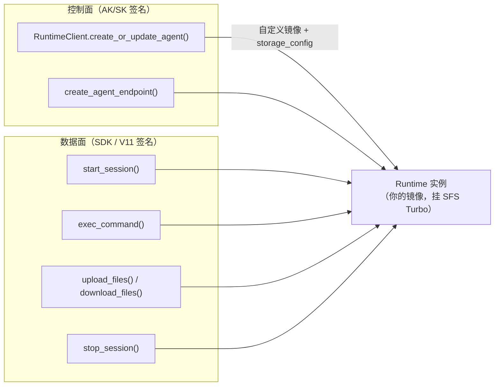

# 用 Runtime 冒充沙箱：可行性与实现指南

> 适用范围：`Langgraph-agentarts-demo`，`agentarts-sdk==0.1.6`
> 相关代码：本 demo 的 `demo/executepython.py`（已落地的 Runtime 执行工具）、`demo/config.py`（`RUNTIME_AS_SANDBOX_TOOL` 开关）

## 1. 问题从哪来

AgentArts 的沙箱工具（Code Interpreter，`agentarts.sdk.tools.code_interpreter`）是被收窄的：

| 能力 | Code Interpreter | AgentArts Runtime |
| --- | --- | --- |
| 自定义镜像 | 不支持，`create_code_interpreter()` 只接受 `name` / `auth_type` / `api_key_name` / `description` / `observability` / `network_config` / `agent_gateway_id` / `tags` | 支持，`artifact_source.url` 指向任意 SWR 镜像 |
| 挂载存储 | 不支持，文件域被归一化到 `/home/user` | 支持，`storage_config` 有 SFS Turbo 与 session storage 两档 |
| 命令能力 | `execute_command` 用正则白名单阻断 shell 元字符，只能跑受限命令 | `exec_command` 可跑完整 `sh -c`，超时上限 3600s |
| 计费粒度 | 按 `execute_code` / `execute_command` / 上传下载逐次计费 | 按运行时实例存活时长占用资源 |

所以当需求是「我的代码要跑在我自己的镜像里」或者「产物要落到持久存储上」时，Code Interpreter 这条路是堵死的。

**结论：把 Runtime 的创建 API 封装成一个"沙箱工具"是可行的**，不是绕过平台，而是复用平台已有的能力拼装。四个支点下面逐条展开。



---

## 2. 支点一：创建 API 已经完整参数化

创建运行时不需要改 SDK，也不需要走控制台，`RuntimeClient` 已经把控制面参数全部暴露成关键字参数。

### 2.1 方法签名

`agentarts-sdk-python/src/agentarts/sdk/service/runtime_client.py:307`（`create_agent`）与 `:437`（`create_or_update_agent`）：

```python
RuntimeClient.create_or_update_agent(
    agent_name: str,
    description: str = "",
    artifact_source_config: dict | None = None,   # 镜像 + 启动命令
    env_vars: list[dict] | None = None,           # 容器环境变量
    identity_config: dict | None = None,          # 入站鉴权方式（仅创建时生效，见 2.4）
    execution_agency_name: str | None = None,     # 委托，让运行时能访问其他云服务
    network_config: dict | None = None,           # PUBLIC / VPC
    agent_gateway_id: str | None = None,          # 出站网关
    invoke_config: dict | None = None,            # 协议 / 端口 / 文件传输开关
    observability_config: dict | None = None,     # tracing / metrics / logs
    storage_config: dict | None = None,           # ★ 存储挂载
    tags_config: list[dict] | None = None,
    **extra,                                      # arch 等透传字段
)
```

参数名到 API 字段名的映射（`create_agent` 的实际拼装逻辑，`:341-371`）：

| Python 参数 | 请求体字段 | 说明 |
| --- | --- | --- |
| `agent_name` | `name` | 工作空间内唯一 |
| `artifact_source_config` | `artifact_source` | `url`（SWR 镜像）、`commands`、`swr_instance_id` |
| `env_vars` | `environment_variables` | `[{"key": K, "value": V}]` |
| `identity_config` | `identity_configuration` | `authorizer_type` |
| `network_config` | `network_config` | `network_mode` / `vpc_config` |
| `invoke_config` | `invoke_config` | `protocol` / `port` / `file_transfer_config` / `url_match_type` |
| `observability_config` | `observability` | `tracing` / `metrics` / `logs` |
| `storage_config` | `storage_config` | 见第 3 节 |
| `tags_config` | `tags` | 标签 |
| `**extra` | 同名透传 | `arch="arm64"` 等 |

### 2.2 端到端创建案例

```python
"""创建/更新一个「带自定义镜像 + SFS Turbo 挂载」的 Runtime 实例。"""
from agentarts.sdk.service.runtime_client import RuntimeClient
from agentarts.sdk.utils.constant import get_control_plane_endpoint, get_region

region = get_region()
client = RuntimeClient(
    control_endpoint=get_control_plane_endpoint(region),
    verify_ssl=True,
)

agent = client.create_or_update_agent(
    agent_name="demo-sandbox",
    description="Runtime-backed sandbox: custom image + persistent storage",
    # ① 自定义镜像：SWR 地址，commands 是容器启动命令（留空用镜像 CMD）
    artifact_source_config={
        "url": "swr.cn-southwest-2.myhuaweicloud.com/agentarts-demo-org/sandbox-runtime:0.1.0",
        "commands": [],
    },
    # ② 协议契约 + 文件传输开关（上传/下载的前置条件）
    invoke_config={
        "protocol": "HTTP",
        "port": 8080,
        "file_transfer_config": {"enabled": True},
        "url_match_type": "ACCURATE_MATCH",
    },
    network_config={"network_mode": "PUBLIC"},
    identity_configuration={"authorizer_type": "IAM"},
    observability_config={
        "tracing": {"enabled": False},
        "metrics": {"enabled": False},
        "logs": {"enabled": True},
    },
    # ③ 存储：跨会话持久的 SFS Turbo + 会话级的临时盘
    storage_config={
        "sfs_turbo": [
            {
                "sfs_turbo_id": "0f1e2d3c-4b5a-6978-8796-a5b4c3d2e1f0",
                "sfs_path": "/dataset",
                "mount_path": "/mnt/data",
                "read_only": False,
            }
        ],
        "session_storage": {"mount_path": "/mnt/session"},
    },
    env_vars=[{"key": "PYTHONUNBUFFERED", "value": "1"}],
    tags_config=[{"key": "purpose", "value": "sandbox"}],
    arch="arm64",
)

print(agent["id"], agent.get("latest_version"))
```

### 2.3 配套的控制面方法

| 方法 | 行号 | 用途 |
| --- | --- | --- |
| `get_agents(name="", offset=1, limit=10)` | `:516` | 列表查询（模糊匹配 name） |
| `find_agent_by_name(name)` | `:547` | 按名字找（`create_or_update_agent` 内部就用它做幂等判断） |
| `find_agent_by_id(agent_id)` | `:577` | 按 ID 查详情，拿访问端点 |
| `create_agent_endpoint(agent_id, endpoint_name, endpoint_type="invocations")` | `:613` | 发布一个可指定 `?endpoint=` 的调用端点 |
| `delete_agent_by_name(name)` | `:590` | 销毁运行时，沙箱池回收时用 |

> `create_or_update_agent` 的语义是先按名字查、命中就 `PUT` 更新、未命中才 `POST` 创建。这一点对沙箱池很关键：重复调用不会产生重复实例。

### 2.4 两个容易踩的细节

- **`identity_config` 只在创建时生效**。`update_agent`（`:374`）的签名里没有这个参数，更新路径不会转发 `identity_configuration`。要改入站鉴权方式，得删掉重建。
- **`file_transfer_config.enabled` 不支持对已有 Agent 修改**（`agentarts-sdk-python/docs/cn/toolkit_user_guide/runtime_cli.md:356`）。如果沙箱方案依赖上传/下载文件，必须在**创建时**就设为 `true`，否则只能新建实例。

---

## 3. 支点二：存储就是 Runtime 侧已有的两档

存储不是新造的能力，`storage_config` 本来就在运行时的配置模型里（`agentarts-sdk-python/src/agentarts/toolkit/utils/runtime/config.py:197-280`）。

### 3.1 两档存储的语义

| | `sfs_turbo` | `session_storage` |
| --- | --- | --- |
| 配置类 | `SfsTurboConfig`（`:197`） | `SessionStorageConfig`（`:228`） |
| 字段 | `sfs_turbo_id`（UUID）、`sfs_path`、`mount_path`、`read_only` | `mount_path` |
| 生命周期 | 持久，独立于运行时实例与会话 | 随会话创建/销毁 |
| 可见范围 | 该运行时实例的**所有**会话共享 | 单个会话独享 |
| 适用 | 数据集、模型产物、跨任务中间结果 | 临时工作目录、单次任务的 scratch |

### 3.2 两个模型层约定（封装时要注意）

- **`sfs_turbo` 在 API 侧是数组，不是对象。** `StorageConfig.to_dict()`（`config.py:262`）会把单个 `SfsTurboConfig` 包成 `[item]`；自己拼 `storage_config` 字典时也必须写成数组，否则后端解析不了。
- **`sfs_turbo_id` 有 UUID 正则校验，且设置了 id 就必须给 `mount_path`。** 校验位置：字段定义在 `config.py:200-204`，部署前的显式检查在 `agentarts-sdk-python/src/agentarts/toolkit/operations/runtime/deploy.py:117-126`。
- 只配 `session_storage.mount_path`、不配 `sfs_turbo_id` 时，`sfs_turbo` 不会出现在最终 payload 里（`to_dict` 里 `if st is not None and st.sfs_turbo_id`），这是正常的。

### 3.3 YAML 写法（`agentarts deploy` 路径）

`.agentarts_config.yaml` 片段：

```yaml
    runtime:
      storage_config:
        sfs_turbo:
          sfs_turbo_id: 0f1e2d3c-4b5a-6978-8796-a5b4c3d2e1f0
          sfs_path: /dataset
          mount_path: /mnt/data
          read_only: false
        session_storage:
          mount_path: /mnt/session
```

### 3.4 用起来是什么样

挂载之后，沙箱内的读写就是普通文件操作：

```python
result = sandbox.run_shell(
    "mkdir -p /mnt/data/jobs/$JOB && "
    "python -c \"import pandas as pd; "
    "df = pd.read_parquet('/mnt/data/raw/orders.parquet'); "
    "df.groupby('city').agg({'amount': 'sum'}).to_parquet('/mnt/data/jobs/x/out.parquet')\"",
    session_id=sid,
)
```

并发注意事项：

- SFS Turbo 对同一运行时实例下**所有会话可见**，多任务并发写同一路径会互相覆盖。建议按任务建子目录（`/mnt/data/jobs/<task_id>/`），或者干脆用 session storage 承接临时产物、只把最终结果写回 SFS。
- `read_only: true` 适合"数据集只读、产物写别处"的形态，能防住误写。

---

## 4. 支点三：自定义镜像

### 4.1 三种落地方式

| 方式 | 命令 / 入口 | 适用 |
| --- | --- | --- |
| CLI 构建并推送 | `agentarts deploy`（构建 `Dockerfile` → 推 SWR → 建运行时） | 常规路径 |
| 复用已有镜像 | `agentarts deploy --skip-build` + 配置里的 `runtime.artifact_source.url` | CI/CD、镜像已在外部仓库 |
| SDK 直连控制面 | `create_or_update_agent(artifact_source_config={"url": ...})` | 脚本化、批量、平台集成 |

### 4.2 镜像必须满足的运行时契约

这是「自定义」的边界：镜像内容随你，但**入口协议不能改**。平台靠 `/ping` 判活，靠 `/invocations` 调用：

| 约束 | 值 | 依据 |
| --- | --- | --- |
| 监听地址 | `0.0.0.0` | 容器端口映射需要；本 demo 用 `AGENTARTS_DEMO_HOST=0.0.0.0` |
| 端口 | `8080`（与 `invoke_config.port` 一致） | `.agentarts_config.yaml` |
| 端点 | `POST /invocations`、`GET /ping`、`WS /ws` | `agentarts-sdk-python/src/agentarts/sdk/runtime/app.py:106-108` |
| 架构 | 与 `runtime.arch` 一致（本 demo 为 `arm64`） | `.agentarts_config.yaml` |
| 启动方式 | `CMD ["python", "-m", "<module>"]` | 生成的 `Dockerfile` |

### 4.3 纯沙箱形态：最小 stub 镜像

如果这个运行时的唯一用途就是被 `exec_command` 驱动，那么业务代码不需要写在里面 —— 但**必须有一个能通过健康检查的 app**，否则平台会认为实例不健康。放一个最小 stub：

```python
# sandbox_stub/app.py
"""只为了让 Runtime 通过健康检查而存在；实际工作走 exec_command。"""
from agentarts.sdk import AgentArtsRuntimeApp, PingStatus, RequestContext

app = AgentArtsRuntimeApp()


@app.entrypoint
async def handler(payload: dict, context: RequestContext | None = None) -> dict:
    return {"ok": True, "session_id": context.session_id if context else None}


@app.ping
def ping() -> PingStatus:
    return PingStatus.HEALTHY


if __name__ == "__main__":
    app.run()
```

```dockerfile
# 自定义沙箱镜像：在模板基础上预装分析依赖
FROM python:3.12-slim

RUN groupadd -g 1000 appuser && \
    useradd -u 1000 -g 1000 -m -s /bin/bash appuser

WORKDIR /app
RUN chown appuser:appuser /app

COPY requirements.txt .
RUN pip install --no-cache-dir -r requirements.txt

COPY . .
RUN chown -R appuser:appuser /app

EXPOSE 8080
USER appuser
CMD ["python", "-m", "sandbox_stub.app"]
```

`requirements.txt`：

```text
agentarts-sdk==0.1.6
pandas>=2.2
pyarrow>=15
```

要点：

- 换基础镜像就换 `FROM` 一行；也可以用 `PYTHON_BASE_IMAGE` 环境变量覆盖 CLI 生成模板里的 `{base_image}`（`agentarts-sdk-python/src/agentarts/toolkit/utils/templates/docker/Dockerfile.j2`）。
- **依赖要在构建期装好**。运行时阶段再用 `pip install` 走网络，会拖慢每次调用，且在 VPC 网络模式下可能直接不通。
- 保持非 root 用户（模板默认 `appuser`，uid/gid 1000），文件属主与 `upload_files` 的 `file_user_id` / `file_group_id` 默认值（1000）对得上。

### 4.4 镜像地址从哪来

- `agentarts deploy` 会在 `.agentarts_config.yaml` 的 `swr_config`（`organization` / `repository`，`*_auto_create`）下推送并回填；
- 也可以先用 `RuntimeClient` 自带的 `SWRClient` 路径（`agentarts-sdk-python/src/agentarts/toolkit/utils/runtime/container.py` 的 `login_to_registry` / `tag_image` / `push_image`）自己推;
- 或者完全外部化：镜像放到任意 SWR 仓库，把完整地址塞进 `artifact_source.url`。

---

## 5. 支点四：执行面也齐了

沙箱要的三件事——跑命令、传文件、清理——数据面全有。

### 5.1 方法清单

| 能力 | 方法 | HTTP | 会话头 | 默认超时 |
| --- | --- | --- | --- | --- |
| 开会话 | `start_session(agent_name, ...)` `:1245` | `POST /runtimes/{name}/sessions-start` | 无（服务端生成） | 30s |
| 执行命令 | `exec_command(agent_name, session_id, command, chunked=False)` `:783` | `POST /runtimes/{name}/commands` | `x-hw-agentarts-session-id` | 900s |
| 上传文件 | `upload_files(agent_name, session_id, files, path="/tmp/")` `:865` | `POST /runtimes/{name}/upload-files` | 同上 | 900s |
| 下载文件 | `download_files(agent_name, session_id, path, recursive=False)` `:1052` | `GET /runtimes/{name}/download-files` | 同上 | 900s |
| 关会话 | `stop_session(agent_name, session_id, ...)` `:1196` | `POST /runtimes/{name}/sessions-stop` | 同上 | 30s |
| 调入口 | `invoke_agent(agent_name, session_id, payload)` `:716` | `POST /runtimes/{name}/invocations` | 同上 | 900s |

### 5.2 与 Code Interpreter 的 API 对照

| Code Interpreter | Runtime 等价写法 |
| --- | --- |
| `code_session(region, name)` | `start_session(...)` / `stop_session(...)` 显式配对 |
| `execute_code(code)` | `exec_command(command=["python", "-c", code])` |
| `execute_command("ls -la")` | `exec_command(command=["ls", "-la"])` |
| `upload_file(path, content)` | `upload_files(files=[{"content": content, "path": path}])` |
| `download_file(path)` | `download_files(path=path)` → `b"".join(result.iter_bytes())` |
| `install_packages([...])` | 构建期装进自定义镜像（推荐），或 `pip install` 命令 |

### 5.3 `exec_command` 的命令语义

`command` 在 SDK 层是 **argv 数组**（exec-form），不是字符串。工具层（`agentarts-sdk-python/src/agentarts/toolkit/operations/runtime/exec_command.py:47-67`）对字符串命令做了自动包装：

- 普通命令 → `shlex.split` → `["ls", "-la"]`
- 含管道 / 重定向 / `&&` / `;` / `$()` / 反引号（引号外的）→ `["sh", "-c", "<原字符串>"]`
- 超时上限 **3600s**（`MAX_TIMEOUT`），CLI 默认 60s

**这正是与 Code Interpreter 最大的安全差异**：这里没有元字符白名单。`exec_command` 能跑完整 shell，所以它不是一个防注入的隔离边界，而是「一个你自己负责加固的容器」。

### 5.4 文件传输的几条硬约束

- 单文件上限 **100MB**（`upload_files` 内的 `MAX_FILE_SIZE`，`:912-925` 校验，超限直接 `ValueError`）。
- 需要 `invoke_config.file_transfer_config.enabled == true`；否则后端拒绝。见 2.4 的"创建时就必须打开"。
- 单文件上传时 `path` 的语义：给了 `files[i]["path"]` 就用它作为完整远端路径，否则取 `path + 文件名`（`path` 需以 `/` 结尾）；多文件上传时 `path` 是远端目录。

### 5.5 一个可直接用的 `RuntimeSandbox` 门面

把会话、命令、文件、清理收进一个类，对外暴露和 `code_session` 相近的用法：

```python
"""把 AgentArts Runtime 当作带存储、可自定义镜像的沙箱来用。"""
from __future__ import annotations

import os
from collections.abc import Iterator
from contextlib import contextmanager
from typing import Any

from agentarts.sdk.service.http_client import SignMode
from agentarts.sdk.service.runtime_client import RuntimeClient


class RuntimeSandbox:
    """Runtime 门面：会话生命周期 + 命令执行 + 文件收发。

    Args:
        agent_name: 已部署的运行时名称（承载自定义镜像与存储挂载）。
        data_endpoint: 运行时数据面地址，如 https://<id>.<region>.huaweicloud-agentarts.com。
        region: 区域，IAM 签名（V11）需要。
        sign_mode: IAM 鉴权用 V11_HMAC_SHA256，API Key 鉴权用 SDK_HMAC_SHA256。
    """

    def __init__(
        self,
        agent_name: str,
        data_endpoint: str,
        region: str | None = None,
        sign_mode: SignMode = SignMode.SDK_HMAC_SHA256,
        verify_ssl: bool | str = True,
    ) -> None:
        self.agent_name = agent_name
        self.client = RuntimeClient(
            data_endpoint=data_endpoint,
            region_id=region or os.getenv("HUAWEICLOUD_SDK_REGION", ""),
            sign_mode=sign_mode,
            verify_ssl=verify_ssl,
        )

    @contextmanager
    def session(self, user_id: str | None = None) -> Iterator[str]:
        """开启一个会话，退出时尽力关闭（清理失败不掩盖业务异常）。"""
        started = self.client.start_session(agent_name=self.agent_name, user_id=user_id)
        session_id = started.get("session_id") if isinstance(started, dict) else None
        if not session_id:
            raise RuntimeError(f"runtime did not return session_id: {started!r}")
        try:
            yield session_id
        finally:
            try:
                self.client.stop_session(agent_name=self.agent_name, session_id=session_id)
            except Exception:
                pass

    def run_python(self, code: str, session_id: str, timeout: int = 300) -> dict[str, Any]:
        """在容器内以 python -c 执行代码。"""
        return self.client.exec_command(
            agent_name=self.agent_name,
            session_id=session_id,
            command=["python", "-c", code],
            timeout=timeout,
        )

    def run_shell(self, command: str, session_id: str, timeout: int = 300) -> dict[str, Any]:
        """执行 shell 命令；需要管道/重定向时走 sh -c。"""
        return self.client.exec_command(
            agent_name=self.agent_name,
            session_id=session_id,
            command=["sh", "-c", command],
            timeout=timeout,
        )

    def upload(self, session_id: str, local_path: str, remote_path: str | None = None) -> dict[str, Any]:
        """上传本地文件；未指定 remote_path 时落到 /tmp/<文件名>。"""
        file_spec: dict[str, Any] = {"local_file": local_path}
        if remote_path:
            file_spec["path"] = remote_path
        return self.client.upload_files(
            agent_name=self.agent_name,
            session_id=session_id,
            files=[file_spec],
            path="/tmp/",
        )

    def download(self, session_id: str, remote_path: str, recursive: bool = False) -> bytes:
        """下载文件（或目录 tar）并读出全部字节。"""
        result = self.client.download_files(
            agent_name=self.agent_name,
            session_id=session_id,
            path=remote_path,
            recursive=recursive,
        )
        return b"".join(result.iter_bytes())
```

最小用法：

```python
sandbox = RuntimeSandbox(
    agent_name="demo-sandbox",
    data_endpoint="https://<runtime-id>.cn-southwest-2.huaweicloud-agentarts.com",
    region="cn-southwest-2",
)

with sandbox.session(user_id="demo-user") as sid:
    print(sandbox.run_python("import pandas; print(pandas.__version__)", sid))
    sandbox.upload(sid, "./orders.csv", "/tmp/orders.csv")
    print(sandbox.run_shell(
        "python -c \"import pandas as pd; "
        "print(pd.read_csv('/tmp/orders.csv').groupby('city')['amount'].sum())\"",
        sid,
    ))
    csv_bytes = sandbox.download(sid, "/mnt/data/result.csv")
```

---

## 6. 封装要点与主要坑

上面四个支点解决的是"能不能做"，这一节解决的是"做成什么样才不会被生产环境教育"。

### 6.1 封装要点

- **门面做成和 `CodeInterpreter` 同签名**：`execute_code` / `execute_command` / `upload_file` / `download_file` 一一对齐，上层 agent 代码零改动，`demo/sandbox.py` 那种 `code_session` 用法可以直接平替。API 对照见 5.2，门面实现见 5.5。
- **生命周期用 `create_or_update_agent`（`:437`）按名字复用**：绝不要每次调用都建 runtime——建实例有镜像拉取 / 调度 / 端点部署的冷启动，`create_agent_endpoint`（`:613`）也要单独走一遍。
- **建议做 warm pool + 租借 + TTL 回收**：按 image / storage / 资源维度分池，并配合 `start_session` / `stop_session` 做任务级边界。

### 6.2 主要坑

- **镜像不是"随便一个容器"**：runtime 要能监听 8080 并响应 runtime 协议（`/ping`、`/invocations`，见 `agentarts-sdk-python/src/agentarts/sdk/runtime/app.py`），所以自定义镜像得是个最小 stub agent app，不能是 `tail -f /dev/null`。stub 写法见 4.3。
- **隔离等级下降**：CI 沙箱有命令字符集白名单，runtime 的 `exec_command` 是完整 `sh -c`（`AgentArtsPhase2/AgentArts_Agent平台Wiki知识包/02-sandbox/sandbox.md` 第 7 节明确写了"需完整 shell 由 Runtime 侧 exec-command 包裹"）。跑不可信代码时，你就只剩容器边界了。
- **存储是 runtime 级的**：SFS Turbo 挂载对该实例所有 session 可见，`read_only` 只能整体开关；多任务并发必须自己定子目录约定和锁。`session_storage` 则是会话内有效、随会话销毁。
- **计费模型变了**：CIE 按执行计费、session 起停；runtime 是按实例存活时长占用配额，闲置必须回收。
- **权限两套要分别管**：控制面 AK/SK + 数据面 API Key / Bearer。

> 这几条对应的实测项与回收兜底，见第 9 节；端到端跑通的完整链路见第 7 节。

---

## 7. 端到端案例：挂 SFS 的数据分析沙箱

**目标**：模型给出的分析代码，跑在预装 `pandas`/`pyarrow` 的自定义镜像里，读写 `/mnt/data`（SFS Turbo 持久盘），产物落盘后可跨任务复用。

### 7.1 一次性准备

1. 写 `sandbox_stub/app.py`（见 4.3）与 `requirements.txt`，按 4.3 的 Dockerfile 构建镜像。
2. 在 `.agentarts_config.yaml` 里配置镜像与存储（可参考 2.2 的字段对应关系）：

```yaml
    runtime:
      invoke_config:
        protocol: HTTP
        port: 8080
        file_transfer_config:
          enabled: true          # 想用 upload/download 就必须创建时就打开
        url_match_type: ACCURATE_MATCH
      storage_config:
        sfs_turbo:
          sfs_turbo_id: 0f1e2d3c-4b5a-6978-8796-a5b4c3d2e1f0
          mount_path: /mnt/data
          read_only: false
        session_storage:
          mount_path: /mnt/session
```

3. 部署并把访问端点写回 `.env`：

```bash
uv run agentarts deploy -a demo-sandbox
uv run agentarts runtime start-session -a demo-sandbox          # 冒烟：能否拿到 session_id
uv run agentarts runtime exec-command "ls -la /mnt/data" -a demo-sandbox -s <session-id>
uv run agentarts runtime stop-session -a demo-sandbox -s <session-id>
```

### 7.2 接入 demo 的沙箱工具

本 demo 已经预留了开关（`demo/config.py:107-109`、`.env.example`）：

```bash
RUNTIME_AS_SANDBOX_TOOL=true
AGENTARTS_RUNTIME_AGENT_NAME=demo-sandbox
AGENTARTS_RUNTIME_DATA_ENDPOINT=https://<runtime-id>.cn-southwest-2.huaweicloud-agentarts.com
```

打开后 `demo/tools.py:71-72` 会优先暴露 `runtime_execute_python`，由 `demo/executepython.py` 里的 `execute_python(code)` 走 `RuntimeClient`：

```python
client = RuntimeClient(data_endpoint=endpoint, region_id=region, verify_ssl=verify_ssl)
session = client.start_session(agent_name=agent, user_id=user_id)
sid = session.get("session_id")
try:
    return {"ok": True, "session_id": sid,
            "result": client.exec_command(agent_name=agent, session_id=sid,
                                          command=["python", "-c", code], timeout=900)}
finally:
    try:
        client.stop_session(agent_name=agent, session_id=sid)
    except Exception:
        pass
```

也就是说：**"用 Runtime 冒充沙箱"这条路在本 demo 里已经跑通了最小闭环**，剩余的是工程化增强。

### 7.3 建议的增强点

| 现状（`demo/executepython.py`） | 建议 |
| --- | --- |
| 每次调用新建/销毁会话 | 按对话线程复用会话，长任务不必冷启动 |
| 直接返回 `result` 原始 dict | 归一化成 `{"ok", "stdout", "stderr", "exitcode"}`，与 Code Interpreter 返回结构对齐，模型更好消费 |
| 命令固定为 `python -c code` | 支持把代码写入 `/mnt/session/task_<id>.py` 再执行，规避超长 `-c` 参数与引号转义 |
| 无文件通道 | 增加 `upload` / `download` 封装，配合 SFS 的 `/mnt/data/jobs/<task_id>/` 约定 |
| 无并发/配额控制 | 加信号量或运行时池，避免实例被同时打满（`AgentArtsRuntimeApp` 默认 `max_concurrency=15`，超限 503） |

---

## 8. 什么时候该用哪个

| 判据 | 选 Code Interpreter | 选 Runtime 冒充沙箱 |
| --- | --- | --- |
| 代码是否可信 | 不可信（模型/用户生成） | 相对可信（内部数据任务） |
| 是否需要特定依赖 | 不需要 | 需要预装 pandas/私有 SDK 等 |
| 是否需要持久存储 | 不需要 | 需要 SFS Turbo 落盘 |
| 是否需要完整 shell | 不需要 | 需要管道/重定向/多步脚本 |
| 隔离等级要求 | 高（独立 session + 命令白名单） | 中（自建容器，安全责任在自己） |
| 计费敏感度 | 按次计费，空闲不花钱 | 常驻实例占资源，需池化+回收 |

一句话：**Code Interpreter 是"安全的执行器"，Runtime 是"可定制的容器"**。当需求关键词是「自定义镜像」「持久存储」「完整 shell」时，Runtime 路线才成立。

---

## 9. 已知限制与上线前验证清单

### 9.1 限制

1. **冷启动**：创建运行时涉及镜像拉取与调度，耗时远大于开一个 Code Interpreter 会话；绝不能按调用创建，必须池化复用，用 `create_or_update_agent` 做幂等。
2. **会话没有 TTL 参数**：`start_session` 的 `timeout=30` 是 HTTP 超时，不是会话存活时间；也无法查询会话状态（没有 `get_session`）。必须自己做回收兜底。
3. **`start_session` 可能拿不到 id**：实现是 `return result.data if isinstance(result.data, dict) else {}`，拿到 `{}` 就没法关会话，需要显式报错。
4. **`stop_session` 是 best-effort**：200 空 body 也会被当成成功（回落 `{"status": "stopped"}`），别用它判断远端是否真的清理干净。
5. **并发语义**：同一运行时实例的多个会话共享容器与 SFS 挂载，路径冲突要自己约定。
6. **无强隔离**：没有元字符白名单，容器边界就是唯一边界。
7. **`file_transfer_config` / `identity_configuration` 改不了**：只能新建。

### 9.2 验证清单

- [ ] 纯 stub 镜像（只实现 `/ping` + `/invocations`）能否长时间驻留且 `ping` 保持 Healthy
- [ ] `RUNTIME_AS_SANDBOX_TOOL=true` 后，模型能否正常调用 `runtime_execute_python` 并拿到 stdout
- [ ] SFS Turbo 多会话并发写同一目录的表现（是否需要按任务分目录）
- [ ] `upload_files` / `download_files` 在目标镜像里是否可用（`file_transfer_config.enabled` 是否在创建时打开）
- [ ] 创建/更新路径下 `identity_configuration` 是否符合预期（注意 update 不转发）
- [ ] `arch` 与镜像实际架构一致，否则启动即失败

---

## 10. 代码索引

| 主题 | 位置 |
| --- | --- |
| 创建 / 更新 / 查询 / 删除运行时 | `agentarts-sdk-python/src/agentarts/sdk/service/runtime_client.py:307,374,437,516,547,577,590,613` |
| 会话与执行面 | 同文件 `:716,783,865,1052,1196,1245` |
| 存储配置模型 | `agentarts-sdk-python/src/agentarts/toolkit/utils/runtime/config.py:197,228,246` |
| 存储校验 | `agentarts-sdk-python/src/agentarts/toolkit/operations/runtime/deploy.py:117-126` |
| 部署编排（构建 → SWR → 创建） | `agentarts-sdk-python/src/agentarts/toolkit/operations/runtime/deploy.py:33-458` |
| 命令字符串 → argv / `sh -c` 包装 | `agentarts-sdk-python/src/agentarts/toolkit/operations/runtime/exec_command.py:47-67` |
| Dockerfile 模板 | `agentarts-sdk-python/src/agentarts/toolkit/utils/templates/docker/Dockerfile.j2` |
| 运行时 HTTP 契约 | `agentarts-sdk-python/src/agentarts/sdk/runtime/app.py` |
| 本 demo 已落地的 Runtime 执行工具 | `Langgraph-agentarts-demo/demo/executepython.py` |
| 本 demo 的开关与配置 | `Langgraph-agentarts-demo/demo/config.py:107-109,144-145,196-198` |
| 文件传输 / 会话的 CLI 说明 | `agentarts-sdk-python/docs/cn/toolkit_user_guide/runtime_cli.md` |
